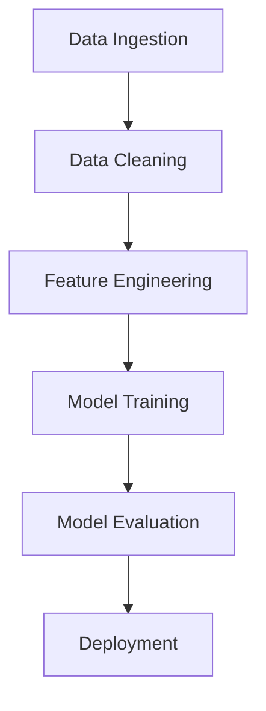

## 22.3 Data Science and Machine Learning Applications

In the rapidly evolving fields of data science and machine learning, Scala has emerged as a powerful tool, offering a blend of functional programming capabilities and seamless integration with big data technologies. This section delves into how Scala can be leveraged for analytical tasks, focusing on functional programming in machine learning workflows and providing examples using Apache Spark MLlib.

### Introduction to Scala in Data Science

Scala, a language that combines object-oriented and functional programming paradigms, is uniquely suited for data science applications. Its strong type system, concise syntax, and compatibility with Java make it an excellent choice for building robust data pipelines and machine learning models. Scala's interoperability with Java allows it to leverage a vast ecosystem of libraries and tools, while its functional programming features enable developers to write clean, maintainable code.

#### Why Scala for Data Science?

- **Concurrency and Parallelism**: Scala's support for concurrent and parallel programming makes it ideal for processing large datasets efficiently.
- **Functional Programming**: Immutability, higher-order functions, and pattern matching facilitate the development of complex data transformations.
- **Integration with Big Data Tools**: Scala is the language of choice for Apache Spark, a leading big data processing framework.
- **Type Safety**: Scala's type system helps catch errors at compile time, reducing runtime failures.

### Functional Programming in Machine Learning Workflows

Functional programming (FP) is a paradigm that treats computation as the evaluation of mathematical functions, avoiding changing state and mutable data. In machine learning workflows, FP offers several advantages:

- **Immutability**: Ensures data consistency and simplifies reasoning about code.
- **Higher-Order Functions**: Enable the creation of reusable and composable operations.
- **Lazy Evaluation**: Allows the deferral of computation until necessary, optimizing performance.

#### Key Functional Concepts in Scala

1. **Immutability and Persistent Data Structures**: Immutable data structures prevent accidental data modification, crucial for maintaining data integrity in machine learning pipelines.

2. **Higher-Order Functions**: Functions that take other functions as parameters or return them as results. They are used extensively in Scala to create flexible and reusable code components.

3. **Pattern Matching**: Provides a powerful mechanism for deconstructing data structures, making it easier to handle complex data transformations.

4. **Monads and For-Comprehensions**: Abstract complex computations and manage side effects in a functional way.

### Building Machine Learning Models with Apache Spark MLlib

Apache Spark MLlib is a scalable machine learning library built on top of Apache Spark. It provides a variety of machine learning algorithms and utilities, including classification, regression, clustering, collaborative filtering, and more.

#### Setting Up Your Environment

To get started with Scala and Spark MLlib, ensure you have the following prerequisites:

- **Scala**: Install Scala from the [official website](https://www.scala-lang.org/download/).
- **Apache Spark**: Download and set up Apache Spark from the [Apache Spark website](https://spark.apache.org/downloads.html).
- **IDE**: Use an IDE like IntelliJ IDEA with the Scala plugin for a seamless development experience.

#### Example: Building a Logistic Regression Model

Let's walk through an example of building a logistic regression model using Spark MLlib in Scala.

```scala
import org.apache.spark.sql.SparkSession
import org.apache.spark.ml.classification.LogisticRegression
import org.apache.spark.ml.feature.{VectorAssembler, StringIndexer}
import org.apache.spark.ml.Pipeline

// Create a Spark session
val spark = SparkSession.builder
  .appName("Logistic Regression Example")
  .master("local[*]")
  .getOrCreate()

// Load the data
val data = spark.read.option("inferSchema", "true").option("header", "true")
  .csv("path/to/data.csv")

// Index the label column
val labelIndexer = new StringIndexer()
  .setInputCol("label")
  .setOutputCol("indexedLabel")
  .fit(data)

// Assemble feature columns into a feature vector
val assembler = new VectorAssembler()
  .setInputCols(Array("feature1", "feature2", "feature3"))
  .setOutputCol("features")

// Create a logistic regression model
val lr = new LogisticRegression()
  .setLabelCol("indexedLabel")
  .setFeaturesCol("features")

// Create a pipeline
val pipeline = new Pipeline()
  .setStages(Array(labelIndexer, assembler, lr))

// Train the model
val model = pipeline.fit(data)

// Make predictions
val predictions = model.transform(data)

// Show the results
predictions.select("features", "indexedLabel", "prediction").show()
```

**Explanation:**

- **SparkSession**: Entry point for Spark applications.
- **Data Loading**: Reads CSV data into a DataFrame.
- **StringIndexer**: Converts categorical labels into numerical indices.
- **VectorAssembler**: Combines feature columns into a single feature vector.
- **LogisticRegression**: Sets up the logistic regression model.
- **Pipeline**: Chains multiple data processing steps into a single workflow.

### Advanced Functional Patterns in Machine Learning

Scala's functional programming features can be further leveraged to implement advanced patterns in machine learning workflows.

#### Monads in Machine Learning

Monads provide a way to handle computations that include additional context, such as error handling or state. In machine learning, monads can be used to manage data transformations and model training processes.

##### Example: Using `Option` Monad for Missing Data

```scala
def safeDivide(x: Double, y: Double): Option[Double] = {
  if (y != 0) Some(x / y) else None
}

val data = List((4.0, 2.0), (3.0, 0.0), (9.0, 3.0))
val results = data.map { case (num, denom) => safeDivide(num, denom) }

results.foreach {
  case Some(value) => println(s"Result: $value")
  case None => println("Division by zero encountered!")
}
```

**Explanation:**

- **Option Monad**: Represents optional values, encapsulating the presence or absence of a value.
- **Pattern Matching**: Handles both `Some` and `None` cases, ensuring safe operations.

#### Lenses for Data Manipulation

Lenses are a functional programming concept used to access and modify nested data structures immutably. They are particularly useful in machine learning for manipulating complex datasets.

##### Example: Using Lenses with Monocle

```scala
import monocle.Lens
import monocle.macros.GenLens

case class Address(street: String, city: String)
case class Person(name: String, age: Int, address: Address)

val addressLens: Lens[Person, Address] = GenLens[Person](_.address)
val cityLens: Lens[Address, String] = GenLens[Address](_.city)

val person = Person("Alice", 30, Address("123 Main St", "Springfield"))

// Update city using lenses
val updatedPerson = (addressLens composeLens cityLens).modify(_ => "Shelbyville")(person)

println(updatedPerson)
```

**Explanation:**

- **Lenses**: Provide a way to focus on a part of a data structure, allowing updates without mutation.
- **Monocle**: A Scala library that simplifies working with lenses.

### Integrating Scala with Big Data Tools

Scala's compatibility with big data tools like Apache Spark makes it a powerful choice for data-intensive applications. Let's explore how Scala can be integrated with these tools to enhance machine learning workflows.

#### Apache Spark for Distributed Computing

Apache Spark is an open-source distributed computing system that provides an interface for programming entire clusters with implicit data parallelism and fault tolerance.

##### Example: Distributed Data Processing with Spark

```scala
import org.apache.spark.sql.SparkSession

val spark = SparkSession.builder
  .appName("Distributed Data Processing")
  .master("local[*]")
  .getOrCreate()

val data = spark.read.option("inferSchema", "true").csv("path/to/large_dataset.csv")

// Perform transformations
val transformedData = data.filter("columnA > 100").groupBy("columnB").count()

// Show results
transformedData.show()
```

**Explanation:**

- **SparkSession**: Initializes the Spark environment.
- **DataFrame API**: Provides a high-level abstraction for data manipulation.
- **Transformations and Actions**: Enable efficient data processing across distributed systems.

#### Machine Learning with Spark MLlib

Spark MLlib provides scalable machine learning algorithms and utilities. It supports various tasks such as classification, regression, clustering, and collaborative filtering.

##### Example: Clustering with K-Means

```scala
import org.apache.spark.ml.clustering.KMeans
import org.apache.spark.ml.feature.VectorAssembler

val dataset = spark.read.option("inferSchema", "true").csv("path/to/data.csv")

val assembler = new VectorAssembler()
  .setInputCols(Array("feature1", "feature2"))
  .setOutputCol("features")

val featureData = assembler.transform(dataset)

val kmeans = new KMeans().setK(3).setSeed(1L)
val model = kmeans.fit(featureData)

val predictions = model.transform(featureData)
predictions.show()
```

**Explanation:**

- **KMeans**: A clustering algorithm that partitions data into K distinct clusters.
- **VectorAssembler**: Prepares feature vectors for clustering.

### Visualizing Data Science Workflows

Visualizing workflows and data transformations is crucial for understanding and debugging machine learning pipelines. Let's explore how to represent these workflows using diagrams.

#### Workflow Diagram for a Machine Learning Pipeline



**Description**: This diagram represents a typical machine learning pipeline, starting from data ingestion and ending with model deployment. Each step is crucial for building a successful machine learning application.

### Try It Yourself

Experiment with the provided code examples by modifying feature columns, changing algorithms, or integrating additional data processing steps. For instance, try using a different machine learning algorithm in Spark MLlib or implement a custom data transformation using Scala's functional programming features.

### References and Further Reading

- [Scala Official Documentation](https://www.scala-lang.org/documentation/)
- [Apache Spark Documentation](https://spark.apache.org/docs/latest/)
- [Monocle Library](https://www.optics.dev/Monocle/)
- [Functional Programming Principles in Scala](https://www.coursera.org/learn/functional-programming-scala)

### Knowledge Check

Before moving on, consider the following questions to test your understanding:

1. How does Scala's functional programming paradigm benefit machine learning workflows?
2. What are the advantages of using Apache Spark MLlib for building machine learning models?
3. How can lenses be used to manipulate nested data structures in Scala?
4. What role do monads play in handling computations with additional context?

### Embrace the Journey

Remember, mastering Scala for data science and machine learning is a journey. As you progress, you'll discover new patterns and techniques that will enhance your ability to build robust, scalable applications. Keep experimenting, stay curious, and enjoy the journey!

## Quiz Time!



### What is a key advantage of using Scala for data science applications?

- [x] Integration with big data tools like Apache Spark
- [ ] Lack of type safety
- [ ] Limited support for functional programming
- [ ] Incompatibility with Java

> **Explanation:** Scala's integration with big data tools like Apache Spark is a significant advantage, allowing for efficient processing of large datasets.

### Which Scala feature helps in handling computations with additional context?

- [ ] Lenses
- [x] Monads
- [ ] Pattern Matching
- [ ] Case Classes

> **Explanation:** Monads provide a way to handle computations that include additional context, such as error handling or state.

### What is the purpose of a VectorAssembler in Spark MLlib?

- [x] To combine feature columns into a single feature vector
- [ ] To index categorical labels
- [ ] To train machine learning models
- [ ] To evaluate model performance

> **Explanation:** A VectorAssembler is used to combine feature columns into a single feature vector, preparing data for machine learning algorithms.

### How does immutability benefit machine learning workflows?

- [x] Ensures data consistency and simplifies reasoning about code
- [ ] Increases the complexity of data transformations
- [ ] Requires more memory usage
- [ ] Slows down data processing

> **Explanation:** Immutability ensures data consistency and simplifies reasoning about code, which is crucial in machine learning workflows.

### Which library is used for working with lenses in Scala?

- [ ] Akka
- [ ] Spark
- [x] Monocle
- [ ] Cats

> **Explanation:** Monocle is a Scala library that simplifies working with lenses, enabling manipulation of nested data structures.

### What is the primary role of Apache Spark in data science?

- [ ] To provide a user interface for data visualization
- [x] To enable distributed data processing
- [ ] To store large datasets
- [ ] To create static reports

> **Explanation:** Apache Spark is designed to enable distributed data processing, making it ideal for handling large datasets in data science.

### What does the KMeans algorithm do in Spark MLlib?

- [x] Partitions data into K distinct clusters
- [ ] Performs linear regression
- [ ] Evaluates model accuracy
- [ ] Transforms categorical features

> **Explanation:** The KMeans algorithm partitions data into K distinct clusters, which is a common clustering task in machine learning.

### How can pattern matching be used in Scala?

- [x] To deconstruct data structures and handle complex transformations
- [ ] To combine feature columns
- [ ] To train machine learning models
- [ ] To visualize data

> **Explanation:** Pattern matching in Scala is used to deconstruct data structures and handle complex transformations, making it a powerful tool in functional programming.

### What is the benefit of using a pipeline in Spark MLlib?

- [x] Chains multiple data processing steps into a single workflow
- [ ] Increases the complexity of data transformations
- [ ] Requires more memory usage
- [ ] Slows down data processing

> **Explanation:** A pipeline in Spark MLlib chains multiple data processing steps into a single workflow, simplifying the machine learning process.

### True or False: Scala's type system helps catch errors at runtime.

- [ ] True
- [x] False

> **Explanation:** Scala's type system helps catch errors at compile time, reducing runtime failures and increasing code reliability.


