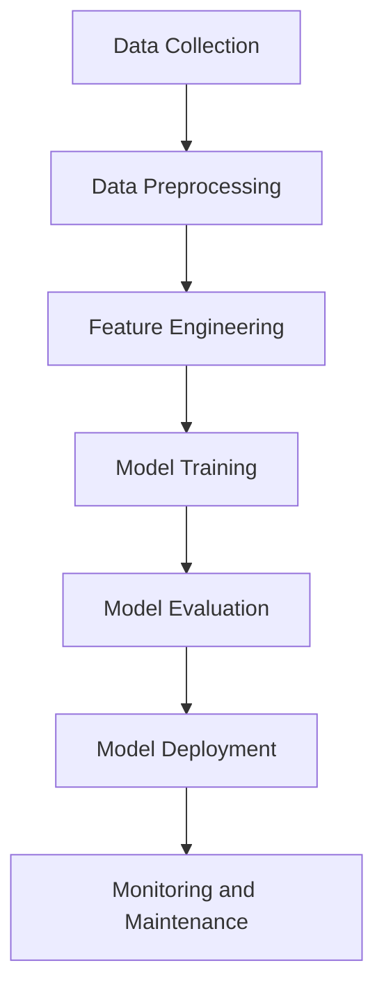

## 22.4 Machine Learning and AI Patterns in Scala

In the realm of machine learning (ML) and artificial intelligence (AI), Scala has emerged as a powerful language due to its functional programming capabilities, strong type system, and seamless interoperability with Java. This section explores how Scala can be leveraged to implement predictive models and algorithms, focusing on design patterns that facilitate efficient and scalable ML and AI solutions.

### Introduction to Machine Learning and AI in Scala

Machine learning involves creating algorithms that allow computers to learn from and make predictions based on data. AI extends this concept to simulate human intelligence processes. Scala's concise syntax and robust libraries make it an excellent choice for developing ML and AI applications.

#### Key Concepts

- **Predictive Models**: Algorithms that predict outcomes based on input data.
- **Algorithms**: Step-by-step procedures for calculations, data processing, and automated reasoning tasks.
- **Scala Libraries**: Libraries such as Breeze, Spark MLlib, and DL4J provide tools for implementing ML and AI solutions.

### Design Patterns in Machine Learning and AI

Design patterns in ML and AI provide reusable solutions to common problems, enhancing code maintainability and scalability. Let's explore some key patterns used in Scala for ML and AI.

#### 1. Data Pipeline Pattern

**Intent**: To process and transform raw data into a format suitable for machine learning models.

**Key Participants**:
- **Data Source**: The origin of raw data.
- **Transformations**: Steps to clean, normalize, and prepare data.
- **Data Sink**: The destination for processed data.

**Applicability**: Use when data needs to be processed in stages before feeding into a model.

**Sample Code Snippet**:

```scala
import org.apache.spark.sql.SparkSession
import org.apache.spark.sql.functions._

val spark = SparkSession.builder.appName("DataPipeline").getOrCreate()

// Data Source
val rawData = spark.read.option("header", "true").csv("data.csv")

// Transformations
val processedData = rawData
  .withColumn("feature1", col("feature1").cast("double"))
  .withColumn("feature2", col("feature2").cast("double"))
  .na.fill(0)

// Data Sink
processedData.write.format("parquet").save("processed_data.parquet")
```

**Design Considerations**: Ensure transformations are efficient and scalable. Use Spark's lazy evaluation to optimize processing.

#### 2. Model Training Pattern

**Intent**: To train machine learning models using prepared data.

**Key Participants**:
- **Training Data**: The dataset used for training the model.
- **Model**: The algorithm or architecture being trained.
- **Evaluator**: Metrics to assess model performance.

**Applicability**: Use when developing and refining predictive models.

**Sample Code Snippet**:

```scala
import org.apache.spark.ml.feature.VectorAssembler
import org.apache.spark.ml.regression.LinearRegression

// Prepare features
val assembler = new VectorAssembler()
  .setInputCols(Array("feature1", "feature2"))
  .setOutputCol("features")

val trainingData = assembler.transform(processedData)

// Train model
val lr = new LinearRegression()
  .setLabelCol("label")
  .setFeaturesCol("features")

val model = lr.fit(trainingData)

// Evaluate model
val trainingSummary = model.summary
println(s"RMSE: ${trainingSummary.rootMeanSquaredError}")
```

**Design Considerations**: Choose appropriate algorithms based on the problem domain. Regularly evaluate and tune model parameters.

#### 3. Model Evaluation and Selection Pattern

**Intent**: To evaluate multiple models and select the best-performing one.

**Key Participants**:
- **Candidate Models**: Different models or configurations to be evaluated.
- **Metrics**: Criteria for evaluating model performance.
- **Model Selector**: Logic to choose the best model based on metrics.

**Applicability**: Use when comparing multiple models to find the best fit for the data.

**Sample Code Snippet**:

```scala
import org.apache.spark.ml.evaluation.RegressionEvaluator

val evaluator = new RegressionEvaluator()
  .setLabelCol("label")
  .setPredictionCol("prediction")
  .setMetricName("rmse")

val models = Seq(model1, model2, model3)
val bestModel = models.minBy(m => evaluator.evaluate(m.transform(testData)))

println(s"Best Model RMSE: ${evaluator.evaluate(bestModel.transform(testData))}")
```

**Design Considerations**: Use cross-validation to ensure model robustness. Consider computational efficiency when evaluating large numbers of models.

### Advanced Machine Learning Patterns

#### 4. Ensemble Learning Pattern

**Intent**: To improve model performance by combining predictions from multiple models.

**Key Participants**:
- **Base Models**: Individual models whose predictions are combined.
- **Ensemble Method**: Strategy for combining predictions (e.g., bagging, boosting).
- **Final Model**: The aggregated model providing improved predictions.

**Applicability**: Use when individual models do not perform well enough on their own.

**Sample Code Snippet**:

```scala
import org.apache.spark.ml.classification.RandomForestClassifier

val rf = new RandomForestClassifier()
  .setLabelCol("label")
  .setFeaturesCol("features")
  .setNumTrees(10)

val ensembleModel = rf.fit(trainingData)

// Evaluate ensemble model
val predictions = ensembleModel.transform(testData)
val accuracy = evaluator.evaluate(predictions)
println(s"Ensemble Model Accuracy: $accuracy")
```

**Design Considerations**: Balance between model diversity and computational cost. Ensure base models are sufficiently different to benefit from ensemble learning.

#### 5. Feature Engineering Pattern

**Intent**: To create new features from raw data to improve model performance.

**Key Participants**:
- **Raw Features**: Original data attributes.
- **Derived Features**: New features created from raw data.
- **Feature Selector**: Logic to choose the most relevant features.

**Applicability**: Use when raw features are insufficient for model accuracy.

**Sample Code Snippet**:

```scala
import org.apache.spark.ml.feature.PCA

val pca = new PCA()
  .setInputCol("features")
  .setOutputCol("pcaFeatures")
  .setK(3)

val pcaModel = pca.fit(trainingData)
val pcaResult = pcaModel.transform(trainingData)

pcaResult.show()
```

**Design Considerations**: Avoid overfitting by selecting only the most relevant features. Use domain knowledge to guide feature engineering.

### Deep Learning Patterns in Scala

Deep learning involves neural networks with multiple layers, capable of learning complex patterns in data. Scala, with libraries like DL4J and BigDL, supports deep learning applications.

#### 6. Neural Network Training Pattern

**Intent**: To train deep neural networks for complex pattern recognition.

**Key Participants**:
- **Neural Network**: The architecture of interconnected layers.
- **Training Algorithm**: Method for optimizing network weights.
- **Loss Function**: Metric for evaluating prediction error.

**Applicability**: Use for tasks like image recognition, natural language processing, and more.

**Sample Code Snippet**:

```scala
import org.deeplearning4j.nn.conf.NeuralNetConfiguration
import org.deeplearning4j.nn.conf.layers.DenseLayer
import org.deeplearning4j.nn.multilayer.MultiLayerNetwork
import org.nd4j.linalg.lossfunctions.LossFunctions

val conf = new NeuralNetConfiguration.Builder()
  .list()
  .layer(0, new DenseLayer.Builder().nIn(784).nOut(1000)
    .activation("relu")
    .build())
  .layer(1, new DenseLayer.Builder().nIn(1000).nOut(500)
    .activation("relu")
    .build())
  .layer(2, new DenseLayer.Builder().nIn(500).nOut(10)
    .activation("softmax")
    .build())
  .build()

val model = new MultiLayerNetwork(conf)
model.init()

// Train model
model.fit(trainingData)
```

**Design Considerations**: Choose appropriate network architectures for the task. Monitor training to prevent overfitting.

#### 7. Transfer Learning Pattern

**Intent**: To leverage pre-trained models for new tasks, reducing training time and data requirements.

**Key Participants**:
- **Pre-trained Model**: A model trained on a large dataset.
- **New Task**: The specific problem to be solved.
- **Fine-tuning**: Adjusting the pre-trained model for the new task.

**Applicability**: Use when data is limited or when training from scratch is computationally expensive.

**Sample Code Snippet**:

```scala
import org.deeplearning4j.zoo.model.VGG16
import org.deeplearning4j.nn.transferlearning.TransferLearning

val vgg16 = VGG16.builder().build()
val transferModel = new TransferLearning.Builder(vgg16)
  .fineTuneConfiguration(fineTuneConf)
  .setFeatureExtractor("fc2")
  .build()

// Train transfer model
transferModel.fit(newTaskData)
```

**Design Considerations**: Ensure the pre-trained model is suitable for the new task. Fine-tune only the necessary layers to avoid overfitting.

### AI Patterns in Scala

AI patterns extend beyond ML to include logic-based systems, natural language processing, and more.

#### 8. Rule-Based System Pattern

**Intent**: To implement systems that make decisions based on predefined rules.

**Key Participants**:
- **Rule Engine**: The component that evaluates rules.
- **Rules**: Conditions and actions defined by domain experts.
- **Inference Engine**: Logic to apply rules to data.

**Applicability**: Use for tasks requiring explicit decision-making logic.

**Sample Code Snippet**:

```scala
import org.drools.core.impl.KnowledgeBaseFactory
import org.kie.api.KieServices
import org.kie.api.runtime.KieSession

val kieServices = KieServices.Factory.get()
val kContainer = kieServices.getKieClasspathContainer
val kSession = kContainer.newKieSession("ksession-rules")

// Insert facts and fire rules
kSession.insert(fact)
kSession.fireAllRules()
```

**Design Considerations**: Ensure rules are comprehensive and conflict-free. Regularly update rules to reflect changes in domain knowledge.

#### 9. Natural Language Processing (NLP) Pattern

**Intent**: To process and analyze human language data.

**Key Participants**:
- **Text Data**: The input language data.
- **NLP Model**: Algorithms for processing language.
- **Output**: Structured data or insights derived from text.

**Applicability**: Use for tasks like sentiment analysis, language translation, and more.

**Sample Code Snippet**:

```scala
import org.apache.spark.ml.feature.Tokenizer
import org.apache.spark.ml.feature.StopWordsRemover

val tokenizer = new Tokenizer().setInputCol("text").setOutputCol("words")
val wordsData = tokenizer.transform(textData)

val remover = new StopWordsRemover().setInputCol("words").setOutputCol("filtered")
val filteredData = remover.transform(wordsData)

filteredData.show()
```

**Design Considerations**: Choose appropriate preprocessing steps based on the language and task. Use domain-specific knowledge to enhance model accuracy.

### Visualizing Machine Learning Workflows

Understanding the flow of data and processes in ML workflows is crucial. Below is a diagram representing a typical machine learning workflow.



**Description**: This diagram illustrates the stages of a machine learning workflow, from data collection to model deployment and monitoring.

### Try It Yourself

To deepen your understanding, try modifying the code examples provided:

- Experiment with different data preprocessing techniques.
- Try training different models and compare their performance.
- Implement a simple rule-based system for a domain of your choice.

### Knowledge Check

- Explain the difference between ensemble learning and transfer learning.
- Describe how feature engineering can impact model performance.
- Discuss the role of rule-based systems in AI applications.

### Conclusion

Scala provides a robust platform for implementing machine learning and AI patterns, offering powerful libraries and a strong type system. By leveraging these patterns, developers can create scalable and efficient ML and AI solutions. Remember, this is just the beginning. As you progress, you'll build more complex models and systems. Keep experimenting, stay curious, and enjoy the journey!

## Quiz Time!



### What is the primary intent of the Data Pipeline Pattern?

- [x] To process and transform raw data into a format suitable for machine learning models.
- [ ] To evaluate multiple models and select the best-performing one.
- [ ] To train deep neural networks for complex pattern recognition.
- [ ] To leverage pre-trained models for new tasks.

> **Explanation:** The Data Pipeline Pattern focuses on processing and transforming raw data into a format that can be used for machine learning models.

### What is the role of the Model Selector in the Model Evaluation and Selection Pattern?

- [ ] To train the model using prepared data.
- [x] To choose the best model based on evaluation metrics.
- [ ] To create new features from raw data.
- [ ] To implement systems that make decisions based on predefined rules.

> **Explanation:** The Model Selector is responsible for choosing the best model based on evaluation metrics.

### Which library is commonly used in Scala for deep learning applications?

- [ ] Spark MLlib
- [x] DL4J
- [ ] Breeze
- [ ] Monix

> **Explanation:** DL4J (DeepLearning4J) is a popular library for deep learning applications in Scala.

### What is the main advantage of using Transfer Learning?

- [ ] It requires a large amount of data to train models.
- [x] It reduces training time and data requirements by leveraging pre-trained models.
- [ ] It improves model performance by combining predictions from multiple models.
- [ ] It creates new features from raw data to improve model performance.

> **Explanation:** Transfer Learning reduces training time and data requirements by using pre-trained models for new tasks.

### What is the purpose of the Rule-Based System Pattern?

- [x] To implement systems that make decisions based on predefined rules.
- [ ] To process and analyze human language data.
- [ ] To train deep neural networks for complex pattern recognition.
- [ ] To evaluate multiple models and select the best-performing one.

> **Explanation:** The Rule-Based System Pattern is used to implement systems that make decisions based on predefined rules.

### Which of the following is a key participant in the Ensemble Learning Pattern?

- [x] Base Models
- [ ] Neural Network
- [ ] Text Data
- [ ] Rule Engine

> **Explanation:** Base Models are individual models whose predictions are combined in the Ensemble Learning Pattern.

### What is a common use case for the Natural Language Processing (NLP) Pattern?

- [ ] Image recognition
- [x] Sentiment analysis
- [ ] Predictive maintenance
- [ ] Fraud detection

> **Explanation:** Sentiment analysis is a common use case for the Natural Language Processing (NLP) Pattern.

### Which pattern involves creating new features from raw data?

- [ ] Model Training Pattern
- [x] Feature Engineering Pattern
- [ ] Data Pipeline Pattern
- [ ] Rule-Based System Pattern

> **Explanation:** The Feature Engineering Pattern involves creating new features from raw data to improve model performance.

### What is the primary focus of the Neural Network Training Pattern?

- [x] To train deep neural networks for complex pattern recognition.
- [ ] To implement systems that make decisions based on predefined rules.
- [ ] To evaluate multiple models and select the best-performing one.
- [ ] To process and transform raw data into a format suitable for machine learning models.

> **Explanation:** The Neural Network Training Pattern focuses on training deep neural networks for complex pattern recognition.

### True or False: Scala's strong type system is a disadvantage for machine learning applications.

- [ ] True
- [x] False

> **Explanation:** Scala's strong type system is an advantage for machine learning applications as it helps ensure code reliability and safety.




