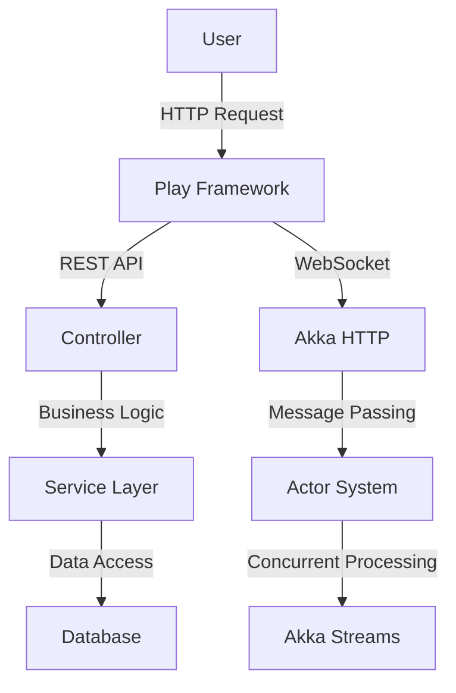

## 22.5 Web Development with Play Framework and Akka HTTP

In the realm of web development, Scala offers powerful tools to build scalable, robust, and high-performance applications. Two of the most prominent frameworks in this space are the Play Framework and Akka HTTP. Both frameworks leverage Scala's strengths, providing developers with the tools necessary to craft modern web applications. In this comprehensive guide, we will delve into the intricacies of using these frameworks, exploring their features, design patterns, and best practices.

### Introduction to Play Framework

The Play Framework is a high-velocity web framework for Java and Scala, designed to create web applications with minimal boilerplate. It embraces a reactive model, making it well-suited for modern web applications that require high concurrency and low latency.

#### Key Features of Play Framework

- **Asynchronous I/O**: Play is built on top of Akka, allowing it to handle asynchronous I/O operations efficiently.
- **Stateless Architecture**: Play applications are inherently stateless, which simplifies scaling and deployment.
- **Built-in Testing**: Play provides a robust testing framework that supports unit, integration, and functional testing.
- **Hot Reloading**: Developers can see changes in real-time without restarting the server, enhancing productivity.
- **RESTful by Design**: Play is designed with RESTful principles in mind, making it easy to build RESTful APIs.

#### Getting Started with Play Framework

To begin using Play Framework, you'll need to set up your development environment. Follow these steps to create a new Play application:

1. **Install Java and sbt**: Ensure you have Java and sbt (Scala Build Tool) installed on your system.
2. **Create a New Play Project**: Use the following sbt command to create a new Play application:

   ```bash
   sbt new playframework/play-scala-seed.g8
   ```

3. **Run the Application**: Navigate to your project directory and start the Play server:

   ```bash
   cd my-play-app
   sbt run
   ```

4. **Access the Application**: Open a web browser and go to `http://localhost:9000` to see your Play application in action.

### Building a RESTful API with Play Framework

One of the most common use cases for Play Framework is building RESTful APIs. Let's explore how to create a simple API using Play.

#### Define Routes

In Play, routes are defined in the `conf/routes` file. Each route maps an HTTP request to a controller action. Here's an example:

```
GET     /api/items              controllers.ItemController.getAllItems
POST    /api/items              controllers.ItemController.createItem
GET     /api/items/:id          controllers.ItemController.getItem(id: Long)
PUT     /api/items/:id          controllers.ItemController.updateItem(id: Long)
DELETE  /api/items/:id          controllers.ItemController.deleteItem(id: Long)
```

#### Implementing Controllers

Controllers in Play handle HTTP requests and return responses. Here's an example of a simple controller:

```scala
package controllers

import javax.inject._
import play.api.mvc._
import scala.concurrent.ExecutionContext

@Singleton
class ItemController @Inject()(cc: ControllerComponents)(implicit ec: ExecutionContext) extends AbstractController(cc) {

  def getAllItems: Action[AnyContent] = Action.async { implicit request: Request[AnyContent] =>
    // Fetch items from the database or service
    Future.successful(Ok("List of items"))
  }

  def createItem: Action[AnyContent] = Action.async { implicit request: Request[AnyContent] =>
    // Parse request and create a new item
    Future.successful(Created("Item created"))
  }

  def getItem(id: Long): Action[AnyContent] = Action.async { implicit request: Request[AnyContent] =>
    // Fetch item by ID
    Future.successful(Ok(s"Item with ID: $id"))
  }

  def updateItem(id: Long): Action[AnyContent] = Action.async { implicit request: Request[AnyContent] =>
    // Update item by ID
    Future.successful(Ok(s"Item with ID: $id updated"))
  }

  def deleteItem(id: Long): Action[AnyContent] = Action.async { implicit request: Request[AnyContent] =>
    // Delete item by ID
    Future.successful(NoContent)
  }
}
```

### Introduction to Akka HTTP

Akka HTTP is a toolkit for building HTTP-based applications on top of Akka. It provides a flexible and powerful way to create RESTful services and web applications.

#### Key Features of Akka HTTP

- **Reactive Streams**: Akka HTTP is built on Akka Streams, enabling backpressure and efficient handling of streaming data.
- **DSL for Routing**: Akka HTTP offers a domain-specific language (DSL) for defining routes, making it easy to create complex routing logic.
- **Integration with Akka**: Seamlessly integrates with other Akka components, such as Akka Actors and Akka Streams.
- **High Performance**: Designed for high concurrency and low latency, making it ideal for performance-critical applications.

#### Getting Started with Akka HTTP

To start using Akka HTTP, you need to set up your project with the necessary dependencies. Here's how to create a simple Akka HTTP server:

1. **Add Dependencies**: Include Akka HTTP dependencies in your `build.sbt` file:

   ```scala
   libraryDependencies ++= Seq(
     "com.typesafe.akka" %% "akka-http" % "10.2.9",
     "com.typesafe.akka" %% "akka-stream" % "2.6.19"
   )
   ```

2. **Create an Akka HTTP Server**: Define a simple server using Akka HTTP:

   ```scala
   import akka.actor.ActorSystem
   import akka.http.scaladsl.Http
   import akka.http.scaladsl.server.Directives._
   import akka.stream.ActorMaterializer

   object AkkaHttpServer extends App {
     implicit val system = ActorSystem("my-system")
     implicit val materializer = ActorMaterializer()
     implicit val executionContext = system.dispatcher

     val route =
       path("hello") {
         get {
           complete("Hello, Akka HTTP!")
         }
       }

     Http().newServerAt("localhost", 8080).bind(route)
   }
   ```

3. **Run the Server**: Execute the server and access it at `http://localhost:8080/hello`.

### Building RESTful APIs with Akka HTTP

Akka HTTP provides a powerful DSL for defining routes and handling HTTP requests. Let's create a RESTful API using Akka HTTP.

#### Define Routes

Routes in Akka HTTP are defined using the DSL. Here's an example of defining routes for a simple API:

```scala
val routes =
  pathPrefix("api" / "items") {
    concat(
      pathEndOrSingleSlash {
        get {
          complete("List of items")
        } ~
        post {
          complete("Item created")
        }
      },
      path(LongNumber) { id =>
        get {
          complete(s"Item with ID: $id")
        } ~
        put {
          complete(s"Item with ID: $id updated")
        } ~
        delete {
          complete(s"Item with ID: $id deleted")
        }
      }
    )
  }
```

#### Implementing Business Logic

In Akka HTTP, business logic is typically implemented in separate classes or objects. Here's an example of a simple service:

```scala
object ItemService {
  def getAllItems: String = "List of items"
  def createItem: String = "Item created"
  def getItem(id: Long): String = s"Item with ID: $id"
  def updateItem(id: Long): String = s"Item with ID: $id updated"
  def deleteItem(id: Long): String = s"Item with ID: $id deleted"
}
```

### Integrating Play Framework and Akka HTTP

While Play Framework and Akka HTTP can be used independently, they can also be integrated to leverage the strengths of both frameworks. This integration allows developers to build applications that benefit from Play's rapid development capabilities and Akka HTTP's high-performance features.

#### Use Case: Real-Time Web Application

Consider a real-time web application that requires both RESTful APIs and WebSocket communication. Play Framework can handle the RESTful APIs, while Akka HTTP can manage WebSocket connections, providing a seamless experience.

#### Example Integration

Here's an example of integrating Play Framework and Akka HTTP:

1. **Define Play Routes**: Use Play to handle RESTful API requests.

   ```scala
   // Play routes
   GET     /api/items              controllers.ItemController.getAllItems
   POST    /api/items              controllers.ItemController.createItem
   ```

2. **Set Up Akka HTTP for WebSockets**: Use Akka HTTP to handle WebSocket connections.

   ```scala
   val websocketRoute =
     path("ws") {
       handleWebSocketMessages(websocketFlow)
     }

   def websocketFlow: Flow[Message, Message, Any] = Flow[Message].map {
     case TextMessage.Strict(text) => TextMessage.Strict(s"Echo: $text")
     case _ => TextMessage.Strict("Unsupported message type")
   }
   ```

3. **Run Both Servers**: Start both Play and Akka HTTP servers, ensuring they operate on different ports.

### Design Patterns in Play Framework and Akka HTTP

Both Play Framework and Akka HTTP support various design patterns that enhance application architecture and maintainability. Let's explore some of these patterns.

#### MVC Pattern in Play Framework

The Model-View-Controller (MVC) pattern is a cornerstone of Play Framework. It separates application logic into three interconnected components:

- **Model**: Represents the application's data and business logic.
- **View**: Handles the presentation layer, rendering data to the user.
- **Controller**: Manages user input and updates the model and view accordingly.

##### Example: Implementing MVC in Play

```scala
// Model
case class Item(id: Long, name: String, description: String)

// Controller
class ItemController @Inject()(cc: ControllerComponents) extends AbstractController(cc) {
  def getItem(id: Long): Action[AnyContent] = Action {
    val item = Item(id, "Sample Item", "This is a sample item.")
    Ok(views.html.item(item))
  }
}

// View (item.scala.html)
@(item: Item)
<html>
  <body>
    <h1>@item.name</h1>
    <p>@item.description</p>
  </body>
</html>
```

#### Actor Model in Akka HTTP

Akka HTTP leverages the actor model, which is a design pattern for managing concurrency and state. Actors are lightweight, independent units of computation that communicate via message passing.

##### Example: Using Actors in Akka HTTP

```scala
import akka.actor.{Actor, ActorSystem, Props}
import akka.http.scaladsl.server.Directives._

class ItemActor extends Actor {
  def receive: Receive = {
    case "get" => sender() ! "List of items"
    case _ => sender() ! "Unknown command"
  }
}

object AkkaHttpWithActors extends App {
  implicit val system = ActorSystem("my-system")
  val itemActor = system.actorOf(Props[ItemActor], "itemActor")

  val route =
    path("items") {
      get {
        complete((itemActor ? "get").mapTo[String])
      }
    }

  Http().newServerAt("localhost", 8080).bind(route)
}
```

### Best Practices for Web Development with Play and Akka HTTP

To build robust and maintainable web applications using Play Framework and Akka HTTP, consider the following best practices:

1. **Embrace Asynchronous Programming**: Utilize Scala's Future and Akka's Streams to handle asynchronous operations efficiently.
2. **Leverage Type Safety**: Use Scala's strong type system to catch errors at compile time and improve code reliability.
3. **Modularize Your Code**: Break down your application into smaller, reusable components to enhance maintainability.
4. **Implement Comprehensive Testing**: Use Play's testing framework and Akka's test kits to ensure your application is robust and reliable.
5. **Optimize for Performance**: Profile your application to identify bottlenecks and optimize critical paths for performance.
6. **Secure Your Application**: Implement security best practices, such as input validation and authentication, to protect your application from vulnerabilities.

### Visualizing the Architecture

To better understand the architecture of a web application using Play Framework and Akka HTTP, let's visualize the components and their interactions.



**Diagram Description**: This diagram illustrates the flow of a web application using Play Framework and Akka HTTP. Users interact with the application via HTTP requests, which are handled by Play Framework. REST API requests are processed by controllers, which interact with the service layer and database. WebSocket connections are managed by Akka HTTP, leveraging the actor system and Akka Streams for concurrent processing.

### Try It Yourself

To deepen your understanding, try modifying the code examples provided. Experiment with adding new routes, implementing additional business logic, or integrating external libraries. Consider building a small web application that combines RESTful APIs and WebSocket communication, leveraging the strengths of both Play Framework and Akka HTTP.

### Knowledge Check

Before we conclude, let's reinforce what we've learned:

- How does Play Framework handle asynchronous operations?
- What are the benefits of using Akka HTTP for WebSocket communication?
- How can you integrate Play Framework and Akka HTTP in a single application?

### Conclusion

Web development with Play Framework and Akka HTTP offers a powerful combination of tools and patterns for building modern, scalable web applications. By leveraging Scala's strengths and embracing best practices, developers can create applications that are robust, maintainable, and performant. Remember, this is just the beginning. As you continue to explore these frameworks, you'll discover new patterns and techniques that will enhance your web development skills. Keep experimenting, stay curious, and enjoy the journey!

## Quiz Time!



### What is a key feature of the Play Framework?

- [x] Asynchronous I/O
- [ ] Synchronous processing
- [ ] Built-in SQL database
- [ ] Monolithic architecture

> **Explanation:** Play Framework is built on top of Akka, which allows it to handle asynchronous I/O operations efficiently.

### How does Play Framework handle hot reloading?

- [x] By allowing changes to be seen in real-time without restarting the server
- [ ] By requiring a server restart for every change
- [ ] By caching previous versions of the application
- [ ] By using a separate tool for reloading

> **Explanation:** Play Framework supports hot reloading, enabling developers to see changes in real-time without restarting the server.

### What is the primary use of Akka HTTP?

- [x] Building HTTP-based applications with high concurrency
- [ ] Managing SQL databases
- [ ] Creating desktop applications
- [ ] Designing graphical user interfaces

> **Explanation:** Akka HTTP is a toolkit for building HTTP-based applications, designed for high concurrency and low latency.

### Which pattern does Play Framework primarily use?

- [x] Model-View-Controller (MVC)
- [ ] Singleton
- [ ] Observer
- [ ] Factory

> **Explanation:** Play Framework is based on the Model-View-Controller (MVC) pattern, which separates application logic into three interconnected components.

### What is an advantage of using Akka HTTP for WebSockets?

- [x] Seamless integration with Akka Streams for handling streaming data
- [ ] Built-in support for SQL queries
- [ ] Automatic UI generation
- [ ] Static content delivery

> **Explanation:** Akka HTTP integrates seamlessly with Akka Streams, making it ideal for handling streaming data over WebSockets.

### How can Play Framework and Akka HTTP be integrated?

- [x] By using Play for RESTful APIs and Akka HTTP for WebSocket connections
- [ ] By replacing Play with Akka HTTP entirely
- [ ] By using Akka HTTP only for database operations
- [ ] By combining both in a single controller

> **Explanation:** Play Framework can handle RESTful APIs while Akka HTTP manages WebSocket connections, providing a seamless experience.

### What is a best practice for web development with Play and Akka HTTP?

- [x] Embrace asynchronous programming
- [ ] Use only synchronous operations
- [ ] Avoid modularizing code
- [ ] Ignore type safety

> **Explanation:** Embracing asynchronous programming is crucial for handling operations efficiently in web development with Play and Akka HTTP.

### What is the role of actors in Akka HTTP?

- [x] Managing concurrency and state through message passing
- [ ] Rendering HTML templates
- [ ] Handling SQL transactions
- [ ] Generating static content

> **Explanation:** Actors in Akka HTTP manage concurrency and state through message passing, leveraging the actor model.

### What is a key benefit of using Scala's type system in web development?

- [x] Catching errors at compile time
- [ ] Simplifying runtime debugging
- [ ] Reducing code verbosity
- [ ] Enabling dynamic typing

> **Explanation:** Scala's strong type system helps catch errors at compile time, improving code reliability.

### True or False: Akka HTTP is designed for low latency and high concurrency.

- [x] True
- [ ] False

> **Explanation:** Akka HTTP is indeed designed for low latency and high concurrency, making it ideal for performance-critical applications.


