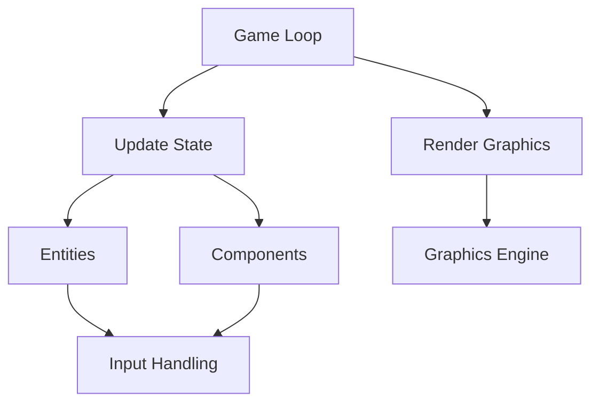

## 22.6 Game Development with Scala

Game development is an exciting and challenging field that combines creativity with technical prowess. Scala, with its robust type system and functional programming capabilities, offers unique advantages for building interactive media. In this section, we will explore how to leverage Scala for game development, focusing on design patterns, libraries like ScalaFX, and 2D game engines.

### Introduction to Game Development with Scala

Scala is a versatile language that supports both object-oriented and functional programming paradigms. This dual nature makes it an excellent choice for game development, where performance and expressiveness are crucial. By utilizing Scala's features, developers can create games that are both efficient and easy to maintain.

#### Why Choose Scala for Game Development?

- **Functional Programming**: Scala's functional programming capabilities allow for concise and expressive code, which is particularly useful in game logic and AI.
- **Concurrency**: Scala's support for concurrent programming, through libraries like Akka, helps in managing complex game states and interactions.
- **Interoperability**: Scala runs on the JVM, allowing seamless integration with Java libraries and tools, expanding the possibilities for game development.
- **Rich Ecosystem**: Libraries like ScalaFX provide a robust framework for building graphical user interfaces, while other libraries support 2D and 3D game development.

### Key Concepts in Game Development

Before diving into Scala-specific implementations, let's review some fundamental concepts in game development:

- **Game Loop**: The core of any game, responsible for updating game state and rendering graphics.
- **Entities and Components**: A design pattern where game objects are composed of interchangeable components, promoting flexibility and reuse.
- **Collision Detection**: Techniques for determining when game objects intersect or interact.
- **Rendering**: The process of drawing game graphics on the screen.
- **Input Handling**: Managing user input from devices like keyboards, mice, and game controllers.

### Design Patterns in Game Development

Design patterns provide reusable solutions to common problems in software design. In game development, certain patterns are particularly useful:

#### Game Loop Pattern

The game loop is the heartbeat of any game, continuously updating and rendering the game world. In Scala, we can implement a simple game loop using a `while` loop or a more sophisticated approach with actors for concurrency.

```scala
import scala.concurrent.ExecutionContext.Implicits.global
import scala.concurrent.Future
import scala.util.control.Breaks._

object GameLoop {
  var running = true

  def main(args: Array[String]): Unit = {
    Future {
      while (running) {
        update()
        render()
        Thread.sleep(16) // Approx. 60 FPS
      }
    }
  }

  def update(): Unit = {
    // Update game state
  }

  def render(): Unit = {
    // Render graphics
  }
}
```

#### Entity-Component-System (ECS) Pattern

The ECS pattern decouples game objects from their behaviors, allowing for more flexible and maintainable code. In Scala, we can use case classes and traits to define entities and components.

```scala
trait Component

case class Position(x: Double, y: Double) extends Component
case class Velocity(dx: Double, dy: Double) extends Component

case class Entity(components: Map[Class[_], Component]) {
  def getComponent[T <: Component](clazz: Class[T]): Option[T] =
    components.get(clazz).asInstanceOf[Option[T]]
}

val player = Entity(Map(
  classOf[Position] -> Position(0, 0),
  classOf[Velocity] -> Velocity(1, 1)
))
```

#### Observer Pattern

The observer pattern is useful for handling events and notifications, such as user input or game state changes. Scala's functional programming features make it easy to implement this pattern using higher-order functions and collections.

```scala
trait Observer {
  def update(event: String): Unit
}

class GameObserver extends Observer {
  def update(event: String): Unit = {
    println(s"Received event: $event")
  }
}

class Game {
  private var observers: List[Observer] = List()

  def addObserver(observer: Observer): Unit = {
    observers = observer :: observers
  }

  def notifyObservers(event: String): Unit = {
    observers.foreach(_.update(event))
  }
}

val game = new Game()
val observer = new GameObserver()
game.addObserver(observer)
game.notifyObservers("Player scored!")
```

### Using ScalaFX for Game Development

ScalaFX is a wrapper around JavaFX, providing a more Scala-friendly API for building graphical user interfaces. It's well-suited for 2D game development, offering features like scene graphs, animations, and event handling.

#### Setting Up ScalaFX

To get started with ScalaFX, add the following dependency to your `build.sbt` file:

```scala
libraryDependencies += "org.scalafx" %% "scalafx" % "17.0.0-R25"
```

#### Creating a Simple Game with ScalaFX

Let's create a simple 2D game using ScalaFX. We'll build a basic game where a player can move a character around the screen.

```scala
import scalafx.application.JFXApp
import scalafx.scene.Scene
import scalafx.scene.input.KeyEvent
import scalafx.scene.paint.Color
import scalafx.scene.shape.Rectangle

object SimpleGame extends JFXApp {
  val player = new Rectangle {
    width = 20
    height = 20
    fill = Color.Blue
    x = 100
    y = 100
  }

  stage = new JFXApp.PrimaryStage {
    title.value = "Simple ScalaFX Game"
    scene = new Scene(400, 400) {
      content = List(player)

      onKeyPressed = (e: KeyEvent) => {
        e.code.getName match {
          case "Up"    => player.y.value -= 5
          case "Down"  => player.y.value += 5
          case "Left"  => player.x.value -= 5
          case "Right" => player.x.value += 5
          case _       =>
        }
      }
    }
  }
}
```

#### Enhancing the Game with Animation

ScalaFX supports animations, which can be used to create smooth movements and transitions. Let's animate the player's movement using a `Timeline`.

```scala
import scalafx.animation.{KeyFrame, Timeline}
import scalafx.util.Duration

val timeline = new Timeline {
  cycleCount = Timeline.Indefinite
  keyFrames = Seq(
    KeyFrame(Duration(16), onFinished = _ => {
      // Update game logic here
    })
  )
}

timeline.play()
```

### Exploring 2D Game Libraries

In addition to ScalaFX, several libraries can aid in 2D game development with Scala. These libraries provide tools for physics, rendering, and more.

#### LibGDX

LibGDX is a popular cross-platform game development framework that supports both 2D and 3D games. While primarily a Java library, it can be used with Scala due to JVM compatibility.

- **Physics**: LibGDX includes a Box2D physics engine for realistic simulations.
- **Rendering**: It offers a powerful rendering engine for 2D and 3D graphics.
- **Input Handling**: LibGDX provides robust input handling for various devices.

#### Monogame

Monogame is another framework that supports 2D game development. It is a cross-platform, open-source implementation of the Microsoft XNA 4 Framework.

### Advanced Topics in Scala Game Development

#### Concurrency with Akka

Akka is a powerful toolkit for building concurrent applications in Scala. It can be used in game development to manage complex interactions and states.

```scala
import akka.actor.{Actor, ActorSystem, Props}

class GameActor extends Actor {
  def receive: Receive = {
    case "update" => // Update game state
    case "render" => // Render graphics
  }
}

val system = ActorSystem("GameSystem")
val gameActor = system.actorOf(Props[GameActor], "gameActor")

gameActor ! "update"
gameActor ! "render"
```

#### Functional Programming in Game Logic

Scala's functional programming features can be leveraged to create clean and maintainable game logic. For example, using immutable data structures and pure functions can simplify state management.

```scala
case class GameState(playerPosition: (Double, Double))

def updateState(state: GameState, input: String): GameState = {
  input match {
    case "up"    => state.copy(playerPosition = (state.playerPosition._1, state.playerPosition._2 - 1))
    case "down"  => state.copy(playerPosition = (state.playerPosition._1, state.playerPosition._2 + 1))
    case "left"  => state.copy(playerPosition = (state.playerPosition._1 - 1, state.playerPosition._2))
    case "right" => state.copy(playerPosition = (state.playerPosition._1 + 1, state.playerPosition._2))
    case _       => state
  }
}
```

### Visualizing Game Architecture

To better understand the architecture of a Scala-based game, let's visualize the components and their interactions using a Mermaid.js diagram.



### Try It Yourself

Encourage experimentation by modifying the provided code examples. Try changing the player's speed, adding new entities, or implementing a simple collision detection system.

### Knowledge Check

- What are the benefits of using Scala for game development?
- How does the Entity-Component-System pattern improve game architecture?
- What role does the game loop play in a game?

### Conclusion

Game development with Scala offers a unique blend of functional programming and object-oriented design, providing powerful tools for building interactive media. By leveraging ScalaFX and other libraries, developers can create engaging and maintainable games. Remember, this is just the beginning. As you progress, you'll build more complex and interactive games. Keep experimenting, stay curious, and enjoy the journey!

## Quiz Time!



### What is the primary purpose of the game loop in game development?

- [x] To continuously update and render the game world
- [ ] To handle user input
- [ ] To manage game assets
- [ ] To initialize game settings

> **Explanation:** The game loop is responsible for continuously updating the game state and rendering graphics, ensuring smooth gameplay.

### Which design pattern is used to decouple game objects from their behaviors?

- [x] Entity-Component-System (ECS) Pattern
- [ ] Observer Pattern
- [ ] Singleton Pattern
- [ ] Factory Pattern

> **Explanation:** The ECS pattern separates game objects into entities and components, allowing for flexible and maintainable code.

### How can Scala's functional programming features benefit game logic?

- [x] By simplifying state management with immutable data structures and pure functions
- [ ] By increasing the complexity of the code
- [ ] By reducing code readability
- [ ] By making the code less maintainable

> **Explanation:** Functional programming features like immutability and pure functions simplify state management and enhance code maintainability.

### What is ScalaFX primarily used for in game development?

- [x] Building graphical user interfaces for 2D games
- [ ] Handling physics simulations
- [ ] Managing game assets
- [ ] Implementing AI algorithms

> **Explanation:** ScalaFX is a wrapper around JavaFX, providing tools for building graphical user interfaces, making it suitable for 2D game development.

### Which library is known for its cross-platform support and includes a Box2D physics engine?

- [x] LibGDX
- [ ] ScalaFX
- [ ] Monogame
- [ ] Akka

> **Explanation:** LibGDX is a cross-platform game development framework that includes a Box2D physics engine for realistic simulations.

### What is the role of the observer pattern in game development?

- [x] Handling events and notifications, such as user input or game state changes
- [ ] Managing game assets
- [ ] Rendering graphics
- [ ] Initializing game settings

> **Explanation:** The observer pattern is used to handle events and notifications, allowing for responsive game interactions.

### How can Akka be utilized in game development?

- [x] For managing complex interactions and states through concurrency
- [ ] For rendering graphics
- [ ] For handling user input
- [ ] For asset management

> **Explanation:** Akka is a toolkit for building concurrent applications, making it useful for managing complex interactions and states in games.

### What is the benefit of using immutable data structures in game development?

- [x] They simplify state management and enhance code maintainability
- [ ] They increase code complexity
- [ ] They reduce performance
- [ ] They make the code less readable

> **Explanation:** Immutable data structures simplify state management by preventing unintended modifications, enhancing code maintainability.

### Which pattern is used to manage user input from devices like keyboards and mice?

- [x] Observer Pattern
- [ ] Singleton Pattern
- [ ] Factory Pattern
- [ ] Decorator Pattern

> **Explanation:** The observer pattern is often used to manage user input, allowing the game to respond to events such as key presses.

### True or False: Scala's interoperability with Java allows for seamless integration with Java libraries in game development.

- [x] True
- [ ] False

> **Explanation:** Scala runs on the JVM, enabling seamless integration with Java libraries and tools, expanding the possibilities for game development.


