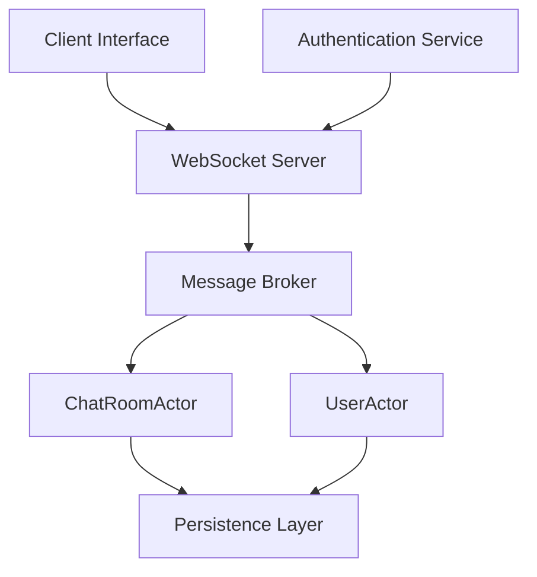

## 22.7 Designing a Real-Time Chat Application

In this section, we will delve into the architecture and design patterns necessary for building a robust real-time chat application using Scala and Akka. This case study will guide you through the essential components, design considerations, and best practices for creating a scalable and responsive chat system.

### Introduction to Real-Time Communication Systems

Real-time communication systems enable instantaneous data exchange between users, making them ideal for applications like chat, video conferencing, and collaborative tools. The key challenges in designing such systems include handling concurrency, ensuring low latency, and maintaining scalability.

### Key Concepts and Components

1. **Concurrency and Asynchronous Processing**: Real-time applications must handle multiple simultaneous connections and messages. Akka's actor model provides a natural way to manage concurrency without traditional locking mechanisms.

2. **Scalability**: The system should efficiently handle an increasing number of users and messages. Akka's distributed capabilities allow for horizontal scaling across multiple nodes.

3. **Message Delivery and Ordering**: Ensuring messages are delivered in the correct order and without loss is crucial. Akka's reliable message delivery mechanisms help maintain message integrity.

4. **State Management**: Maintaining user sessions and chat history requires effective state management. Akka Persistence can be used to store and recover state across system restarts.

5. **Security**: Protecting user data and ensuring secure communication channels is vital. Implementing authentication, authorization, and encryption are necessary steps.

### Architecture Overview

The architecture of a real-time chat application can be broken down into several key components:

- **Client Interface**: The user-facing application, typically a web or mobile app, which interacts with the server to send and receive messages.

- **WebSocket Server**: Facilitates real-time communication between clients and the server. WebSockets provide a full-duplex communication channel over a single TCP connection.

- **Message Broker**: Handles the routing of messages between clients. Akka actors can serve as a message broker, managing message delivery and ensuring order.

- **Persistence Layer**: Stores chat history and user data. This can be implemented using databases or Akka Persistence for event sourcing.

- **Authentication Service**: Manages user authentication and authorization, ensuring secure access to the chat application.

### Implementing the Chat Application with Akka

#### Setting Up the Akka Actor System

To begin, we need to set up an Akka actor system. This system will manage the lifecycle of actors, which are the building blocks of our application.

```scala
import akka.actor.{ActorSystem, Props}
import akka.stream.ActorMaterializer

object ChatApp extends App {
  implicit val system: ActorSystem = ActorSystem("ChatSystem")
  implicit val materializer: ActorMaterializer = ActorMaterializer()

  // Initialize actors and other components here
}
```

#### Designing the Actor Model

Actors in Akka are lightweight, concurrent entities that communicate via message passing. For our chat application, we'll define several actor types:

- **UserActor**: Represents a connected user. Handles incoming messages and updates the user's state.

- **ChatRoomActor**: Manages a chat room, handling messages sent to the room and broadcasting them to all participants.

- **MessageRouterActor**: Routes messages between users and chat rooms.

##### UserActor Implementation

The `UserActor` handles messages from a single user and communicates with the `ChatRoomActor`.

```scala
import akka.actor.{Actor, ActorRef, Props}

class UserActor(chatRoom: ActorRef) extends Actor {
  override def receive: Receive = {
    case SendMessage(text) =>
      chatRoom ! BroadcastMessage(text, self)

    case ReceiveMessage(text) =>
      println(s"Received message: $text")
  }
}

object UserActor {
  def props(chatRoom: ActorRef): Props = Props(new UserActor(chatRoom))
}
```

##### ChatRoomActor Implementation

The `ChatRoomActor` manages a collection of `UserActor` instances and broadcasts messages to all participants.

```scala
import akka.actor.{Actor, ActorRef}

class ChatRoomActor extends Actor {
  private var users: Set[ActorRef] = Set.empty

  override def receive: Receive = {
    case JoinRoom(user) =>
      users += user
      context.watch(user)

    case LeaveRoom(user) =>
      users -= user

    case BroadcastMessage(text, sender) =>
      users.foreach(_ ! ReceiveMessage(text))
  }
}

object ChatRoomActor {
  def props: Props = Props[ChatRoomActor]
}
```

#### Handling WebSocket Connections

WebSockets provide a persistent connection between the client and server, enabling real-time data exchange. We can use Akka HTTP to handle WebSocket connections.

```scala
import akka.http.scaladsl.Http
import akka.http.scaladsl.model.ws.{Message, TextMessage}
import akka.http.scaladsl.server.Directives._

val route =
  path("chat") {
    handleWebSocketMessages(webSocketFlow)
  }

def webSocketFlow: Flow[Message, Message, Any] = {
  Flow[Message].collect {
    case TextMessage.Strict(text) =>
      // Handle incoming text messages
      TextMessage(s"Echo: $text")
  }
}

Http().bindAndHandle(route, "localhost", 8080)
```

#### Persistence and State Management

To ensure chat history and user sessions are preserved, we can use Akka Persistence. This allows us to store events and recover state upon system restart.

```scala
import akka.persistence.PersistentActor

class PersistentChatRoomActor extends PersistentActor {
  override def persistenceId: String = "chat-room-id"

  private var messages: List[String] = Nil

  override def receiveCommand: Receive = {
    case BroadcastMessage(text, _) =>
      persist(MessageSent(text)) { event =>
        messages = event.text :: messages
        // Broadcast to users
      }
  }

  override def receiveRecover: Receive = {
    case MessageSent(text) =>
      messages = text :: messages
  }
}
```

### Security Considerations

Implementing security measures is crucial for protecting user data and ensuring secure communication. Consider the following:

- **Authentication**: Use OAuth2 or JWT for authenticating users.

- **Encryption**: Encrypt data in transit using TLS/SSL.

- **Authorization**: Implement role-based access control to restrict access to certain features.

### Scaling the Application

To handle increased load, the chat application should be designed to scale horizontally. Akka's clustering capabilities allow us to distribute actors across multiple nodes, balancing the load and ensuring high availability.

```scala
import akka.cluster.Cluster
import akka.cluster.ClusterEvent._

class ClusterListener extends Actor {
  val cluster = Cluster(context.system)

  override def preStart(): Unit = cluster.subscribe(self, classOf[MemberEvent])
  override def postStop(): Unit = cluster.unsubscribe(self)

  def receive: Receive = {
    case MemberUp(member) =>
      println(s"Member is Up: ${member.address}")

    case UnreachableMember(member) =>
      println(s"Member detected as unreachable: ${member}")

    case MemberRemoved(member, previousStatus) =>
      println(s"Member is Removed: ${member.address} after $previousStatus")
  }
}
```

### Monitoring and Logging

Monitoring the application is essential for maintaining performance and diagnosing issues. Use tools like Akka's built-in logging and monitoring capabilities to track actor performance and system health.

```scala
import akka.event.Logging

class LoggingActor extends Actor {
  val log = Logging(context.system, this)

  def receive: Receive = {
    case message =>
      log.info(s"Received message: $message")
  }
}
```

### Try It Yourself

Experiment with the code examples provided. Try adding new features, such as private messaging or user notifications. Modify the `ChatRoomActor` to support multiple chat rooms or implement a simple user interface using a web framework like Play.

### Visualizing the Architecture

Below is a diagram illustrating the architecture of our real-time chat application:



### Knowledge Check

- **What are the key components of a real-time chat application?**
- **How does Akka's actor model help manage concurrency?**
- **What are the benefits of using WebSockets for real-time communication?**
- **How can Akka Persistence be used to manage state?**
- **What security measures should be implemented in a chat application?**

### Conclusion

Designing a real-time chat application with Scala and Akka involves leveraging the actor model for concurrency, ensuring scalability with clustering, and maintaining security with authentication and encryption. By following the design patterns and best practices outlined in this guide, you can create a robust and responsive chat system.

## Quiz Time!



### What is the primary benefit of using Akka's actor model in a chat application?

- [x] Managing concurrency without traditional locking mechanisms
- [ ] Providing a graphical user interface
- [ ] Enhancing database performance
- [ ] Simplifying user authentication

> **Explanation:** Akka's actor model allows for managing concurrency through message passing, avoiding the need for traditional locking mechanisms.

### Which protocol is commonly used for real-time communication in chat applications?

- [ ] HTTP
- [x] WebSockets
- [ ] FTP
- [ ] SMTP

> **Explanation:** WebSockets provide a full-duplex communication channel, making them ideal for real-time communication.

### How does Akka Persistence help in managing state in a chat application?

- [x] By storing events and recovering state upon system restart
- [ ] By encrypting user messages
- [ ] By providing a user interface
- [ ] By managing user authentication

> **Explanation:** Akka Persistence allows for storing events and recovering state, ensuring that chat history and user sessions are preserved.

### What security measure is recommended for encrypting data in transit?

- [ ] Using plain text
- [x] TLS/SSL
- [ ] FTP
- [ ] HTTP

> **Explanation:** TLS/SSL is recommended for encrypting data in transit, ensuring secure communication channels.

### What is a key advantage of using Akka clustering in a chat application?

- [x] Distributing actors across multiple nodes for high availability
- [ ] Simplifying user interface design
- [ ] Enhancing database queries
- [ ] Reducing code complexity

> **Explanation:** Akka clustering allows for distributing actors across multiple nodes, balancing the load and ensuring high availability.

### Which of the following is a role of the `ChatRoomActor`?

- [x] Managing a collection of `UserActor` instances and broadcasting messages
- [ ] Handling user authentication
- [ ] Storing chat history in a database
- [ ] Providing a graphical user interface

> **Explanation:** The `ChatRoomActor` manages a collection of `UserActor` instances and broadcasts messages to all participants.

### What is the purpose of the `UserActor` in the chat application?

- [x] Handling messages from a single user and communicating with the `ChatRoomActor`
- [ ] Managing the entire chat room
- [ ] Storing messages in a database
- [ ] Providing user authentication

> **Explanation:** The `UserActor` handles messages from a single user and communicates with the `ChatRoomActor`.

### Which tool can be used for monitoring actor performance and system health?

- [x] Akka's built-in logging and monitoring capabilities
- [ ] FTP
- [ ] SMTP
- [ ] HTTP

> **Explanation:** Akka's built-in logging and monitoring capabilities can be used to track actor performance and system health.

### What is a recommended practice for handling increased load in a chat application?

- [x] Designing the system to scale horizontally
- [ ] Using a single server for all users
- [ ] Storing all data in memory
- [ ] Disabling logging

> **Explanation:** Designing the system to scale horizontally allows it to handle increased load efficiently.

### True or False: Akka's actor model requires traditional locking mechanisms to manage concurrency.

- [ ] True
- [x] False

> **Explanation:** Akka's actor model manages concurrency through message passing, avoiding the need for traditional locking mechanisms.


