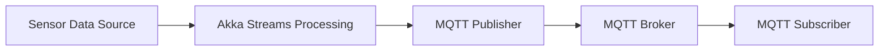

## 22.8 Implementing IoT Systems with Scala

The Internet of Things (IoT) is revolutionizing how we interact with the world, connecting billions of devices and generating vast amounts of data. Implementing IoT systems requires robust, scalable, and efficient solutions. Scala, with its powerful functional programming capabilities and rich ecosystem, is an excellent choice for building IoT applications. In this section, we will explore how to implement IoT systems using Scala, focusing on two key technologies: Akka Streams for data processing and MQTT for communication.

### Understanding IoT Systems

Before diving into the implementation details, let's briefly discuss what constitutes an IoT system. An IoT system typically involves:

- **Devices/Sensors**: These are the physical components that collect data from the environment.
- **Connectivity**: Protocols and networks that facilitate communication between devices and the central system.
- **Data Processing**: Analyzing and processing the data collected from devices.
- **User Interface**: Applications or dashboards that allow users to interact with the system.

Scala's functional programming paradigm, along with its strong type system, makes it ideal for developing reliable and maintainable IoT applications. Let's explore how we can leverage Scala's features to build an efficient IoT system.

### Leveraging Akka Streams for Data Processing

Akka Streams is a powerful library for processing data streams in a non-blocking and asynchronous manner. It is built on top of Akka, a toolkit for building concurrent, distributed, and fault-tolerant systems. Akka Streams provides a high-level API for defining and running data processing pipelines.

#### Key Concepts in Akka Streams

- **Source**: A source is a starting point of a data stream. It can emit elements to the stream.
- **Flow**: A flow represents a transformation of the data stream. It can modify or filter elements.
- **Sink**: A sink is an endpoint of a data stream. It consumes elements from the stream.

These components can be composed to form a data processing pipeline. Let's look at a simple example of using Akka Streams to process data from IoT sensors.

```scala
import akka.actor.ActorSystem
import akka.stream._
import akka.stream.scaladsl._

import scala.concurrent.Future

object IoTDataProcessing extends App {
  implicit val system: ActorSystem = ActorSystem("IoTSystem")
  implicit val materializer: Materializer = Materializer(system)

  // Simulated IoT sensor data
  val sensorData: Source[Int, NotUsed] = Source(1 to 100)

  // Define a flow to process the data
  val processFlow: Flow[Int, String, NotUsed] = Flow[Int].map { data =>
    s"Processed data: $data"
  }

  // Define a sink to consume the processed data
  val sink: Sink[String, Future[Done]] = Sink.foreach[String](println)

  // Connect the source, flow, and sink to form a runnable graph
  val runnableGraph: RunnableGraph[NotUsed] = sensorData.via(processFlow).to(sink)

  // Run the graph
  runnableGraph.run()
}
```

In this example, we simulate IoT sensor data using a `Source` that emits integers. The `Flow` processes each data point by converting it into a string with a "Processed data" prefix. Finally, the `Sink` consumes the processed data and prints it to the console.

#### Benefits of Akka Streams in IoT Systems

- **Backpressure**: Akka Streams provides built-in backpressure support, ensuring that the system can handle varying data rates without overwhelming any component.
- **Modularity**: The composable nature of streams allows for modular and reusable data processing components.
- **Scalability**: Akka Streams can easily scale to handle large volumes of data, making it suitable for IoT applications with numerous devices.

### Communicating with MQTT

MQTT (Message Queuing Telemetry Transport) is a lightweight messaging protocol designed for low-bandwidth, high-latency, or unreliable networks. It is widely used in IoT applications due to its efficiency and simplicity.

#### Key Features of MQTT

- **Publish/Subscribe Model**: Devices can publish messages to topics, and other devices can subscribe to those topics to receive messages.
- **Quality of Service (QoS)**: MQTT supports different levels of message delivery guarantees, ensuring reliable communication.
- **Lightweight Protocol**: MQTT's minimal overhead makes it ideal for resource-constrained devices.

Let's explore how to use MQTT in a Scala-based IoT system.

#### Setting Up MQTT with Scala

To use MQTT in Scala, we can leverage the Eclipse Paho MQTT client library. First, add the dependency to your `build.sbt` file:

```sbt
libraryDependencies += "org.eclipse.paho" % "org.eclipse.paho.client.mqttv3" % "1.2.5"
```

Next, let's create a simple MQTT client that publishes sensor data to a topic.

```scala
import org.eclipse.paho.client.mqttv3.{IMqttDeliveryToken, MqttCallback, MqttClient, MqttMessage}

object MqttPublisher extends App {
  val brokerUrl = "tcp://localhost:1883"
  val clientId = "ScalaMqttClient"
  val topic = "iot/sensors"

  val client = new MqttClient(brokerUrl, clientId)
  client.connect()

  // Publish a message to the topic
  val message = new MqttMessage("Hello from Scala MQTT!".getBytes)
  client.publish(topic, message)

  println(s"Message published to topic $topic")

  client.disconnect()
}
```

In this example, we create an MQTT client that connects to a broker and publishes a message to the `iot/sensors` topic. The message is a simple string, but in a real IoT system, it could be sensor data or commands.

#### Subscribing to MQTT Topics

To receive messages from an MQTT topic, we need to create a subscriber. Let's modify our example to include a subscriber that listens for messages on the `iot/sensors` topic.

```scala
object MqttSubscriber extends App {
  val brokerUrl = "tcp://localhost:1883"
  val clientId = "ScalaMqttSubscriber"
  val topic = "iot/sensors"

  val client = new MqttClient(brokerUrl, clientId)
  client.setCallback(new MqttCallback {
    override def connectionLost(cause: Throwable): Unit = {
      println("Connection lost")
    }

    override def messageArrived(topic: String, message: MqttMessage): Unit = {
      println(s"Message received: ${new String(message.getPayload)}")
    }

    override def deliveryComplete(token: IMqttDeliveryToken): Unit = {}
  })

  client.connect()
  client.subscribe(topic)

  println(s"Subscribed to topic $topic")
}
```

Here, we set up an MQTT client that subscribes to the `iot/sensors` topic and prints any received messages to the console. The `MqttCallback` interface is used to handle incoming messages and connection events.

### Integrating Akka Streams and MQTT

Now that we have explored both Akka Streams and MQTT, let's integrate them to build a complete IoT system. We will create a system that reads data from sensors, processes it using Akka Streams, and communicates with other devices using MQTT.

#### System Architecture

The architecture of our IoT system will consist of the following components:

- **Sensor Data Source**: Simulates sensor data generation.
- **Data Processing Pipeline**: Uses Akka Streams to process the sensor data.
- **MQTT Publisher**: Publishes processed data to an MQTT topic.
- **MQTT Subscriber**: Subscribes to the topic and consumes the data.

Below is a diagram illustrating the architecture of our IoT system:



#### Implementing the IoT System

Let's implement the components of our IoT system step by step.

##### Sensor Data Source

We will simulate sensor data using a `Source` in Akka Streams.

```scala
val sensorData: Source[Int, NotUsed] = Source(1 to 1000)
```

##### Data Processing Pipeline

We will define a `Flow` to process the sensor data. For simplicity, let's assume we are just converting the data to strings.

```scala
val processFlow: Flow[Int, String, NotUsed] = Flow[Int].map { data =>
  s"Processed data: $data"
}
```

##### MQTT Publisher

We will create a custom `Sink` that publishes processed data to an MQTT topic.

```scala
import org.eclipse.paho.client.mqttv3.{MqttClient, MqttMessage}

val mqttSink: Sink[String, Future[Done]] = Sink.foreach[String] { data =>
  val client = new MqttClient("tcp://localhost:1883", MqttClient.generateClientId())
  client.connect()
  val message = new MqttMessage(data.getBytes)
  client.publish("iot/processed", message)
  client.disconnect()
}
```

##### Running the System

Finally, we will connect the components and run the system.

```scala
val runnableGraph: RunnableGraph[NotUsed] = sensorData.via(processFlow).to(mqttSink)
runnableGraph.run()
```

### Enhancing the IoT System

The basic IoT system we have implemented can be enhanced in several ways to make it more robust and feature-rich.

#### Adding Error Handling

In real-world IoT systems, error handling is crucial. We can add error handling to our Akka Streams pipeline using the `recover` operator.

```scala
val processFlowWithErrorHandling: Flow[Int, String, NotUsed] = Flow[Int].map { data =>
  if (data % 10 == 0) throw new RuntimeException("Simulated error")
  s"Processed data: $data"
}.recover {
  case ex: Throwable => s"Error processing data: ${ex.getMessage}"
}
```

#### Implementing Backpressure

Backpressure is an important concept in stream processing, ensuring that the system can handle varying data rates. Akka Streams provides built-in backpressure support, but we can also implement custom backpressure strategies.

```scala
val throttledSource: Source[Int, NotUsed] = sensorData.throttle(10, 1.second, 10, ThrottleMode.Shaping)
```

#### Scaling the System

To handle large volumes of data, we can scale our IoT system by distributing the processing across multiple nodes. Akka Cluster can be used to distribute the workload and achieve scalability.

### Visualizing IoT Data

Visualizing IoT data is essential for monitoring and analysis. We can use various tools and libraries to visualize the data processed by our IoT system. One popular choice is Grafana, an open-source platform for monitoring and observability.

#### Setting Up Grafana

To visualize IoT data with Grafana, follow these steps:

1. **Install Grafana**: Download and install Grafana on your system.
2. **Configure Data Source**: Set up a data source in Grafana, such as InfluxDB or Prometheus, to store IoT data.
3. **Create Dashboards**: Use Grafana's dashboard editor to create visualizations and charts for your IoT data.

### Security Considerations

Security is a critical aspect of IoT systems. Here are some best practices to secure your Scala-based IoT system:

- **Authentication and Authorization**: Implement robust authentication and authorization mechanisms to control access to the system.
- **Data Encryption**: Use encryption protocols such as TLS to secure data transmission between devices and the central system.
- **Regular Updates**: Keep your software and dependencies up to date to protect against vulnerabilities.

### Conclusion

Implementing IoT systems with Scala offers numerous advantages, including scalability, reliability, and ease of maintenance. By leveraging Akka Streams for data processing and MQTT for communication, we can build efficient and robust IoT applications. As you continue your journey in IoT development, remember to focus on scalability, security, and data visualization to create impactful solutions.

## Quiz Time!



### What is the primary role of Akka Streams in an IoT system?

- [x] Processing data streams in a non-blocking and asynchronous manner
- [ ] Providing a user interface for IoT applications
- [ ] Storing IoT data in a database
- [ ] Managing device connectivity

> **Explanation:** Akka Streams is used for processing data streams efficiently, which is crucial in IoT systems where data is continuously generated by devices.

### Which protocol is commonly used for communication in IoT systems due to its lightweight nature?

- [ ] HTTP
- [x] MQTT
- [ ] FTP
- [ ] SMTP

> **Explanation:** MQTT is a lightweight messaging protocol designed for low-bandwidth and high-latency networks, making it ideal for IoT applications.

### In Akka Streams, what is a `Sink`?

- [ ] A starting point of a data stream
- [ ] A transformation of the data stream
- [x] An endpoint of a data stream
- [ ] A component that emits elements to the stream

> **Explanation:** A `Sink` is an endpoint of a data stream in Akka Streams, where data is consumed.

### How does Akka Streams handle varying data rates in an IoT system?

- [ ] By ignoring excess data
- [ ] By buffering all incoming data
- [x] By providing built-in backpressure support
- [ ] By discarding slow data

> **Explanation:** Akka Streams has built-in backpressure support, which ensures that the system can adapt to varying data rates without overwhelming any component.

### What is the function of the `recover` operator in Akka Streams?

- [ ] To start a data stream
- [x] To handle errors in the data processing pipeline
- [ ] To transform data elements
- [ ] To consume data elements

> **Explanation:** The `recover` operator is used to handle errors in the data processing pipeline, allowing the stream to continue processing even if an error occurs.

### Which of the following is a key feature of MQTT?

- [ ] High bandwidth usage
- [x] Publish/Subscribe model
- [ ] Complex data structures
- [ ] Synchronous communication

> **Explanation:** MQTT uses a publish/subscribe model, which allows devices to communicate efficiently by publishing messages to topics and subscribing to receive messages.

### What is the purpose of using Grafana in an IoT system?

- [ ] To process IoT data
- [ ] To communicate with IoT devices
- [x] To visualize IoT data
- [ ] To secure IoT data

> **Explanation:** Grafana is used to visualize IoT data, providing dashboards and charts for monitoring and analysis.

### How can you ensure secure data transmission in an IoT system?

- [ ] By using plain text communication
- [ ] By using unencrypted protocols
- [x] By using encryption protocols such as TLS
- [ ] By disabling authentication

> **Explanation:** Using encryption protocols like TLS ensures secure data transmission by encrypting the data being transmitted.

### What is a benefit of using Akka Cluster in an IoT system?

- [ ] It simplifies the user interface
- [x] It allows for distributed processing and scalability
- [ ] It reduces the need for data processing
- [ ] It eliminates the need for MQTT

> **Explanation:** Akka Cluster enables distributed processing, allowing the IoT system to scale and handle large volumes of data efficiently.

### True or False: MQTT is suitable for high-bandwidth networks.

- [ ] True
- [x] False

> **Explanation:** MQTT is designed for low-bandwidth, high-latency, or unreliable networks, making it ideal for IoT applications where bandwidth is limited.


