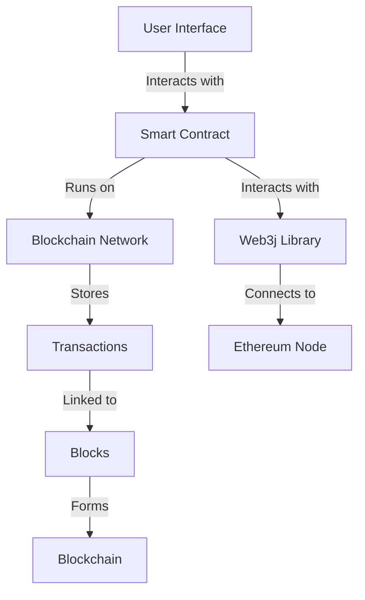

## 22.9 Blockchain Applications with Scala

Blockchain technology has revolutionized the way we think about data integrity, transparency, and decentralization. As we delve into blockchain applications with Scala, we will explore how Scala's unique features and functional programming paradigms can be leveraged to build robust blockchain solutions, smart contracts, and decentralized applications (DApps).

### Introduction to Blockchain Technology

Blockchain is a distributed ledger technology that allows data to be stored across a network of computers in a way that is secure, transparent, and tamper-proof. Each block in the chain contains a list of transactions, and once a block is added to the chain, it cannot be altered without altering all subsequent blocks, which requires consensus from the network.

#### Key Concepts of Blockchain

- **Decentralization**: Unlike traditional databases, blockchain does not have a central authority. Instead, it relies on a distributed network of nodes.
- **Immutability**: Once data is recorded in a blockchain, it cannot be changed without consensus from the network.
- **Transparency**: All transactions are visible to participants in the network, ensuring transparency.
- **Security**: Cryptographic techniques are used to secure data on the blockchain.

### Why Use Scala for Blockchain Development?

Scala is a powerful language that combines object-oriented and functional programming paradigms. It is known for its concise syntax, strong type system, and ability to handle complex computations, making it an excellent choice for blockchain development.

#### Advantages of Scala in Blockchain

- **Functional Programming**: Scala's functional programming capabilities allow for more predictable and testable code, which is crucial in blockchain applications.
- **Concurrency**: Scala's support for concurrent and parallel processing is beneficial for handling the distributed nature of blockchain.
- **Interoperability**: Scala runs on the JVM, allowing seamless integration with existing Java libraries and tools used in blockchain development.
- **Type Safety**: Scala's strong type system helps prevent errors at compile time, increasing the reliability of blockchain applications.

### Building Blockchain Solutions with Scala

Let's explore how to build a basic blockchain application using Scala. We will cover the essential components of a blockchain and demonstrate how to implement them in Scala.

#### Components of a Blockchain

1. **Block**: The basic unit of a blockchain, containing a list of transactions.
2. **Chain**: A sequence of blocks linked together.
3. **Transaction**: A record of data or value exchange.
4. **Consensus Algorithm**: A method for validating transactions and adding new blocks to the chain.

#### Implementing a Simple Blockchain in Scala

Below is a simplified implementation of a blockchain in Scala. This example focuses on the core concepts and does not include advanced features like consensus algorithms or network communication.

```scala
import java.security.MessageDigest

// Define a case class for a Block
case class Block(index: Int, previousHash: String, timestamp: Long, data: String, hash: String)

// Blockchain class to manage the chain of blocks
class Blockchain {
  private var chain: List[Block] = List(createGenesisBlock())

  // Create the first block in the chain
  def createGenesisBlock(): Block = {
    Block(0, "0", System.currentTimeMillis(), "Genesis Block", calculateHash(0, "0", System.currentTimeMillis(), "Genesis Block"))
  }

  // Get the latest block in the chain
  def getLatestBlock: Block = chain.last

  // Add a new block to the chain
  def addBlock(data: String): Unit = {
    val latestBlock = getLatestBlock
    val newBlock = Block(latestBlock.index + 1, latestBlock.hash, System.currentTimeMillis(), data, calculateHash(latestBlock.index + 1, latestBlock.hash, System.currentTimeMillis(), data))
    chain = chain :+ newBlock
  }

  // Calculate the hash for a block
  def calculateHash(index: Int, previousHash: String, timestamp: Long, data: String): String = {
    val input = s"$index$previousHash$timestamp$data"
    MessageDigest.getInstance("SHA-256").digest(input.getBytes("UTF-8")).map("%02x".format(_)).mkString
  }

  // Verify the integrity of the blockchain
  def isChainValid: Boolean = {
    for (i <- 1 until chain.length) {
      val currentBlock = chain(i)
      val previousBlock = chain(i - 1)
      if (currentBlock.hash != calculateHash(currentBlock.index, currentBlock.previousHash, currentBlock.timestamp, currentBlock.data)) return false
      if (currentBlock.previousHash != previousBlock.hash) return false
    }
    true
  }
}

// Example usage
object BlockchainApp extends App {
  val blockchain = new Blockchain
  blockchain.addBlock("First Block")
  blockchain.addBlock("Second Block")
  println(s"Blockchain valid: ${blockchain.isChainValid}")
}
```

In this example, we define a `Block` case class and a `Blockchain` class to manage the chain of blocks. The `Blockchain` class includes methods to create the genesis block, add new blocks, calculate hashes, and verify the integrity of the chain.

### Smart Contracts and Scala

Smart contracts are self-executing contracts with the terms of the agreement directly written into code. They run on blockchain platforms like Ethereum and automate transactions without the need for intermediaries.

#### Implementing Smart Contracts with Scala

While Scala is not natively supported on Ethereum, we can use Scala to interact with smart contracts deployed on the Ethereum blockchain using web3j, a Java library for Ethereum.

```scala
import org.web3j.protocol.Web3j
import org.web3j.protocol.http.HttpService
import org.web3j.tx.gas.DefaultGasProvider
import org.web3j.tx.ClientTransactionManager
import org.web3j.crypto.Credentials
import org.web3j.generated.Contracts.MyContract

object SmartContractApp extends App {
  // Connect to Ethereum node
  val web3j = Web3j.build(new HttpService("https://mainnet.infura.io/v3/YOUR_INFURA_PROJECT_ID"))

  // Load credentials
  val credentials = Credentials.create("YOUR_PRIVATE_KEY")

  // Load the smart contract
  val contract = MyContract.load("CONTRACT_ADDRESS", web3j, new ClientTransactionManager(web3j, "YOUR_ADDRESS"), DefaultGasProvider.GAS_PRICE, DefaultGasProvider.GAS_LIMIT)

  // Interact with the contract
  val result = contract.someMethod().send()
  println(s"Result from smart contract: $result")
}
```

In this example, we use web3j to connect to an Ethereum node and interact with a deployed smart contract. We load the contract using its address and credentials, then call a method on the contract.

### Decentralized Applications (DApps) with Scala

Decentralized applications (DApps) are applications that run on a blockchain network rather than a centralized server. They leverage blockchain's decentralized nature to provide transparency and security.

#### Building a DApp with Scala

To build a DApp with Scala, we need to integrate with a blockchain network and provide a user interface for interacting with the blockchain. We can use frameworks like Play Framework for building the web interface and libraries like web3j for blockchain interaction.

```scala
import play.api.mvc._
import play.api.libs.json._
import org.web3j.protocol.Web3j
import org.web3j.protocol.http.HttpService

class DAppController @Inject()(cc: ControllerComponents) extends AbstractController(cc) {
  val web3j = Web3j.build(new HttpService("https://mainnet.infura.io/v3/YOUR_INFURA_PROJECT_ID"))

  def getBalance(address: String) = Action {
    val balance = web3j.ethGetBalance(address, DefaultBlockParameterName.LATEST).send().getBalance
    Ok(Json.obj("address" -> address, "balance" -> balance.toString))
  }
}
```

In this example, we use Play Framework to create a simple web application that connects to the Ethereum blockchain and retrieves the balance of a given address.

### Visualizing Blockchain Architecture

To better understand the architecture of a blockchain application, let's visualize the components and their interactions.



This diagram illustrates the flow of interactions in a blockchain application. The user interface interacts with smart contracts, which run on the blockchain network. Transactions are stored in blocks, forming the blockchain. The web3j library facilitates communication between the application and the Ethereum node.

### Design Considerations for Blockchain Applications

When building blockchain applications with Scala, consider the following design considerations:

- **Scalability**: Ensure that your application can handle increased load as the number of users and transactions grows.
- **Security**: Implement robust security measures to protect against attacks and vulnerabilities.
- **Interoperability**: Design your application to work seamlessly with other blockchain networks and systems.
- **User Experience**: Provide a user-friendly interface for interacting with the blockchain.

### Differences and Similarities with Other Patterns

Blockchain applications share similarities with distributed systems and decentralized architectures. However, they differ in their emphasis on immutability, transparency, and consensus mechanisms. Understanding these differences is crucial for designing effective blockchain solutions.

### Try It Yourself

Experiment with the code examples provided in this guide. Try modifying the blockchain implementation to include a simple proof-of-work algorithm or add additional functionality to the smart contract interaction. Explore the Play Framework to build a more complex DApp with user authentication and transaction history.

### Conclusion

Scala's functional programming capabilities and strong type system make it an excellent choice for building blockchain applications. By leveraging Scala's features, you can create robust, secure, and scalable blockchain solutions, smart contracts, and decentralized applications. Remember, this is just the beginning. As you progress, you'll build more complex and interactive blockchain applications. Keep experimenting, stay curious, and enjoy the journey!

## Quiz Time!



### What is a key advantage of using Scala for blockchain development?

- [x] Functional programming capabilities
- [ ] Lack of type safety
- [ ] Limited concurrency support
- [ ] Incompatibility with Java libraries

> **Explanation:** Scala's functional programming capabilities allow for more predictable and testable code, which is crucial in blockchain applications.

### What is a smart contract?

- [x] A self-executing contract with terms written into code
- [ ] A physical contract signed by parties
- [ ] A contract that requires manual execution
- [ ] A contract stored on a centralized server

> **Explanation:** Smart contracts are self-executing contracts with the terms of the agreement directly written into code, automating transactions without intermediaries.

### How does Scala handle concurrency?

- [x] Through support for concurrent and parallel processing
- [ ] By using only single-threaded processing
- [ ] By avoiding concurrency altogether
- [ ] By relying solely on external libraries

> **Explanation:** Scala's support for concurrent and parallel processing is beneficial for handling the distributed nature of blockchain.

### What is the role of web3j in Scala blockchain applications?

- [x] It facilitates interaction with the Ethereum blockchain
- [ ] It is a framework for building user interfaces
- [ ] It is a tool for data visualization
- [ ] It is a library for machine learning

> **Explanation:** Web3j is a Java library that facilitates interaction with the Ethereum blockchain, allowing Scala applications to connect and interact with smart contracts.

### What is a DApp?

- [x] A decentralized application running on a blockchain network
- [ ] A desktop application running on a single computer
- [ ] A centralized application hosted on a server
- [ ] An application with no user interface

> **Explanation:** Decentralized applications (DApps) are applications that run on a blockchain network rather than a centralized server, leveraging blockchain's decentralized nature.

### What is the purpose of a consensus algorithm in a blockchain?

- [x] To validate transactions and add new blocks to the chain
- [ ] To encrypt data on the blockchain
- [ ] To provide a user interface for the blockchain
- [ ] To store user credentials securely

> **Explanation:** A consensus algorithm is used to validate transactions and add new blocks to the chain, ensuring the integrity and security of the blockchain.

### What is the significance of immutability in blockchain?

- [x] It ensures that once data is recorded, it cannot be changed
- [ ] It allows data to be easily modified
- [ ] It reduces the security of the blockchain
- [ ] It simplifies the consensus process

> **Explanation:** Immutability ensures that once data is recorded in a blockchain, it cannot be changed without consensus from the network, enhancing security and integrity.

### How can Scala's type system benefit blockchain applications?

- [x] By preventing errors at compile time
- [ ] By allowing dynamic typing
- [ ] By reducing code readability
- [ ] By increasing runtime errors

> **Explanation:** Scala's strong type system helps prevent errors at compile time, increasing the reliability of blockchain applications.

### What is the role of the Play Framework in building DApps with Scala?

- [x] It provides a web interface for interacting with the blockchain
- [ ] It is used for data encryption
- [ ] It is a library for machine learning
- [ ] It is a tool for blockchain consensus

> **Explanation:** The Play Framework is used to build the web interface for DApps, allowing users to interact with the blockchain.

### True or False: Scala can only be used for blockchain applications on the Ethereum network.

- [ ] True
- [x] False

> **Explanation:** Scala can be used for blockchain applications on various networks, not just Ethereum, thanks to its interoperability and support for multiple libraries.


