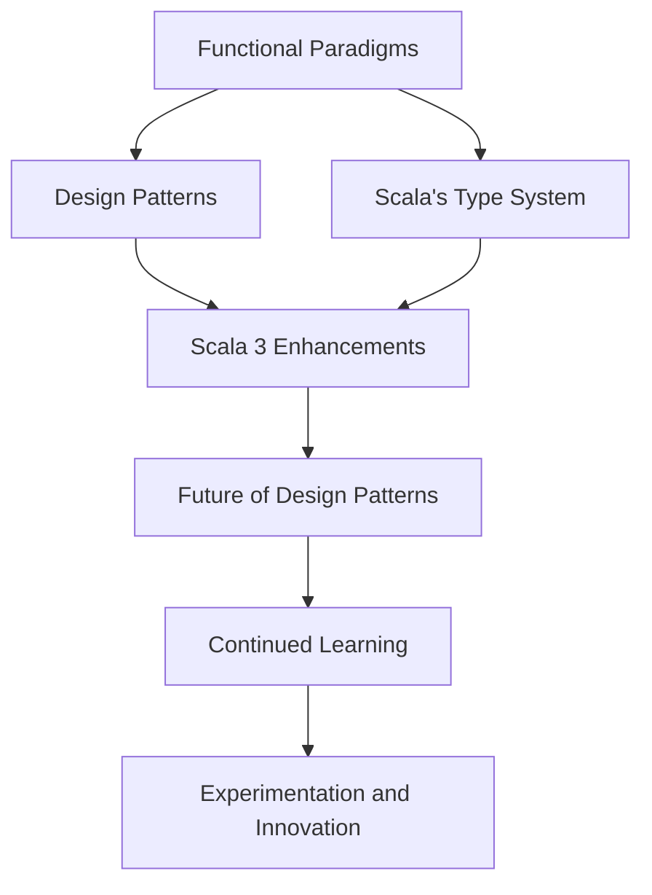

## 23.4 Final Thoughts on Design Patterns in Scala

As we reach the culmination of our journey through design patterns in Scala, it is essential to reflect on the insights gained and the path forward for expert software engineers and architects. This section aims to consolidate the knowledge acquired, highlight the unique aspects of Scala in the realm of design patterns, and provide encouragement for continued exploration and mastery.

### Embracing Scala's Unique Paradigms

Scala's unique blend of object-oriented and functional programming paradigms offers a rich landscape for applying design patterns. This duality allows developers to choose the most appropriate paradigm for a given problem, leveraging the strengths of both worlds. The integration of functional programming concepts, such as immutability, higher-order functions, and pattern matching, enhances the expressiveness and robustness of design patterns in Scala.

#### Functional Programming and Design Patterns

Functional programming in Scala encourages the use of pure functions, immutability, and higher-order functions, which align well with many design patterns. For instance, the Strategy pattern can be elegantly implemented using higher-order functions, allowing for dynamic behavior changes without altering the underlying object structure.

```scala
// Strategy Pattern using Higher-Order Functions
trait PaymentStrategy {
  def pay(amount: Double): Unit
}

class CreditCardStrategy extends PaymentStrategy {
  override def pay(amount: Double): Unit = println(s"Paid $$amount using Credit Card")
}

class PayPalStrategy extends PaymentStrategy {
  override def pay(amount: Double): Unit = println(s"Paid $$amount using PayPal")
}

def executePayment(amount: Double, strategy: PaymentStrategy): Unit = strategy.pay(amount)

// Usage
val creditCard = new CreditCardStrategy
val payPal = new PayPalStrategy

executePayment(100.0, creditCard)
executePayment(150.0, payPal)
```

### The Power of Scala's Type System

Scala's robust type system, with features like type inference, generics, and type classes, plays a crucial role in implementing design patterns. The type system not only ensures type safety but also enhances code clarity and maintainability.

#### Leveraging Type Classes

Type classes in Scala provide a powerful mechanism for achieving ad-hoc polymorphism. They allow developers to define generic interfaces that can be implemented for various types, enabling flexible and reusable design patterns.

```scala
// Type Class for Serialization
trait Serializer[T] {
  def serialize(value: T): String
}

object SerializerInstances {
  implicit val stringSerializer: Serializer[String] = (value: String) => s""""$value""""
  implicit val intSerializer: Serializer[Int] = (value: Int) => value.toString
}

def serialize[T](value: T)(implicit serializer: Serializer[T]): String = serializer.serialize(value)

// Usage
import SerializerInstances._

println(serialize("Hello, Scala!")) // Output: "Hello, Scala!"
println(serialize(42))              // Output: 42
```

### The Role of Immutability

Immutability is a cornerstone of functional programming and a key aspect of Scala's design philosophy. It simplifies reasoning about code, reduces the likelihood of bugs, and enhances concurrency. Many design patterns, such as the Singleton and Flyweight patterns, benefit from immutability by ensuring thread safety and reducing the need for synchronization.

### Integrating Object-Oriented and Functional Approaches

Scala's ability to seamlessly integrate object-oriented and functional programming paradigms allows for versatile and powerful design patterns. This integration is particularly evident in patterns like the Adapter and Decorator, where traits and mixins can be used to dynamically compose behavior.

#### The Adapter Pattern with Traits

The Adapter pattern is used to bridge incompatible interfaces. In Scala, traits provide a flexible way to implement adapters, allowing for dynamic composition and reuse.

```scala
// Adapter Pattern using Traits
trait MediaPlayer {
  def play(audioType: String, fileName: String): Unit
}

class AudioPlayer extends MediaPlayer {
  override def play(audioType: String, fileName: String): Unit = {
    if (audioType.equalsIgnoreCase("mp3")) {
      println(s"Playing mp3 file. Name: $fileName")
    } else {
      println(s"Invalid media. $audioType format not supported")
    }
  }
}

trait AdvancedMediaPlayer {
  def playVlc(fileName: String): Unit
  def playMp4(fileName: String): Unit
}

class VlcPlayer extends AdvancedMediaPlayer {
  override def playVlc(fileName: String): Unit = println(s"Playing vlc file. Name: $fileName")
  override def playMp4(fileName: String): Unit = {}
}

class Mp4Player extends AdvancedMediaPlayer {
  override def playVlc(fileName: String): Unit = {}
  override def playMp4(fileName: String): Unit = println(s"Playing mp4 file. Name: $fileName")
}

class MediaAdapter(audioType: String) extends MediaPlayer {
  private val advancedMusicPlayer: AdvancedMediaPlayer = audioType match {
    case "vlc" => new VlcPlayer
    case "mp4" => new Mp4Player
  }

  override def play(audioType: String, fileName: String): Unit = {
    audioType match {
      case "vlc" => advancedMusicPlayer.playVlc(fileName)
      case "mp4" => advancedMusicPlayer.playMp4(fileName)
    }
  }
}

// Usage
val audioPlayer = new AudioPlayer
audioPlayer.play("mp3", "beyond the horizon.mp3")

val mediaAdapter = new MediaAdapter("mp4")
mediaAdapter.play("mp4", "alone.mp4")
```

### The Future of Design Patterns in Scala

As Scala continues to evolve, so too will the design patterns that developers use. The introduction of Scala 3 brings new features such as union types, intersection types, and improved type inference, which will further enhance the implementation of design patterns.

#### Embracing Scala 3 Features

Scala 3 introduces several enhancements that simplify the implementation of design patterns. For example, the new `given` and `using` keywords replace implicits, providing a more intuitive syntax for dependency injection and type class instances.

```scala
// Using Scala 3's Given and Using for Dependency Injection
trait Logger {
  def log(message: String): Unit
}

given ConsoleLogger: Logger with {
  def log(message: String): Unit = println(s"Log: $message")
}

def logMessage(message: String)(using logger: Logger): Unit = logger.log(message)

// Usage
logMessage("Hello, Scala 3!")
```

### Encouragement for Continued Learning

As we conclude this guide, it's important to remember that mastering design patterns in Scala is an ongoing journey. The landscape of software development is ever-changing, and staying current with new patterns, tools, and techniques is crucial for continued success.

#### Keep Experimenting and Innovating

Design patterns are not rigid rules but rather guidelines that can be adapted and extended to suit specific needs. As you continue to develop your skills, don't hesitate to experiment with new approaches and innovate beyond traditional patterns.

### Try It Yourself

To solidify your understanding of design patterns in Scala, try modifying the code examples provided in this guide. Experiment with different implementations, explore alternative approaches, and see how Scala's unique features can enhance the patterns.

### Visualizing the Journey

To help visualize the journey of mastering design patterns in Scala, consider the following diagram, which illustrates the interplay between functional and object-oriented paradigms, the role of Scala's type system, and the evolution of design patterns with Scala 3.



### Conclusion

In conclusion, design patterns in Scala offer a powerful toolkit for expert software engineers and architects. By embracing Scala's unique paradigms, leveraging its robust type system, and integrating functional and object-oriented approaches, developers can create elegant, scalable, and maintainable software solutions. As you continue your journey, remember to stay curious, keep learning, and enjoy the process of mastering design patterns in Scala.

## Quiz Time!



### What is a key benefit of using Scala's type system in design patterns?

- [x] It enhances code clarity and maintainability.
- [ ] It allows for dynamic typing.
- [ ] It simplifies syntax by removing type annotations.
- [ ] It eliminates the need for design patterns.

> **Explanation:** Scala's type system enhances code clarity and maintainability by ensuring type safety and enabling flexible and reusable design patterns.

### How does Scala's immutability benefit design patterns?

- [x] It ensures thread safety and reduces the need for synchronization.
- [ ] It allows for mutable state changes.
- [ ] It simplifies the implementation of the Singleton pattern.
- [ ] It makes code less readable.

> **Explanation:** Immutability ensures thread safety and reduces the need for synchronization, which is beneficial for patterns like Singleton and Flyweight.

### What is a primary advantage of using higher-order functions in Scala?

- [x] They allow for dynamic behavior changes without altering object structure.
- [ ] They eliminate the need for classes.
- [ ] They simplify the syntax of loops.
- [ ] They make code less readable.

> **Explanation:** Higher-order functions allow for dynamic behavior changes without altering the underlying object structure, which is useful in patterns like Strategy.

### How do type classes in Scala aid in design patterns?

- [x] They provide a mechanism for achieving ad-hoc polymorphism.
- [ ] They enforce strict inheritance hierarchies.
- [ ] They simplify the implementation of Singleton patterns.
- [ ] They eliminate the need for interfaces.

> **Explanation:** Type classes provide a mechanism for achieving ad-hoc polymorphism, allowing for flexible and reusable design patterns.

### What is a key feature of Scala 3 that impacts design patterns?

- [x] The introduction of `given` and `using` keywords.
- [ ] The removal of the type system.
- [ ] The elimination of functional programming features.
- [ ] The addition of mutable state by default.

> **Explanation:** Scala 3 introduces `given` and `using` keywords, which replace implicits and provide a more intuitive syntax for dependency injection and type class instances.

### What is the primary role of the Adapter pattern?

- [x] To bridge incompatible interfaces.
- [ ] To simplify code syntax.
- [ ] To enforce strict type checking.
- [ ] To eliminate the need for classes.

> **Explanation:** The Adapter pattern is used to bridge incompatible interfaces, allowing different systems to work together.

### How does Scala's integration of functional and object-oriented paradigms benefit design patterns?

- [x] It allows for versatile and powerful design patterns.
- [ ] It eliminates the need for design patterns.
- [ ] It simplifies the syntax of loops.
- [ ] It enforces strict inheritance hierarchies.

> **Explanation:** Scala's integration of functional and object-oriented paradigms allows for versatile and powerful design patterns, leveraging the strengths of both approaches.

### What is a key takeaway from mastering design patterns in Scala?

- [x] Design patterns are guidelines that can be adapted and extended.
- [ ] Design patterns are rigid rules that must be followed exactly.
- [ ] Design patterns eliminate the need for functional programming.
- [ ] Design patterns simplify syntax by removing type annotations.

> **Explanation:** Design patterns are guidelines that can be adapted and extended to suit specific needs, allowing for innovation and experimentation.

### Why is continued learning important in mastering design patterns in Scala?

- [x] The landscape of software development is ever-changing.
- [ ] Design patterns never change.
- [ ] Scala does not support new features.
- [ ] Functional programming is outdated.

> **Explanation:** Continued learning is important because the landscape of software development is ever-changing, and staying current with new patterns, tools, and techniques is crucial for success.

### True or False: Scala's type system eliminates the need for design patterns.

- [ ] True
- [x] False

> **Explanation:** Scala's type system enhances design patterns by ensuring type safety and enabling flexible and reusable implementations, but it does not eliminate the need for design patterns.


