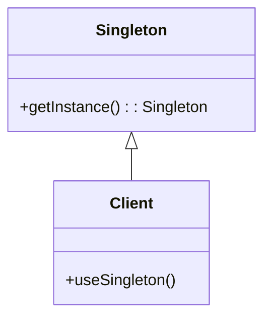
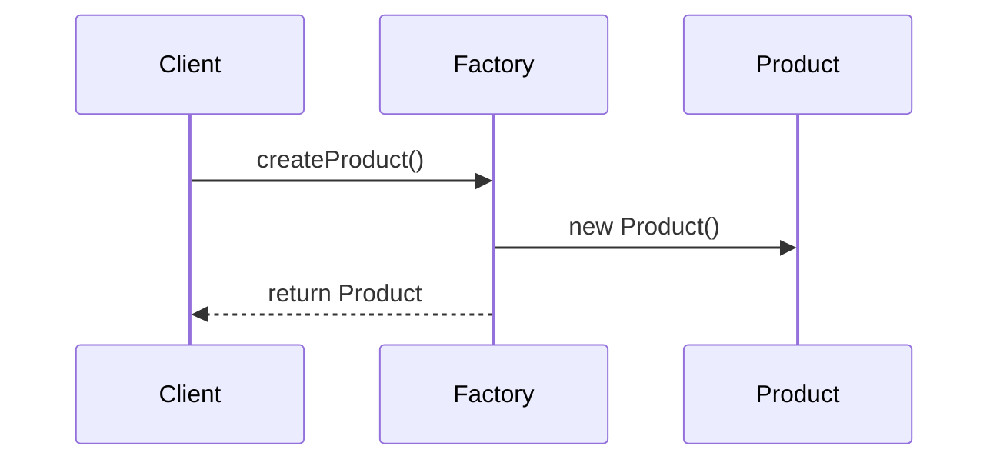

## 24.2 Bibliography and Further Reading

In the ever-evolving landscape of software development, staying informed and expanding your knowledge is crucial. This section provides a comprehensive list of recommended books, articles, and papers that delve into Scala design patterns, functional programming, and software architecture. Whether you're an expert software engineer or an architect, these resources will enhance your understanding and proficiency in Scala's unique paradigms and its application in modern software design.

### Books

1. **"Programming in Scala" by Martin Odersky, Lex Spoon, and Bill Venners**
   - **Description:** This book is a definitive guide to Scala, written by the creator of the language, Martin Odersky. It covers the language's features, including its object-oriented and functional programming capabilities, making it a must-read for anyone serious about mastering Scala.
   - **Why Read:** Gain insights directly from the language's creator and understand the core principles and features of Scala.

2. **"Functional Programming in Scala" by Paul Chiusano and Rúnar Bjarnason**
   - **Description:** This book introduces functional programming concepts using Scala as the medium. It covers topics like immutability, higher-order functions, and monads, providing a solid foundation for applying functional programming in Scala.
   - **Why Read:** Learn how to apply functional programming principles in Scala, enhancing code robustness and maintainability.

3. **"Scala Design Patterns" by Ivan Nikolov**
   - **Description:** This book explores design patterns through the lens of Scala, demonstrating how traditional patterns can be adapted to leverage Scala's functional and object-oriented features.
   - **Why Read:** Understand how to implement classic design patterns in Scala, taking advantage of its unique features.

4. **"Scala for the Impatient" by Cay S. Horstmann**
   - **Description:** A concise introduction to Scala, this book is ideal for developers who want to quickly get up to speed with Scala's syntax and features.
   - **Why Read:** Quickly grasp Scala's syntax and features, making it easier to dive into more complex topics like design patterns.

5. **"Reactive Design Patterns" by Roland Kuhn, Brian Hanafee, and Jamie Allen**
   - **Description:** This book covers patterns for building reactive systems, which are crucial for developing responsive, resilient, and scalable applications in Scala.
   - **Why Read:** Learn how to design reactive systems in Scala, a key skill for modern software development.

6. **"Domain Modeling Made Functional" by Scott Wlaschin**
   - **Description:** While not Scala-specific, this book provides insights into functional domain modeling, a concept that can be effectively applied in Scala.
   - **Why Read:** Understand how to model complex domains using functional programming principles, applicable in Scala projects.

7. **"Akka in Action" by Raymond Roestenburg, Rob Bakker, and Rob Williams**
   - **Description:** This book provides a comprehensive guide to Akka, a powerful toolkit for building concurrent, distributed, and resilient message-driven applications in Scala.
   - **Why Read:** Master Akka for building scalable and resilient applications in Scala.

8. **"Advanced Scala with Cats" by Noel Welsh and Dave Gurnell**
   - **Description:** This book explores advanced functional programming concepts using the Cats library in Scala, covering topics like monads, functors, and type classes.
   - **Why Read:** Deepen your understanding of functional programming in Scala using the Cats library.

### Articles and Papers

1. **"The Essence of the Iterator Pattern" by Jeremy Gibbons and Bruno C. d. S. Oliveira**
   - **Description:** This paper revisits the Iterator pattern from a functional programming perspective, providing insights into its essence and implementation in functional languages like Scala.
   - **Why Read:** Gain a deeper understanding of the Iterator pattern in a functional context, applicable to Scala.

2. **"A Tour of Scala" by Martin Odersky**
   - **Description:** An online resource that provides an overview of Scala's features, including its type system, collections, and concurrency model.
   - **Why Read:** Familiarize yourself with Scala's core features and capabilities, laying the groundwork for mastering design patterns.

3. **"Scala's Type System: A Deep Dive" by Adriaan Moors**
   - **Description:** This article explores Scala's type system, including advanced features like higher-kinded types and implicits, which are crucial for implementing design patterns in Scala.
   - **Why Read:** Understand Scala's type system in depth, enabling you to leverage it effectively in design patterns.

4. **"Functional Design Patterns for Scala" by Debasish Ghosh**
   - **Description:** This article discusses functional design patterns in Scala, providing practical examples and insights into their implementation.
   - **Why Read:** Learn how to apply functional design patterns in Scala, enhancing your code's clarity and maintainability.

5. **"The Reactive Manifesto" by Jonas Bonér, Dave Farley, Roland Kuhn, and Martin Thompson**
   - **Description:** This manifesto outlines the principles of reactive systems, which are increasingly relevant in modern Scala applications.
   - **Why Read:** Understand the principles of reactive systems and how they can be applied in Scala development.

6. **"Scala and the JVM: A Match Made in Heaven" by Heather Miller**
   - **Description:** This paper explores the synergy between Scala and the JVM, highlighting the benefits and challenges of using Scala on the JVM platform.
   - **Why Read:** Gain insights into the advantages of using Scala on the JVM, a critical aspect of Scala development.

7. **"Monads in Scala: A Practical Guide" by John A. De Goes**
   - **Description:** This article provides a practical guide to understanding and using monads in Scala, a key concept in functional programming.
   - **Why Read:** Master the use of monads in Scala, a fundamental concept for functional programming.

8. **"Scala's Collections: A Comprehensive Overview" by Daniel Spiewak**
   - **Description:** This article provides an in-depth look at Scala's collection library, including its design and usage patterns.
   - **Why Read:** Understand Scala's collection library, a vital component for implementing design patterns.

### Online Resources

1. **Scala Documentation**
   - **Description:** The official Scala documentation provides comprehensive information on Scala's features, libraries, and best practices.
   - **Why Visit:** Access up-to-date information and examples on Scala's features and libraries.

2. **Coursera: Functional Programming Principles in Scala**
   - **Description:** An online course by Martin Odersky that introduces functional programming concepts using Scala.
   - **Why Enroll:** Learn functional programming from the creator of Scala, enhancing your understanding of Scala's paradigms.

3. **Scala Exercises**
   - **Description:** An interactive platform for learning Scala through exercises and quizzes.
   - **Why Use:** Practice Scala concepts and design patterns through hands-on exercises.

4. **Scala Center**
   - **Description:** A non-profit organization dedicated to the development and promotion of Scala, providing resources and support for the Scala community.
   - **Why Explore:** Access a wealth of resources and support for Scala development.

5. **GitHub: Scala Design Patterns**
   - **Description:** A repository of Scala design pattern implementations, providing practical examples and insights.
   - **Why Explore:** Discover practical implementations of design patterns in Scala, enhancing your understanding and skills.

### Conferences and Workshops

1. **Scala Days**
   - **Description:** An annual conference that brings together Scala enthusiasts and experts to share knowledge and insights.
   - **Why Attend:** Network with Scala experts and learn about the latest developments in the Scala ecosystem.

2. **Functional Scala**
   - **Description:** A conference focused on functional programming in Scala, featuring talks and workshops by industry leaders.
   - **Why Attend:** Deepen your understanding of functional programming in Scala through expert-led sessions.

3. **Scala World**
   - **Description:** A conference that combines technical talks with outdoor activities, providing a unique learning experience.
   - **Why Attend:** Engage with the Scala community in a unique setting, gaining insights and inspiration.

4. **Typelevel Summit**
   - **Description:** A conference focused on type-level programming in Scala, featuring talks and workshops on advanced Scala topics.
   - **Why Attend:** Explore advanced Scala topics and network with experts in type-level programming.

### Community and Forums

1. **Scala Users Mailing List**
   - **Description:** A mailing list for Scala users to discuss topics related to Scala development and design patterns.
   - **Why Join:** Connect with other Scala developers and share knowledge and experiences.

2. **Stack Overflow: Scala**
   - **Description:** A community-driven platform for asking and answering Scala-related questions.
   - **Why Use:** Get answers to your Scala questions and learn from the community's collective knowledge.

3. **Reddit: r/scala**
   - **Description:** A subreddit dedicated to Scala, featuring discussions, news, and resources.
   - **Why Join:** Stay updated on Scala news and engage with the community.

4. **Gitter: Scala**
   - **Description:** A chat platform for real-time discussions about Scala and related topics.
   - **Why Use:** Participate in real-time discussions with other Scala developers.

5. **Scala Discord Server**
   - **Description:** A community server for Scala enthusiasts to discuss topics and share resources.
   - **Why Join:** Engage with the Scala community and access a wealth of resources and support.

### Research Papers

1. **"Scala: A Scalable Language for Software Development" by Martin Odersky**
   - **Description:** This paper provides an overview of Scala's design and its application in software development.
   - **Why Read:** Gain insights into Scala's design principles and its application in software development.

2. **"A Study of Scala's Type System" by Adriaan Moors**
   - **Description:** This paper explores Scala's type system, including its advanced features and applications.
   - **Why Read:** Understand Scala's type system in depth, a crucial aspect of implementing design patterns.

3. **"Functional Programming with Scala" by Paul Chiusano**
   - **Description:** This paper discusses the application of functional programming principles in Scala.
   - **Why Read:** Learn how to apply functional programming principles in Scala, enhancing your code's robustness and maintainability.

4. **"Reactive Programming in Scala" by Roland Kuhn**
   - **Description:** This paper explores the principles of reactive programming and their application in Scala.
   - **Why Read:** Understand the principles of reactive programming and how they can be applied in Scala development.

5. **"Scala and the JVM: A Perfect Match" by Heather Miller**
   - **Description:** This paper explores the synergy between Scala and the JVM, highlighting the benefits and challenges of using Scala on the JVM platform.
   - **Why Read:** Gain insights into the advantages of using Scala on the JVM, a critical aspect of Scala development.

### Try It Yourself

To truly grasp the concepts discussed in these resources, it's essential to experiment and apply them in your projects. Here are some suggestions:

- **Implement a Design Pattern:** Choose a design pattern from the resources and implement it in a Scala project. Experiment with different approaches and see how Scala's features can enhance the pattern.
- **Explore Functional Programming:** Apply functional programming principles in a Scala project, such as immutability and higher-order functions. Observe how these principles improve code clarity and maintainability.
- **Build a Reactive System:** Use Akka or another reactive toolkit to build a responsive and resilient system in Scala. Experiment with different reactive patterns and observe their impact on system performance.

### Visualizing Scala Design Patterns

To aid your understanding of Scala design patterns, consider creating diagrams to visualize the relationships and interactions between components. Here are some examples:

*Diagram 1: Singleton Pattern in Scala - This diagram illustrates the Singleton pattern, where a single instance of a class is accessed by a client.*

*Diagram 2: Factory Pattern Sequence - This sequence diagram shows the interaction between a client, a factory, and a product in the Factory pattern.*

### Knowledge Check

To reinforce your understanding of the material, consider the following questions:

1. What are the key features of Scala that make it suitable for implementing design patterns?
2. How does functional programming enhance the implementation of design patterns in Scala?
3. What are the benefits of using Scala's type system in design pattern implementation?
4. How can reactive programming principles be applied in Scala development?
5. What are the advantages of using Scala on the JVM platform?

### Embrace the Journey

Remember, mastering Scala design patterns is a journey. As you explore these resources and experiment with Scala's features, you'll gain a deeper understanding of its paradigms and their application in modern software design. Stay curious, keep experimenting, and enjoy the journey!

## Quiz Time!



### What is the primary benefit of using Scala's type system in design pattern implementation?

- [x] Enhances code safety and reliability
- [ ] Simplifies syntax
- [ ] Reduces code length
- [ ] Increases execution speed

> **Explanation:** Scala's type system provides strong typing, which enhances code safety and reliability by catching errors at compile time.

### Which book is written by the creator of Scala?

- [x] "Programming in Scala"
- [ ] "Functional Programming in Scala"
- [ ] "Scala Design Patterns"
- [ ] "Scala for the Impatient"

> **Explanation:** "Programming in Scala" is co-authored by Martin Odersky, the creator of Scala.

### What is a key focus of the book "Reactive Design Patterns"?

- [x] Building responsive, resilient, and scalable applications
- [ ] Simplifying syntax
- [ ] Enhancing code readability
- [ ] Reducing execution time

> **Explanation:** "Reactive Design Patterns" focuses on building responsive, resilient, and scalable applications using reactive principles.

### Which online resource provides interactive Scala exercises?

- [x] Scala Exercises
- [ ] Scala Documentation
- [ ] Coursera: Functional Programming Principles in Scala
- [ ] Scala Center

> **Explanation:** Scala Exercises is an interactive platform for learning Scala through hands-on exercises.

### What is the primary topic of the paper "The Essence of the Iterator Pattern"?

- [x] Revisiting the Iterator pattern from a functional programming perspective
- [ ] Simplifying the Iterator pattern
- [ ] Enhancing the performance of the Iterator pattern
- [ ] Reducing the complexity of the Iterator pattern

> **Explanation:** The paper revisits the Iterator pattern from a functional programming perspective, providing insights into its essence.

### Which conference combines technical talks with outdoor activities?

- [x] Scala World
- [ ] Scala Days
- [ ] Functional Scala
- [ ] Typelevel Summit

> **Explanation:** Scala World combines technical talks with outdoor activities, providing a unique learning experience.

### What is a key advantage of using Akka in Scala?

- [x] Building scalable and resilient applications
- [ ] Simplifying syntax
- [ ] Reducing execution time
- [ ] Enhancing code readability

> **Explanation:** Akka is a powerful toolkit for building scalable and resilient message-driven applications in Scala.

### Which book provides a practical guide to using monads in Scala?

- [x] "Monads in Scala: A Practical Guide"
- [ ] "Programming in Scala"
- [ ] "Scala Design Patterns"
- [ ] "Functional Programming in Scala"

> **Explanation:** "Monads in Scala: A Practical Guide" provides a practical guide to understanding and using monads in Scala.

### What is the focus of the paper "Scala and the JVM: A Match Made in Heaven"?

- [x] Exploring the synergy between Scala and the JVM
- [ ] Simplifying Scala syntax
- [ ] Enhancing Scala's performance
- [ ] Reducing Scala's complexity

> **Explanation:** The paper explores the synergy between Scala and the JVM, highlighting the benefits and challenges of using Scala on the JVM platform.

### True or False: "Scala Design Patterns" by Ivan Nikolov focuses on adapting traditional patterns to leverage Scala's features.

- [x] True
- [ ] False

> **Explanation:** "Scala Design Patterns" explores how traditional patterns can be adapted to leverage Scala's functional and object-oriented features.


