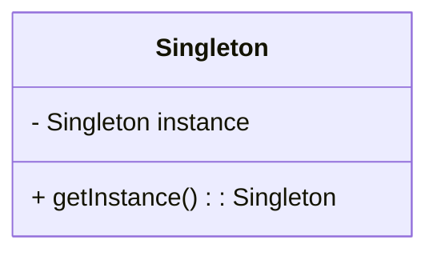
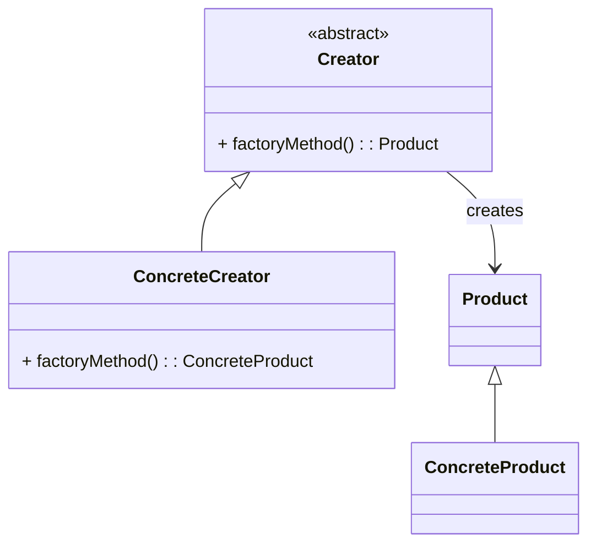
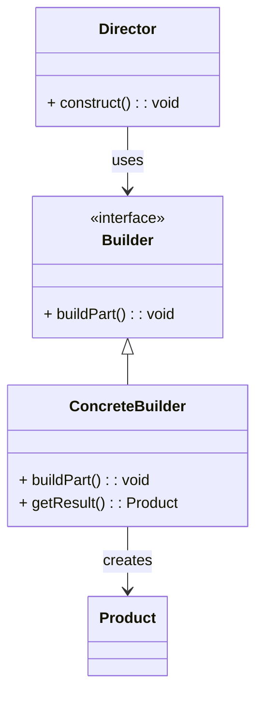
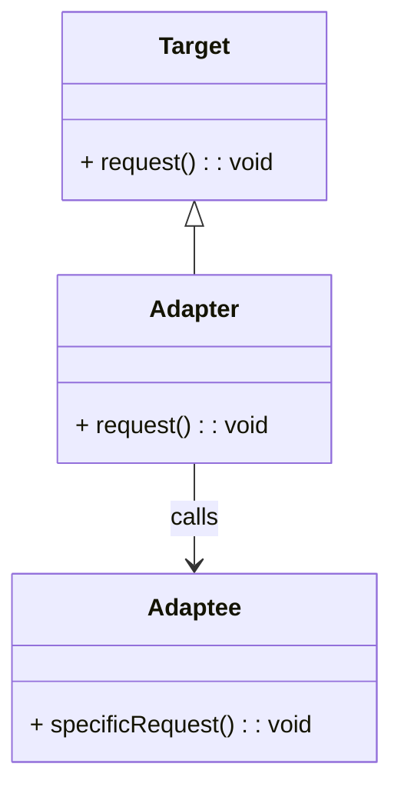
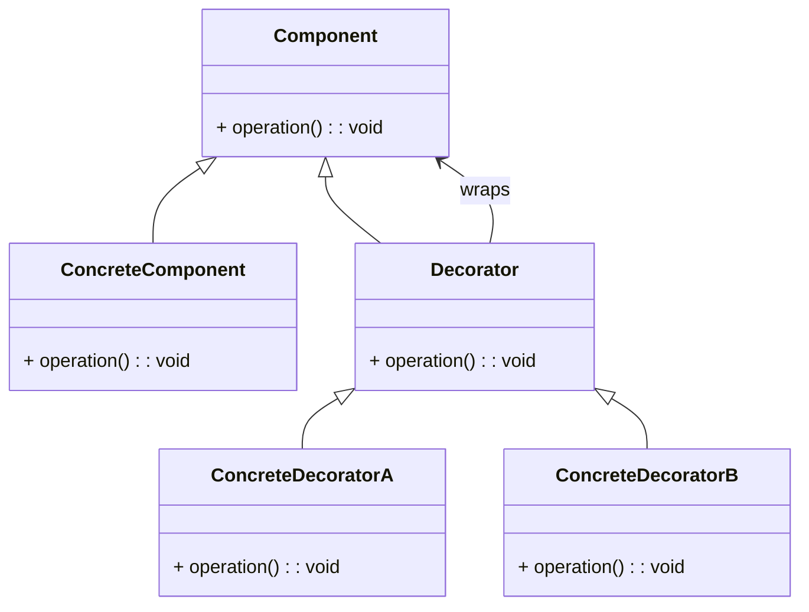
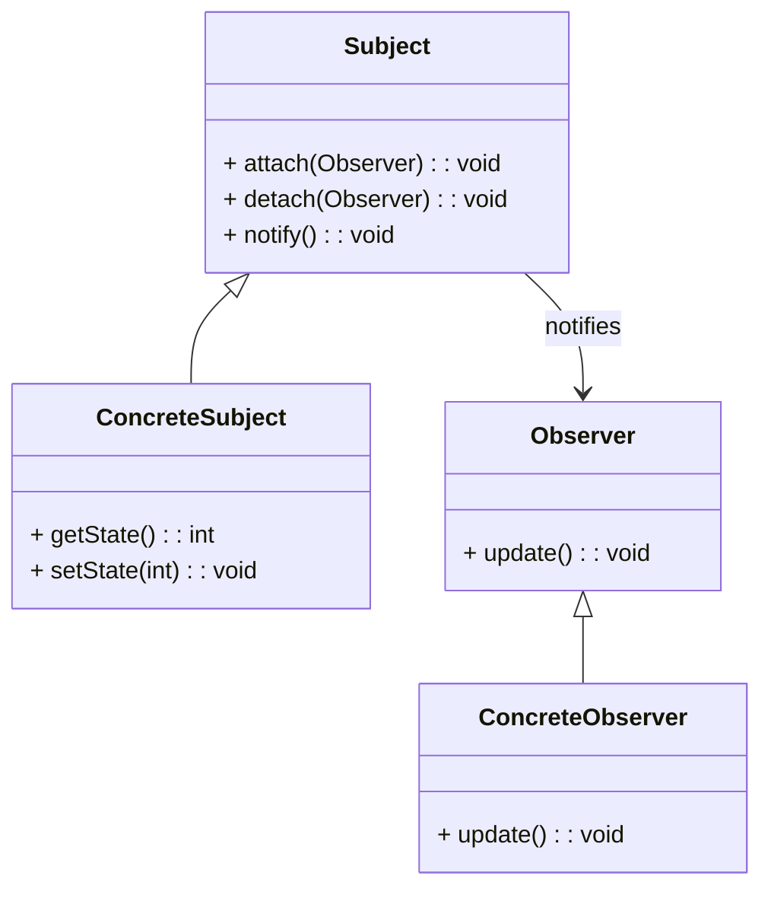
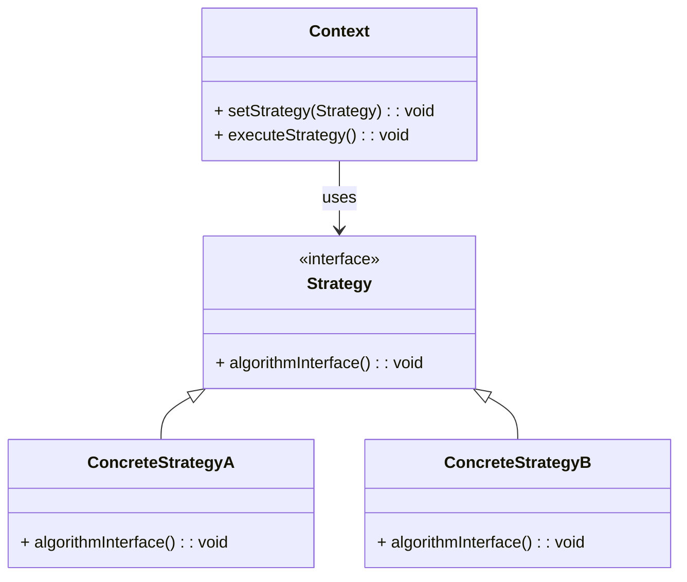
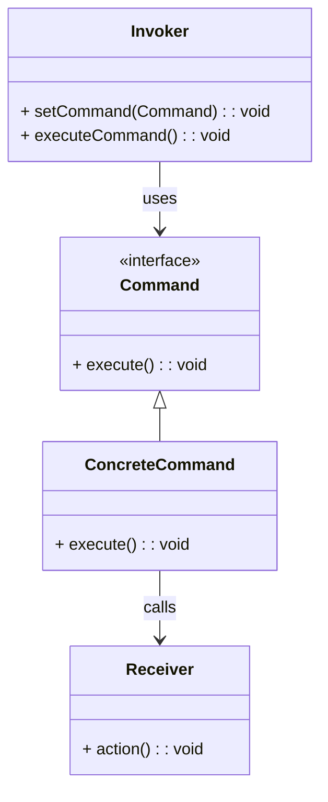

## 24.3 Pattern Reference Cheat Sheet

This section provides a quick-reference guide to the design patterns discussed in the Scala Design Patterns guide. Each pattern is presented with a consistent format to facilitate understanding and application in your projects.

### Singleton Pattern

- **Category**: Creational
- **Intent**: Ensure a class has only one instance and provide a global point of access to it.



- **Key Participants**: Singleton class
- **Applicability**: Use when exactly one instance of a class is needed to coordinate actions across the system.
- **Sample Code Snippet**:

```scala
object Singleton {
  private var instance: Singleton = _

  def getInstance: Singleton = {
    if (instance == null) {
      instance = new Singleton()
    }
    instance
  }
}

class Singleton private() {
  // Singleton logic
}
```

- **Design Considerations**: Ensure thread safety in concurrent environments. Scala's `object` keyword inherently provides a thread-safe singleton.
- **Differences and Similarities**: Often confused with the Factory pattern, which deals with object creation but not uniqueness.

### Factory Method Pattern

- **Category**: Creational
- **Intent**: Define an interface for creating an object, but let subclasses alter the type of objects that will be created.



- **Key Participants**: Creator, ConcreteCreator, Product
- **Applicability**: Use when a class can't anticipate the class of objects it must create.
- **Sample Code Snippet**:

```scala
trait Product {
  def use(): Unit
}

class ConcreteProductA extends Product {
  override def use(): Unit = println("Using Product A")
}

class ConcreteProductB extends Product {
  override def use(): Unit = println("Using Product B")
}

abstract class Creator {
  def factoryMethod(): Product
}

class ConcreteCreatorA extends Creator {
  override def factoryMethod(): Product = new ConcreteProductA
}

class ConcreteCreatorB extends Creator {
  override def factoryMethod(): Product = new ConcreteProductB
}
```

- **Design Considerations**: Consider using pattern matching in Scala to simplify factory logic.
- **Differences and Similarities**: Different from the Abstract Factory pattern, which provides an interface for creating families of related objects.

### Builder Pattern

- **Category**: Creational
- **Intent**: Separate the construction of a complex object from its representation, allowing the same construction process to create different representations.



- **Key Participants**: Builder, ConcreteBuilder, Director, Product
- **Applicability**: Use when the construction process must allow different representations of an object.
- **Sample Code Snippet**:

```scala
case class Car(engine: String, wheels: Int, color: String)

class CarBuilder {
  private var engine: String = _
  private var wheels: Int = _
  private var color: String = _

  def setEngine(engine: String): CarBuilder = {
    this.engine = engine
    this
  }

  def setWheels(wheels: Int): CarBuilder = {
    this.wheels = wheels
    this
  }

  def setColor(color: String): CarBuilder = {
    this.color = color
    this
  }

  def build(): Car = Car(engine, wheels, color)
}
```

- **Design Considerations**: Use Scala's case classes and copy methods for immutable builders.
- **Differences and Similarities**: Similar to the Factory pattern, but focuses on constructing complex objects step by step.

### Adapter Pattern

- **Category**: Structural
- **Intent**: Convert the interface of a class into another interface clients expect. Adapter lets classes work together that couldn't otherwise because of incompatible interfaces.



- **Key Participants**: Target, Adapter, Adaptee
- **Applicability**: Use when you want to use an existing class, and its interface does not match the one you need.
- **Sample Code Snippet**:

```scala
trait Target {
  def request(): String
}

class Adaptee {
  def specificRequest(): String = "Adaptee's specific request"
}

class Adapter(adaptee: Adaptee) extends Target {
  override def request(): String = adaptee.specificRequest()
}
```

- **Design Considerations**: Use implicit conversions in Scala to create adapters seamlessly.
- **Differences and Similarities**: Often confused with the Decorator pattern, which adds behavior rather than adapting interfaces.

### Decorator Pattern

- **Category**: Structural
- **Intent**: Attach additional responsibilities to an object dynamically. Decorators provide a flexible alternative to subclassing for extending functionality.



- **Key Participants**: Component, ConcreteComponent, Decorator, ConcreteDecorator
- **Applicability**: Use to add responsibilities to individual objects dynamically and transparently.
- **Sample Code Snippet**:

```scala
trait Coffee {
  def cost(): Double
  def description(): String
}

class SimpleCoffee extends Coffee {
  override def cost(): Double = 5.0
  override def description(): String = "Simple coffee"
}

abstract class CoffeeDecorator(coffee: Coffee) extends Coffee {
  override def cost(): Double = coffee.cost()
  override def description(): String = coffee.description()
}

class MilkDecorator(coffee: Coffee) extends CoffeeDecorator(coffee) {
  override def cost(): Double = super.cost() + 1.5
  override def description(): String = super.description() + ", milk"
}
```

- **Design Considerations**: Use Scala's traits and mixins to implement decorators.
- **Differences and Similarities**: Different from the Adapter pattern, which changes interfaces rather than adding functionality.

### Observer Pattern

- **Category**: Behavioral
- **Intent**: Define a one-to-many dependency between objects so that when one object changes state, all its dependents are notified and updated automatically.



- **Key Participants**: Subject, ConcreteSubject, Observer, ConcreteObserver
- **Applicability**: Use when an abstraction has two aspects, one dependent on the other.
- **Sample Code Snippet**:

```scala
trait Observer {
  def update(subject: Subject): Unit
}

class ConcreteObserver extends Observer {
  override def update(subject: Subject): Unit = {
    println(s"Observer notified. New state: ${subject.getState}")
  }
}

trait Subject {
  private var observers: List[Observer] = List()

  def attach(observer: Observer): Unit = observers ::= observer
  def detach(observer: Observer): Unit = observers = observers.filterNot(_ == observer)
  def notifyObservers(): Unit = observers.foreach(_.update(this))
  def getState: Int
}

class ConcreteSubject extends Subject {
  private var state: Int = _

  def setState(state: Int): Unit = {
    this.state = state
    notifyObservers()
  }

  override def getState: Int = state
}
```

- **Design Considerations**: Use Scala's `Observable` trait for reactive programming.
- **Differences and Similarities**: Similar to the Mediator pattern, but the Observer pattern allows for direct communication between subjects and observers.

### Strategy Pattern

- **Category**: Behavioral
- **Intent**: Define a family of algorithms, encapsulate each one, and make them interchangeable. Strategy lets the algorithm vary independently from clients that use it.



- **Key Participants**: Context, Strategy, ConcreteStrategy
- **Applicability**: Use when you need to use one of several algorithms dynamically.
- **Sample Code Snippet**:

```scala
trait Strategy {
  def execute(a: Int, b: Int): Int
}

class AddStrategy extends Strategy {
  override def execute(a: Int, b: Int): Int = a + b
}

class MultiplyStrategy extends Strategy {
  override def execute(a: Int, b: Int): Int = a * b
}

class Context(var strategy: Strategy) {
  def executeStrategy(a: Int, b: Int): Int = strategy.execute(a, b)
}
```

- **Design Considerations**: Use higher-order functions in Scala to pass strategies as parameters.
- **Differences and Similarities**: Different from the State pattern, which changes behavior based on state rather than strategy.

### Command Pattern

- **Category**: Behavioral
- **Intent**: Encapsulate a request as an object, thereby allowing for parameterization of clients with queues, requests, and operations.



- **Key Participants**: Command, ConcreteCommand, Invoker, Receiver
- **Applicability**: Use to parameterize objects with operations, delay execution, or queue operations.
- **Sample Code Snippet**:

```scala
trait Command {
  def execute(): Unit
}

class LightOnCommand(light: Light) extends Command {
  override def execute(): Unit = light.on()
}

class Light {
  def on(): Unit = println("Light is on")
  def off(): Unit = println("Light is off")
}

class RemoteControl {
  private var command: Command = _

  def setCommand(command: Command): Unit = this.command = command
  def pressButton(): Unit = command.execute()
}
```

- **Design Considerations**: Use Scala's functions as commands for simplicity.
- **Differences and Similarities**: Similar to the Strategy pattern, but focuses on executing commands rather than selecting algorithms.

### Try It Yourself

Experiment with the provided code snippets by modifying them to suit different scenarios. For example, try creating a new `ConcreteProductC` in the Factory Method pattern or add a `SugarDecorator` in the Decorator pattern. This hands-on approach will deepen your understanding of each pattern's flexibility and applicability.

## Quiz Time!



### What is the primary intent of the Singleton pattern?

- [x] Ensure a class has only one instance.
- [ ] Define a family of algorithms.
- [ ] Convert the interface of a class.
- [ ] Encapsulate a request as an object.

> **Explanation:** The Singleton pattern ensures a class has only one instance and provides a global point of access to it.

### Which pattern is used to separate the construction of a complex object from its representation?

- [ ] Factory Method
- [x] Builder
- [ ] Adapter
- [ ] Strategy

> **Explanation:** The Builder pattern separates the construction of a complex object from its representation, allowing the same construction process to create different representations.

### In the Adapter pattern, what is the role of the Adapter?

- [x] Convert the interface of a class into another interface clients expect.
- [ ] Attach additional responsibilities to an object dynamically.
- [ ] Define a one-to-many dependency between objects.
- [ ] Define a family of algorithms.

> **Explanation:** The Adapter pattern converts the interface of a class into another interface clients expect, allowing classes to work together that couldn't otherwise.

### Which pattern is used to add responsibilities to individual objects dynamically?

- [ ] Observer
- [ ] Command
- [x] Decorator
- [ ] Singleton

> **Explanation:** The Decorator pattern is used to add responsibilities to individual objects dynamically and transparently.

### What is the main difference between the Strategy and State patterns?

- [x] Strategy lets the algorithm vary independently from clients that use it, while State changes behavior based on state.
- [ ] Strategy changes behavior based on state, while State lets the algorithm vary independently.
- [ ] Both patterns are identical in their intent.
- [ ] Strategy is used for creating objects, while State is for managing object states.

> **Explanation:** The Strategy pattern lets the algorithm vary independently from clients that use it, while the State pattern changes behavior based on the object's state.

### Which pattern encapsulates a request as an object?

- [ ] Observer
- [x] Command
- [ ] Adapter
- [ ] Factory Method

> **Explanation:** The Command pattern encapsulates a request as an object, allowing for parameterization of clients with queues, requests, and operations.

### What is the key participant in the Observer pattern that maintains a list of observers?

- [x] Subject
- [ ] Observer
- [ ] ConcreteObserver
- [ ] Adapter

> **Explanation:** The Subject is the key participant in the Observer pattern that maintains a list of observers and notifies them of any state changes.

### Which pattern is often confused with the Decorator pattern but focuses on changing interfaces?

- [x] Adapter
- [ ] Observer
- [ ] Strategy
- [ ] Command

> **Explanation:** The Adapter pattern is often confused with the Decorator pattern but focuses on changing interfaces rather than adding functionality.

### Which pattern is suitable for implementing undo functionality in applications?

- [x] Command
- [ ] Strategy
- [ ] Adapter
- [ ] Observer

> **Explanation:** The Command pattern is suitable for implementing undo functionality in applications because it encapsulates requests as objects.

### True or False: The Factory Method pattern provides an interface for creating families of related objects.

- [ ] True
- [x] False

> **Explanation:** False. The Factory Method pattern defines an interface for creating an object, but lets subclasses alter the type of objects that will be created. The Abstract Factory pattern provides an interface for creating families of related objects.


