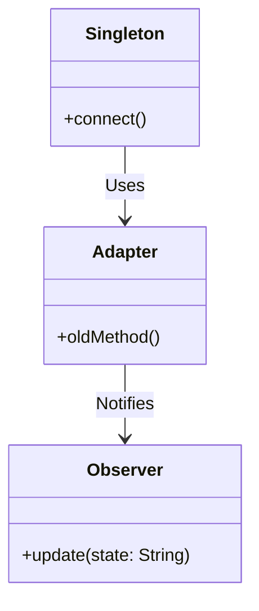

## 24.4 Common Interview Questions

Preparing for technical interviews on Scala and design patterns can be a daunting task, especially when aiming for roles that require expert-level knowledge. In this section, we will delve into common interview questions you might encounter, focusing on Scala's unique features and how they integrate with design patterns. This guide will provide you with the insights, code examples, and explanations needed to excel in your interviews.

### Introduction to Scala Design Patterns

Scala is a powerful language that combines object-oriented and functional programming paradigms. This dual nature makes it an excellent choice for implementing design patterns, which are reusable solutions to common software design problems. Understanding how to apply these patterns in Scala is crucial for building robust, scalable applications.

### Key Concepts and Interview Questions

#### 1. Understanding Design Patterns

**Question:** Explain what design patterns are and why they are important in software development.

**Answer:** Design patterns are established solutions to recurring design problems in software development. They provide a template for how to solve a problem in a way that is proven to be effective. In Scala, design patterns help developers leverage the language's functional and object-oriented features to write clean, maintainable, and scalable code.

#### 2. Functional Programming Principles

**Question:** How do functional programming principles in Scala influence the implementation of design patterns?

**Answer:** Scala's functional programming principles, such as immutability, pure functions, and higher-order functions, influence the implementation of design patterns by promoting side-effect-free code and enhancing code composability. For instance, patterns like the Strategy Pattern can be implemented using higher-order functions, allowing for more flexible and reusable code.

#### 3. Creational Patterns

**Question:** Describe the Singleton Pattern in Scala and how it differs from traditional implementations.

**Answer:** In Scala, the Singleton Pattern is implemented using the `object` keyword, which ensures that a class has only one instance. Unlike traditional languages where explicit control over instance creation is needed, Scala's `object` provides a concise and thread-safe way to define singletons without additional boilerplate code.

```scala
object DatabaseConnection {
  def connect(): Unit = {
    println("Connecting to the database...")
  }
}

// Usage
DatabaseConnection.connect()
```

#### 4. Structural Patterns

**Question:** How does the Adapter Pattern work in Scala, and when would you use it?

**Answer:** The Adapter Pattern in Scala allows incompatible interfaces to work together. It is used when you want to integrate classes with incompatible interfaces. Scala's traits and implicit conversions can be leveraged to implement this pattern seamlessly.

```scala
trait OldSystem {
  def oldMethod(): String
}

class NewSystem {
  def newMethod(): String = "New System Method"
}

class Adapter(newSystem: NewSystem) extends OldSystem {
  def oldMethod(): String = newSystem.newMethod()
}

// Usage
val adapter = new Adapter(new NewSystem())
println(adapter.oldMethod())
```

#### 5. Behavioral Patterns

**Question:** What is the Observer Pattern, and how can it be implemented in Scala?

**Answer:** The Observer Pattern defines a one-to-many dependency between objects so that when one object changes state, all its dependents are notified. In Scala, this can be implemented using `Reactive Streams` or `Akka Streams`, which provide powerful abstractions for handling asynchronous data flows.

```scala
import akka.actor.{Actor, ActorSystem, Props}

class Subject extends Actor {
  private var state: String = _
  private var observers: List[Observer] = List()

  def receive: Receive = {
    case UpdateState(newState) =>
      state = newState
      notifyObservers()
    case AttachObserver(observer) =>
      observers = observer :: observers
  }

  def notifyObservers(): Unit = {
    observers.foreach(_.update(state))
  }
}

trait Observer {
  def update(state: String): Unit
}

case class UpdateState(newState: String)
case class AttachObserver(observer: Observer)

// Usage
val system = ActorSystem("ObserverPattern")
val subject = system.actorOf(Props[Subject], "subject")
```

### Advanced Topics and Interview Questions

#### 6. Type System and Pattern Matching

**Question:** How does Scala's type system enhance the implementation of design patterns?

**Answer:** Scala's type system, with features like variance, generics, and type inference, enhances the implementation of design patterns by providing strong compile-time checks and reducing runtime errors. Pattern matching further simplifies control flow and data manipulation, making it easier to implement patterns like Visitor and Interpreter.

#### 7. Concurrency Patterns

**Question:** Describe the Actor Model in Scala and its use in concurrent programming.

**Answer:** The Actor Model in Scala, implemented through the Akka framework, provides a high-level abstraction for writing concurrent and distributed systems. Actors encapsulate state and behavior, communicating through message passing, which avoids shared state and locks, leading to more robust and scalable applications.

```scala
import akka.actor.{Actor, ActorSystem, Props}

class SimpleActor extends Actor {
  def receive: Receive = {
    case message: String => println(s"Received message: $message")
  }
}

// Usage
val system = ActorSystem("ActorSystem")
val actor = system.actorOf(Props[SimpleActor], "simpleActor")
actor ! "Hello, Actor!"
```

#### 8. Functional Design Patterns

**Question:** How do Monads facilitate functional design patterns in Scala?

**Answer:** Monads in Scala, such as `Option`, `Either`, and `Future`, encapsulate computations with context, allowing for chaining operations while handling side effects, errors, or asynchronous computations. They enable the implementation of patterns like the Chain of Responsibility and Strategy in a functional style.

```scala
val result: Option[Int] = for {
  a <- Some(10)
  b <- Some(20)
} yield a + b

println(result) // Output: Some(30)
```

### Practical Exercises

#### Try It Yourself

1. **Modify the Singleton Pattern:** Implement a lazy singleton in Scala using `lazy val` and compare it with the eager initialization using `object`.

2. **Extend the Adapter Pattern:** Create an adapter for a third-party library in Scala, using implicit classes to add functionality.

3. **Experiment with the Observer Pattern:** Implement a simple notification system using Akka Streams and observe how changes propagate through the system.

### Visualizing Design Patterns

To better understand the relationships and workflows within design patterns, let's visualize some of these concepts using Mermaid.js diagrams.



**Diagram Description:** This class diagram illustrates the relationships between the Singleton, Adapter, and Observer patterns. The Singleton pattern uses the Adapter to integrate with other systems, while the Adapter notifies Observers of state changes.

### References and Further Reading

- [Scala Documentation](https://docs.scala-lang.org/)
- [Akka Documentation](https://doc.akka.io/docs/akka/current/)
- [Reactive Streams](https://www.reactive-streams.org/)

### Knowledge Check

- **Question:** What are the benefits of using Scala's `object` for implementing the Singleton Pattern?
- **Exercise:** Implement a custom Monad in Scala and demonstrate its use in a simple application.

### Embrace the Journey

Remember, mastering Scala and design patterns is a journey. As you continue to explore and experiment, you'll gain deeper insights and become more proficient in building complex, scalable applications. Keep pushing the boundaries, stay curious, and enjoy the process!

## Quiz Time!



### What is the primary benefit of using design patterns in software development?

- [x] They provide reusable solutions to common problems.
- [ ] They make code execution faster.
- [ ] They eliminate the need for testing.
- [ ] They automatically generate code documentation.

> **Explanation:** Design patterns offer reusable solutions to common software design problems, enhancing code maintainability and scalability.

### How does Scala's `object` keyword help in implementing the Singleton Pattern?

- [x] It ensures a single instance is created.
- [ ] It allows multiple instances to be created.
- [ ] It makes the class abstract.
- [ ] It requires manual synchronization for thread safety.

> **Explanation:** The `object` keyword in Scala creates a single instance of a class, ensuring thread safety without additional synchronization.

### Which Scala feature is crucial for implementing the Adapter Pattern?

- [x] Traits and implicit conversions
- [ ] Case classes
- [ ] Pattern matching
- [ ] Lazy evaluation

> **Explanation:** Traits and implicit conversions in Scala allow for seamless integration of incompatible interfaces, which is essential for the Adapter Pattern.

### What is the main advantage of using the Actor Model in Scala?

- [x] It avoids shared state and locks.
- [ ] It requires less memory.
- [ ] It simplifies synchronous programming.
- [ ] It eliminates the need for message passing.

> **Explanation:** The Actor Model in Scala, implemented via Akka, avoids shared state and locks, making concurrent programming more robust and scalable.

### Which Monad in Scala is used for handling optional values?

- [x] Option
- [ ] Future
- [ ] Either
- [ ] Try

> **Explanation:** The `Option` Monad in Scala is used to handle optional values, providing a way to represent the presence or absence of a value.

### What is the purpose of pattern matching in Scala?

- [x] To simplify control flow and data manipulation
- [ ] To enforce type safety
- [ ] To generate random numbers
- [ ] To create user interfaces

> **Explanation:** Pattern matching in Scala simplifies control flow and data manipulation by allowing concise and expressive handling of different data structures.

### How do Monads facilitate functional design patterns?

- [x] By encapsulating computations with context
- [ ] By making code run faster
- [ ] By eliminating the need for variables
- [ ] By automatically generating documentation

> **Explanation:** Monads encapsulate computations with context, enabling chaining operations while handling side effects, errors, or asynchronous computations.

### What is the role of the Observer Pattern?

- [x] To define a one-to-many dependency between objects
- [ ] To create a single instance of a class
- [ ] To convert one interface to another
- [ ] To encapsulate a request as an object

> **Explanation:** The Observer Pattern defines a one-to-many dependency between objects, ensuring that when one object changes state, all its dependents are notified.

### Which Scala feature enhances the implementation of design patterns through strong compile-time checks?

- [x] Type system
- [ ] Lazy evaluation
- [ ] Pattern matching
- [ ] Collections API

> **Explanation:** Scala's type system, with features like variance, generics, and type inference, enhances the implementation of design patterns by providing strong compile-time checks.

### True or False: The Singleton Pattern in Scala requires explicit control over instance creation.

- [ ] True
- [x] False

> **Explanation:** In Scala, the Singleton Pattern does not require explicit control over instance creation because the `object` keyword automatically ensures a single instance.


