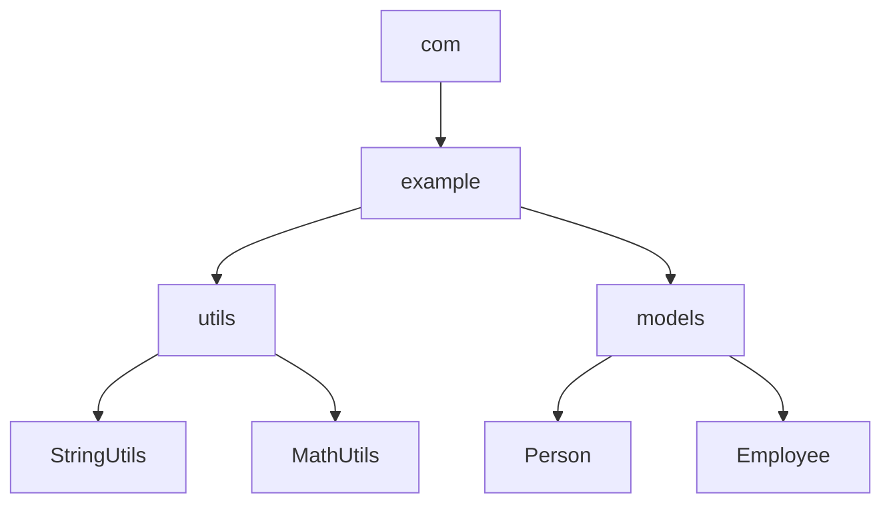

## 3.1 Packages and Imports

In the realm of software engineering, especially when working with Scala, organizing code effectively is crucial for clarity and maintainability. Packages and imports are fundamental concepts that enable developers to structure their codebases efficiently. This section delves into the intricacies of Scala packages and imports, providing expert insights into organizing code, controlling visibility, and ensuring maintainability.

### Understanding Packages in Scala

**Packages** in Scala are used to group related classes, objects, and traits. They provide a namespace to avoid naming conflicts and help organize code logically. Let's explore the key aspects of packages:

#### Defining Packages

In Scala, you define a package using the `package` keyword. Here's a simple example:

```scala
package com.example.utils

object StringUtils {
  def toUpperCase(s: String): String = s.toUpperCase
}
```

In this example, `StringUtils` is part of the `com.example.utils` package. This hierarchical structure helps in organizing code logically.

#### Nested Packages

Scala allows you to nest packages, providing a deeper organizational structure. Here's how you can define nested packages:

```scala
package com.example {
  package utils {
    object MathUtils {
      def add(a: Int, b: Int): Int = a + b
    }
  }
}
```

This structure is equivalent to defining `MathUtils` inside the `com.example.utils` package.

#### Package Objects

Scala introduces **package objects** to hold functions or variables that are shared across a package. This is particularly useful for defining utility functions or constants. Here's an example:

```scala
package object utils {
  def printHello(): Unit = println("Hello, World!")
}
```

The `printHello` function is accessible to all classes within the `utils` package.

### Importing in Scala

**Imports** in Scala allow you to bring members of a package into scope, making them accessible without needing to qualify their names. Let's explore the nuances of imports:

#### Basic Imports

To use a class or object from another package, you import it using the `import` keyword:

```scala
import com.example.utils.StringUtils

object MainApp {
  def main(args: Array[String]): Unit = {
    println(StringUtils.toUpperCase("hello"))
  }
}
```

Here, `StringUtils` is imported from the `com.example.utils` package.

#### Wildcard Imports

Scala supports wildcard imports, allowing you to import all members of a package:

```scala
import com.example.utils._

object MainApp {
  def main(args: Array[String]): Unit = {
    println(StringUtils.toUpperCase("hello"))
    println(MathUtils.add(2, 3))
  }
}
```

The underscore (`_`) is used to import all members of the `utils` package.

#### Renaming Imports

You can rename imports to avoid naming conflicts or for convenience:

```scala
import com.example.utils.{StringUtils => SU}

object MainApp {
  def main(args: Array[String]): Unit = {
    println(SU.toUpperCase("hello"))
  }
}
```

Here, `StringUtils` is imported as `SU`.

#### Selective Imports

Selective imports allow you to import specific members of a package:

```scala
import com.example.utils.{StringUtils, MathUtils}

object MainApp {
  def main(args: Array[String]): Unit = {
    println(StringUtils.toUpperCase("hello"))
    println(MathUtils.add(2, 3))
  }
}
```

Only `StringUtils` and `MathUtils` are imported from the `utils` package.

### Controlling Visibility and Access

Scala provides mechanisms to control visibility and access to classes, objects, and members. This is crucial for encapsulation and maintaining code integrity.

#### Access Modifiers

Scala supports several access modifiers:

- **Public**: Members are public by default and accessible from anywhere.
- **Private**: Members are accessible only within the class or object they are defined.
- **Protected**: Members are accessible within the class and its subclasses.

Here’s an example demonstrating access modifiers:

```scala
package com.example

class Person {
  private var name: String = "John Doe"
  protected var age: Int = 30
  def getName: String = name
}

class Employee extends Person {
  def getAge: Int = age
}
```

In this example, `name` is private and accessible only within `Person`, while `age` is protected and accessible within `Employee`.

#### Package-Level Access

Scala also allows package-level access using the `private[package]` modifier. This restricts access to members within the specified package:

```scala
package com.example

class Company {
  private[example] var revenue: Double = 1000000.0
}
```

Here, `revenue` is accessible only within the `com.example` package.

### Best Practices for Packages and Imports

To ensure clarity and maintainability, follow these best practices when working with packages and imports in Scala:

1. **Logical Organization**: Organize packages logically based on functionality or modules. This aids in understanding and navigating the codebase.

2. **Avoid Deep Nesting**: While nested packages can be useful, avoid excessive nesting as it can complicate the structure.

3. **Use Package Objects Wisely**: Package objects are powerful but should be used judiciously to avoid cluttering the package namespace.

4. **Limit Wildcard Imports**: While convenient, wildcard imports can lead to namespace pollution. Prefer selective imports to maintain clarity.

5. **Consistent Naming Conventions**: Follow consistent naming conventions for packages and imports to enhance readability.

6. **Control Access Appropriately**: Use access modifiers to encapsulate and protect sensitive parts of your code.

### Visualizing Package Structure

Understanding the hierarchical structure of packages can be challenging. Let's visualize a typical package structure using a Mermaid.js diagram:



**Diagram Description**: This diagram represents a hierarchical package structure where `com.example` contains two sub-packages: `utils` and `models`. `utils` includes `StringUtils` and `MathUtils`, while `models` includes `Person` and `Employee`.

### Try It Yourself

To solidify your understanding, try modifying the code examples:

- **Experiment with Package Objects**: Create a package object with utility functions and use them across different classes.
- **Practice Selective Imports**: Import specific members from a package and observe how it affects code readability.
- **Control Access**: Implement different access modifiers and test their impact on code accessibility.

### References and Further Reading

- [Scala Documentation on Packages](https://docs.scala-lang.org/tour/packages-and-imports.html)
- [Scala Language Specification](https://www.scala-lang.org/files/archive/spec/2.13/12-packages-and-imports.html)

### Knowledge Check

To reinforce your learning, consider the following questions:

- How do package objects enhance code organization in Scala?
- What are the advantages of using selective imports over wildcard imports?
- How does Scala's package-level access differ from Java's package-private access?

### Embrace the Journey

Remember, mastering packages and imports is just the beginning. As you progress, you'll build more complex and maintainable Scala applications. Keep experimenting, stay curious, and enjoy the journey!

## Quiz Time!



### What is the primary purpose of packages in Scala?

- [x] To group related classes, objects, and traits
- [ ] To execute code
- [ ] To handle exceptions
- [ ] To perform input/output operations

> **Explanation:** Packages are used to group related classes, objects, and traits, providing a namespace to avoid naming conflicts and organize code logically.

### How can you import all members of a package in Scala?

- [x] Using a wildcard import with an underscore (_)
- [ ] Using a wildcard import with an asterisk (*)
- [ ] Using the `import all` keyword
- [ ] Using the `import *` keyword

> **Explanation:** In Scala, the underscore (_) is used for wildcard imports to bring all members of a package into scope.

### What is a package object in Scala?

- [x] A special object that can hold shared functions or variables for a package
- [ ] A class that defines a package
- [ ] A method for importing packages
- [ ] A tool for debugging packages

> **Explanation:** Package objects in Scala are used to hold functions or variables that are shared across a package, enhancing code organization.

### Which access modifier allows members to be accessible only within the class they are defined?

- [x] Private
- [ ] Public
- [ ] Protected
- [ ] Package-level

> **Explanation:** The `private` access modifier restricts access to members within the class or object they are defined.

### How can you rename an import in Scala?

- [x] Using the `=>` symbol in the import statement
- [ ] Using the `as` keyword
- [ ] Using the `rename` keyword
- [ ] Using the `alias` keyword

> **Explanation:** In Scala, you can rename an import using the `=>` symbol in the import statement to avoid naming conflicts or for convenience.

### What is the effect of using wildcard imports excessively?

- [x] It can lead to namespace pollution
- [ ] It improves code readability
- [ ] It enhances code performance
- [ ] It simplifies debugging

> **Explanation:** Excessive use of wildcard imports can lead to namespace pollution, making it harder to track where certain members are coming from.

### What does the `private[package]` modifier do?

- [x] Restricts access to members within the specified package
- [ ] Makes members accessible only within the class
- [ ] Allows members to be accessed from any package
- [ ] Grants access to members from subclasses only

> **Explanation:** The `private[package]` modifier restricts access to members within the specified package, providing package-level access control.

### Why should you avoid deep nesting of packages?

- [x] It can complicate the structure
- [ ] It improves performance
- [ ] It enhances security
- [ ] It simplifies debugging

> **Explanation:** Deep nesting of packages can complicate the structure, making it harder to navigate and understand the codebase.

### What is the default access level for members in Scala?

- [x] Public
- [ ] Private
- [ ] Protected
- [ ] Package-level

> **Explanation:** In Scala, members are public by default, meaning they are accessible from anywhere unless specified otherwise.

### True or False: Scala's package-level access is equivalent to Java's package-private access.

- [x] False
- [ ] True

> **Explanation:** Scala's package-level access (`private[package]`) is more flexible than Java's package-private access, allowing finer control over visibility within a specific package.


