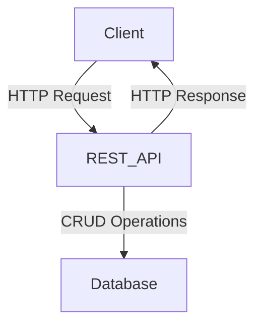
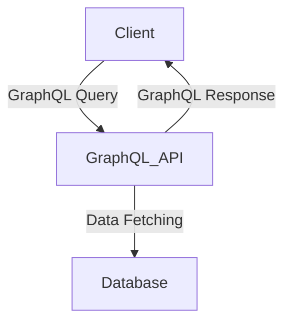
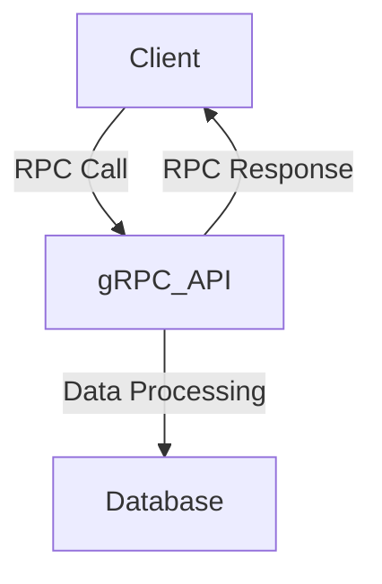

## 3.10 API Design and Documentation

Designing and documenting APIs is a critical aspect of software development, especially in the context of modern distributed systems and microservices architectures. In this section, we will delve into the principles of API design in Scala, explore the tools available for documenting APIs such as Swagger/OpenAPI, and compare different API paradigms like REST, GraphQL, and gRPC within Scala applications.

### Principles of API Design in Scala

API design is about creating a clear, concise, and consistent interface for your software components. Here are some key principles to consider when designing APIs in Scala:

#### 1. **Simplicity and Clarity**

- **Keep it Simple**: Design APIs that are easy to understand and use. Avoid unnecessary complexity and strive for simplicity in both the interface and the underlying implementation.
- **Clear Naming Conventions**: Use descriptive names for API endpoints, methods, and parameters. This helps users understand the purpose and functionality of the API.

#### 2. **Consistency**

- **Consistent Patterns**: Use consistent design patterns across your API. This includes consistent naming conventions, error handling, and response formats.
- **Uniform Resource Identifiers (URIs)**: Ensure that URIs are consistent and follow a logical structure. This makes it easier for users to navigate and understand the API.

#### 3. **Scalability and Performance**

- **Efficient Data Handling**: Design APIs to handle large volumes of data efficiently. Consider using pagination, filtering, and sorting to manage data retrieval.
- **Asynchronous Processing**: Use asynchronous processing to improve performance and scalability. This is particularly important for APIs that handle long-running operations.

#### 4. **Security**

- **Authentication and Authorization**: Implement robust authentication and authorization mechanisms to secure your API. Consider using OAuth2 or OpenID Connect for managing access control.
- **Data Protection**: Ensure that sensitive data is protected using encryption and other security measures.

#### 5. **Versioning**

- **API Versioning**: Implement versioning to manage changes to your API over time. This allows you to introduce new features and improvements without breaking existing clients.

#### 6. **Error Handling**

- **Meaningful Error Messages**: Provide clear and informative error messages that help users understand what went wrong and how to fix it.
- **Consistent Error Codes**: Use consistent error codes across your API to make it easier for users to handle errors programmatically.

### Documenting APIs with Swagger/OpenAPI

Documentation is an essential part of API design. It helps users understand how to use your API and provides them with the information they need to integrate it into their applications. Swagger/OpenAPI is a popular tool for documenting APIs.

#### What is Swagger/OpenAPI?

Swagger/OpenAPI is a framework for designing, building, and documenting RESTful APIs. It provides a standard way to describe your API's endpoints, request and response formats, and other important details.

#### Benefits of Using Swagger/OpenAPI

- **Interactive Documentation**: Swagger/OpenAPI generates interactive documentation that allows users to explore and test your API directly from the documentation.
- **Standardized Format**: It provides a standardized format for describing APIs, making it easier for users to understand and integrate with your API.
- **Tooling Support**: Swagger/OpenAPI is supported by a wide range of tools and libraries, making it easy to generate client SDKs, server stubs, and other artifacts.

#### How to Document APIs with Swagger/OpenAPI in Scala

To document your API with Swagger/OpenAPI in Scala, you can use libraries like *Swagger-akka-http* or *Play Swagger*. Here's a basic example using *Swagger-akka-http*:

```scala
// Import necessary libraries
import akka.http.scaladsl.server.Directives._
import akka.http.scaladsl.server.Route
import io.swagger.annotations._
import javax.ws.rs.Path

// Define a case class for the API response
case class ApiResponse(message: String)

// Define the API endpoint with Swagger annotations
@Path("/hello")
@Api(value = "/hello", produces = "application/json")
class HelloApi {

  @ApiOperation(value = "Say hello", notes = "Returns a greeting message", httpMethod = "GET")
  @ApiResponses(Array(
    new ApiResponse(code = 200, message = "Successful response", response = classOf[ApiResponse])
  ))
  def helloRoute: Route = path("hello") {
    get {
      complete(ApiResponse("Hello, world!"))
    }
  }
}

// Create the Swagger documentation
val swaggerDoc = new SwaggerHttpService {
  override val apiClasses = Set(classOf[HelloApi])
  override val host = "localhost:8080"
  override val basePath = "/"
  override val apiDocsPath = "api-docs"
  override val info = Info(version = "1.0", title = "Hello API", description = "A simple hello world API")
}.routes
```

In this example, we define a simple API endpoint that returns a greeting message. We use Swagger annotations to describe the endpoint and generate the Swagger documentation.

### Comparing REST, GraphQL, and gRPC in Scala Applications

When designing APIs, it's important to choose the right paradigm for your use case. REST, GraphQL, and gRPC are three popular paradigms for designing APIs. Let's compare them in the context of Scala applications.

#### REST (Representational State Transfer)

REST is a widely used architectural style for designing networked applications. It is based on a set of principles and constraints that emphasize stateless communication and the use of standard HTTP methods.

**Advantages of REST:**

- **Simplicity**: REST APIs are simple to design and use. They leverage standard HTTP methods and status codes, making them easy to understand and integrate.
- **Scalability**: REST APIs are stateless, which makes them highly scalable. Each request is independent, allowing the server to handle a large number of requests concurrently.
- **Caching**: REST APIs can leverage HTTP caching mechanisms to improve performance and reduce server load.

**Disadvantages of REST:**

- **Over-fetching and Under-fetching**: REST APIs often return more data than needed (over-fetching) or require multiple requests to get all the necessary data (under-fetching).
- **Limited Flexibility**: REST APIs have a fixed structure, which can make it difficult to adapt to changing requirements.

#### GraphQL

GraphQL is a query language for APIs that allows clients to request exactly the data they need. It provides a flexible and efficient way to interact with APIs.

**Advantages of GraphQL:**

- **Flexibility**: Clients can request exactly the data they need, reducing over-fetching and under-fetching.
- **Single Endpoint**: GraphQL APIs expose a single endpoint, simplifying client-server communication.
- **Strong Typing**: GraphQL uses a strong type system, which helps catch errors early and improve API reliability.

**Disadvantages of GraphQL:**

- **Complexity**: GraphQL can be more complex to implement and use compared to REST.
- **Caching Challenges**: GraphQL's flexibility makes it challenging to implement caching mechanisms.

#### gRPC

gRPC is a high-performance, open-source framework for remote procedure calls (RPC). It uses HTTP/2 for transport and Protocol Buffers for serialization.

**Advantages of gRPC:**

- **Performance**: gRPC is designed for high performance and low latency, making it ideal for real-time applications.
- **Strong Typing**: gRPC uses Protocol Buffers, which provide a strong type system and efficient serialization.
- **Bi-directional Streaming**: gRPC supports bi-directional streaming, allowing clients and servers to send and receive data simultaneously.

**Disadvantages of gRPC:**

- **Limited Browser Support**: gRPC is not natively supported by browsers, which can limit its use in web applications.
- **Complexity**: gRPC can be more complex to set up and use compared to REST.

### Implementing REST, GraphQL, and gRPC in Scala

Let's explore how to implement REST, GraphQL, and gRPC APIs in Scala.

#### Implementing a REST API in Scala

To implement a REST API in Scala, you can use frameworks like *Akka HTTP* or *Play Framework*. Here's a simple example using *Akka HTTP*:

```scala
import akka.http.scaladsl.server.Directives._
import akka.http.scaladsl.server.Route

// Define a case class for the API response
case class ApiResponse(message: String)

// Define the REST API route
val restApiRoute: Route = path("hello") {
  get {
    complete(ApiResponse("Hello, REST!"))
  }
}

// Start the server
Http().newServerAt("localhost", 8080).bind(restApiRoute)
```

In this example, we define a simple REST API endpoint that returns a greeting message.

#### Implementing a GraphQL API in Scala

To implement a GraphQL API in Scala, you can use libraries like *Sangria*. Here's a basic example:

```scala
import sangria.schema._
import sangria.execution._
import sangria.macros._

import scala.concurrent.ExecutionContext.Implicits.global
import scala.concurrent.Future

// Define a case class for the data
case class Greeting(message: String)

// Define the GraphQL schema
val GreetingType = ObjectType("Greeting", fields[Unit, Greeting](
  Field("message", StringType, resolve = _.value.message)
))

val QueryType = ObjectType("Query", fields[Unit, Unit](
  Field("greeting", GreetingType, resolve = _ => Greeting("Hello, GraphQL!"))
))

val schema = Schema(QueryType)

// Execute a GraphQL query
val query = graphql"{ greeting { message } }"
val result: Future[Map[String, Any]] = Executor.execute(schema, query)
result.foreach(println)
```

In this example, we define a simple GraphQL schema with a single query that returns a greeting message.

#### Implementing a gRPC API in Scala

To implement a gRPC API in Scala, you can use the *ScalaPB* library. Here's a basic example:

1. **Define the Protocol Buffers file (greeting.proto):**

```protobuf
syntax = "proto3";

package greeting;

service GreetingService {
  rpc SayHello (HelloRequest) returns (HelloResponse);
}

message HelloRequest {
  string name = 1;
}

message HelloResponse {
  string message = 1;
}
```

2. **Generate Scala code using ScalaPB:**

```shell
protoc --scala_out=src/main/scala --proto_path=src/main/protobuf src/main/protobuf/greeting.proto
```

3. **Implement the gRPC service in Scala:**

```scala
import io.grpc.stub.StreamObserver
import greeting.{GreetingServiceGrpc, HelloRequest, HelloResponse}

// Implement the gRPC service
class GreetingServiceImpl extends GreetingServiceGrpc.GreetingServiceImplBase {
  override def sayHello(request: HelloRequest, responseObserver: StreamObserver[HelloResponse]): Unit = {
    val response = HelloResponse(s"Hello, ${request.name}!")
    responseObserver.onNext(response)
    responseObserver.onCompleted()
  }
}

// Start the gRPC server
val server = ServerBuilder.forPort(8080)
  .addService(GreetingServiceGrpc.bindService(new GreetingServiceImpl, ExecutionContext.global))
  .build()
  .start()
```

In this example, we define a gRPC service that returns a greeting message.

### Try It Yourself

Now that we've explored the basics of implementing REST, GraphQL, and gRPC APIs in Scala, try modifying the examples to add new features or change the behavior. For example:

- **REST API**: Add a new endpoint that returns a personalized greeting based on a query parameter.
- **GraphQL API**: Add a mutation that allows users to update the greeting message.
- **gRPC API**: Add a new method to the service that returns a farewell message.

### Visualizing API Paradigms

To better understand the differences between REST, GraphQL, and gRPC, let's visualize their architectures using Mermaid.js diagrams.

#### REST Architecture



**Description**: In REST architecture, clients send HTTP requests to the API, which performs CRUD operations on the database and returns HTTP responses.

#### GraphQL Architecture



**Description**: In GraphQL architecture, clients send queries to the API, which fetches the requested data from the database and returns a response.

#### gRPC Architecture



**Description**: In gRPC architecture, clients make RPC calls to the API, which processes the data and returns a response.

### Knowledge Check

Before we conclude, let's reinforce what we've learned with a few questions:

- What are the key principles of API design in Scala?
- How does Swagger/OpenAPI help in documenting APIs?
- What are the main differences between REST, GraphQL, and gRPC?
- How can you implement a REST API in Scala using Akka HTTP?
- What are the advantages and disadvantages of using GraphQL?

### Embrace the Journey

Remember, designing and documenting APIs is an ongoing process. As you gain more experience, you'll develop a deeper understanding of the nuances and trade-offs involved. Keep experimenting, stay curious, and enjoy the journey!

## Quiz Time!



### What is a key principle of API design in Scala?

- [x] Simplicity and clarity
- [ ] Complexity and flexibility
- [ ] Inconsistency
- [ ] Lack of security

> **Explanation:** Simplicity and clarity are crucial for making APIs easy to understand and use.

### Which tool is commonly used for documenting RESTful APIs?

- [x] Swagger/OpenAPI
- [ ] GraphQL
- [ ] gRPC
- [ ] ScalaPB

> **Explanation:** Swagger/OpenAPI is a widely used tool for documenting RESTful APIs.

### What is a disadvantage of REST APIs?

- [x] Over-fetching and under-fetching
- [ ] Strong typing
- [ ] Bi-directional streaming
- [ ] High performance

> **Explanation:** REST APIs can suffer from over-fetching and under-fetching due to their fixed structure.

### Which API paradigm allows clients to request exactly the data they need?

- [x] GraphQL
- [ ] REST
- [ ] gRPC
- [ ] SOAP

> **Explanation:** GraphQL allows clients to specify exactly the data they need, reducing over-fetching and under-fetching.

### What is a benefit of using gRPC?

- [x] High performance and low latency
- [ ] Limited browser support
- [ ] Complexity
- [ ] Over-fetching

> **Explanation:** gRPC is designed for high performance and low latency, making it ideal for real-time applications.

### How can you implement a REST API in Scala?

- [x] Using Akka HTTP or Play Framework
- [ ] Using ScalaPB
- [ ] Using Sangria
- [ ] Using Swagger

> **Explanation:** Akka HTTP and Play Framework are popular choices for implementing REST APIs in Scala.

### What is a challenge of using GraphQL?

- [x] Caching mechanisms
- [ ] Simplicity
- [ ] Strong typing
- [ ] Single endpoint

> **Explanation:** GraphQL's flexibility can make it challenging to implement caching mechanisms.

### What is a key feature of gRPC?

- [x] Bi-directional streaming
- [ ] Over-fetching
- [ ] Single endpoint
- [ ] Simplicity

> **Explanation:** gRPC supports bi-directional streaming, allowing clients and servers to send and receive data simultaneously.

### Which library is used for implementing GraphQL APIs in Scala?

- [x] Sangria
- [ ] Akka HTTP
- [ ] ScalaPB
- [ ] Play Framework

> **Explanation:** Sangria is a popular library for implementing GraphQL APIs in Scala.

### True or False: REST APIs are stateful.

- [ ] True
- [x] False

> **Explanation:** REST APIs are stateless, meaning each request is independent and does not rely on previous requests.


