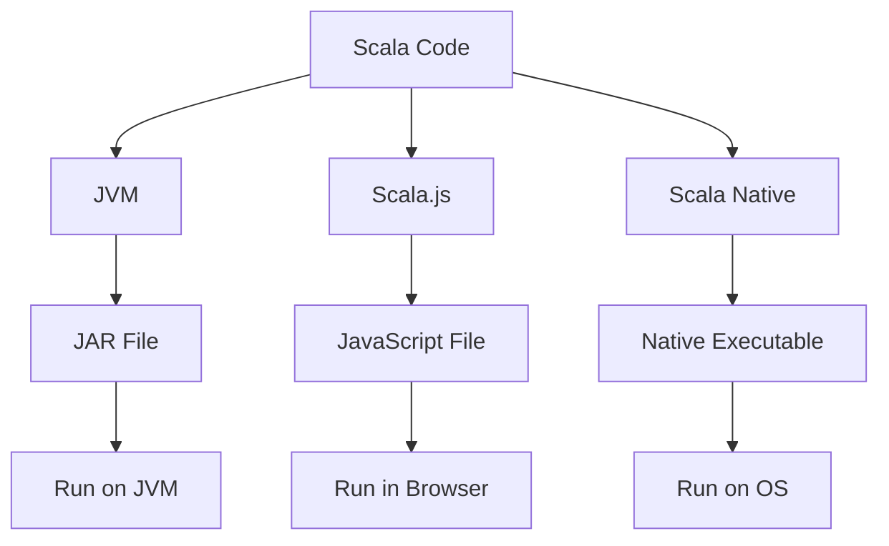

## 3.11 Cross-Platform Development with JVM, Scala.js, and Scala Native

In today's rapidly evolving technological landscape, the ability to develop applications that can run seamlessly across different platforms is invaluable. Scala, with its robust ecosystem and versatile language features, offers powerful tools for cross-platform development. This section delves into the intricacies of using Scala for cross-platform development, focusing on the JVM, Scala.js, and Scala Native. We'll explore how to target JavaScript with Scala.js, create native applications with Scala Native, and address platform-specific considerations to deploy Scala applications effectively across diverse environments.

### Introduction to Cross-Platform Development

Cross-platform development refers to the practice of building software applications that can run on multiple operating systems or environments without requiring significant modification. This approach is crucial for reaching a broader audience and reducing development costs. Scala, with its strong type system and functional programming capabilities, provides a unique advantage in this domain.

#### Why Cross-Platform Development?

1. **Wider Reach**: By targeting multiple platforms, you can reach a larger audience, whether it's web users, desktop users, or mobile users.
2. **Cost Efficiency**: Developing a single codebase that can be deployed across various platforms reduces the need for separate development teams and resources.
3. **Consistency**: Ensuring a consistent user experience across platforms enhances brand recognition and user satisfaction.

### Targeting JavaScript with Scala.js

Scala.js is a Scala compiler that targets JavaScript, enabling developers to write Scala code that runs in the browser. This capability allows Scala developers to leverage their existing skills to build rich, interactive web applications.

#### Key Features of Scala.js

- **Type Safety**: Scala.js brings Scala's strong type system to JavaScript, reducing runtime errors and enhancing code reliability.
- **Interoperability**: Scala.js provides seamless interoperability with JavaScript libraries and frameworks, allowing developers to integrate Scala code with existing JavaScript ecosystems.
- **Optimization**: The Scala.js compiler optimizes Scala code for performance, producing efficient JavaScript output.

#### Getting Started with Scala.js

To begin using Scala.js, you need to set up a development environment. Here's a step-by-step guide:

1. **Install Scala and sbt**: Ensure that Scala and sbt (Scala Build Tool) are installed on your system. These tools are essential for building Scala.js projects.

2. **Create a New Scala.js Project**: Use sbt to create a new Scala.js project. You can do this by running the following command in your terminal:

   ```bash
   sbt new scala/scala-seed.g8
   ```

3. **Configure sbt for Scala.js**: Modify your `build.sbt` file to include Scala.js settings. Here's an example configuration:

   ```scala
   enablePlugins(ScalaJSPlugin)

   scalaVersion := "2.13.8"

   libraryDependencies += "org.scala-js" %%% "scalajs-dom" % "2.0.0"
   ```

4. **Write Scala.js Code**: Create a Scala object with a `main` method to serve as the entry point for your application. Here's a simple example:

   ```scala
   import org.scalajs.dom
   import dom.document

   object HelloWorld {
     def main(args: Array[String]): Unit = {
       val paragraph = document.createElement("p")
       paragraph.textContent = "Hello, Scala.js!"
       document.body.appendChild(paragraph)
     }
   }
   ```

5. **Compile and Run**: Use sbt to compile your Scala.js code into JavaScript. Run the following command:

   ```bash
   sbt fastOptJS
   ```

   This will generate a JavaScript file that you can include in an HTML page to run your Scala.js application.

#### Interoperability with JavaScript

Scala.js provides a powerful mechanism for interacting with JavaScript code. You can call JavaScript functions, use JavaScript libraries, and even define JavaScript types in Scala. Here's an example of how to use a JavaScript library in Scala.js:

```scala
import scala.scalajs.js
import scala.scalajs.js.annotation.JSImport

@js.native
@JSImport("lodash", JSImport.Namespace)
object _ extends js.Object {
  def chunk[T](array: js.Array[T], size: Int): js.Array[js.Array[T]] = js.native
}

object Example {
  def main(args: Array[String]): Unit = {
    val array = js.Array(1, 2, 3, 4, 5)
    val chunks = _.chunk(array, 2)
    println(chunks.mkString(", "))
  }
}
```

In this example, we import the `lodash` library and use its `chunk` function to split an array into smaller arrays.

#### Try It Yourself

Experiment with Scala.js by modifying the code examples provided. Try using different JavaScript libraries, or create a simple web application that interacts with the DOM. This hands-on approach will deepen your understanding of Scala.js and its capabilities.

### Native Applications with Scala Native

Scala Native is a Scala compiler that targets native code, allowing you to build applications that run directly on the operating system without the need for a virtual machine. This capability is particularly useful for performance-critical applications and environments where JVM is not available.

#### Key Features of Scala Native

- **Performance**: Scala Native compiles Scala code to native machine code, resulting in faster execution times compared to JVM-based applications.
- **Low-Level Interoperability**: Scala Native provides interoperability with C libraries, enabling developers to leverage existing native code and libraries.
- **No JVM Dependency**: Scala Native applications do not require a JVM, making them suitable for environments where JVM is not feasible.

#### Getting Started with Scala Native

To start developing with Scala Native, follow these steps:

1. **Install Prerequisites**: Ensure that you have the necessary tools installed, including LLVM, Clang, and sbt.

2. **Create a New Scala Native Project**: Use sbt to create a new Scala Native project. Run the following command:

   ```bash
   sbt new scala-native/scala-native.g8
   ```

3. **Configure sbt for Scala Native**: Update your `build.sbt` file with Scala Native settings. Here's an example configuration:

   ```scala
   enablePlugins(ScalaNativePlugin)

   scalaVersion := "2.13.8"

   nativeLinkStubs := true
   ```

4. **Write Scala Native Code**: Create a Scala object with a `main` method. Here's a simple example:

   ```scala
   object HelloWorld {
     def main(args: Array[String]): Unit = {
       println("Hello, Scala Native!")
     }
   }
   ```

5. **Compile and Run**: Use sbt to compile your Scala Native code into a native executable. Run the following command:

   ```bash
   sbt nativeLink
   ```

   This will generate an executable file that you can run directly on your operating system.

#### Interoperability with C Libraries

Scala Native allows you to call C functions and use C libraries in your Scala code. Here's an example of how to use a C library in Scala Native:

```scala
import scala.scalanative.unsafe._
import scala.scalanative.libc.stdlib._

object Example {
  def main(args: Array[String]): Unit = {
    val ptr = malloc(10.toULong)
    if (ptr != null) {
      println("Memory allocated")
      free(ptr)
    } else {
      println("Memory allocation failed")
    }
  }
}
```

In this example, we use the `malloc` and `free` functions from the C standard library to allocate and deallocate memory.

#### Try It Yourself

Experiment with Scala Native by modifying the code examples provided. Try using different C libraries, or create a simple native application that performs a specific task. This hands-on approach will deepen your understanding of Scala Native and its capabilities.

### Dealing with Platform-Specific Considerations

When developing cross-platform applications, it's essential to consider platform-specific differences and limitations. Here are some key considerations:

#### Performance

- **JVM**: While the JVM provides excellent performance for most applications, it may not be suitable for performance-critical tasks that require low-level access to hardware.
- **Scala.js**: JavaScript performance can vary significantly across different browsers and devices. It's essential to test your Scala.js applications on multiple platforms to ensure consistent performance.
- **Scala Native**: Native applications generally offer superior performance compared to JVM-based applications, but they may require more effort to optimize for specific hardware.

#### Interoperability

- **JVM**: Scala on the JVM offers seamless interoperability with Java libraries, making it easy to integrate with existing Java codebases.
- **Scala.js**: While Scala.js provides excellent interoperability with JavaScript, some JavaScript libraries may not be fully compatible with Scala.js.
- **Scala Native**: Interoperability with C libraries is a significant advantage of Scala Native, but it requires careful management of memory and resources.

#### Deployment

- **JVM**: Deploying Scala applications on the JVM is straightforward, as the JVM is widely supported across different operating systems.
- **Scala.js**: Deploying Scala.js applications involves integrating the generated JavaScript with web technologies. Consider using tools like Webpack for bundling and optimizing your JavaScript code.
- **Scala Native**: Deploying Scala Native applications requires compiling the code for the target platform. Ensure that you have the necessary tools and libraries installed on the target system.

### Deploying Scala Applications Cross-Platform

Deploying Scala applications across different platforms involves several steps, depending on the target environment. Here's a general guide for deploying Scala applications:

#### JVM Deployment

1. **Package Your Application**: Use sbt to package your Scala application into a JAR file. Run the following command:

   ```bash
   sbt package
   ```

2. **Distribute the JAR File**: Distribute the JAR file to your target environment. Ensure that the target system has a compatible JVM installed.

3. **Run the Application**: Use the `java` command to run your Scala application. Here's an example:

   ```bash
   java -jar your-application.jar
   ```

#### Scala.js Deployment

1. **Compile Your Scala.js Code**: Use sbt to compile your Scala.js code into JavaScript. Run the following command:

   ```bash
   sbt fullOptJS
   ```

   This will generate an optimized JavaScript file for production use.

2. **Integrate with Web Technologies**: Include the generated JavaScript file in your HTML page. Consider using tools like Webpack to bundle and optimize your JavaScript code.

3. **Deploy to a Web Server**: Deploy your web application to a web server. Ensure that your server is configured to serve static files and handle client-side routing if necessary.

#### Scala Native Deployment

1. **Compile Your Scala Native Code**: Use sbt to compile your Scala Native code into a native executable. Run the following command:

   ```bash
   sbt nativeLink
   ```

2. **Distribute the Executable**: Distribute the executable file to your target environment. Ensure that the target system has the necessary libraries and dependencies installed.

3. **Run the Application**: Execute the native file directly on the target system. Here's an example:

   ```bash
   ./your-application
   ```

### Visualizing Cross-Platform Development

To better understand the cross-platform development process, let's visualize the interaction between Scala, Scala.js, and Scala Native using a flowchart.



**Diagram Description**: This flowchart illustrates the process of compiling Scala code for different platforms. Scala code can be compiled to run on the JVM, in the browser using Scala.js, or as a native executable using Scala Native.

### Knowledge Check

1. **What are the benefits of cross-platform development?**
   - Wider reach, cost efficiency, and consistency.

2. **How does Scala.js enhance JavaScript development?**
   - By providing type safety, interoperability, and optimization.

3. **What is a key advantage of using Scala Native?**
   - Performance and low-level interoperability with C libraries.

### Conclusion

Cross-platform development with Scala offers a powerful way to build applications that can run on a variety of platforms. By leveraging the capabilities of the JVM, Scala.js, and Scala Native, developers can create efficient, reliable, and versatile applications. As you continue your journey in cross-platform development, remember to consider platform-specific differences and optimize your applications for each target environment.

## Quiz Time!



### What is one of the main advantages of using Scala.js for web development?

- [x] Type safety and optimization
- [ ] Direct access to hardware
- [ ] Native code compilation
- [ ] JVM dependency

> **Explanation:** Scala.js provides type safety and optimization for JavaScript, enhancing reliability and performance in web development.


### Which tool is essential for creating a new Scala.js project?

- [x] sbt (Scala Build Tool)
- [ ] npm
- [ ] Maven
- [ ] Gradle

> **Explanation:** sbt is the Scala Build Tool used to create and manage Scala.js projects.


### What is a significant benefit of using Scala Native?

- [x] Performance and low-level interoperability
- [ ] JavaScript integration
- [ ] JVM compatibility
- [ ] Web development

> **Explanation:** Scala Native offers performance improvements and low-level interoperability with C libraries.


### How does Scala.js achieve interoperability with JavaScript libraries?

- [x] By allowing Scala code to call JavaScript functions and use JavaScript libraries
- [ ] By compiling JavaScript to Scala code
- [ ] By running JavaScript on the JVM
- [ ] By using JavaScript interpreters

> **Explanation:** Scala.js allows Scala code to interact directly with JavaScript libraries, enabling seamless integration.


### What is the primary purpose of Scala Native?

- [x] To compile Scala code to native machine code
- [ ] To run Scala code in web browsers
- [ ] To enhance JavaScript performance
- [ ] To provide JVM compatibility

> **Explanation:** Scala Native compiles Scala code to native machine code, improving performance and enabling applications to run without a JVM.


### What is a platform-specific consideration when deploying Scala.js applications?

- [x] JavaScript performance varies across browsers
- [ ] JVM compatibility
- [ ] Native code execution
- [ ] Direct hardware access

> **Explanation:** JavaScript performance can vary across different browsers and devices, requiring testing and optimization.


### Which command is used to compile Scala Native code into a native executable?

- [x] sbt nativeLink
- [ ] sbt fastOptJS
- [ ] sbt package
- [ ] sbt compile

> **Explanation:** The `sbt nativeLink` command compiles Scala Native code into a native executable.


### What is a key consideration when deploying Scala applications on the JVM?

- [x] Ensuring a compatible JVM is installed on the target system
- [ ] JavaScript integration
- [ ] Native code compilation
- [ ] Direct hardware access

> **Explanation:** Scala applications on the JVM require a compatible JVM to be installed on the target system for execution.


### How can Scala.js applications be optimized for production use?

- [x] By using the sbt fullOptJS command
- [ ] By compiling to native code
- [ ] By using the sbt package command
- [ ] By running on the JVM

> **Explanation:** The `sbt fullOptJS` command generates an optimized JavaScript file for production use.


### True or False: Scala Native applications require a JVM to run.

- [ ] True
- [x] False

> **Explanation:** Scala Native applications do not require a JVM to run; they are compiled to native machine code.


