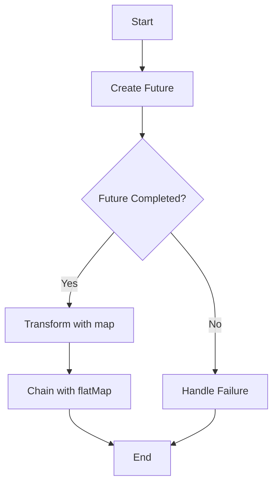

## 3.12 Asynchronous Programming

In the world of modern software development, building responsive and scalable applications is paramount. Asynchronous programming is a key technique that allows developers to write non-blocking code, enabling applications to handle multiple tasks simultaneously. In Scala, asynchronous programming is primarily facilitated through the use of `Futures`. This section will delve into the intricacies of using `Futures` in Scala, providing expert insights and best practices for managing asynchronous operations effectively.

### Understanding Asynchronous Programming

Asynchronous programming allows a program to perform tasks without waiting for other tasks to complete. This is particularly useful in scenarios where tasks involve I/O operations, such as network requests or file reading, which can be time-consuming. By not blocking the main thread, asynchronous programming helps in maintaining the responsiveness of applications.

### Introduction to Futures

In Scala, a `Future` represents a computation that may or may not have completed yet. It is a placeholder for a value that will be available at some point in the future. Futures are a powerful abstraction for handling asynchronous computations, allowing developers to write code that is both non-blocking and easy to reason about.

#### Key Characteristics of Futures

- **Non-blocking**: Futures allow computations to proceed without waiting for other operations to complete.
- **Composable**: Futures can be combined using combinators like `map`, `flatMap`, and `filter`.
- **Error Handling**: Futures provide mechanisms to handle exceptions and failures gracefully.

### Creating and Using Futures

To create a `Future`, you typically use the `Future` companion object, which requires an implicit `ExecutionContext`. The `ExecutionContext` is responsible for executing the asynchronous tasks.

```scala
import scala.concurrent.{Future, ExecutionContext}
import scala.util.{Success, Failure}

implicit val ec: ExecutionContext = ExecutionContext.global

val futureResult: Future[Int] = Future {
  // Simulate a long-running computation
  Thread.sleep(1000)
  42
}

futureResult.onComplete {
  case Success(value) => println(s"Computation succeeded with value: $value")
  case Failure(exception) => println(s"Computation failed with exception: $exception")
}
```

In this example, we create a `Future` that performs a computation to return the number `42` after a delay. The `onComplete` method is used to handle the result of the computation, whether it succeeds or fails.

### Composing Futures

One of the strengths of `Futures` is their composability. You can chain multiple asynchronous operations together using combinators like `map`, `flatMap`, and `filter`.

#### Using `map` and `flatMap`

The `map` method is used to transform the result of a `Future` once it completes successfully.

```scala
val futurePlusOne: Future[Int] = futureResult.map(_ + 1)
```

The `flatMap` method is used to chain multiple `Futures` together, allowing for sequential asynchronous computations.

```scala
val futureComputation: Future[Int] = futureResult.flatMap { result =>
  Future {
    result * 2
  }
}
```

#### Using `filter`

The `filter` method allows you to apply a predicate to the result of a `Future`. If the predicate is not satisfied, the `Future` will fail with a `NoSuchElementException`.

```scala
val filteredFuture: Future[Int] = futureResult.filter(_ > 40)
```

### Error Handling with Futures

Handling errors in asynchronous computations is crucial for building robust applications. Scala's `Future` provides several methods for dealing with failures.

#### Using `recover` and `recoverWith`

The `recover` method allows you to provide a fallback value in case of failure.

```scala
val recoveredFuture: Future[Int] = futureResult.recover {
  case _: Exception => 0
}
```

The `recoverWith` method is similar but allows you to return a new `Future`.

```scala
val recoveredWithFuture: Future[Int] = futureResult.recoverWith {
  case _: Exception => Future.successful(0)
}
```

#### Using `fallbackTo`

The `fallbackTo` method allows you to specify an alternative `Future` to use in case the original `Future` fails.

```scala
val fallbackFuture: Future[Int] = futureResult.fallbackTo(Future.successful(0))
```

### Combining Multiple Futures

In many scenarios, you need to work with multiple `Futures` simultaneously. Scala provides several utilities for combining `Futures`.

#### Using `Future.sequence`

The `Future.sequence` method transforms a `List` of `Futures` into a single `Future` containing a `List` of results.

```scala
val futuresList: List[Future[Int]] = List(Future(1), Future(2), Future(3))
val combinedFuture: Future[List[Int]] = Future.sequence(futuresList)
```

#### Using `Future.traverse`

The `Future.traverse` method is similar to `sequence` but allows you to apply a function to each element in a collection, returning a `Future` of the transformed results.

```scala
val numbers = List(1, 2, 3)
val traversedFuture: Future[List[Int]] = Future.traverse(numbers)(n => Future(n * 2))
```

### Visualizing Future Composition

To better understand how `Futures` can be composed, let's visualize a sequence of operations using a flowchart.



This diagram illustrates the flow of creating a `Future`, checking its completion, transforming the result, and handling failures.

### Best Practices for Asynchronous Programming

1. **Use the Right ExecutionContext**: Choose an appropriate `ExecutionContext` for your application. The global execution context is suitable for CPU-bound tasks, but for I/O-bound tasks, consider using a dedicated thread pool.

2. **Avoid Blocking**: Avoid blocking operations within `Futures`, as they can lead to thread starvation and reduced performance.

3. **Handle Errors Gracefully**: Always handle potential errors in `Futures` to prevent unhandled exceptions from propagating.

4. **Compose Futures Effectively**: Use combinators like `map`, `flatMap`, and `filter` to compose `Futures` in a clean and readable manner.

5. **Test Asynchronous Code**: Write tests for asynchronous code to ensure it behaves as expected under various conditions.

### Advanced Techniques

#### Using Promises

A `Promise` is a writable, single-assignment container that completes a `Future`. It allows you to manually complete a `Future` with a value or an exception.

```scala
import scala.concurrent.Promise

val promise: Promise[Int] = Promise[Int]()
val futureFromPromise: Future[Int] = promise.future

// Completing the promise
promise.success(42)
// Or in case of failure
// promise.failure(new Exception("Failure"))
```

#### Using Await

In some cases, you may need to block and wait for a `Future` to complete. The `Await` object provides a way to do this, but it should be used sparingly as it blocks the current thread.

```scala
import scala.concurrent.Await
import scala.concurrent.duration._

val result: Int = Await.result(futureResult, 2.seconds)
```

### Try It Yourself

To get hands-on experience with `Futures`, try modifying the code examples provided. For instance, change the computation in the `Future` to simulate different scenarios, or experiment with combining multiple `Futures` using `sequence` and `traverse`.

### Knowledge Check

- What is a `Future` in Scala, and how does it facilitate asynchronous programming?
- How can you handle errors in a `Future` computation?
- What is the difference between `map` and `flatMap` when working with `Futures`?
- Why is it important to choose the right `ExecutionContext` for your application?

### Conclusion

Asynchronous programming in Scala using `Futures` is a powerful technique for building responsive and scalable applications. By understanding the core concepts and best practices, you can effectively manage asynchronous operations and create robust software solutions. Remember, this is just the beginning. As you progress, you'll build more complex and interactive applications. Keep experimenting, stay curious, and enjoy the journey!

## Quiz Time!



### What is a `Future` in Scala?

- [x] A placeholder for a value that will be available at some point in the future.
- [ ] A synchronous computation that blocks the main thread.
- [ ] A data structure for storing multiple values.
- [ ] A Scala-specific data type for handling errors.

> **Explanation:** A `Future` in Scala represents a computation that may or may not have completed yet, serving as a placeholder for a value that will be available in the future.

### How do you handle errors in a `Future` computation?

- [x] Using `recover` and `recoverWith` methods.
- [ ] Using `try-catch` blocks.
- [ ] By ignoring them.
- [ ] Using `println` statements.

> **Explanation:** Errors in a `Future` computation can be handled using the `recover` and `recoverWith` methods, which allow you to provide fallback values or alternative `Futures`.

### What is the purpose of the `map` method in `Futures`?

- [x] To transform the result of a `Future` once it completes successfully.
- [ ] To create a new `Future` that fails with an exception.
- [ ] To block the current thread until the `Future` completes.
- [ ] To handle errors in a `Future`.

> **Explanation:** The `map` method is used to transform the result of a `Future` once it completes successfully, allowing you to apply a function to the result.

### What is the difference between `map` and `flatMap` in `Futures`?

- [x] `map` transforms the result, while `flatMap` chains multiple `Futures`.
- [ ] `map` handles errors, while `flatMap` does not.
- [ ] `map` blocks the thread, while `flatMap` does not.
- [ ] `map` is used for error handling, while `flatMap` is not.

> **Explanation:** `map` is used to transform the result of a `Future`, while `flatMap` is used to chain multiple `Futures` together, allowing for sequential asynchronous computations.

### Why is it important to choose the right `ExecutionContext`?

- [x] It determines how and where the asynchronous computations are executed.
- [ ] It affects the syntax of the `Future` operations.
- [ ] It changes the data type of the `Future`.
- [ ] It is not important at all.

> **Explanation:** The `ExecutionContext` is crucial because it determines how and where the asynchronous computations are executed, affecting the performance and responsiveness of the application.

### What is a `Promise` in Scala?

- [x] A writable, single-assignment container that completes a `Future`.
- [ ] A read-only container for storing values.
- [ ] A data structure for handling errors.
- [ ] A Scala-specific data type for managing threads.

> **Explanation:** A `Promise` in Scala is a writable, single-assignment container that allows you to manually complete a `Future` with a value or an exception.

### How can you block and wait for a `Future` to complete?

- [x] Using the `Await` object.
- [ ] Using `println` statements.
- [ ] By ignoring the `Future`.
- [ ] Using `try-catch` blocks.

> **Explanation:** You can block and wait for a `Future` to complete using the `Await` object, although this should be used sparingly as it blocks the current thread.

### What does the `Future.sequence` method do?

- [x] Transforms a `List` of `Futures` into a single `Future` containing a `List` of results.
- [ ] Creates a new `Future` that fails with an exception.
- [ ] Blocks the current thread until all `Futures` complete.
- [ ] Handles errors in a `Future`.

> **Explanation:** The `Future.sequence` method transforms a `List` of `Futures` into a single `Future` containing a `List` of results, allowing you to work with multiple `Futures` simultaneously.

### What is the purpose of the `recoverWith` method in `Futures`?

- [x] To return a new `Future` in case of failure.
- [ ] To transform the result of a `Future`.
- [ ] To block the current thread until the `Future` completes.
- [ ] To handle errors using `try-catch` blocks.

> **Explanation:** The `recoverWith` method allows you to return a new `Future` in case of failure, providing an alternative computation path.

### True or False: Blocking operations should be avoided within `Futures`.

- [x] True
- [ ] False

> **Explanation:** Blocking operations should be avoided within `Futures` to prevent thread starvation and maintain the performance and responsiveness of the application.


