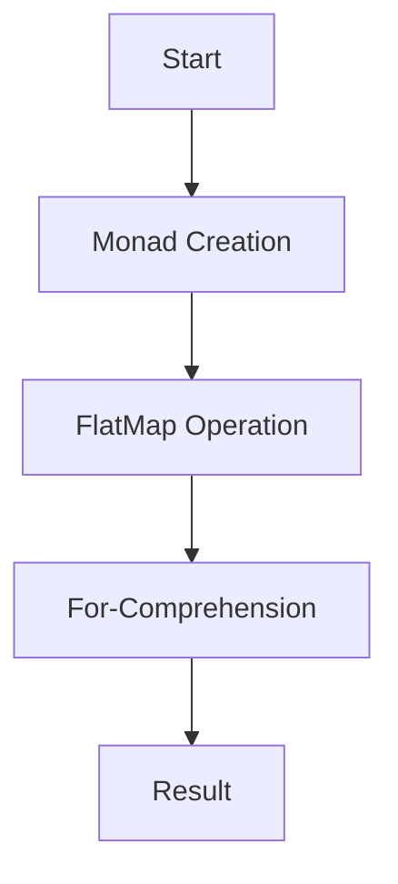

## 3.13 Monads and For-Comprehensions

In the realm of functional programming, monads are a powerful abstraction that allows developers to handle complex computations in a clean and modular way. Scala, with its rich type system and functional programming capabilities, provides robust support for monads. This section will delve into the concept of monads, their implementation in Scala, and how for-comprehensions can be used to simplify monadic code.

### Understanding Monads

#### What is a Monad?

A monad is a design pattern used to handle program-wide concerns in a functional way. It can be thought of as a type that represents computations instead of values. Monads provide a way to chain operations together, allowing for the composition of functions that return monadic values.

#### Monad Laws

Monads must satisfy three laws to ensure consistent behavior:

1. **Left Identity**: `unit(x).flatMap(f)` is equivalent to `f(x)`.
2. **Right Identity**: `m.flatMap(unit)` is equivalent to `m`.
3. **Associativity**: `m.flatMap(f).flatMap(g)` is equivalent to `m.flatMap(x => f(x).flatMap(g))`.

These laws ensure that monads behave predictably when chaining operations.

#### Common Monads in Scala

Scala provides several built-in monads that are commonly used:

- **Option**: Represents optional values.
- **Either**: Represents a value of one of two possible types (a disjoint union).
- **Try**: Represents a computation that may either result in an exception or return a successfully computed value.
- **Future**: Represents a computation that may be performed asynchronously.

### Implementing Monads in Scala

To implement a monad in Scala, a type must define two operations: `flatMap` and `unit` (often called `pure` or `return` in other languages).

#### Example: Option Monad

The `Option` monad is used to represent optional values. It can either be `Some(value)` or `None`.

```scala
val someValue: Option[Int] = Some(42)
val noValue: Option[Int] = None

val result = someValue.flatMap(value => Some(value * 2)) // Some(84)
val noResult = noValue.flatMap(value => Some(value * 2)) // None
```

In this example, `flatMap` is used to apply a function to the value inside the `Option`, if it exists.

#### Creating a Custom Monad

Let's create a simple custom monad called `Box`:

```scala
case class Box[A](value: A) {
  def flatMap[B](f: A => Box[B]): Box[B] = f(value)
}

object Box {
  def unit[A](value: A): Box[A] = Box(value)
}

// Usage
val box = Box(10)
val result = box.flatMap(x => Box(x * 2)) // Box(20)
```

Here, `Box` is a monad that wraps a value and provides a `flatMap` method to chain operations.

### For-Comprehensions in Scala

For-comprehensions provide a syntactic sugar for working with monads, making the code more readable and expressive.

#### Basic For-Comprehension

For-comprehensions are used to sequence operations, handle monadic values, and extract results in a clean way.

```scala
val option1: Option[Int] = Some(10)
val option2: Option[Int] = Some(20)

val result: Option[Int] = for {
  x <- option1
  y <- option2
} yield x + y

// result: Some(30)
```

In this example, the for-comprehension extracts values from `option1` and `option2`, and computes their sum.

#### Desugaring For-Comprehensions

For-comprehensions are syntactic sugar for a series of `flatMap` and `map` calls. The above example is equivalent to:

```scala
val result = option1.flatMap(x => option2.map(y => x + y))
```

This desugaring shows how for-comprehensions simplify the chaining of monadic operations.

### Advanced Usage of Monads and For-Comprehensions

#### Error Handling with Try Monad

The `Try` monad is used to handle exceptions in a functional way.

```scala
import scala.util.{Try, Success, Failure}

val result: Try[Int] = for {
  x <- Try(10 / 2)
  y <- Try(5 / 0) // This will throw an exception
} yield x + y

result match {
  case Success(value) => println(s"Result: $value")
  case Failure(exception) => println(s"Failed with exception: $exception")
}
```

In this example, the for-comprehension handles a division operation that may throw an exception.

#### Asynchronous Computations with Future

The `Future` monad is used for asynchronous computations.

```scala
import scala.concurrent.Future
import scala.concurrent.ExecutionContext.Implicits.global

val future1: Future[Int] = Future(10)
val future2: Future[Int] = Future(20)

val result: Future[Int] = for {
  x <- future1
  y <- future2
} yield x + y

result.foreach(println) // Prints 30
```

Here, the for-comprehension waits for both futures to complete and then computes their sum.

### Visualizing Monads and For-Comprehensions

To better understand how monads and for-comprehensions work, let's visualize the flow of operations.



This diagram illustrates the flow from creating a monad, applying a `flatMap` operation, using a for-comprehension, and obtaining the result.

### Design Considerations

When using monads and for-comprehensions, consider the following:

- **Readability**: For-comprehensions improve readability by reducing nested `flatMap` and `map` calls.
- **Error Handling**: Use monads like `Try` and `Either` for robust error handling.
- **Asynchronous Code**: Leverage `Future` for non-blocking operations.
- **Custom Monads**: Create custom monads for domain-specific needs, ensuring they adhere to monad laws.

### Differences and Similarities

Monads and for-comprehensions are often confused with other functional patterns. Here's how they differ:

- **Monads vs. Functors**: Functors provide a `map` method, while monads provide `flatMap`.
- **Monads vs. Applicatives**: Applicatives allow for function application within a context, while monads allow for chaining operations.
- **For-Comprehensions vs. Loops**: For-comprehensions are not loops; they are a way to sequence monadic operations.

### Try It Yourself

Experiment with the following code by modifying the monadic operations and observing the results:

```scala
val option1: Option[Int] = Some(5)
val option2: Option[Int] = Some(15)

val result: Option[Int] = for {
  x <- option1
  y <- option2
} yield x * y

println(result) // Try changing the values or using None
```

### Knowledge Check

- Explain the three monad laws.
- How do for-comprehensions improve code readability?
- What is the difference between `map` and `flatMap`?

### Conclusion

Monads and for-comprehensions are powerful tools in Scala, enabling developers to abstract complex computations and write clean, expressive code. By understanding and leveraging these concepts, you can enhance the robustness and maintainability of your Scala applications.

Remember, this is just the beginning. As you progress, you'll build more complex and interactive applications. Keep experimenting, stay curious, and enjoy the journey!

## Quiz Time!



### What is a monad in Scala?

- [x] A design pattern that represents computations instead of values
- [ ] A type that only represents optional values
- [ ] A function that always returns a value
- [ ] A loop construct in Scala

> **Explanation:** A monad is a design pattern used to handle program-wide concerns in a functional way, representing computations instead of values.

### Which of the following is a monad in Scala?

- [x] Option
- [x] Try
- [x] Future
- [ ] List

> **Explanation:** `Option`, `Try`, and `Future` are monads in Scala, while `List` is a collection type that can also be used in a monadic context.

### What is the purpose of the `flatMap` method in a monad?

- [x] To chain operations together
- [ ] To create a new monad
- [ ] To handle exceptions
- [ ] To iterate over a collection

> **Explanation:** The `flatMap` method is used to chain operations together, allowing for the composition of functions that return monadic values.

### How does a for-comprehension improve code readability?

- [x] By reducing nested `flatMap` and `map` calls
- [ ] By eliminating the need for functions
- [ ] By converting monads into loops
- [ ] By simplifying error handling

> **Explanation:** For-comprehensions improve readability by reducing the need for nested `flatMap` and `map` calls, making the code more concise and expressive.

### Which monad is used for asynchronous computations in Scala?

- [x] Future
- [ ] Option
- [ ] Either
- [ ] Try

> **Explanation:** The `Future` monad is used for asynchronous computations in Scala, allowing for non-blocking operations.

### What is the result of the following for-comprehension?
```scala
val option1: Option[Int] = Some(5)
val option2: Option[Int] = None

val result: Option[Int] = for {
  x <- option1
  y <- option2
} yield x + y
```

- [x] None
- [ ] Some(5)
- [ ] Some(0)
- [ ] Some(10)

> **Explanation:** The result is `None` because `option2` is `None`, and the for-comprehension short-circuits when encountering a `None`.

### Which monad is used to handle exceptions in a functional way?

- [x] Try
- [ ] Option
- [ ] Either
- [ ] Future

> **Explanation:** The `Try` monad is used to handle exceptions in a functional way, representing computations that may either result in an exception or return a successfully computed value.

### What is the difference between `map` and `flatMap`?

- [x] `map` applies a function and wraps the result in a monad, while `flatMap` chains operations
- [ ] `map` is used for collections, while `flatMap` is used for monads
- [ ] `map` handles exceptions, while `flatMap` does not
- [ ] `map` is a loop construct, while `flatMap` is not

> **Explanation:** `map` applies a function to the value inside a monad and wraps the result in a new monad, while `flatMap` is used to chain operations together.

### What is the purpose of the `unit` method in a monad?

- [x] To wrap a value in a monad
- [ ] To handle errors
- [ ] To chain operations
- [ ] To iterate over a collection

> **Explanation:** The `unit` method, often called `pure` or `return`, is used to wrap a value in a monad, creating a monadic context for the value.

### True or False: For-comprehensions are equivalent to loops in Scala.

- [ ] True
- [x] False

> **Explanation:** False. For-comprehensions are not loops; they are a way to sequence monadic operations, providing syntactic sugar for chaining `flatMap` and `map` calls.


