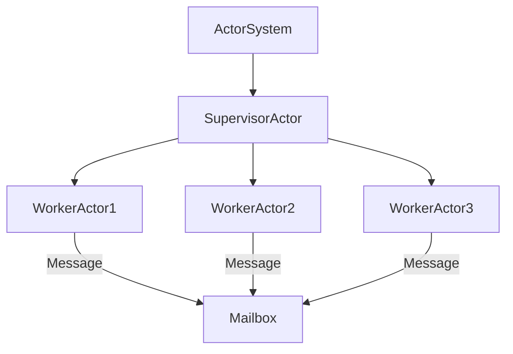

## 3.14 Actors and the Akka Framework

Concurrency and parallelism are crucial aspects of modern software systems, especially when dealing with distributed architectures and high-performance applications. The Akka Framework, built on the Actor Model, provides a powerful toolkit for building concurrent, distributed, and fault-tolerant systems in Scala. In this section, we'll delve into the core concepts of the Actor Model, explore the Akka Framework, and provide guidance on designing safe and scalable concurrent systems.

### Understanding the Actor Model

The Actor Model is a conceptual model for handling concurrent computation. It abstracts away the complexities of thread management and synchronization by encapsulating state and behavior within actors. Each actor is an independent unit that communicates with other actors through message passing, making it inherently concurrent and distributed.

#### Key Concepts of the Actor Model

1. **Actors**: The fundamental unit of computation in the Actor Model. An actor encapsulates state and behavior and communicates with other actors through asynchronous message passing.

2. **Messages**: Immutable objects that actors use to communicate. Messages are sent asynchronously, allowing actors to process them at their own pace.

3. **Mailboxes**: Queues where incoming messages are stored until the actor is ready to process them.

4. **Supervision**: A mechanism for managing actor failures. Supervisors monitor their child actors and apply predefined strategies to handle failures.

5. **Location Transparency**: Actors can communicate without knowing each other's physical location, enabling seamless distribution across nodes.

### Introducing the Akka Framework

Akka is a powerful toolkit and runtime for building concurrent, distributed, and fault-tolerant applications on the JVM. It implements the Actor Model and provides a rich set of features for managing concurrency, distribution, and resilience.

#### Core Components of Akka

1. **ActorSystem**: The entry point for creating and managing actors. It provides the infrastructure for actor creation, supervision, and message dispatching.

2. **Actors**: Defined by extending the `Actor` trait and implementing the `receive` method to handle incoming messages.

3. **Props**: A configuration object used to create actors. It defines the actor's behavior and initial state.

4. **Routers**: Components that manage a group of actors and distribute messages among them, enabling load balancing and parallel processing.

5. **Dispatchers**: Responsible for managing the execution of actors. They determine how actors are scheduled and executed.

6. **Supervision Strategies**: Define how parent actors handle failures in their child actors, ensuring system resilience.

### Designing Actors in Akka

To design effective actors in Akka, it's essential to understand the principles of actor behavior, message handling, and state management.

#### Defining Actor Behavior

Actors in Akka are defined by extending the `Actor` trait and implementing the `receive` method, which defines how the actor responds to incoming messages.

```scala
import akka.actor.{Actor, ActorSystem, Props}

// Define an actor by extending the Actor trait
class GreetingActor extends Actor {
  def receive: Receive = {
    case "hello" => println("Hello, world!")
    case _       => println("Unknown message")
  }
}

// Create an ActorSystem
val system = ActorSystem("GreetingSystem")

// Create an instance of the GreetingActor
val greetingActor = system.actorOf(Props[GreetingActor], "greetingActor")

// Send messages to the actor
greetingActor ! "hello"
greetingActor ! "goodbye"
```

#### Managing Actor State

Actors can maintain internal state, which is encapsulated and not shared with other actors. This state can be updated based on the messages received.

```scala
import akka.actor.Actor

class CounterActor extends Actor {
  private var count = 0

  def receive: Receive = {
    case "increment" =>
      count += 1
      println(s"Count: $count")
    case "get" =>
      sender() ! count
  }
}
```

#### Handling Actor Lifecycle

Actors have a lifecycle, including creation, message processing, and termination. Akka provides hooks for managing these lifecycle events.

```scala
import akka.actor.{Actor, ActorSystem, Props}

class LifecycleActor extends Actor {
  override def preStart(): Unit = println("Actor is starting")
  override def postStop(): Unit = println("Actor has stopped")

  def receive: Receive = {
    case msg => println(s"Received: $msg")
  }
}

val system = ActorSystem("LifecycleSystem")
val lifecycleActor = system.actorOf(Props[LifecycleActor], "lifecycleActor")

lifecycleActor ! "Test message"
system.terminate()
```

### Designing Safe and Scalable Concurrent Systems

Akka provides several features to ensure the safety and scalability of concurrent systems, including supervision strategies, routers, and dispatchers.

#### Supervision and Fault Tolerance

Supervision is a key concept in Akka, allowing actors to monitor and manage the failures of their child actors. Supervisors can apply different strategies, such as restarting or stopping the child actor, to handle failures gracefully.

```scala
import akka.actor.{Actor, ActorSystem, Props, OneForOneStrategy, SupervisorStrategy}
import akka.actor.SupervisorStrategy._

class WorkerActor extends Actor {
  def receive: Receive = {
    case "fail" => throw new RuntimeException("Failure")
    case msg    => println(s"Received: $msg")
  }
}

class SupervisorActor extends Actor {
  override val supervisorStrategy: SupervisorStrategy = OneForOneStrategy() {
    case _: RuntimeException => Restart
  }

  def receive: Receive = {
    case props: Props => sender() ! context.actorOf(props)
  }
}

val system = ActorSystem("SupervisionSystem")
val supervisor = system.actorOf(Props[SupervisorActor], "supervisor")

val worker = system.actorOf(Props[WorkerActor], "worker")
worker ! "fail"
```

#### Routers for Load Balancing

Routers manage a group of actors and distribute messages among them, enabling load balancing and parallel processing. Akka provides several built-in routers, such as `RoundRobinPool` and `BroadcastPool`.

```scala
import akka.actor.{Actor, ActorSystem, Props}
import akka.routing.RoundRobinPool

class Worker extends Actor {
  def receive: Receive = {
    case msg => println(s"Worker ${self.path.name} received: $msg")
  }
}

val system = ActorSystem("RoutingSystem")
val router = system.actorOf(RoundRobinPool(5).props(Props[Worker]), "router")

for (i <- 1 to 10) {
  router ! s"Message $i"
}
```

#### Dispatchers for Execution Management

Dispatchers control how actors are scheduled and executed. They can be configured to optimize performance based on the application's needs.

```hocon
akka {
  actor {
    default-dispatcher {
      type = "Dispatcher"
      executor = "fork-join-executor"
      fork-join-executor {
        parallelism-min = 2
        parallelism-factor = 2.0
        parallelism-max = 10
      }
      throughput = 100
    }
  }
}
```

### Visualizing Actor Systems

To better understand the flow of messages and interactions within an actor system, we can use diagrams to visualize the architecture and relationships between actors.



**Diagram Description**: This diagram illustrates an actor system with a `SupervisorActor` managing three `WorkerActors`. Messages are sent to the worker actors through a shared mailbox.

### Try It Yourself

Experiment with the code examples provided in this section. Modify the actors' behavior, add new messages, or change the supervision strategy to observe how the system responds. Consider implementing a simple application with actors that perform different tasks, such as processing data or handling user requests.

### Knowledge Check

1. What is the primary purpose of the Actor Model in concurrent systems?
2. How does Akka handle actor failures?
3. What are the benefits of using routers in Akka?
4. How can dispatchers be configured to optimize actor execution?

### Conclusion

The Akka Framework and the Actor Model provide a robust foundation for building concurrent, distributed, and fault-tolerant systems in Scala. By understanding the core concepts of actors, messages, and supervision, you can design safe and scalable systems that leverage the power of concurrency and parallelism. As you continue to explore Akka, consider experimenting with different patterns and configurations to optimize your applications for performance and resilience.

## Quiz Time!



### What is the primary purpose of the Actor Model in concurrent systems?

- [x] To encapsulate state and behavior within actors and handle concurrency through message passing
- [ ] To manage thread pools efficiently
- [ ] To provide a graphical user interface for concurrent applications
- [ ] To replace all traditional concurrency mechanisms

> **Explanation:** The Actor Model encapsulates state and behavior within actors and handles concurrency through message passing, abstracting away the complexities of thread management.

### How does Akka handle actor failures?

- [x] Through supervision strategies that define how parent actors manage child actor failures
- [ ] By terminating the entire actor system
- [ ] By logging errors and continuing execution
- [ ] By automatically retrying failed operations

> **Explanation:** Akka uses supervision strategies to define how parent actors manage child actor failures, ensuring system resilience.

### What are the benefits of using routers in Akka?

- [x] Load balancing and parallel processing of messages
- [ ] Simplifying actor creation
- [ ] Reducing memory usage
- [ ] Enhancing message security

> **Explanation:** Routers enable load balancing and parallel processing of messages, distributing work among multiple actors.

### How can dispatchers be configured to optimize actor execution?

- [x] By adjusting parallelism settings and throughput in the configuration
- [ ] By increasing the number of actors
- [ ] By using more powerful hardware
- [ ] By reducing the message size

> **Explanation:** Dispatchers can be configured by adjusting parallelism settings and throughput in the configuration to optimize actor execution.

### What is the role of the ActorSystem in Akka?

- [x] It is the entry point for creating and managing actors
- [ ] It is responsible for message encryption
- [ ] It handles network communication
- [ ] It manages database connections

> **Explanation:** The ActorSystem is the entry point for creating and managing actors, providing the infrastructure for actor creation and message dispatching.

### Which of the following is a key concept of the Actor Model?

- [x] Location Transparency
- [ ] Thread Pools
- [ ] Synchronous Communication
- [ ] Global State

> **Explanation:** Location Transparency is a key concept of the Actor Model, allowing actors to communicate without knowing each other's physical location.

### What is the purpose of the `Props` object in Akka?

- [x] To configure and create actors
- [ ] To store actor messages
- [ ] To manage actor lifecycles
- [ ] To define actor supervision strategies

> **Explanation:** `Props` is a configuration object used to create actors, defining the actor's behavior and initial state.

### How does Akka achieve fault tolerance?

- [x] Through supervision strategies and actor restarts
- [ ] By using redundant hardware
- [ ] By encrypting all messages
- [ ] By logging all errors

> **Explanation:** Akka achieves fault tolerance through supervision strategies and actor restarts, allowing systems to recover from failures gracefully.

### What is the function of a mailbox in the Actor Model?

- [x] To queue incoming messages for an actor
- [ ] To store actor state
- [ ] To manage actor lifecycles
- [ ] To encrypt messages

> **Explanation:** A mailbox queues incoming messages for an actor, allowing the actor to process them asynchronously.

### True or False: Actors in Akka share state with other actors.

- [ ] True
- [x] False

> **Explanation:** Actors in Akka do not share state with other actors; each actor encapsulates its own state, ensuring isolation and reducing the risk of concurrency issues.


