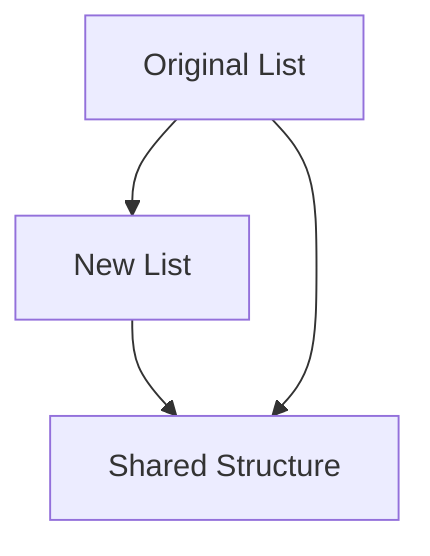

## 3.15 Collections and Functional Data Structures

In this section, we delve into Scala's powerful collection library and explore functional data structures, with a particular focus on immutable collections. As expert software engineers and architects, understanding these concepts is crucial for building robust, maintainable, and scalable applications. Scala's collections framework offers a rich set of tools that leverage the language's functional programming paradigms, enabling you to write concise and expressive code.

### Introduction to Scala Collections

Scala's collection library is one of its most powerful features, providing a wide range of data structures that are both mutable and immutable. The library is designed to be consistent and easy to use, with a uniform API across different collection types. This consistency allows developers to switch between different collection implementations with minimal code changes.

#### Key Characteristics of Scala Collections

- **Uniform API**: All collections share a common set of operations, making it easy to switch between different types.
- **Immutability**: Immutable collections are preferred in functional programming as they prevent side effects and make code easier to reason about.
- **Lazy Evaluation**: Some collections, like `Stream`, support lazy evaluation, which can improve performance by deferring computation until necessary.
- **Rich Set of Operations**: Scala collections provide a wide range of operations, including map, filter, fold, and more, enabling expressive and concise code.

### Immutable Collections in Scala

Immutable collections are a cornerstone of functional programming in Scala. They offer several advantages, such as thread safety and ease of reasoning about code, as they cannot be modified after creation. Let's explore some of the most commonly used immutable collections in Scala.

#### List

The `List` is a fundamental immutable collection in Scala, representing a linked list. It is a linear sequence that allows efficient head operations but is less efficient for random access.

```scala
val numbers = List(1, 2, 3, 4, 5)
val newNumbers = 0 :: numbers // Prepend an element
val moreNumbers = numbers :+ 6 // Append an element
```

#### Vector

`Vector` is an immutable collection that provides an indexed sequence with fast random access. It is implemented as a tree with a branching factor of 32, making it a good choice for large collections.

```scala
val vector = Vector(1, 2, 3, 4, 5)
val updatedVector = vector.updated(2, 10) // Update an element at index 2
```

#### Set

An immutable `Set` is a collection of unique elements. It provides efficient operations for adding, removing, and checking for elements.

```scala
val set = Set(1, 2, 3)
val newSet = set + 4 // Add an element
val withoutElement = set - 2 // Remove an element
```

#### Map

An immutable `Map` is a collection of key-value pairs. It provides efficient lookup, addition, and removal of elements.

```scala
val map = Map("a" -> 1, "b" -> 2)
val updatedMap = map + ("c" -> 3) // Add a key-value pair
val withoutKey = map - "a" // Remove a key
```

### Leveraging Scala's Rich Collection Library

Scala's collection library provides a wide range of operations that allow you to manipulate collections in a functional style. Let's explore some of these operations and how they can be used to write expressive and concise code.

#### Mapping and Filtering

Mapping and filtering are two of the most commonly used operations in functional programming. They allow you to transform and filter collections based on a given function.

```scala
val numbers = List(1, 2, 3, 4, 5)
val doubled = numbers.map(_ * 2) // Double each element
val evenNumbers = numbers.filter(_ % 2 == 0) // Filter even numbers
```

#### Folding and Reducing

Folding and reducing operations allow you to aggregate elements of a collection into a single result. They are powerful tools for performing complex transformations and aggregations.

```scala
val sum = numbers.foldLeft(0)(_ + _) // Sum of elements
val product = numbers.reduce(_ * _) // Product of elements
```

#### Grouping and Partitioning

Grouping and partitioning operations allow you to organize elements of a collection based on a given predicate or function.

```scala
val grouped = numbers.groupBy(_ % 2) // Group by even and odd
val (evens, odds) = numbers.partition(_ % 2 == 0) // Partition into evens and odds
```

### Functional Data Structures

Functional data structures are designed to work seamlessly with functional programming paradigms. They are immutable by nature and provide efficient ways to perform common operations without side effects.

#### Persistent Data Structures

Persistent data structures are a type of functional data structure that allows you to create modified versions of a data structure without altering the original. This is achieved by sharing structure between different versions, making them both space and time efficient.

##### Example: Persistent List

The `List` in Scala is a classic example of a persistent data structure. When you add or remove elements, a new list is created that shares structure with the original list.

```scala
val originalList = List(1, 2, 3)
val newList = 0 :: originalList // New list shares structure with original
```

#### Zippers

Zippers are a functional data structure that allows you to navigate and update immutable data structures efficiently. They provide a way to focus on a particular part of a data structure while maintaining the context of the whole.

##### Example: Zipper for Lists

A zipper for a list can be implemented using two lists: one for the elements before the focus and one for the elements after.

```scala
case class ListZipper[A](left: List[A], focus: A, right: List[A])

val zipper = ListZipper(List(1, 2), 3, List(4, 5))
// Move focus to the right
val movedRight = zipper.copy(left = zipper.focus :: zipper.left, focus = zipper.right.head, right = zipper.right.tail)
```

### Try It Yourself

To deepen your understanding of Scala's collections and functional data structures, try modifying the examples above. For instance, experiment with different collection operations, such as `flatMap`, `collect`, or `scan`. Observe how these operations can be combined to achieve complex transformations in a concise and expressive manner.

### Visualizing Scala Collections

To better understand the structure and relationships within Scala collections, let's visualize some of these concepts using Mermaid.js diagrams.

#### Visualizing a Persistent List



*Caption*: This diagram illustrates how a persistent list shares structure between the original and new versions, allowing efficient modifications without altering the original.

### Design Considerations

When working with Scala's collections and functional data structures, it's important to consider the following:

- **Performance**: Immutable collections can have different performance characteristics compared to mutable ones. Choose the right collection based on your use case.
- **Memory Usage**: Persistent data structures can be more memory efficient due to structure sharing, but they may also introduce overhead in certain scenarios.
- **Concurrency**: Immutable collections are inherently thread-safe, making them a good choice for concurrent programming.

### Differences and Similarities

Scala's collections framework is often compared to Java's collections. While both provide a rich set of data structures, Scala's collections are more aligned with functional programming paradigms, offering a more consistent and expressive API. Additionally, Scala's collections emphasize immutability, which is less prevalent in Java's collections.

### Conclusion

Scala's collections and functional data structures provide a powerful toolkit for expert developers. By leveraging these tools, you can write code that is not only efficient and expressive but also easier to reason about and maintain. As you continue to explore Scala's rich collection library, remember to experiment with different operations and data structures to find the best fit for your specific use case.

## Quiz Time!



### Which of the following is an immutable collection in Scala?

- [x] List
- [ ] Array
- [ ] MutableList
- [ ] Buffer

> **Explanation:** `List` is an immutable collection in Scala, while `Array`, `MutableList`, and `Buffer` are mutable.

### What is a key advantage of using immutable collections?

- [x] Thread safety
- [ ] Faster performance
- [ ] Less memory usage
- [ ] Easier syntax

> **Explanation:** Immutable collections are inherently thread-safe because they cannot be modified after creation, reducing the risk of concurrent modification issues.

### How does a persistent data structure differ from a regular data structure?

- [x] It shares structure between versions
- [ ] It is always faster
- [ ] It uses more memory
- [ ] It is mutable

> **Explanation:** Persistent data structures share structure between different versions, allowing efficient modifications without altering the original.

### What operation would you use to transform each element of a collection?

- [x] map
- [ ] filter
- [ ] fold
- [ ] partition

> **Explanation:** The `map` operation is used to transform each element of a collection based on a given function.

### Which collection type provides fast random access?

- [x] Vector
- [ ] List
- [ ] Set
- [ ] Queue

> **Explanation:** `Vector` provides fast random access due to its tree-based implementation, while `List` is optimized for head operations.

### What is the purpose of a zipper in functional programming?

- [x] To navigate and update data structures efficiently
- [ ] To compress data
- [ ] To sort elements
- [ ] To filter collections

> **Explanation:** A zipper is a functional data structure that allows efficient navigation and updates of immutable data structures.

### Which operation would you use to aggregate elements into a single result?

- [x] fold
- [ ] map
- [ ] filter
- [ ] groupBy

> **Explanation:** The `fold` operation aggregates elements of a collection into a single result, often used for summing or concatenating elements.

### What is a common use case for the `groupBy` operation?

- [x] Organizing elements based on a predicate
- [ ] Sorting elements
- [ ] Removing duplicates
- [ ] Updating elements

> **Explanation:** The `groupBy` operation organizes elements of a collection into groups based on a given predicate or function.

### True or False: Scala's collections library is designed to be consistent and easy to use.

- [x] True
- [ ] False

> **Explanation:** Scala's collections library is designed with a uniform API, making it consistent and easy to use across different collection types.

### Which of the following is a benefit of using functional data structures?

- [x] They prevent side effects
- [ ] They are always faster
- [ ] They use more memory
- [ ] They are mutable

> **Explanation:** Functional data structures are immutable, preventing side effects and making code easier to reason about.


