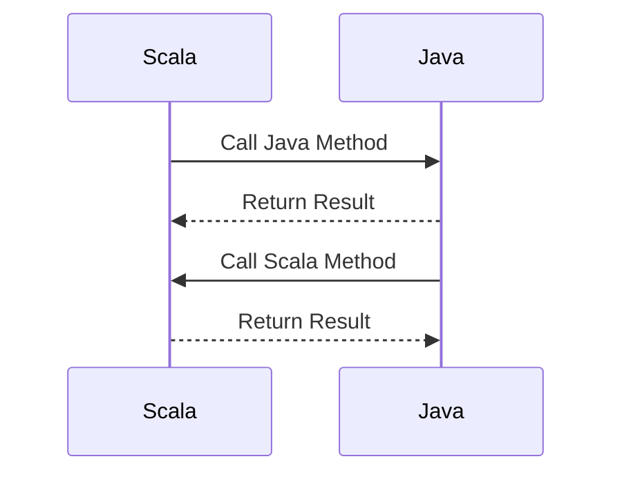

## 3.16 Interoperability with Java

In the world of software development, leveraging existing codebases and libraries is a common practice that can save time and resources. Scala, being a language that runs on the Java Virtual Machine (JVM), offers seamless interoperability with Java. This capability allows developers to integrate Scala into existing Java projects or vice versa, thus capitalizing on the strengths of both languages. In this section, we will explore the intricacies of Scala-Java interoperability, best practices for cross-language integration, and how to effectively manage mixed-language projects.

### Understanding Scala-Java Interoperability

Scala's design inherently supports interoperability with Java, making it a powerful tool for developers who want to enhance their Java applications with Scala's functional programming features. The interoperability is facilitated by the fact that both Scala and Java compile to bytecode that runs on the JVM. This shared runtime environment allows Scala and Java to call each other’s code, use each other’s libraries, and even share data structures.

#### Key Concepts

- **Bytecode Compatibility**: Both Scala and Java compile to JVM bytecode, which means they can run on the same platform and interact with each other seamlessly.
- **Type Compatibility**: Scala's type system is designed to be compatible with Java's, allowing for smooth data exchange between the two languages.
- **Library Access**: Scala can use Java libraries without any special configuration, and Java can access Scala libraries with minimal setup.

### Calling Java from Scala

One of the most straightforward aspects of Scala-Java interoperability is calling Java code from Scala. Scala's syntax and type system are designed to align closely with Java, making it easy to use Java classes and methods within Scala code.

#### Example: Using a Java Library in Scala

Let's consider a simple example where we use Java's `ArrayList` in Scala.

```scala
import java.util.ArrayList

object ScalaJavaInteropExample {
  def main(args: Array[String]): Unit = {
    val javaList = new ArrayList[String]()
    javaList.add("Scala")
    javaList.add("Java")
    javaList.forEach(item => println(item))
  }
}
```

In this example, we import `java.util.ArrayList` and use it as if it were a native Scala collection. This demonstrates the ease with which Scala can utilize Java libraries.

### Calling Scala from Java

While calling Java from Scala is straightforward, calling Scala code from Java requires a bit more attention due to Scala's advanced features like traits, case classes, and higher-order functions.

#### Example: Accessing a Scala Object from Java

Consider a Scala object that we want to access from Java:

```scala
// Scala code
object ScalaUtils {
  def greet(name: String): String = s"Hello, $name!"
}
```

To call this from Java, we need to understand how Scala compiles objects and methods:

```java
// Java code
public class JavaCaller {
    public static void main(String[] args) {
        String greeting = ScalaUtils$.MODULE$.greet("World");
        System.out.println(greeting);
    }
}
```

Here, `ScalaUtils$.MODULE$` is used to access the singleton instance of the Scala object. This is because Scala objects are compiled into classes with a static `MODULE$` field.

### Managing Data Types

Data type compatibility is crucial for seamless interoperability. Scala's type system is more expressive than Java's, which can lead to some challenges when exchanging data between the two languages.

#### Primitive Types

Scala's primitive types (e.g., `Int`, `Double`) correspond directly to Java's primitive types (`int`, `double`). This direct mapping ensures efficient data exchange without additional overhead.

#### Collections

Scala's collections library is more powerful and flexible than Java's, but interoperability is straightforward. Scala collections can be easily converted to Java collections and vice versa using Scala's collection conversion utilities.

```scala
import scala.jdk.CollectionConverters._

val scalaList = List("Scala", "Java")
val javaList = scalaList.asJava
```

In this example, `asJava` is used to convert a Scala `List` to a Java `List`.

### Handling Exceptions

Exception handling is another area where Scala and Java interoperability shines. Scala's exception handling mechanism is compatible with Java's, allowing exceptions to be thrown and caught across language boundaries.

#### Example: Catching Java Exceptions in Scala

```scala
try {
  // Java method that might throw an exception
  JavaLibrary.someMethod()
} catch {
  case e: Exception => println(s"Caught exception: ${e.getMessage}")
}
```

This example shows how a Java exception can be caught in Scala using a `try-catch` block.

### Best Practices for Cross-Language Interoperability

To ensure smooth interoperability between Scala and Java, consider the following best practices:

1. **Consistent Naming Conventions**: Use consistent naming conventions across Scala and Java codebases to avoid confusion and improve readability.

2. **Minimize Language-Specific Features**: When writing code that will be accessed from both Scala and Java, minimize the use of language-specific features that may not be easily translatable.

3. **Use Interfaces for Abstraction**: Define interfaces in Java and implement them in Scala to ensure that Scala classes can be easily used from Java.

4. **Leverage Scala's Implicits Carefully**: While Scala's implicits are powerful, they can be confusing when accessed from Java. Use them judiciously and document their usage.

5. **Test Cross-Language Interactions**: Regularly test interactions between Scala and Java code to catch any interoperability issues early.

### Try It Yourself

To gain hands-on experience with Scala-Java interoperability, try modifying the code examples provided. For instance, experiment with converting more complex Scala collections to Java collections, or try calling Scala methods that use higher-order functions from Java.

### Visualizing Scala-Java Interoperability

To better understand the flow of data and method calls between Scala and Java, consider the following diagram:



This sequence diagram illustrates the bidirectional communication between Scala and Java, highlighting the seamless integration possible between the two languages.

### References and Further Reading

- [Scala Documentation](https://docs.scala-lang.org/)
- [Java Documentation](https://docs.oracle.com/en/java/)
- [Scala-Java Interoperability](https://docs.scala-lang.org/tutorials/scala-for-java-programmers.html)

### Knowledge Check

To reinforce your understanding of Scala-Java interoperability, consider the following questions:

1. What are the key benefits of Scala's interoperability with Java?
2. How can you call a Scala method from Java?
3. What are some best practices for managing data types between Scala and Java?
4. Why is it important to test cross-language interactions?

### Embrace the Journey

Remember, mastering Scala-Java interoperability is just the beginning. As you continue to explore the capabilities of both languages, you'll discover new ways to enhance your applications and streamline your development process. Keep experimenting, stay curious, and enjoy the journey!

## Quiz Time!



### What is a key advantage of Scala's interoperability with Java?

- [x] Both compile to JVM bytecode, allowing seamless integration.
- [ ] Scala's syntax is identical to Java's.
- [ ] Scala does not support Java libraries.
- [ ] Java cannot call Scala methods.

> **Explanation:** Scala and Java both compile to JVM bytecode, enabling seamless integration and interoperability.

### How can you call a Scala object method from Java?

- [x] Use `ScalaObject$.MODULE$.methodName()`.
- [ ] Directly call `methodName()` on the object.
- [ ] Use `ScalaObject.methodName()`.
- [ ] Use `ScalaObject::methodName`.

> **Explanation:** Scala objects are compiled into classes with a static `MODULE$` field, which is used to access the singleton instance.

### What is a best practice for managing data types between Scala and Java?

- [x] Use Scala's collection conversion utilities.
- [ ] Avoid using collections altogether.
- [ ] Use only Java collections in Scala.
- [ ] Use only Scala collections in Java.

> **Explanation:** Scala's collection conversion utilities allow seamless conversion between Scala and Java collections.

### Which of the following is a challenge when calling Scala from Java?

- [x] Handling Scala's advanced features like traits and higher-order functions.
- [ ] Java cannot access Scala's primitive types.
- [ ] Scala does not support Java exceptions.
- [ ] Java cannot use Scala libraries.

> **Explanation:** Scala's advanced features like traits and higher-order functions require careful handling when accessed from Java.

### Why is it important to test cross-language interactions?

- [x] To catch interoperability issues early.
- [ ] To ensure Java code runs faster.
- [ ] To prevent Scala from using Java libraries.
- [ ] To avoid using Scala's implicits.

> **Explanation:** Regular testing of cross-language interactions helps identify and resolve interoperability issues early in the development process.

### What is a recommended practice when writing code to be accessed from both Scala and Java?

- [x] Minimize the use of language-specific features.
- [ ] Use only Scala-specific features.
- [ ] Avoid using interfaces.
- [ ] Use only Java-specific features.

> **Explanation:** Minimizing language-specific features ensures that the code is easily translatable and accessible from both Scala and Java.

### How can Scala handle Java exceptions?

- [x] Using a `try-catch` block.
- [ ] Using `Option` types.
- [ ] Using `Either` types.
- [ ] Using `Future` types.

> **Explanation:** Scala can catch Java exceptions using a `try-catch` block, similar to Java's exception handling mechanism.

### What is a common use case for Scala-Java interoperability?

- [x] Enhancing existing Java applications with Scala's functional features.
- [ ] Replacing Java libraries with Scala libraries.
- [ ] Writing only Java code in Scala projects.
- [ ] Avoiding the use of Java libraries.

> **Explanation:** Scala-Java interoperability is often used to enhance existing Java applications with Scala's functional programming features.

### Which of the following is a benefit of using interfaces for abstraction in Scala-Java projects?

- [x] Ensures Scala classes can be easily used from Java.
- [ ] Prevents Java from calling Scala methods.
- [ ] Allows only Scala to use Java libraries.
- [ ] Restricts Scala from using Java collections.

> **Explanation:** Using interfaces for abstraction ensures that Scala classes can be easily used from Java, facilitating seamless interoperability.

### True or False: Scala's implicits can be confusing when accessed from Java.

- [x] True
- [ ] False

> **Explanation:** Scala's implicits can be powerful but may be confusing when accessed from Java, so they should be used judiciously and documented.


