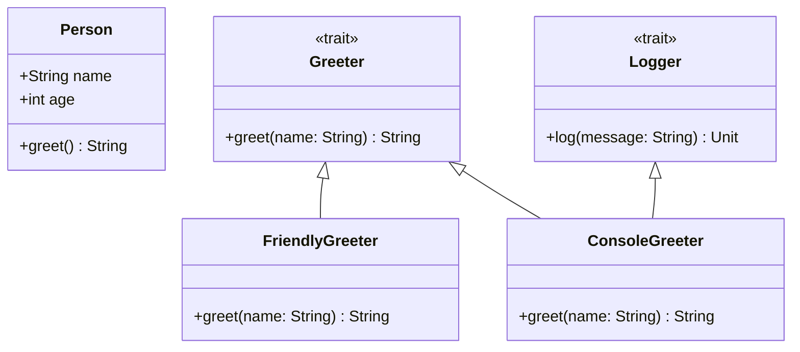

## 3.17 Object-Oriented Programming in Scala

Scala is a unique language that elegantly combines the principles of object-oriented programming (OOP) with functional programming (FP). This blend allows developers to leverage the strengths of both paradigms, creating robust, scalable, and maintainable software solutions. In this section, we will delve into the object-oriented aspects of Scala, focusing on classes, traits, and inheritance, and explore how these features integrate with functional programming concepts.

### Understanding Object-Oriented Programming in Scala

Object-oriented programming is a paradigm centered around the concept of "objects," which are instances of classes. These objects encapsulate data and behavior, allowing for modular and reusable code. Scala, being a hybrid language, supports OOP by providing powerful constructs such as classes, traits, and inheritance.

#### Key Concepts of Object-Oriented Programming

- **Encapsulation**: Bundling data and methods that operate on the data within a single unit, or class.
- **Abstraction**: Hiding complex implementation details and exposing only the necessary parts of an object.
- **Inheritance**: Allowing a new class to inherit properties and methods from an existing class, promoting code reuse.
- **Polymorphism**: Enabling objects to be treated as instances of their parent class, allowing for flexible code.

### Classes in Scala

Classes in Scala are blueprints for creating objects. They define the properties (fields) and behaviors (methods) that the objects created from them will have.

#### Defining a Class

A class in Scala is defined using the `class` keyword. Here's a simple example:

```scala
class Person(val name: String, val age: Int) {
  def greet(): String = s"Hello, my name is $name and I am $age years old."
}

// Creating an instance of the Person class
val person = new Person("Alice", 30)
println(person.greet())  // Output: Hello, my name is Alice and I am 30 years old.
```

In this example, `Person` is a class with two fields, `name` and `age`, and a method `greet` that returns a greeting message.

#### Primary Constructor

The parameters of a class in Scala are part of its primary constructor. The primary constructor is defined in the class signature itself. In the `Person` class, `name` and `age` are parameters of the primary constructor.

#### Auxiliary Constructors

Scala also supports auxiliary constructors, which are additional constructors that can be defined using the `this` keyword. Here's how you can define an auxiliary constructor:

```scala
class Person(val name: String, val age: Int) {
  def this(name: String) = this(name, 0)  // Auxiliary constructor
  def greet(): String = s"Hello, my name is $name and I am $age years old."
}

val personWithUnknownAge = new Person("Bob")
println(personWithUnknownAge.greet())  // Output: Hello, my name is Bob and I am 0 years old.
```

In this example, the auxiliary constructor allows creating a `Person` object with only a name, defaulting the age to 0.

### Traits in Scala

Traits in Scala are similar to interfaces in Java but more powerful. They can contain both abstract and concrete methods and can be mixed into classes to extend their functionality.

#### Defining and Using Traits

Here's an example of a trait in Scala:

```scala
trait Greeter {
  def greet(name: String): String  // Abstract method
}

class FriendlyGreeter extends Greeter {
  def greet(name: String): String = s"Hello, $name! Welcome!"
}

val greeter = new FriendlyGreeter()
println(greeter.greet("Charlie"))  // Output: Hello, Charlie! Welcome!
```

In this example, `Greeter` is a trait with an abstract method `greet`. The `FriendlyGreeter` class extends this trait and provides an implementation for the `greet` method.

#### Mixing Traits

Scala allows mixing multiple traits into a class, enabling a form of multiple inheritance. Here's how you can mix traits:

```scala
trait Logger {
  def log(message: String): Unit = println(s"Log: $message")
}

class ConsoleGreeter extends Greeter with Logger {
  def greet(name: String): String = {
    val message = s"Hello, $name!"
    log(message)
    message
  }
}

val consoleGreeter = new ConsoleGreeter()
consoleGreeter.greet("Dave")  // Output: Log: Hello, Dave!
                              //         Hello, Dave!
```

In this example, `ConsoleGreeter` mixes in both `Greeter` and `Logger` traits, allowing it to greet and log messages.

### Inheritance in Scala

Inheritance is a mechanism for creating a new class from an existing class. In Scala, inheritance is achieved using the `extends` keyword.

#### Single Inheritance

Scala supports single inheritance, where a class can extend only one superclass. Here's an example:

```scala
class Animal {
  def sound(): String = "Some sound"
}

class Dog extends Animal {
  override def sound(): String = "Bark"
}

val dog = new Dog()
println(dog.sound())  // Output: Bark
```

In this example, `Dog` extends `Animal` and overrides the `sound` method to provide a specific implementation.

#### Abstract Classes

Abstract classes in Scala are classes that cannot be instantiated and are meant to be extended. They can contain both abstract and concrete methods.

```scala
abstract class Vehicle {
  def move(): String  // Abstract method
}

class Car extends Vehicle {
  def move(): String = "Driving"
}

val car = new Car()
println(car.move())  // Output: Driving
```

In this example, `Vehicle` is an abstract class with an abstract method `move`. The `Car` class extends `Vehicle` and provides an implementation for the `move` method.

### Combining Functional and Object-Oriented Paradigms

Scala's unique ability to combine functional and object-oriented paradigms allows developers to create more expressive and flexible code. Let's explore how these paradigms can be integrated.

#### Case Classes

Case classes in Scala are a powerful feature that combines the benefits of both paradigms. They are immutable by default and come with built-in support for pattern matching.

```scala
case class Point(x: Int, y: Int)

val point1 = Point(1, 2)
val point2 = Point(1, 2)

println(point1 == point2)  // Output: true
```

In this example, `Point` is a case class with two fields, `x` and `y`. Case classes automatically provide implementations for `equals`, `hashCode`, and `toString` methods, making them ideal for functional programming patterns.

#### Pattern Matching

Pattern matching is a powerful feature in Scala that allows you to deconstruct data structures and apply logic based on their shape.

```scala
def describe(x: Any): String = x match {
  case 0 => "zero"
  case 1 => "one"
  case _ => "many"
}

println(describe(1))  // Output: one
```

In this example, pattern matching is used to describe a number based on its value.

### Design Considerations

When designing software in Scala, it's important to consider when to use object-oriented features and when to leverage functional programming. Here are some guidelines:

- Use classes and inheritance when you need to model entities with shared behavior and state.
- Use traits to define reusable behaviors that can be mixed into multiple classes.
- Use case classes and pattern matching for immutable data structures and functional programming patterns.

### Differences and Similarities

Scala's traits are often compared to interfaces in Java, but they are more powerful because they can contain concrete methods. Unlike Java, Scala supports multiple inheritance through traits, allowing for more flexible code design.

### Visualizing Object-Oriented Concepts in Scala

Below is a class diagram illustrating the relationships between classes and traits in Scala:



This diagram shows how traits `Greeter` and `Logger` are mixed into classes `FriendlyGreeter` and `ConsoleGreeter`, demonstrating multiple inheritance in Scala.

### Try It Yourself

Experiment with the code examples provided in this section. Try modifying the `Person` class to include additional methods or fields. Create new traits and mix them into existing classes to see how they affect the behavior of your objects.

### References and Links

For further reading on Scala's object-oriented features, consider exploring the following resources:

- [Scala Documentation](https://docs.scala-lang.org/)
- [Programming in Scala](https://www.artima.com/shop/programming_in_scala) by Martin Odersky, Lex Spoon, and Bill Venners

### Knowledge Check

- What is the primary constructor in a Scala class?
- How do traits differ from interfaces in Java?
- What are case classes, and why are they useful in Scala?
- How does Scala support multiple inheritance?
- When should you use abstract classes in Scala?

### Embrace the Journey

Remember, mastering Scala's object-oriented features is just the beginning. As you continue to explore Scala, you'll discover new ways to combine functional and object-oriented paradigms to create powerful and efficient software solutions. Keep experimenting, stay curious, and enjoy the journey!

## Quiz Time!



### What is a primary constructor in Scala?

- [x] The constructor defined in the class signature itself.
- [ ] A constructor defined using the `this` keyword.
- [ ] A constructor that cannot take parameters.
- [ ] A constructor that is automatically generated by the compiler.

> **Explanation:** The primary constructor in Scala is defined in the class signature itself and is responsible for initializing the class parameters.

### How do traits in Scala differ from interfaces in Java?

- [x] Traits can contain concrete methods.
- [ ] Traits cannot be mixed into classes.
- [ ] Traits are only used for defining abstract methods.
- [ ] Traits cannot be extended by other traits.

> **Explanation:** Unlike Java interfaces, Scala traits can contain both abstract and concrete methods, making them more versatile.

### What is the purpose of a case class in Scala?

- [x] To provide immutable data structures with built-in pattern matching support.
- [ ] To define mutable data structures.
- [ ] To enforce encapsulation.
- [ ] To allow multiple inheritance.

> **Explanation:** Case classes in Scala are used to create immutable data structures with built-in support for pattern matching, `equals`, `hashCode`, and `toString` methods.

### How does Scala support multiple inheritance?

- [x] By allowing classes to mix in multiple traits.
- [ ] By allowing classes to extend multiple classes.
- [ ] By using interfaces like in Java.
- [ ] By using abstract classes.

> **Explanation:** Scala supports multiple inheritance through traits, which can be mixed into classes to provide additional behavior.

### When should you use abstract classes in Scala?

- [x] When you need to define a class with some abstract and some concrete methods.
- [ ] When you want to create a class that cannot be instantiated.
- [ ] When you want to define a class with only concrete methods.
- [ ] When you want to enforce immutability.

> **Explanation:** Abstract classes in Scala are used when you need to define a class with a mix of abstract and concrete methods, which cannot be instantiated directly.

### What is encapsulation in object-oriented programming?

- [x] Bundling data and methods that operate on the data within a single unit.
- [ ] Hiding the implementation details of a method.
- [ ] Allowing a class to inherit properties from another class.
- [ ] Enabling objects to be treated as instances of their parent class.

> **Explanation:** Encapsulation is the bundling of data and methods that operate on the data within a single unit, typically a class.

### What is polymorphism in object-oriented programming?

- [x] Enabling objects to be treated as instances of their parent class.
- [ ] Allowing a class to inherit properties from another class.
- [ ] Hiding the implementation details of a method.
- [ ] Bundling data and methods within a single unit.

> **Explanation:** Polymorphism allows objects to be treated as instances of their parent class, enabling flexible and dynamic code behavior.

### What is the role of the `override` keyword in Scala?

- [x] To indicate that a method is overriding a method in a superclass.
- [ ] To define a new method in a class.
- [ ] To create an abstract method.
- [ ] To prevent a method from being overridden.

> **Explanation:** The `override` keyword in Scala is used to indicate that a method is overriding a method in a superclass, ensuring that the method signature matches.

### Can Scala classes have multiple primary constructors?

- [x] False
- [ ] True

> **Explanation:** Scala classes can only have one primary constructor, but they can have multiple auxiliary constructors defined using the `this` keyword.

### What is the benefit of using pattern matching in Scala?

- [x] It allows deconstructing data structures and applying logic based on their shape.
- [ ] It enforces immutability.
- [ ] It provides a way to define abstract methods.
- [ ] It enables multiple inheritance.

> **Explanation:** Pattern matching in Scala allows deconstructing data structures and applying logic based on their shape, making code more expressive and concise.


