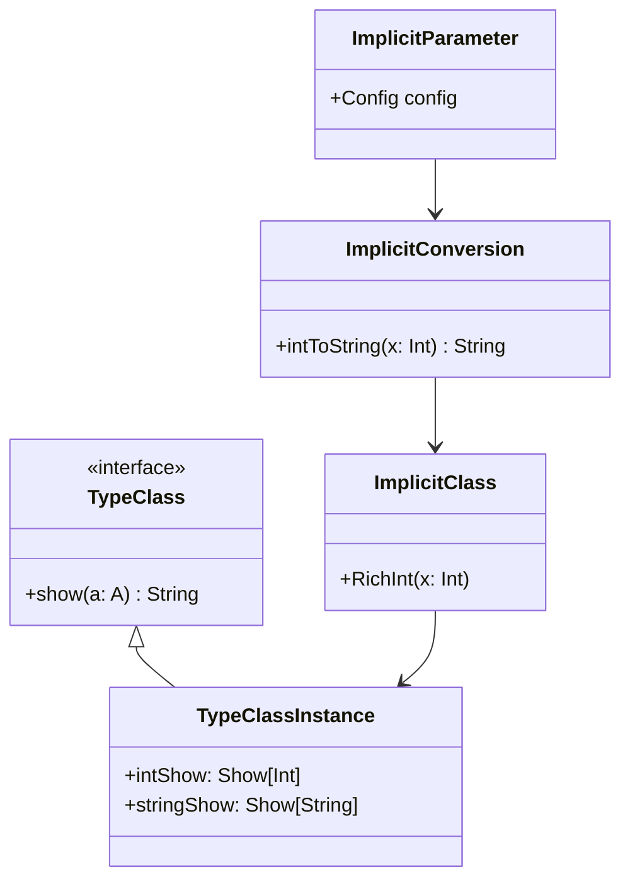

## 3.18 Implicits and Type Classes

In Scala, implicits and type classes are powerful tools that allow developers to write more expressive and flexible code. They enable the creation of highly reusable components and facilitate the integration of functional and object-oriented paradigms. In this section, we will delve into the intricacies of implicits and type classes, exploring their implementation, use cases, and best practices.

### Understanding Implicits

Implicits in Scala are a mechanism that allows the compiler to automatically supply missing parameters or conversions. They can be used to achieve a variety of tasks, such as:

- **Implicit Parameters**: Automatically passing parameters to functions.
- **Implicit Conversions**: Converting one type to another without explicit calls.
- **Implicit Classes**: Adding methods to existing types without modifying their source code.

#### Implicit Parameters

Implicit parameters are a way to define parameters that are automatically filled by the compiler if they are not provided explicitly. This feature is particularly useful for passing around context or configuration objects.

```scala
case class Config(url: String, port: Int)

def connectToDatabase(implicit config: Config): Unit = {
  println(s"Connecting to database at ${config.url}:${config.port}")
}

implicit val defaultConfig: Config = Config("localhost", 5432)

// The implicit parameter is automatically provided by the compiler
connectToDatabase
```

In this example, `connectToDatabase` requires an implicit `Config` parameter. The compiler automatically uses `defaultConfig` when `connectToDatabase` is called without arguments.

#### Implicit Conversions

Implicit conversions allow you to define how one type can be converted to another. This can be useful for integrating libraries or working with legacy code.

```scala
implicit def intToString(x: Int): String = x.toString

val number: String = 42 // Implicitly converts Int to String
```

While implicit conversions can be powerful, they should be used sparingly due to potential readability and maintainability issues.

#### Implicit Classes

Implicit classes provide a way to add methods to existing types. This is often used to create "extension methods" that enhance the functionality of a type.

```scala
implicit class RichInt(val x: Int) extends AnyVal {
  def square: Int = x * x
}

println(5.square) // Outputs: 25
```

Here, the `RichInt` class adds a `square` method to the `Int` type, allowing you to call `5.square`.

### Implementing Type Classes in Scala

Type classes are a pattern used to achieve ad-hoc polymorphism, allowing you to define behavior that can be applied to various types without modifying them. This is particularly useful in functional programming for defining operations that can work with different data types.

#### Defining a Type Class

A type class is typically defined as a trait with one or more abstract methods. For example, let's define a simple `Show` type class that provides a way to convert values to strings.

```scala
trait Show[A] {
  def show(a: A): String
}
```

#### Providing Instances for a Type Class

To use a type class, you need to provide instances for specific types. This is done by creating implicit values that implement the type class for the desired types.

```scala
implicit val intShow: Show[Int] = new Show[Int] {
  def show(a: Int): String = a.toString
}

implicit val stringShow: Show[String] = new Show[String] {
  def show(a: String): String = a
}
```

#### Using Type Classes

Once you have defined a type class and its instances, you can write functions that operate on any type that has a `Show` instance.

```scala
def printShow[A](a: A)(implicit showInstance: Show[A]): Unit = {
  println(showInstance.show(a))
}

printShow(123)    // Outputs: 123
printShow("abc")  // Outputs: abc
```

The `printShow` function takes an implicit `Show` instance, allowing it to work with any type that has a `Show` instance defined.

### Enhancing Code with Implicit Conversions and Classes

Implicits can be used to enhance code by providing seamless conversions and adding methods to existing types. This can lead to more concise and expressive code.

#### Implicit Conversions in Practice

Consider a scenario where you need to work with a library that expects a specific type, but your code uses a different type. Implicit conversions can bridge this gap.

```scala
class OldLibrary {
  def process(data: String): Unit = println(s"Processing: $data")
}

case class NewData(content: String)

implicit def newDataToString(data: NewData): String = data.content

val library = new OldLibrary
val data = NewData("Hello, World!")

library.process(data) // Implicitly converts NewData to String
```

#### Implicit Classes for Extension Methods

Implicit classes can be used to add methods to types that you do not own or cannot modify.

```scala
implicit class StringOps(val s: String) extends AnyVal {
  def greet: String = s"Hello, $s!"
}

println("World".greet) // Outputs: Hello, World!
```

### Design Considerations

When using implicits and type classes, consider the following:

- **Readability**: Implicits can make code less readable. Use them judiciously and document their usage.
- **Performance**: Implicit resolution can introduce overhead. Profile your code if performance is a concern.
- **Compatibility**: Be mindful of changes in implicit definitions, as they can affect binary compatibility.

### Differences and Similarities

Implicits and type classes are related but serve different purposes. Implicits provide a mechanism for automatic parameter passing and conversions, while type classes define a pattern for ad-hoc polymorphism. Both can be used together to create flexible and reusable code.

### Visualizing Implicits and Type Classes

To better understand the relationship between implicits and type classes, let's visualize how they interact:



This diagram illustrates how implicit parameters, conversions, and classes can work together with type classes to create a cohesive system.

### Try It Yourself

Experiment with the code examples provided in this section. Try modifying the `Show` type class to support additional types, or create your own type class for a different operation. Consider how you might use implicits to simplify your codebase.

### Knowledge Check

- What are the main use cases for implicits in Scala?
- How do type classes differ from traditional inheritance-based polymorphism?
- What are some potential pitfalls of using implicits?

### Summary

In this section, we've explored the powerful concepts of implicits and type classes in Scala. By understanding and leveraging these features, you can write more expressive, flexible, and reusable code. Remember to use these tools judiciously, keeping readability and maintainability in mind.

## Quiz Time!



### What is the primary purpose of implicit parameters in Scala?

- [x] To automatically supply missing parameters to functions.
- [ ] To convert one type to another.
- [ ] To add methods to existing types.
- [ ] To define new types.

> **Explanation:** Implicit parameters are used to automatically supply missing parameters to functions, allowing for more concise and flexible code.

### How can implicit conversions be used in Scala?

- [x] To convert one type to another without explicit calls.
- [ ] To define new types.
- [ ] To add methods to existing types.
- [ ] To automatically supply missing parameters.

> **Explanation:** Implicit conversions allow Scala to convert one type to another without explicit calls, facilitating interoperability and integration with libraries.

### What is a type class in Scala?

- [x] A pattern used to achieve ad-hoc polymorphism.
- [ ] A class that defines a new type.
- [ ] A method that adds functionality to existing types.
- [ ] A mechanism for automatic parameter passing.

> **Explanation:** A type class is a pattern used to achieve ad-hoc polymorphism, allowing behavior to be applied to various types without modifying them.

### How do implicit classes enhance existing types?

- [x] By adding methods to existing types without modifying their source code.
- [ ] By converting one type to another.
- [ ] By defining new types.
- [ ] By automatically supplying missing parameters.

> **Explanation:** Implicit classes enhance existing types by adding methods without modifying their source code, enabling extension methods.

### What is a potential drawback of using implicits?

- [x] They can make code less readable.
- [ ] They improve performance.
- [ ] They simplify code.
- [ ] They enhance maintainability.

> **Explanation:** While implicits can simplify code, they can also make it less readable, which is a potential drawback.

### How can type classes be used in Scala?

- [x] To define behavior that can be applied to various types.
- [ ] To convert one type to another.
- [ ] To add methods to existing types.
- [ ] To automatically supply missing parameters.

> **Explanation:** Type classes define behavior that can be applied to various types, providing a flexible and reusable pattern for polymorphism.

### What is the relationship between implicits and type classes?

- [x] Implicits can be used to provide instances for type classes.
- [ ] Implicits are a type of type class.
- [ ] Type classes are a type of implicit.
- [ ] There is no relationship between them.

> **Explanation:** Implicits can be used to provide instances for type classes, allowing for automatic resolution of type class instances.

### How do implicit parameters differ from traditional parameters?

- [x] Implicit parameters are automatically supplied by the compiler.
- [ ] Implicit parameters are explicitly passed by the developer.
- [ ] Implicit parameters cannot be used in Scala.
- [ ] Implicit parameters are only used for conversions.

> **Explanation:** Implicit parameters are automatically supplied by the compiler, unlike traditional parameters which are explicitly passed by the developer.

### What is an example of using implicit classes?

- [x] Adding a `greet` method to the `String` type.
- [ ] Converting `Int` to `String`.
- [ ] Automatically supplying a `Config` parameter.
- [ ] Defining a new `Show` type class.

> **Explanation:** Implicit classes can be used to add methods, such as a `greet` method, to existing types like `String`.

### True or False: Implicits can introduce binary compatibility issues.

- [x] True
- [ ] False

> **Explanation:** Changes in implicit definitions can affect binary compatibility, which is something to be mindful of when using implicits.


