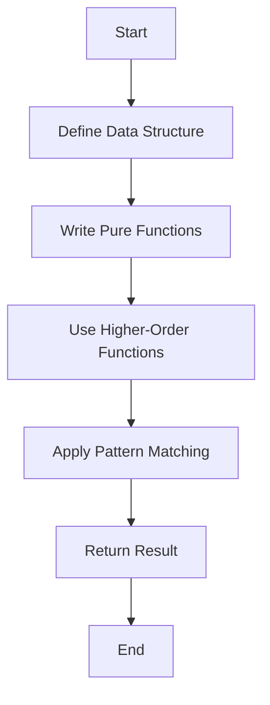

## 3.19 Writing Idiomatic Scala Code

Writing idiomatic Scala code is about embracing the language's unique features and paradigms to produce clean, expressive, and maintainable software. This section will guide you through the best practices and conventions that define idiomatic Scala, helping you leverage the language's strengths to write code that is both elegant and efficient.

### Understanding Idiomatic Code

Idiomatic code refers to writing code that adheres to the conventions and styles of the language, making it intuitive for others familiar with the language to read and understand. In Scala, this means utilizing its functional programming capabilities, strong type system, and concise syntax to write code that is both powerful and readable.

### Embrace Functional Programming

Scala is a hybrid language that supports both object-oriented and functional programming paradigms. To write idiomatic Scala code, it's essential to embrace functional programming principles, such as immutability, pure functions, and higher-order functions.

#### Immutability

Immutability is a cornerstone of functional programming. It involves creating data structures that cannot be modified after they are created. This leads to safer and more predictable code, as there are no side effects from changing data.

```scala
// Using immutable collections
val numbers = List(1, 2, 3, 4, 5)

// Attempting to modify the list will result in a new list
val doubled = numbers.map(_ * 2)
```

#### Pure Functions

Pure functions are functions that always produce the same output for the same input and have no side effects. They are easier to test and reason about.

```scala
// A pure function that calculates the square of a number
def square(x: Int): Int = x * x
```

#### Higher-Order Functions

Higher-order functions are functions that take other functions as parameters or return functions as results. They are a powerful tool for abstraction and code reuse.

```scala
// Using a higher-order function to apply a function to each element in a list
def applyFunction[A, B](list: List[A], func: A => B): List[B] = list.map(func)

val squaredNumbers = applyFunction(numbers, square)
```

### Leverage Scala's Type System

Scala's strong and expressive type system is one of its greatest assets. Writing idiomatic Scala code involves using the type system to your advantage, ensuring type safety and reducing runtime errors.

#### Type Inference

Scala's type inference allows you to write concise code without explicitly specifying types, while still maintaining type safety.

```scala
// Scala infers the type of 'message' as String
val message = "Hello, Scala!"
```

#### Pattern Matching

Pattern matching is a powerful feature in Scala that allows you to destructure data and execute code based on the structure of the data.

```scala
// Using pattern matching to handle different cases
def describe(x: Any): String = x match {
  case 0 => "zero"
  case _: Int => "an integer"
  case _: String => "a string"
  case _ => "something else"
}
```

### Utilize Traits and Mixins

Traits in Scala are a way to share interfaces and fields between classes. They are similar to interfaces in Java, but they can also contain concrete methods and fields.

```scala
// Defining a trait with a concrete method
trait Greeter {
  def greet(name: String): String = s"Hello, $name!"
}

// Using a trait in a class
class Person(val name: String) extends Greeter

val person = new Person("Alice")
println(person.greet(person.name)) // Outputs: Hello, Alice!
```

### Write Concise and Expressive Code

Scala's syntax is designed to be concise and expressive. Writing idiomatic Scala code means taking advantage of this syntax to write code that is both brief and clear.

#### Use of For-Comprehensions

For-comprehensions provide a concise way to work with collections and monads, such as `Option`, `Either`, and `Future`.

```scala
// Using a for-comprehension to work with Options
val maybeNumber: Option[Int] = Some(42)
val maybeString: Option[String] = Some("Scala")

val result = for {
  number <- maybeNumber
  string <- maybeString
} yield s"$string number is $number"

println(result) // Outputs: Some(Scala number is 42)
```

#### Avoiding Boilerplate with Case Classes

Case classes in Scala are a concise way to define classes that are primarily used to store data. They automatically provide implementations for methods like `equals`, `hashCode`, and `toString`.

```scala
// Defining a case class
case class Point(x: Int, y: Int)

// Creating an instance of a case class
val point = Point(1, 2)

// Accessing fields
println(point.x) // Outputs: 1
```

### Embrace the Power of Collections

Scala's collections library is rich and powerful, providing a wide range of immutable and mutable collections. Writing idiomatic Scala code involves using these collections effectively.

#### Use Immutable Collections

Prefer immutable collections over mutable ones to ensure safety and predictability in your code.

```scala
// Creating an immutable list
val fruits = List("apple", "banana", "cherry")

// Adding an element results in a new list
val moreFruits = fruits :+ "date"
```

#### Leverage Collection Methods

Scala collections come with a variety of methods that allow you to perform complex operations concisely.

```scala
// Filtering and transforming a list
val evenNumbers = numbers.filter(_ % 2 == 0).map(_ * 2)
```

### Use Implicits Wisely

Implicits in Scala can be a powerful tool, but they should be used judiciously to avoid making code difficult to understand and maintain.

#### Implicit Parameters

Implicit parameters allow you to define parameters that are automatically filled by the compiler if available in the scope.

```scala
// Defining a function with an implicit parameter
def greet(implicit name: String): String = s"Hello, $name!"

implicit val defaultName: String = "World"
println(greet) // Outputs: Hello, World!
```

#### Implicit Conversions

Implicit conversions can automatically convert one type to another, but they should be used sparingly to avoid unexpected behavior.

```scala
// Defining an implicit conversion
implicit def intToString(x: Int): String = x.toString

val number: String = 42 // Implicitly converted from Int to String
```

### Embrace Scala 3 Enhancements

Scala 3 introduces several enhancements that make writing idiomatic code even more straightforward. These include new syntax features, contextual abstractions, and more.

#### Optional Braces and Indentation-Based Syntax

Scala 3 allows you to use indentation instead of braces for blocks of code, making it more concise and readable.

```scala
// Using indentation instead of braces
def factorial(n: Int): Int =
  if n == 0 then 1
  else n * factorial(n - 1)
```

#### Given/Using Clauses

Scala 3 replaces implicits with `given` and `using` clauses, providing a clearer and more explicit way to define and use implicit values.

```scala
// Defining a given instance
given Int = 42

// Using a given instance
def show(using x: Int): String = s"The value is $x"

println(show) // Outputs: The value is 42
```

### Try It Yourself

Experiment with the code examples provided in this section. Try modifying them to see how changes affect the output. For instance, change the types in pattern matching or add new methods to traits to see how Scala's features can be leveraged to write idiomatic code.

### Visualizing Idiomatic Code Practices

To better understand the flow and structure of idiomatic Scala code, let's visualize the process of using pattern matching and higher-order functions in a simple workflow:



This diagram illustrates the typical steps involved in writing idiomatic Scala code, from defining data structures to returning results using functional programming principles.

### References and Further Reading

- [Scala Documentation](https://docs.scala-lang.org/)
- [Functional Programming in Scala](https://www.manning.com/books/functional-programming-in-scala)
- [Scala Style Guide](https://docs.scala-lang.org/style/)

### Knowledge Check

- What are the benefits of using immutable collections in Scala?
- How does pattern matching enhance code readability and maintainability?
- Why should implicits be used sparingly in Scala?

### Summary

Writing idiomatic Scala code involves embracing the language's functional programming capabilities, leveraging its powerful type system, and utilizing its concise syntax. By following the best practices outlined in this section, you can write code that is not only efficient and maintainable but also a joy to read and work with.

Remember, this is just the beginning. As you continue to explore Scala, you'll discover more ways to write idiomatic code that leverages the full potential of the language. Keep experimenting, stay curious, and enjoy the journey!

## Quiz Time!



### What is a key benefit of using immutable collections in Scala?

- [x] They ensure safety and predictability by preventing side effects.
- [ ] They allow for faster performance due to in-place modifications.
- [ ] They are easier to use with Java libraries.
- [ ] They require less memory than mutable collections.

> **Explanation:** Immutable collections prevent side effects by ensuring that data cannot be modified after creation, leading to safer and more predictable code.

### Which feature allows Scala functions to take other functions as parameters?

- [x] Higher-order functions
- [ ] Pattern matching
- [ ] Implicit conversions
- [ ] Case classes

> **Explanation:** Higher-order functions are functions that take other functions as parameters or return functions as results, enabling powerful abstraction and code reuse.

### What is the purpose of pattern matching in Scala?

- [x] To destructure data and execute code based on its structure
- [ ] To enforce type safety at compile time
- [ ] To convert one type to another implicitly
- [ ] To define interfaces and fields between classes

> **Explanation:** Pattern matching allows you to destructure data and execute code based on its structure, enhancing readability and maintainability.

### How does Scala's type inference benefit developers?

- [x] It allows for concise code without explicitly specifying types.
- [ ] It improves runtime performance by optimizing type checks.
- [ ] It simplifies the integration with Java libraries.
- [ ] It enforces strict type safety at runtime.

> **Explanation:** Scala's type inference allows developers to write concise code by inferring types, while still maintaining type safety.

### What is a trait in Scala?

- [x] A way to share interfaces and fields between classes
- [ ] A mechanism for converting one type to another
- [ ] A method for destructuring data
- [ ] A type of collection that is always immutable

> **Explanation:** Traits in Scala are used to share interfaces and fields between classes, similar to interfaces in Java but with the ability to contain concrete methods.

### How can you define a function with an implicit parameter in Scala?

- [x] By using the `implicit` keyword before the parameter type
- [ ] By using the `given` keyword before the parameter type
- [ ] By using the `using` keyword before the parameter type
- [ ] By using the `match` keyword before the parameter type

> **Explanation:** In Scala, you can define a function with an implicit parameter by using the `implicit` keyword before the parameter type.

### What is a case class in Scala primarily used for?

- [x] Storing data with automatically provided method implementations
- [ ] Defining interfaces and fields between classes
- [ ] Converting one type to another implicitly
- [ ] Destructuring data with pattern matching

> **Explanation:** Case classes in Scala are primarily used for storing data and automatically provide implementations for methods like `equals`, `hashCode`, and `toString`.

### What is the purpose of using for-comprehensions in Scala?

- [x] To work with collections and monads in a concise way
- [ ] To enforce type safety at compile time
- [ ] To convert one type to another implicitly
- [ ] To define interfaces and fields between classes

> **Explanation:** For-comprehensions in Scala provide a concise way to work with collections and monads, such as `Option`, `Either`, and `Future`.

### How does Scala 3 improve the use of implicits?

- [x] By introducing `given` and `using` clauses for clearer and more explicit definitions
- [ ] By removing the need for implicit conversions entirely
- [ ] By enforcing stricter type safety at runtime
- [ ] By allowing for faster performance through optimized type checks

> **Explanation:** Scala 3 introduces `given` and `using` clauses, providing a clearer and more explicit way to define and use implicit values.

### True or False: Scala's strong type system helps reduce runtime errors.

- [x] True
- [ ] False

> **Explanation:** Scala's strong type system helps reduce runtime errors by ensuring type safety at compile time, catching potential issues before the code is executed.


