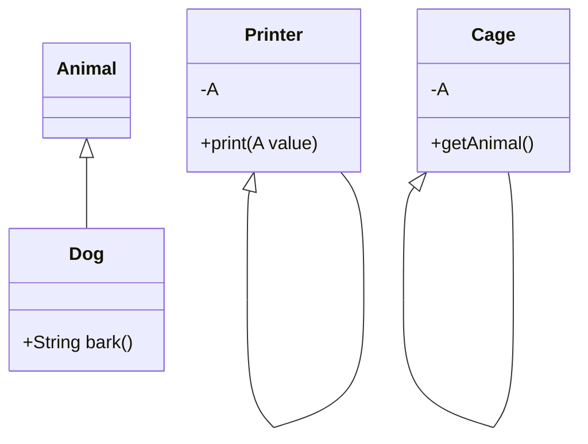

## 3.2 Type System Features

Scala's type system is one of its most powerful features, offering a rich set of tools for developers to create robust, expressive, and safe code. In this section, we will delve into some of the key type system features in Scala: variance, generics, implicits, and type classes. These features not only enhance code reusability but also enable the implementation of sophisticated design patterns.

### Variance: Covariance and Contravariance

Variance is a concept that describes how subtyping between more complex types relates to subtyping between their components. In Scala, variance is expressed using annotations on type parameters: `+` for covariance, `-` for contravariance, and no annotation for invariance.

#### Covariance

Covariance allows a type to vary in the same direction as its type parameter. If `B` is a subtype of `A`, then `List[B]` is a subtype of `List[A]`. This is useful when you want to ensure that a collection of a subtype can be used where a collection of a supertype is expected.

```scala
class Animal
class Dog extends Animal

val dogs: List[Dog] = List(new Dog)
val animals: List[Animal] = dogs // Covariance allows this
```

#### Contravariance

Contravariance allows a type to vary in the opposite direction of its type parameter. If `B` is a subtype of `A`, then `Printer[A]` is a subtype of `Printer[B]`. This is useful in scenarios like event handlers or callbacks, where you want to accept a broader range of inputs.

```scala
class Printer[-A] {
  def print(value: A): Unit = println(value)
}

val animalPrinter: Printer[Animal] = new Printer[Animal]
val dogPrinter: Printer[Dog] = animalPrinter // Contravariance allows this
```

#### Invariance

Invariance means that a type cannot vary with its type parameter. If `B` is a subtype of `A`, `Container[B]` is neither a subtype nor a supertype of `Container[A]`.

```scala
class Container[A](value: A) {
  def get: A = value
}

val animalContainer: Container[Animal] = new Container(new Animal)
val dogContainer: Container[Dog] = new Container(new Dog)
// val invalid: Container[Animal] = dogContainer // Invariance disallows this
```

### Generics and Type Bounds

Generics in Scala allow you to write flexible and reusable code components. Type bounds further refine this flexibility by constraining the types that can be used as type parameters.

#### Upper Bounds

Upper bounds restrict a type parameter to be a subtype of a specified type. This is useful when you want to ensure that a type parameter has certain methods or properties.

```scala
class Cage[A <: Animal](animal: A) {
  def getAnimal: A = animal
}

val dogCage = new Cage(new Dog) // Allowed because Dog <: Animal
// val stringCage = new Cage("Not an animal") // Compilation error
```

#### Lower Bounds

Lower bounds specify that a type parameter must be a supertype of a given type. This is useful when you want to ensure that a type can accept a broader range of inputs.

```scala
def addToList[T >: Dog](list: List[T], dog: Dog): List[T] = dog :: list

val animals: List[Animal] = List(new Animal)
val moreAnimals = addToList(animals, new Dog) // Allowed because Animal >: Dog
```

### Implicits and Implicit Conversions

Implicits in Scala provide a way to define default values or conversions that the compiler can automatically apply. This feature is powerful for reducing boilerplate code and enabling more expressive APIs.

#### Implicit Parameters

Implicit parameters allow you to define methods that require certain values to be in scope without explicitly passing them every time.

```scala
def greet(implicit name: String): String = s"Hello, $name!"

implicit val defaultName: String = "Scala Developer"
println(greet) // "Hello, Scala Developer!"
```

#### Implicit Conversions

Implicit conversions allow you to automatically convert one type to another. This can be useful for integrating with APIs that expect a different type or for extending existing libraries.

```scala
implicit def intToString(x: Int): String = x.toString

val number: String = 42 // Implicit conversion from Int to String
```

### Type Classes and Ad-Hoc Polymorphism

Type classes in Scala provide a way to achieve ad-hoc polymorphism, allowing you to define behavior that can be applied to different types without modifying their definitions.

#### Defining a Type Class

A type class is defined as a trait with one or more methods. Instances of the type class are provided for specific types.

```scala
trait Show[A] {
  def show(a: A): String
}

implicit object IntShow extends Show[Int] {
  def show(a: Int): String = a.toString
}

implicit object StringShow extends Show[String] {
  def show(a: String): String = a
}
```

#### Using Type Classes

You can use type classes to write generic functions that work with any type for which an instance of the type class is available.

```scala
def printShow[A](a: A)(implicit showInstance: Show[A]): Unit = {
  println(showInstance.show(a))
}

printShow(123) // Uses IntShow
printShow("Hello") // Uses StringShow
```

### Visualizing Variance and Type Bounds

To better understand how variance and type bounds work, let's visualize these concepts using a class diagram.



This diagram illustrates the relationships between `Animal`, `Dog`, `Printer`, and `Cage` classes, showing how variance and type bounds can be applied.

### Try It Yourself

Experiment with the following code examples to deepen your understanding:

1. Modify the `Printer` class to handle a new type hierarchy.
2. Create a new type class for a different behavior and provide instances for various types.
3. Implement a generic method with both upper and lower type bounds.

### Knowledge Check

- Explain the difference between covariance and contravariance.
- Provide an example of when you would use an upper type bound.
- How do implicits enhance the expressiveness of Scala code?
- What are the benefits of using type classes over traditional inheritance?

### Embrace the Journey

Remember, mastering Scala's type system is a journey. As you continue to explore these features, you'll find new ways to write more expressive and robust code. Keep experimenting, stay curious, and enjoy the journey!

## Quiz Time!



### What is covariance in Scala?

- [x] Allows a type to vary in the same direction as its type parameter.
- [ ] Allows a type to vary in the opposite direction as its type parameter.
- [ ] Means a type cannot vary with its type parameter.
- [ ] Restricts a type parameter to be a subtype of a specified type.

> **Explanation:** Covariance allows a type to vary in the same direction as its type parameter, meaning if `B` is a subtype of `A`, then `List[B]` is a subtype of `List[A]`.

### What does an upper type bound do in Scala?

- [x] Restricts a type parameter to be a subtype of a specified type.
- [ ] Restricts a type parameter to be a supertype of a specified type.
- [ ] Allows a type to vary in the opposite direction of its type parameter.
- [ ] Means a type cannot vary with its type parameter.

> **Explanation:** An upper type bound restricts a type parameter to be a subtype of a specified type, ensuring that the type parameter has certain methods or properties.

### How do implicit parameters work in Scala?

- [x] They allow methods to require certain values to be in scope without explicitly passing them.
- [ ] They automatically convert one type to another.
- [ ] They define behavior that can be applied to different types without modifying their definitions.
- [ ] They restrict a type parameter to be a supertype of a given type.

> **Explanation:** Implicit parameters allow methods to require certain values to be in scope without explicitly passing them every time, enhancing code expressiveness.

### What is the purpose of type classes in Scala?

- [x] To achieve ad-hoc polymorphism by defining behavior that can be applied to different types.
- [ ] To restrict a type parameter to be a subtype of a specified type.
- [ ] To allow a type to vary in the same direction as its type parameter.
- [ ] To automatically convert one type to another.

> **Explanation:** Type classes in Scala provide a way to achieve ad-hoc polymorphism, allowing you to define behavior that can be applied to different types without modifying their definitions.

### What is contravariance in Scala?

- [x] Allows a type to vary in the opposite direction of its type parameter.
- [ ] Allows a type to vary in the same direction as its type parameter.
- [ ] Means a type cannot vary with its type parameter.
- [ ] Restricts a type parameter to be a subtype of a specified type.

> **Explanation:** Contravariance allows a type to vary in the opposite direction of its type parameter, meaning if `B` is a subtype of `A`, then `Printer[A]` is a subtype of `Printer[B]`.

### What is the role of implicit conversions in Scala?

- [x] To automatically convert one type to another.
- [ ] To define behavior that can be applied to different types without modifying their definitions.
- [ ] To restrict a type parameter to be a supertype of a given type.
- [ ] To allow methods to require certain values to be in scope without explicitly passing them.

> **Explanation:** Implicit conversions allow you to automatically convert one type to another, which can be useful for integrating with APIs that expect a different type or for extending existing libraries.

### How do lower bounds work in Scala?

- [x] They specify that a type parameter must be a supertype of a given type.
- [ ] They restrict a type parameter to be a subtype of a specified type.
- [ ] They allow a type to vary in the same direction as its type parameter.
- [ ] They mean a type cannot vary with its type parameter.

> **Explanation:** Lower bounds specify that a type parameter must be a supertype of a given type, ensuring that a type can accept a broader range of inputs.

### What is invariance in Scala?

- [x] Means a type cannot vary with its type parameter.
- [ ] Allows a type to vary in the same direction as its type parameter.
- [ ] Allows a type to vary in the opposite direction of its type parameter.
- [ ] Restricts a type parameter to be a subtype of a specified type.

> **Explanation:** Invariance means that a type cannot vary with its type parameter, meaning `Container[B]` is neither a subtype nor a supertype of `Container[A]`.

### What is the benefit of using type bounds in Scala?

- [x] They provide constraints on type parameters, ensuring type safety and flexibility.
- [ ] They allow a type to vary in the same direction as its type parameter.
- [ ] They automatically convert one type to another.
- [ ] They define behavior that can be applied to different types without modifying their definitions.

> **Explanation:** Type bounds provide constraints on type parameters, ensuring type safety and flexibility by allowing you to specify upper and lower bounds.

### True or False: Implicits in Scala can be used to reduce boilerplate code.

- [x] True
- [ ] False

> **Explanation:** True. Implicits in Scala provide a way to define default values or conversions that the compiler can automatically apply, reducing boilerplate code and enabling more expressive APIs.


