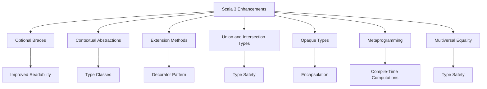

## 3.20 Scala 3 Enhancements and Their Impact on Design Patterns

Scala 3, also known as Dotty, introduces a suite of new features and enhancements that significantly influence the way design patterns are implemented in Scala. These enhancements not only improve code clarity and maintainability but also provide more powerful tools for type safety and metaprogramming. In this section, we will delve into these new features, explore their impact on design patterns, and provide guidance for expert developers looking to leverage Scala 3 in their projects.

### Overview of Scala 3 New Features

#### Introduction to Scala 3 (Dotty)

Scala 3, often referred to as Dotty during its development phase, represents a major evolution of the Scala language. It brings a host of new features aimed at simplifying the language, improving type safety, and enhancing developer productivity. The transition from Scala 2 to Scala 3 is designed to be as smooth as possible, with a focus on backward compatibility and gradual migration paths.

#### Compatibility with Scala 2.x

Scala 3 maintains a high degree of compatibility with Scala 2.x, allowing developers to migrate their codebases incrementally. The Scala 3 compiler can compile Scala 2 code, and tools like `scala-3-migrate` assist in the migration process by automatically updating code to use Scala 3 syntax and features where applicable.

### New Syntax Enhancements

#### Optional Braces and Indentation-Based Syntax

Scala 3 introduces a more concise syntax by allowing optional braces and supporting indentation-based syntax, similar to Python. This change simplifies the code structure and makes it more readable, especially in large codebases.

```scala
// Scala 2 style with braces
def greet(name: String): Unit = {
  println(s"Hello, $name!")
}

// Scala 3 style with indentation
def greet(name: String): Unit =
  println(s"Hello, $name!")
```

This syntax enhancement encourages cleaner code and reduces visual clutter, making it easier to follow the logic of complex design patterns.

### Contextual Abstractions

#### Replacing Implicits with `given`/`using` Clauses

One of the most significant changes in Scala 3 is the replacement of implicits with `given`/`using` clauses. This change addresses the complexity and opacity often associated with implicits in Scala 2, providing a more explicit and understandable mechanism for dependency injection and type class instances.

```scala
trait Show[T]:
  def show(value: T): String

given Show[Int] with
  def show(value: Int): String = value.toString

def printValue[T](value: T)(using showInstance: Show[T]): Unit =
  println(showInstance.show(value))

printValue(42) // Output: 42
```

#### Implementing Type Classes with Given Instances

The `given`/`using` syntax simplifies the implementation of type classes, making it easier to define and use them in a clear and concise manner. This improvement enhances the expressiveness of design patterns that rely on type classes, such as the Strategy pattern.

#### Improving Code Clarity with Contextual Functions

Contextual functions in Scala 3 allow for cleaner and more readable code by explicitly specifying the context in which a function operates. This feature is particularly useful in functional design patterns, where context management is crucial.

### Extension Methods

#### Adding Methods to Existing Types Without Implicits

Scala 3 introduces extension methods, which allow developers to add new methods to existing types without using implicits. This feature simplifies the implementation of the Decorator pattern by enabling the addition of functionality to objects in a straightforward manner.

```scala
extension (s: String)
  def greet: String = s"Hello, $s!"

val name = "World"
println(name.greet) // Output: Hello, World!
```

### Union and Intersection Types

#### Enhancing Type Safety and Expressiveness

Union and intersection types in Scala 3 provide a powerful way to express complex type relationships. Union types allow a value to be one of several types, while intersection types require a value to satisfy multiple type constraints.

```scala
def process(input: Int | String): String = input match
  case i: Int    => s"Number: $i"
  case s: String => s"Text: $s"

println(process(42))        // Output: Number: 42
println(process("Scala"))   // Output: Text: Scala
```

#### Applications in Algebraic Data Types and Pattern Matching

These types enhance the expressiveness of algebraic data types and pattern matching, making it easier to implement patterns like the Visitor pattern, where different types of elements need to be processed uniformly.

### Opaque Types

#### Hiding Implementation Details While Exposing Type Interfaces

Opaque types in Scala 3 allow developers to define types that hide their implementation details while exposing a specific interface. This feature is useful for enforcing invariants and encapsulation, which are key principles in many design patterns.

```scala
opaque type UserId = Int

object UserId:
  def apply(id: Int): UserId = id

def showUserId(id: UserId): String = s"User ID: $id"

val id: UserId = UserId(123)
println(showUserId(id)) // Output: User ID: 123
```

### Metaprogramming in Scala 3

#### Inline Methods for Compile-Time Computations

Scala 3 introduces inline methods, which allow computations to be performed at compile time. This feature can optimize performance by eliminating runtime overhead for certain operations.

```scala
inline def power(x: Double, n: Int): Double =
  if n == 0 then 1.0
  else x * power(x, n - 1)

val result = power(2.0, 3) // Computed at compile time
```

#### Macros and Compile-Time Reflection

Scala 3 provides a safer and more powerful metaprogramming capability with its new macro system and compile-time reflection. These features enable developers to generate code at compile time, ensuring type safety and reducing runtime errors.

#### Safer and More Powerful Metaprogramming Capabilities

The new metaprogramming features in Scala 3 allow for more robust and maintainable code generation, which can be leveraged in design patterns that require dynamic behavior or code transformation.

### Multiversal Equality

#### Controlling Equality Comparisons Between Types

Scala 3 introduces multiversal equality, which allows developers to control equality comparisons between types. This feature prevents unintended equality checks and enhances type safety.

```scala
import scala.language.strictEquality

given CanEqual[Int, String] = CanEqual.derived

val isEqual = (42 == "42") // Compilation error without given instance
```

### Impact on Existing Design Patterns

#### Refactoring Patterns Using New Features

The enhancements in Scala 3 provide opportunities to refactor existing design patterns, making them more concise, expressive, and type-safe. For example, the Strategy pattern can be implemented using contextual abstractions, while the Decorator pattern benefits from extension methods.

### Best Practices for Migrating to Scala 3

#### Strategies and Tools for Migration

Migrating to Scala 3 requires careful planning and execution. Developers should leverage tools like `scala-3-migrate` to automate parts of the migration process and ensure compatibility with existing Scala 2 code. It's important to test thoroughly and refactor code incrementally to take full advantage of Scala 3's new features.

### Case Studies and Examples

#### Real-World Applications of Scala 3 Enhancements

To illustrate the impact of Scala 3 on design patterns, let's explore a few case studies that demonstrate the practical application of these enhancements in real-world scenarios.

**Case Study 1: Implementing a Plugin System with Extension Methods**

In this case study, we will implement a plugin system using Scala 3's extension methods. The goal is to allow developers to add new functionality to an existing application without modifying its core codebase.

```scala
trait Plugin:
  def execute(): Unit

extension (plugin: Plugin)
  def logExecution(): Unit =
    println(s"Executing plugin: ${plugin.getClass.getSimpleName}")
    plugin.execute()

class SamplePlugin extends Plugin:
  def execute(): Unit = println("Sample plugin executed")

val plugin = new SamplePlugin()
plugin.logExecution() // Output: Executing plugin: SamplePlugin
                      //         Sample plugin executed
```

**Case Study 2: Enhancing a DSL with Union Types**

In this case study, we will enhance a domain-specific language (DSL) using Scala 3's union types. The DSL will allow users to define and execute mathematical operations with different types of inputs.

```scala
sealed trait Expr
case class Number(value: Int) extends Expr
case class Add(left: Expr, right: Expr) extends Expr
case class Subtract(left: Expr, right: Expr) extends Expr

def evaluate(expr: Expr): Int = expr match
  case Number(value) => value
  case Add(left, right) => evaluate(left) + evaluate(right)
  case Subtract(left, right) => evaluate(left) - evaluate(right)

val expr = Add(Number(5), Subtract(Number(10), Number(3)))
println(evaluate(expr)) // Output: 12
```

### Try It Yourself

Now that we've explored the new features of Scala 3 and their impact on design patterns, it's time to experiment with these concepts. Try modifying the code examples provided to see how different features interact and enhance your understanding of Scala 3.

### Visualizing Scala 3 Enhancements

To better understand the relationships and interactions between Scala 3 enhancements, let's visualize some of these concepts using Mermaid.js diagrams.



### Knowledge Check

Before moving on, let's reinforce what we've learned with a few questions:

- How do Scala 3's `given`/`using` clauses improve code clarity compared to Scala 2's implicits?
- What are the benefits of using extension methods in Scala 3?
- How do union types enhance type safety and expressiveness in Scala 3?

### Embrace the Journey

Remember, this is just the beginning. As you continue to explore Scala 3, you'll discover even more ways to leverage its powerful features to create robust and maintainable software. Keep experimenting, stay curious, and enjoy the journey!

## Quiz Time!



### What is one of the main goals of Scala 3's new syntax enhancements?

- [x] To improve code readability and reduce visual clutter
- [ ] To make Scala more like Java
- [ ] To eliminate all use of braces
- [ ] To enforce strict indentation rules

> **Explanation:** Scala 3's syntax enhancements aim to improve code readability by allowing optional braces and supporting indentation-based syntax, reducing visual clutter.

### How do `given`/`using` clauses in Scala 3 differ from implicits in Scala 2?

- [x] They provide a more explicit and understandable mechanism for dependency injection
- [ ] They eliminate the need for type classes
- [ ] They are only used for logging purposes
- [ ] They are a replacement for all function parameters

> **Explanation:** `given`/`using` clauses in Scala 3 replace implicits, providing a clearer and more explicit way to handle dependency injection and type class instances.

### What is the purpose of extension methods in Scala 3?

- [x] To add methods to existing types without using implicits
- [ ] To remove methods from existing types
- [ ] To enforce type safety
- [ ] To replace all existing methods

> **Explanation:** Extension methods in Scala 3 allow developers to add new methods to existing types without using implicits, simplifying the implementation of patterns like the Decorator pattern.

### What do union types in Scala 3 allow you to do?

- [x] Express that a value can be one of several types
- [ ] Combine multiple values into one
- [ ] Ensure a value is of a single type
- [ ] Remove type constraints

> **Explanation:** Union types in Scala 3 allow a value to be one of several types, enhancing type safety and expressiveness.

### How do opaque types in Scala 3 help with encapsulation?

- [x] By hiding implementation details while exposing a specific interface
- [ ] By making all types public
- [ ] By removing type interfaces
- [ ] By enforcing strict type hierarchies

> **Explanation:** Opaque types in Scala 3 hide implementation details while exposing a specific interface, helping to enforce invariants and encapsulation.

### What is a key benefit of inline methods in Scala 3?

- [x] They allow computations to be performed at compile time
- [ ] They eliminate the need for functions
- [ ] They are only used for debugging
- [ ] They replace all existing methods

> **Explanation:** Inline methods in Scala 3 allow certain computations to be performed at compile time, optimizing performance by reducing runtime overhead.

### How does multiversal equality in Scala 3 enhance type safety?

- [x] By controlling equality comparisons between types
- [ ] By allowing all types to be equal
- [ ] By removing equality checks
- [ ] By enforcing strict type hierarchies

> **Explanation:** Multiversal equality in Scala 3 allows developers to control equality comparisons between types, preventing unintended equality checks and enhancing type safety.

### What is a recommended strategy for migrating to Scala 3?

- [x] Use tools like `scala-3-migrate` to automate parts of the migration process
- [ ] Rewrite the entire codebase from scratch
- [ ] Ignore compatibility issues
- [ ] Only migrate new projects

> **Explanation:** Using tools like `scala-3-migrate` helps automate parts of the migration process, ensuring compatibility with existing Scala 2 code and facilitating a smooth transition.

### True or False: Scala 3's enhancements make it impossible to use Scala 2 code.

- [ ] True
- [x] False

> **Explanation:** Scala 3 maintains a high degree of compatibility with Scala 2, allowing developers to use Scala 2 code and migrate incrementally.

### Which feature in Scala 3 simplifies the implementation of the Decorator pattern?

- [x] Extension methods
- [ ] Union types
- [ ] Opaque types
- [ ] Inline methods

> **Explanation:** Extension methods in Scala 3 allow developers to add functionality to existing types, simplifying the implementation of the Decorator pattern.


