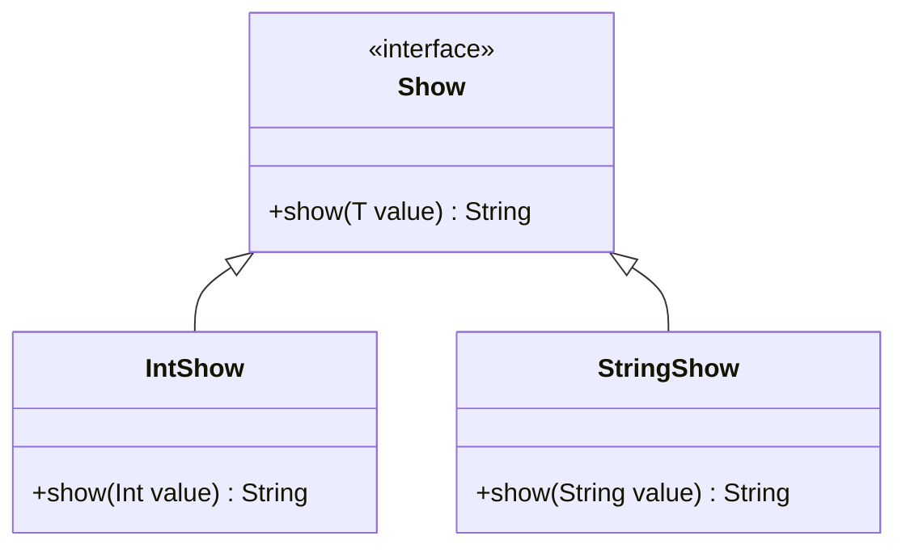

## 3.21 Effective Type-Level Programming

Type-level programming in Scala allows us to leverage the language's powerful type system to enforce constraints, enhance safety, and express complex logic at compile time. This section delves into the nuances of type-level programming, exploring when to use it, the techniques and tools available, common patterns, pitfalls to avoid, and practical applications.

### Understanding When to Use Type-Level Programming

Type-level programming is a powerful tool, but it comes with its own set of complexities. Understanding when to use it is crucial for balancing the benefits against the potential increase in code complexity.

#### Balancing Complexity and Benefits

- **Benefits**: Type-level programming can significantly enhance type safety, prevent runtime errors, and express complex invariants directly in the type system. It allows for more expressive APIs and can lead to more maintainable code by catching errors early in the development process.
  
- **Complexity**: The downside is that it can make code more difficult to understand, especially for those not familiar with advanced type system features. It can also lead to more complex error messages, which can be challenging to decipher.

**Key Consideration**: Use type-level programming when the benefits of enhanced safety and expressiveness outweigh the added complexity. For instance, when designing libraries or APIs that require strict correctness guarantees, type-level programming is invaluable.

### Techniques and Tools

Scala provides several tools and techniques for effective type-level programming. Let's explore some of the most powerful ones.

#### Leveraging Shapeless for Generic Programming

[Shapeless](https://github.com/milessabin/shapeless) is a library that provides generic programming capabilities in Scala. It allows us to write code that can operate on a wide variety of types without sacrificing type safety.

**Key Features of Shapeless**:

- **Heterogeneous Lists (HLists)**: These are lists that can hold elements of different types, providing a way to work with tuples generically.
  
- **Generic Representation**: Shapeless can convert case classes to a generic representation and back, enabling operations on arbitrary case classes.

- **Type-Level Computation**: Shapeless supports type-level computation, allowing us to perform operations based on types at compile time.

**Example: Using HLists**

```scala
import shapeless._

val hlist = 42 :: "Hello" :: true :: HNil

// Accessing elements
val number: Int = hlist.head
val string: String = hlist.tail.head
```

**Try It Yourself**: Modify the `hlist` to include a `Double` and access it using the appropriate method.

#### Using Type Classes for Ad-Hoc Polymorphism

Type classes in Scala provide a way to achieve ad-hoc polymorphism, allowing us to define behavior that can be applied to different types without modifying them.

**Defining a Type Class**

```scala
trait Show[T] {
  def show(value: T): String
}

object Show {
  def apply[T](implicit instance: Show[T]): Show[T] = instance

  implicit val intShow: Show[Int] = (value: Int) => value.toString
  implicit val stringShow: Show[String] = (value: String) => value
}

def printShow[T: Show](value: T): Unit = {
  println(Show[T].show(value))
}

printShow(42)       // Output: 42
printShow("Scala")  // Output: Scala
```

**Try It Yourself**: Implement a `Show` instance for `Boolean` and test it using `printShow`.

### Common Patterns

Type-level programming introduces several patterns that can enhance type safety and expressiveness.

#### Phantom Types for Type Safety

Phantom types are types that carry additional compile-time information but have no runtime representation. They are useful for enforcing constraints without affecting runtime performance.

**Example: Phantom Types for Units**

```scala
trait Meter
trait Second

case class Quantity[T](value: Double)

def speed(distance: Quantity[Meter], time: Quantity[Second]): Quantity[Meter] = {
  Quantity(distance.value / time.value)
}

val distance = Quantity[Meter](100)
val time = Quantity[Second](10)

val velocity = speed(distance, time) // Correct usage
```

**Try It Yourself**: Attempt to pass a `Quantity[Second]` as the first argument to `speed` and observe the compile-time error.

#### Type Tagging and Newtypes

Type tagging and newtypes are techniques for creating distinct types that are represented by the same underlying type at runtime. They help prevent mixing up types that are semantically different but structurally similar.

**Example: Type Tagging**

```scala
import shapeless.tag
import shapeless.tag.@@

trait UserId
trait OrderId

type UserIdType = String @@ UserId
type OrderIdType = String @@ OrderId

def createUser(id: UserIdType): Unit = {
  println(s"Creating user with ID: $id")
}

val userId: UserIdType = tag[UserId][String]("user123")
val orderId: OrderIdType = tag[OrderId][String]("order123")

createUser(userId) // Correct usage
```

**Try It Yourself**: Try passing `orderId` to `createUser` and observe the compile-time error.

### Avoiding Pitfalls

While type-level programming offers many benefits, it also comes with potential pitfalls. Here are some tips to avoid common issues.

#### Keeping Error Messages Comprehensible

Type-level programming can lead to complex error messages. To mitigate this, consider the following:

- **Simplify Type Signatures**: Break down complex type signatures into smaller, more manageable pieces.
  
- **Use Type Aliases**: Define type aliases for complex types to make signatures more readable.

#### Documenting Complex Type-Level Logic

Documentation is crucial when working with advanced type-level constructs. Ensure that you:

- **Document Type Classes and Instances**: Clearly explain the purpose and usage of each type class and its instances.
  
- **Provide Examples**: Include examples of how to use complex type-level constructs in practice.

### Practical Applications

Type-level programming has several practical applications that can enhance the robustness and expressiveness of your code.

#### Enforcing Compile-Time Constraints

By leveraging the type system, we can enforce constraints that would otherwise require runtime checks.

**Example: Enforcing Non-Empty Lists**

```scala
sealed trait NonEmptyList[+A]
case class Cons[A](head: A, tail: List[A]) extends NonEmptyList[A]

object NonEmptyList {
  def apply[A](head: A, tail: A*): NonEmptyList[A] = Cons(head, tail.toList)
}

val nel = NonEmptyList(1, 2, 3) // Correct usage
```

**Try It Yourself**: Attempt to create an empty `NonEmptyList` and observe the compile-time error.

#### Enhancing APIs with Richer Types

Type-level programming allows us to create APIs that are more expressive and less error-prone.

**Example: Using Type Classes for Serialization**

```scala
trait JsonSerializer[T] {
  def serialize(value: T): String
}

object JsonSerializer {
  def apply[T](implicit instance: JsonSerializer[T]): JsonSerializer[T] = instance

  implicit val intSerializer: JsonSerializer[Int] = (value: Int) => s"""{"value": $value}"""
  implicit val stringSerializer: JsonSerializer[String] = (value: String) => s"""{"value": "$value"}"""
}

def toJson[T: JsonSerializer](value: T): String = {
  JsonSerializer[T].serialize(value)
}

println(toJson(42))       // Output: {"value": 42}
println(toJson("Scala"))  // Output: {"value": "Scala"}
```

**Try It Yourself**: Implement a `JsonSerializer` instance for `Boolean` and test it using `toJson`.

### Visualizing Type-Level Programming

To better understand the relationships and flow in type-level programming, let's visualize some concepts using Mermaid.js diagrams.

#### Type Class Relationships



**Description**: This diagram illustrates the relationship between the `Show` type class and its instances `IntShow` and `StringShow`.

### Knowledge Check

Let's reinforce our understanding with some questions and exercises.

1. **Question**: What are the benefits of using phantom types?
   - **Answer**: Phantom types provide compile-time safety without runtime overhead by enforcing constraints through the type system.

2. **Exercise**: Implement a phantom type for a `Kilogram` and use it to enforce type safety in a function that calculates mass.

### Embrace the Journey

Remember, type-level programming is a journey. As you explore these concepts, you'll discover new ways to leverage Scala's type system to write safer, more expressive code. Keep experimenting, stay curious, and enjoy the journey!

### Quiz Time!



### What is a key benefit of type-level programming?

- [x] Enhanced type safety
- [ ] Reduced code complexity
- [ ] Increased runtime performance
- [ ] Simplified error messages

> **Explanation:** Type-level programming enhances type safety by allowing constraints to be enforced at compile time.

### Which library is commonly used for generic programming in Scala?

- [x] Shapeless
- [ ] Cats
- [ ] Akka
- [ ] Play Framework

> **Explanation:** Shapeless is a library that provides generic programming capabilities in Scala.

### What is a phantom type?

- [x] A type with no runtime representation
- [ ] A type that can only be used in pattern matching
- [ ] A type that is automatically inferred by the compiler
- [ ] A type that is used for serialization

> **Explanation:** Phantom types carry compile-time information but have no runtime representation.

### How can you simplify complex type signatures?

- [x] Use type aliases
- [ ] Use more implicits
- [ ] Avoid type classes
- [ ] Use reflection

> **Explanation:** Type aliases can make complex type signatures more readable.

### What is the purpose of a type class?

- [x] To define behavior that can be applied to different types
- [ ] To enforce runtime constraints
- [ ] To simplify error messages
- [ ] To reduce code duplication

> **Explanation:** Type classes allow for ad-hoc polymorphism by defining behavior that can be applied to different types.

### Which of the following is NOT a feature of Shapeless?

- [ ] Heterogeneous Lists
- [ ] Generic Representation
- [ ] Type-Level Computation
- [x] Asynchronous Programming

> **Explanation:** Shapeless is focused on generic programming and type-level computation, not asynchronous programming.

### What is a common pitfall of type-level programming?

- [x] Complex error messages
- [ ] Reduced type safety
- [ ] Increased runtime errors
- [ ] Simplified code maintenance

> **Explanation:** Type-level programming can lead to complex error messages that are difficult to understand.

### How can you document complex type-level logic?

- [x] Provide examples and explanations
- [ ] Use more implicits
- [ ] Avoid using type classes
- [ ] Rely on compiler warnings

> **Explanation:** Documentation, including examples and explanations, is crucial for understanding complex type-level logic.

### What is the role of a JsonSerializer type class?

- [x] To serialize values to JSON
- [ ] To enforce runtime constraints
- [ ] To simplify error messages
- [ ] To reduce code duplication

> **Explanation:** The JsonSerializer type class defines behavior for serializing values to JSON.

### True or False: Type-level programming can prevent runtime errors by enforcing constraints at compile time.

- [x] True
- [ ] False

> **Explanation:** Type-level programming allows constraints to be enforced at compile time, preventing certain types of runtime errors.


