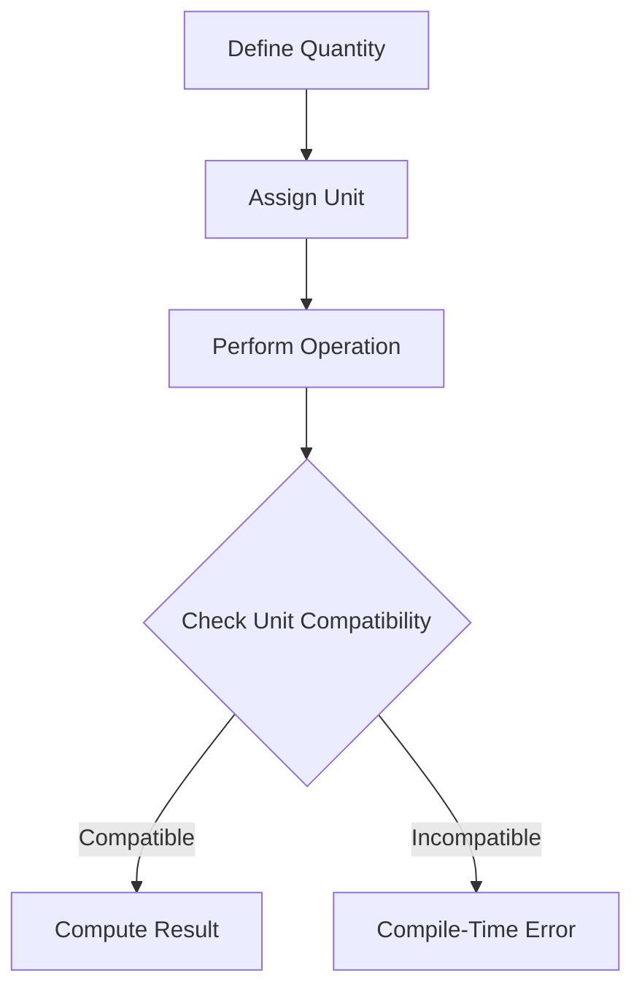

## 3.3 Units of Measure

In the world of software engineering, precision and safety are paramount, especially when dealing with numeric computations. Scala, with its robust type system, provides a fertile ground for enhancing type safety through the use of units of measure. This section delves into how we can leverage Scala's features and libraries like *Squants* to add compile-time safety to numeric types and prevent unit mismatch errors.

### Understanding Units of Measure

Units of measure are an essential concept in both mathematics and science, representing quantities with specific dimensions such as length, mass, time, etc. In programming, incorporating units of measure can prevent errors that arise from unit mismatches, such as adding meters to seconds, which are logically incorrect operations.

#### Why Units of Measure Matter

- **Compile-Time Safety**: By enforcing units at compile time, we can catch errors early in the development process, reducing runtime errors and improving code reliability.
- **Code Clarity**: Units of measure make code more readable and self-documenting, as the units are explicitly defined and enforced.
- **Preventing Logical Errors**: Units help prevent logical errors in calculations, ensuring that operations are dimensionally consistent.

### Introducing Squants

*Squants* is a Scala library designed to provide compile-time safety for units of measure. It offers a comprehensive set of predefined units and allows for easy extension to custom units.

#### Key Features of Squants

- **Predefined Units**: Squants includes a wide variety of units across different dimensions such as length, mass, time, temperature, and more.
- **Type Safety**: Operations between quantities with different units are type-checked, preventing invalid operations.
- **Extensibility**: Users can define their own units and dimensions if the predefined ones do not meet their needs.

### Getting Started with Squants

To use Squants in your Scala project, you need to add it as a dependency. Here's how you can do it using SBT:

```scala
libraryDependencies += "org.typelevel" %% "squants" % "1.8.3"
```

Once added, you can start using Squants to work with units of measure.

#### Basic Usage

Let's explore some basic operations using Squants:

```scala
import squants.space.Meters
import squants.time.Seconds
import squants.motion.Velocity

val distance = Meters(100)
val time = Seconds(9.58)
val speed = distance / time

println(s"Speed: $speed") // Speed: 10.438413361169102 m/s
```

In this example, we define a distance in meters and a time in seconds, then calculate the speed as a velocity. Squants ensures that the units are consistent and the resulting speed is expressed in meters per second.

### Preventing Unit Mismatch Errors

One of the primary advantages of using Squants is its ability to prevent unit mismatch errors. Let's see how it handles such scenarios:

```scala
import squants.space.Meters
import squants.time.Seconds
import squants.mass.Kilograms

val distance = Meters(100)
val weight = Kilograms(70)

// This will not compile because you cannot add meters to kilograms
// val invalidOperation = distance + weight
```

The above code will result in a compile-time error, as Squants prevents the addition of incompatible units, thus safeguarding against logical errors.

### Extending Squants with Custom Units

While Squants provides a rich set of predefined units, there might be cases where you need custom units. Let's create a custom unit for a fictional dimension called "Foo":

```scala
import squants._

case class Foos(value: Double) extends Quantity[Foos] {
  def dimension = Foos
}

object Foos extends Dimension[Foos] {
  private[units] def apply[A](n: A, unit: UnitOfMeasure[Foos])(implicit num: Numeric[A]) = new Foos(num.toDouble(n) * unit.multiplier)
  def name = "Foos"
  def primaryUnit = Foo
  def siUnit = Foo
  def units = Set(Foo)
}

object Foo extends UnitOfMeasure[Foos] {
  def apply[A](n: A)(implicit num: Numeric[A]) = Foos(n, this)
  val symbol = "foo"
}
```

In this example, we define a new dimension `Foos` and a unit `Foo`. This allows us to use the new unit in computations just like the predefined ones.

### Visualizing Unit Operations

To better understand how units interact, let's visualize the operations using a flowchart:



**Figure 1**: Flowchart illustrating the process of defining and operating on quantities with units in Squants.

### Advanced Usage and Patterns

#### Composite Units

Squants allows for the creation of composite units, which are combinations of multiple units. For example, you can define a unit for acceleration:

```scala
import squants.motion.Acceleration
import squants.space.Meters
import squants.time.Seconds

val acceleration = Meters(9.8) / (Seconds(1) * Seconds(1))
println(s"Acceleration: $acceleration") // Acceleration: 9.8 m/s²
```

#### Dimensional Analysis

Dimensional analysis is a technique used to check the consistency of equations involving physical quantities. Squants inherently supports dimensional analysis by ensuring that operations between quantities are dimensionally consistent.

### Design Considerations

When using units of measure in Scala, consider the following:

- **Performance**: While units of measure provide safety, they can introduce overhead. Consider the performance implications in performance-critical applications.
- **Complexity**: Introducing units can add complexity to the codebase. Ensure that the benefits outweigh the added complexity.
- **Interoperability**: Ensure that your use of units is compatible with other systems and libraries, especially when interfacing with external APIs or databases.

### Differences and Similarities with Other Patterns

Units of measure are often compared to other type safety patterns, such as type classes and phantom types. While they share the goal of enhancing type safety, units of measure are specifically tailored for numeric computations and dimensional analysis.

### Try It Yourself

To get hands-on experience, try modifying the code examples provided:

- **Experiment with Custom Units**: Define your own units and perform operations with them.
- **Combine Units**: Create composite units and explore their behavior in computations.
- **Test Edge Cases**: Try operations that should fail due to unit mismatches and observe the compile-time errors.

### Knowledge Check

- **Question**: What is the primary advantage of using units of measure in Scala?
- **Exercise**: Define a custom unit for "Widgets" and perform operations with it.

### Embrace the Journey

Remember, mastering units of measure in Scala is a journey. As you progress, you'll find new ways to leverage this powerful feature to enhance the safety and clarity of your code. Keep experimenting, stay curious, and enjoy the journey!

### References and Links

- [Squants GitHub Repository](https://github.com/typelevel/squants)
- [Scala Documentation](https://docs.scala-lang.org/)
- [Wikipedia on Units of Measure](https://en.wikipedia.org/wiki/Unit_of_measurement)

## Quiz Time!



### What is the primary benefit of using units of measure in Scala?

- [x] Compile-time safety for numeric computations
- [ ] Improved runtime performance
- [ ] Easier debugging
- [ ] Simplified syntax

> **Explanation:** Units of measure provide compile-time safety, ensuring that numeric computations are dimensionally consistent and preventing logical errors.

### Which library is commonly used in Scala for units of measure?

- [x] Squants
- [ ] Cats
- [ ] Scalaz
- [ ] Monix

> **Explanation:** Squants is a popular library in Scala for handling units of measure, providing a wide range of predefined units and extensibility for custom units.

### What happens if you try to add incompatible units using Squants?

- [x] Compile-time error
- [ ] Runtime exception
- [ ] Silent failure
- [ ] Automatic conversion

> **Explanation:** Squants ensures that operations between incompatible units result in a compile-time error, preventing logical errors in the code.

### How can you define a custom unit in Squants?

- [x] By creating a new `Dimension` and `UnitOfMeasure`
- [ ] By extending an existing unit
- [ ] By using a type alias
- [ ] By modifying the library source

> **Explanation:** To define a custom unit in Squants, you need to create a new `Dimension` and `UnitOfMeasure`, allowing for the creation and manipulation of quantities with the new unit.

### Which of the following is a composite unit?

- [x] Meters per second squared (m/s²)
- [ ] Kilograms (kg)
- [ ] Seconds (s)
- [ ] Meters (m)

> **Explanation:** Meters per second squared (m/s²) is a composite unit representing acceleration, derived from the base units of meters and seconds.

### What is dimensional analysis?

- [x] A technique to check the consistency of equations involving physical quantities
- [ ] A method for optimizing code performance
- [ ] A process for debugging type errors
- [ ] A way to visualize data

> **Explanation:** Dimensional analysis is used to ensure that equations involving physical quantities are dimensionally consistent, a feature inherently supported by Squants.

### What should you consider when using units of measure in performance-critical applications?

- [x] Performance overhead
- [ ] Code readability
- [ ] Library compatibility
- [ ] Syntax simplicity

> **Explanation:** While units of measure provide safety, they can introduce performance overhead, which should be considered in performance-critical applications.

### How does Squants handle unit mismatch errors?

- [x] By preventing compilation
- [ ] By logging a warning
- [ ] By throwing an exception at runtime
- [ ] By converting units automatically

> **Explanation:** Squants prevents compilation when there are unit mismatch errors, ensuring that such errors are caught early in the development process.

### Can Squants be used to define non-physical units?

- [x] Yes
- [ ] No

> **Explanation:** Squants is flexible and can be used to define non-physical units, allowing for custom units tailored to specific application domains.

### True or False: Squants automatically converts units to a common base unit.

- [ ] True
- [x] False

> **Explanation:** Squants does not automatically convert units; it enforces type safety by preventing operations between incompatible units unless explicitly defined.


