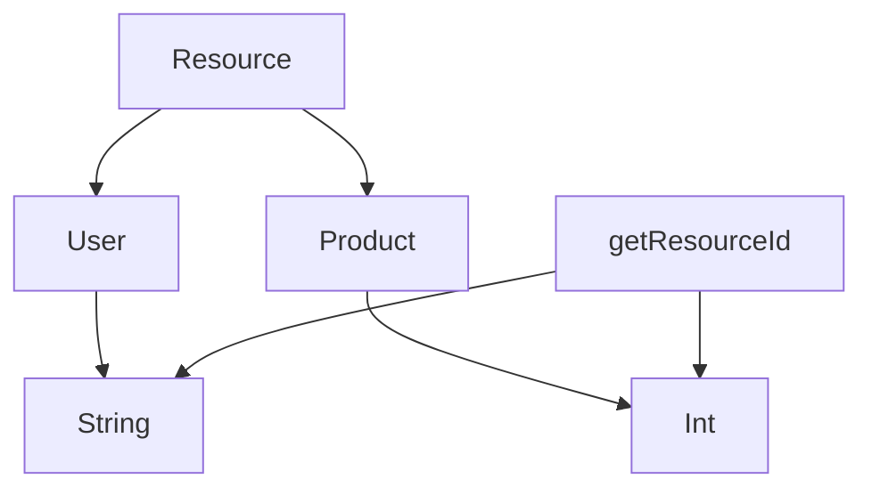

## 3.4 Advanced Type-Level Programming

In the realm of Scala programming, type-level programming is a powerful tool that allows developers to leverage the type system to enforce constraints, improve code safety, and create more expressive APIs. This section delves into advanced type-level programming concepts, including higher-kinded types, type lambdas, and dependent types. These concepts are crucial for expert software engineers and architects seeking to harness the full potential of Scala's type system.

### Understanding Higher-Kinded Types

Higher-kinded types (HKTs) are types that abstract over other types, allowing for more generic and reusable code. They enable the creation of abstractions that can work with any type constructor, such as `List`, `Option`, or `Future`.

#### What Are Higher-Kinded Types?

In Scala, a kind is a type of a type. While most types have a kind `*`, which means they are concrete types, higher-kinded types have kinds that take other types as parameters. For example, `List` has a kind `* -> *`, meaning it takes a type and returns a type.

#### Defining Higher-Kinded Types

To define a higher-kinded type, you use type parameters that themselves take type parameters. Here's a simple example:

```scala
trait Functor[F[_]] {
  def map[A, B](fa: F[A])(f: A => B): F[B]
}
```

In this example, `F[_]` is a higher-kinded type parameter. The `Functor` trait abstracts over any type constructor `F`, allowing you to define `map` for any `F` that can hold a value of type `A`.

#### Using Higher-Kinded Types

Higher-kinded types are often used in conjunction with type classes to define generic operations. For instance, the `Functor` type class can be implemented for different data structures:

```scala
implicit val listFunctor: Functor[List] = new Functor[List] {
  def map[A, B](fa: List[A])(f: A => B): List[B] = fa.map(f)
}

implicit val optionFunctor: Functor[Option] = new Functor[Option] {
  def map[A, B](fa: Option[A])(f: A => B): Option[B] = fa.map(f)
}
```

#### Visualizing Higher-Kinded Types

To better understand how higher-kinded types work, let's visualize them using a simple diagram:

```mermaid
graph TD;
    A[Functor] --> B[F[_]]
    B --> C[List]
    B --> D[Option]
    C --> E[List[A]]
    D --> F[Option[A]]
```

In this diagram, the `Functor` trait abstracts over any type constructor `F[_]`, which can be `List`, `Option`, or any other type that fits the kind `* -> *`.

### Exploring Type Lambdas

Type lambdas are a way to create anonymous type functions, allowing you to partially apply type constructors. They are particularly useful when working with higher-kinded types.

#### What Are Type Lambdas?

A type lambda is a type-level function that takes one or more type parameters and returns a new type. In Scala, you can use type lambdas to create more flexible abstractions.

#### Defining Type Lambdas

Type lambdas are often used in conjunction with type aliases to create concise and expressive type definitions. Here's an example:

```scala
type EitherString[A] = Either[String, A]

val eitherFunctor: Functor[({ type L[A] = Either[String, A] })#L] = new Functor[({ type L[A] = Either[String, A] })#L] {
  def map[A, B](fa: Either[String, A])(f: A => B): Either[String, B] = fa.map(f)
}
```

In this example, `EitherString` is a type alias for `Either[String, A]`, and the type lambda `({ type L[A] = Either[String, A] })#L` is used to create a `Functor` instance for `Either`.

#### Using Type Lambdas

Type lambdas are particularly useful when you need to work with partially applied type constructors. They allow you to create more flexible and reusable abstractions.

#### Visualizing Type Lambdas

Let's visualize how type lambdas work using a simple diagram:

```mermaid
graph TD;
    A[Type Lambda] --> B[Either[String, A]]
    B --> C[Functor]
    C --> D[Either[String, B]]
```

In this diagram, the type lambda `Either[String, A]` is used to create a `Functor` instance for `Either`, allowing you to map over `Either` values.

### Delving into Dependent Types

Dependent types are types that depend on values. They allow you to express more precise type constraints and create safer APIs.

#### What Are Dependent Types?

In Scala, dependent types are types that depend on values. They enable you to express constraints that are not possible with traditional types.

#### Defining Dependent Types

Dependent types are often used in conjunction with path-dependent types and singleton types to create more expressive APIs. Here's an example:

```scala
trait Resource {
  type Id
  def id: Id
}

class User(val id: String) extends Resource {
  type Id = String
}

class Product(val id: Int) extends Resource {
  type Id = Int
}

def getResourceId[R <: Resource](resource: R): resource.Id = resource.id
```

In this example, the `Resource` trait defines a dependent type `Id`, which depends on the concrete implementation of the resource. The `getResourceId` method uses this dependent type to return the correct type of ID.

#### Using Dependent Types

Dependent types are useful for creating more precise and type-safe APIs. They allow you to express constraints that are not possible with traditional types.

#### Visualizing Dependent Types

Let's visualize how dependent types work using a simple diagram:



In this diagram, the `Resource` trait defines a dependent type `Id`, which is implemented as `String` for `User` and `Int` for `Product`. The `getResourceId` method uses this dependent type to return the correct type of ID.

### Practical Applications of Advanced Type-Level Programming

Advanced type-level programming concepts like higher-kinded types, type lambdas, and dependent types have numerous practical applications in Scala programming. They enable you to create more expressive and type-safe APIs, improve code reuse, and enforce constraints at compile time.

#### Creating Type-Safe APIs

By leveraging advanced type-level programming concepts, you can create more type-safe APIs that prevent common errors at compile time. For example, you can use dependent types to ensure that a method only accepts certain types of inputs.

#### Improving Code Reuse

Higher-kinded types and type lambdas enable you to create more generic and reusable code. By abstracting over type constructors, you can define operations that work with any data structure that fits the required kind.

#### Enforcing Constraints at Compile Time

Dependent types allow you to express constraints that are not possible with traditional types. By encoding these constraints in the type system, you can catch errors at compile time and create more robust applications.

### Try It Yourself

To solidify your understanding of advanced type-level programming in Scala, try modifying the code examples provided in this section. Experiment with different type constructors, type lambdas, and dependent types to see how they affect the behavior of your code. By doing so, you'll gain a deeper understanding of these powerful concepts and how they can be applied in real-world scenarios.

### Knowledge Check

- Explain the concept of higher-kinded types and provide an example of how they can be used in Scala.
- What are type lambdas, and how do they differ from traditional type aliases?
- Describe a scenario where dependent types can be used to create more type-safe APIs.
- How can advanced type-level programming concepts improve code reuse and enforce constraints at compile time?

### Conclusion

Advanced type-level programming in Scala is a powerful tool for expert software engineers and architects. By mastering higher-kinded types, type lambdas, and dependent types, you can create more expressive and type-safe APIs, improve code reuse, and enforce constraints at compile time. As you continue to explore these concepts, remember to experiment with different approaches and apply them to real-world scenarios. This is just the beginning of your journey into the world of advanced type-level programming in Scala.

## Quiz Time!



### What is a higher-kinded type in Scala?

- [x] A type that abstracts over other types
- [ ] A type that is only used for primitive data
- [ ] A type that does not take any parameters
- [ ] A type that is specific to the JVM

> **Explanation:** Higher-kinded types are types that abstract over other types, allowing for more generic and reusable code.

### How do type lambdas differ from traditional type aliases?

- [x] Type lambdas allow for partial application of type constructors
- [ ] Type lambdas are only used with primitive types
- [ ] Type lambdas cannot be used with higher-kinded types
- [ ] Type lambdas are the same as type aliases

> **Explanation:** Type lambdas allow for partial application of type constructors, making them more flexible than traditional type aliases.

### What is a dependent type in Scala?

- [x] A type that depends on a value
- [ ] A type that is always mutable
- [ ] A type that cannot be used in function parameters
- [ ] A type that is only used for collections

> **Explanation:** Dependent types are types that depend on values, allowing for more precise type constraints.

### Which of the following is a practical application of advanced type-level programming?

- [x] Creating type-safe APIs
- [ ] Reducing code readability
- [ ] Increasing runtime errors
- [ ] Limiting code reuse

> **Explanation:** Advanced type-level programming can be used to create type-safe APIs, improving code safety and robustness.

### What is the kind of the `List` type constructor in Scala?

- [x] * -> *
- [ ] *
- [ ] * -> * -> *
- [ ] * -> * -> * -> *

> **Explanation:** The `List` type constructor has a kind `* -> *`, meaning it takes a type and returns a type.

### How can higher-kinded types improve code reuse?

- [x] By allowing operations to be defined for any data structure that fits the required kind
- [ ] By making code less readable
- [ ] By increasing the number of runtime errors
- [ ] By limiting the types of data structures that can be used

> **Explanation:** Higher-kinded types allow operations to be defined for any data structure that fits the required kind, improving code reuse.

### Which of the following is a benefit of using dependent types?

- [x] Enforcing constraints at compile time
- [ ] Increasing runtime errors
- [ ] Reducing code readability
- [ ] Limiting the types of inputs a method can accept

> **Explanation:** Dependent types allow you to express constraints in the type system, enforcing them at compile time and reducing runtime errors.

### What is the purpose of the `Functor` trait in Scala?

- [x] To define a generic `map` operation for any type constructor
- [ ] To create mutable data structures
- [ ] To limit the types of data structures that can be used
- [ ] To increase the number of runtime errors

> **Explanation:** The `Functor` trait defines a generic `map` operation for any type constructor, allowing for more flexible and reusable code.

### How can type lambdas be used in conjunction with type aliases?

- [x] To create concise and expressive type definitions
- [ ] To limit the types of data structures that can be used
- [ ] To increase the number of runtime errors
- [ ] To make code less readable

> **Explanation:** Type lambdas can be used with type aliases to create concise and expressive type definitions, improving code readability and flexibility.

### True or False: Dependent types can only be used with primitive data types.

- [ ] True
- [x] False

> **Explanation:** Dependent types can be used with any type, not just primitive data types, allowing for more precise type constraints.


