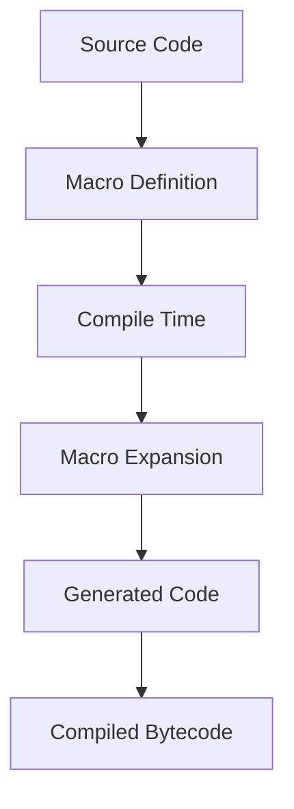

## 3.5.1 Metaprogramming in Scala 2

Metaprogramming in Scala 2 is a powerful technique that allows developers to write code that generates other code at compile time. This capability is particularly useful for reducing boilerplate, enforcing compile-time constraints, and creating domain-specific languages (DSLs). In this section, we will delve into the intricacies of metaprogramming in Scala 2, focusing on macros, quasiquotes, and reflection.

### Introduction to Metaprogramming

Metaprogramming refers to the practice of writing programs that can manipulate other programs or themselves. In Scala 2, metaprogramming is primarily achieved through macros, which enable developers to generate and transform code during compilation.

#### Why Use Metaprogramming?

- **Code Reduction**: Automate repetitive code patterns, reducing boilerplate and improving maintainability.
- **Performance Optimization**: Generate optimized code paths at compile time.
- **Domain-Specific Languages**: Create expressive DSLs tailored to specific problem domains.
- **Compile-Time Safety**: Enforce constraints and invariants at compile time, catching errors early in the development process.

### Understanding Scala Macros

Scala macros are a feature that allows developers to write code that is executed during the compilation process. This code can generate new code, transform existing code, or perform compile-time checks.

#### Types of Macros

1. **Def Macros**: These are the most common type of macros in Scala 2. They are defined using the `macro` keyword and can be used to generate or transform code.
2. **Macro Annotations**: These are used to modify the structure of classes, methods, or fields through annotations.

#### How Macros Work

Macros in Scala 2 are defined in a separate compilation unit, typically in a different source file or module. This separation is necessary because macros are expanded during the compilation of the code that uses them.

### Leveraging Quasiquotes

Quasiquotes are a powerful feature in Scala that allow developers to work with abstract syntax trees (ASTs) in a more intuitive and readable way. They provide a way to construct and deconstruct code fragments using a syntax similar to Scala code.

#### Constructing Code with Quasiquotes

Quasiquotes enable the creation of code fragments that can be used within macros. Here's a simple example of using quasiquotes to construct a piece of code:

```scala
import scala.reflect.macros.blackbox.Context
import scala.language.experimental.macros

object MacroExample {
  def hello: String = macro helloImpl

  def helloImpl(c: Context): c.Expr[String] = {
    import c.universe._
    c.Expr[String](q""" "Hello, World!" """)
  }
}
```

In this example, the `helloImpl` macro constructs a string literal using quasiquotes.

#### Deconstructing Code with Quasiquotes

Quasiquotes can also be used to deconstruct code, allowing developers to analyze and manipulate existing code structures. Here's an example:

```scala
import scala.reflect.macros.blackbox.Context
import scala.language.experimental.macros

object DeconstructExample {
  def showParamNames[T]: List[String] = macro showParamNamesImpl[T]

  def showParamNamesImpl[T: c.WeakTypeTag](c: Context): c.Expr[List[String]] = {
    import c.universe._
    val paramNames = weakTypeOf[T].decls.collect {
      case m: MethodSymbol if m.isConstructor => m.paramLists.flatten.map(_.name.toString)
    }.flatten
    c.Expr[List[String]](q"$paramNames")
  }
}
```

This macro extracts the names of the parameters from the constructor of a given type `T`.

### Reflection in Scala

Reflection is a technique that allows a program to inspect and modify its own structure and behavior at runtime. In Scala, reflection is often used in conjunction with macros to perform more complex metaprogramming tasks.

#### Using Reflection with Macros

Reflection can be used within macros to gather information about types, methods, and other program elements. This information can then be used to generate or transform code.

```scala
import scala.reflect.runtime.universe._

object ReflectionExample {
  def getMethods[T: TypeTag]: List[String] = {
    val tpe = typeOf[T]
    tpe.decls.collect {
      case m: MethodSymbol => m.name.toString
    }.toList
  }
}
```

In this example, the `getMethods` function uses reflection to retrieve the names of all methods defined in a given type `T`.

### Practical Applications of Macros

Macros can be used in a variety of practical scenarios, including:

- **Logging**: Automatically generate logging code for method entry and exit.
- **Validation**: Enforce compile-time validation of data structures.
- **Serialization**: Automatically generate serialization and deserialization code.

#### Example: Logging Macros

Here's an example of a macro that generates logging code for method entry and exit:

```scala
import scala.reflect.macros.blackbox.Context
import scala.language.experimental.macros

object LoggingMacros {
  def logMethodEntryExit[T](block: => T): T = macro logMethodEntryExitImpl[T]

  def logMethodEntryExitImpl[T: c.WeakTypeTag](c: Context)(block: c.Expr[T]): c.Expr[T] = {
    import c.universe._
    val methodName = c.internal.enclosingOwner.name.toString
    c.Expr[T](q"""
      println("Entering method: " + $methodName)
      val result = $block
      println("Exiting method: " + $methodName)
      result
    """)
  }
}
```

This macro logs the entry and exit of a method, along with its name.

### Design Considerations

When using macros, it's important to consider the following:

- **Complexity**: Macros can introduce complexity into your codebase. Use them judiciously and document their behavior.
- **Debugging**: Debugging macros can be challenging. Use logging and print statements to trace macro execution.
- **Compatibility**: Macros in Scala 2 are not forward-compatible with Scala 3. Consider the impact on future code migrations.

### Differences and Similarities with Other Patterns

Macros are often compared to other metaprogramming techniques, such as:

- **Reflection**: While both macros and reflection allow code manipulation, macros operate at compile time, whereas reflection operates at runtime.
- **Annotations**: Annotations provide metadata that can be processed at compile time or runtime, but they do not generate code like macros do.

### Try It Yourself

Experiment with the provided macro examples by modifying them to suit your needs. For instance, try creating a macro that automatically generates `toString` methods for case classes.

### Visualizing Metaprogramming in Scala 2

To better understand the flow of metaprogramming in Scala 2, let's visualize the process using a flowchart:



This diagram illustrates how source code is processed through macro definitions at compile time, resulting in generated code that is then compiled into bytecode.

### References and Links

- [Scala Macros Guide](https://docs.scala-lang.org/overviews/macros/overview.html)
- [Quasiquotes in Scala](https://docs.scala-lang.org/overviews/quasiquotes/overview.html)
- [Reflection in Scala](https://docs.scala-lang.org/overviews/reflection/overview.html)

### Knowledge Check

- What are the main benefits of using macros in Scala 2?
- How do quasiquotes simplify working with abstract syntax trees?
- What are some practical applications of macros in real-world projects?

### Embrace the Journey

Remember, metaprogramming in Scala 2 is a powerful tool that can greatly enhance your development process. As you explore and experiment with macros, you'll discover new ways to optimize and streamline your code. Keep learning, stay curious, and enjoy the journey!

## Quiz Time!



### What is a primary benefit of using macros in Scala 2?

- [x] Reducing boilerplate code
- [ ] Improving runtime performance
- [ ] Enhancing runtime reflection
- [ ] Simplifying syntax

> **Explanation:** Macros in Scala 2 are primarily used to reduce boilerplate code by generating code at compile time.

### How do quasiquotes help in metaprogramming?

- [x] They allow constructing and deconstructing code fragments
- [ ] They enhance runtime performance
- [ ] They simplify syntax errors
- [ ] They provide runtime type checking

> **Explanation:** Quasiquotes allow developers to construct and deconstruct code fragments, making it easier to work with abstract syntax trees.

### What is a key difference between macros and reflection?

- [x] Macros operate at compile time, while reflection operates at runtime
- [ ] Macros are faster than reflection
- [ ] Reflection is more powerful than macros
- [ ] Macros are easier to debug than reflection

> **Explanation:** Macros operate at compile time, allowing for code generation and transformation, whereas reflection operates at runtime.

### Which of the following is a type of macro in Scala 2?

- [x] Def Macros
- [ ] Class Macros
- [ ] Object Macros
- [ ] Trait Macros

> **Explanation:** Def Macros are a common type of macro in Scala 2, used for generating and transforming code.

### What is a practical application of macros?

- [x] Automatically generating serialization code
- [ ] Enhancing runtime performance
- [ ] Simplifying syntax errors
- [ ] Providing runtime type checking

> **Explanation:** Macros can be used to automatically generate serialization and deserialization code, among other applications.

### What is a challenge when using macros?

- [x] Debugging can be difficult
- [ ] They are slow to compile
- [ ] They reduce code readability
- [ ] They are not compatible with Scala 2

> **Explanation:** Debugging macros can be challenging due to their compile-time nature and complexity.

### How can macros enforce compile-time safety?

- [x] By generating code that checks constraints at compile time
- [ ] By providing runtime type checking
- [ ] By simplifying syntax errors
- [ ] By enhancing runtime performance

> **Explanation:** Macros can generate code that enforces constraints and invariants at compile time, enhancing safety.

### What is a similarity between macros and annotations?

- [x] Both can be used to manipulate code structure
- [ ] Both operate at runtime
- [ ] Both enhance runtime performance
- [ ] Both simplify syntax errors

> **Explanation:** Both macros and annotations can be used to manipulate code structure, although macros generate code while annotations provide metadata.

### What is a key consideration when using macros?

- [x] They can introduce complexity
- [ ] They are slow to compile
- [ ] They reduce code readability
- [ ] They are not compatible with Scala 2

> **Explanation:** Macros can introduce complexity into a codebase, so they should be used judiciously and documented thoroughly.

### True or False: Macros in Scala 2 are forward-compatible with Scala 3.

- [ ] True
- [x] False

> **Explanation:** Macros in Scala 2 are not forward-compatible with Scala 3, as Scala 3 introduces a new macro system.


