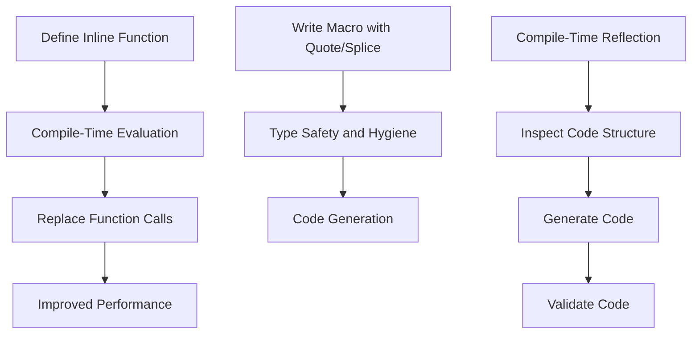

## 3.5.2 Metaprogramming in Scala 3

Metaprogramming in Scala 3 introduces powerful features that allow developers to write code that generates or manipulates other code at compile time. This capability can lead to significant performance improvements, reduced boilerplate, and more expressive code. In this section, we will explore the key metaprogramming constructs in Scala 3, including inline functions, macros with the quote/splice mechanism, compile-time reflection, and more.

### Inline Functions

Inline functions in Scala 3 provide a mechanism to perform compile-time evaluation of certain expressions, effectively reducing runtime overhead and eliminating unnecessary boilerplate. By marking a method as `inline`, you instruct the compiler to replace calls to that method with the method's body, effectively "inlining" the code.

#### Defining Inline Methods

To define an inline method, use the `inline` keyword. This is particularly useful for small utility functions where the overhead of a function call is undesirable.

```scala
inline def add(a: Int, b: Int): Int = a + b

val result = add(3, 4) // The method call is replaced with the expression 3 + 4
```

#### Reducing Boilerplate and Improving Performance

Inline functions can help reduce boilerplate by allowing you to define concise utility methods without the performance penalty of a function call. This is especially beneficial in performance-critical applications where even small overheads can accumulate.

```scala
inline def log(message: String): Unit = println(s"[LOG] $message")

log("This is an inline log message") // The println call is directly inserted here
```

### Macros and Quote/Splice Mechanism

Scala 3 introduces a new approach to macros using the quote and splice mechanism. This approach provides a more robust and type-safe way to perform metaprogramming compared to Scala 2.

#### Writing Macros with Quote/Splice

Macros in Scala 3 are written using quotes (`'`) and splices (`$`). Quotes are used to construct code expressions, while splices are used to insert code into these expressions.

```scala
import scala.quoted.*

inline def showType[T]: String = ${ showTypeImpl[T] }

def showTypeImpl[T: Type](using Quotes): Expr[String] = {
  import quotes.reflect.*
  val tpe = TypeRepr.of[T]
  Expr(tpe.show)
}

val typeName = showType[Int] // Outputs: "Int"
```

#### Ensuring Type Safety and Hygiene

The new macro system in Scala 3 ensures type safety and hygiene by using the type system to enforce constraints on macro expansions. This prevents common pitfalls associated with macros, such as type mismatches and hygiene issues.

### Compile-Time Reflection

Compile-time reflection allows you to inspect and manipulate code during compilation. This is useful for generating code based on existing structures or validating code against certain criteria.

#### Inspecting and Manipulating Code

Using compile-time reflection, you can analyze the structure of types and expressions, enabling powerful code generation and validation techniques.

```scala
def inspectType[T: Type](using Quotes): Unit = {
  import quotes.reflect.*
  val tpe = TypeRepr.of[T]
  println(s"Type: ${tpe.show}")
}

inspectType[List[Int]] // Outputs: "Type: List[Int]"
```

#### Use Cases for Code Generation and Validation

Compile-time reflection can be used to generate boilerplate code, such as serializers and deserializers, or to enforce coding standards by validating code structure.

### Staging and Metaprogramming Patterns

Staging in Scala 3 refers to the concept of multi-stage programming, where code is generated and executed in stages. This can be used to develop domain-specific optimizations and other advanced metaprogramming patterns.

#### Multi-Stage Programming

Multi-stage programming allows you to separate the generation of code from its execution, enabling optimizations that are not possible with single-stage programming.

```scala
inline def power(x: Double, n: Int): Double =
  if n == 0 then 1.0
  else if n % 2 == 0 then
    val y = power(x, n / 2)
    y * y
  else x * power(x, n - 1)

val result = power(2.0, 10) // Computes 2^10 at compile time
```

#### Developing Domain-Specific Optimizations

By leveraging staging, you can create optimizations specific to your domain, such as precomputing constants or simplifying expressions.

### Practical Applications

Metaprogramming in Scala 3 can be applied to a variety of practical scenarios, including the implementation of performant domain-specific languages (DSLs) and the automation of repetitive code patterns.

#### Implementing Performant DSLs

DSLs can benefit from metaprogramming by allowing complex domain logic to be expressed concisely and efficiently.

```scala
inline def dslExample(inline expr: String): Unit = ${ dslImpl('expr) }

def dslImpl(expr: Expr[String])(using Quotes): Expr[Unit] = {
  import quotes.reflect.*
  println(s"Processing DSL expression: ${expr.valueOrError}")
  '{ println("DSL executed") }
}

dslExample("example") // Outputs: "Processing DSL expression: example"
```

#### Automating Repetitive Code Patterns

Metaprogramming can automate the generation of boilerplate code, reducing errors and improving maintainability.

### Migration from Scala 2 Macros

Scala 3 introduces significant changes to the macro system, requiring developers to adapt existing Scala 2 macros to the new paradigm.

#### Differences Between Scala 2 and Scala 3 Macros

The macro system in Scala 3 is more type-safe and hygienic, using quotes and splices instead of the quasiquotes used in Scala 2.

#### Strategies for Updating Existing Macros

To migrate macros from Scala 2 to Scala 3, developers should familiarize themselves with the new quote/splice syntax and leverage the improved type safety features.

```scala
// Example of migrating a simple macro from Scala 2 to Scala 3

// Scala 2 macro
// def printType[T]: Unit = macro printTypeImpl[T]

// Scala 3 equivalent
inline def printType[T]: Unit = ${ printTypeImpl[T] }

def printTypeImpl[T: Type](using Quotes): Expr[Unit] = {
  import quotes.reflect.*
  println(s"Type: ${TypeRepr.of[T].show}")
  '{}
}
```

### Try It Yourself

Experiment with the provided code examples by modifying them to suit your needs. Try creating your own inline functions and macros to see how they can simplify your codebase and improve performance.

### Visualizing Metaprogramming in Scala 3

To better understand the flow of metaprogramming in Scala 3, consider the following diagram illustrating the interaction between inline functions, macros, and compile-time reflection:



This diagram shows how inline functions and macros interact with compile-time reflection to optimize and generate code efficiently.

### Key Takeaways

- **Inline Functions**: Use inline functions to reduce runtime overhead and eliminate boilerplate.
- **Macros with Quote/Splice**: Leverage the new macro system for type-safe and hygienic code generation.
- **Compile-Time Reflection**: Utilize reflection to inspect and manipulate code during compilation.
- **Staging and Metaprogramming Patterns**: Apply multi-stage programming for domain-specific optimizations.
- **Practical Applications**: Implement DSLs and automate repetitive code patterns with metaprogramming.

### References and Links

- [Scala 3 Documentation](https://docs.scala-lang.org/scala3/reference/metaprogramming.html)
- [Metaprogramming in Scala 3](https://www.scala-lang.org/blog/2020/02/25/scala-3-macros.html)
- [Quote and Splice in Scala 3](https://dotty.epfl.ch/docs/reference/metaprogramming/macros.html)

## Quiz Time!



### What is the primary purpose of inline functions in Scala 3?

- [x] To perform compile-time evaluation and reduce runtime overhead
- [ ] To replace all function calls with macros
- [ ] To generate code at runtime
- [ ] To simplify syntax for function definitions

> **Explanation:** Inline functions are used to perform compile-time evaluation, reducing runtime overhead by replacing function calls with the function's body.

### How do you define a macro in Scala 3?

- [x] Using quotes (`'`) and splices (`$`)
- [ ] Using quasiquotes
- [ ] Using the `macro` keyword
- [ ] Using the `def` keyword

> **Explanation:** Macros in Scala 3 are defined using quotes and splices, providing a more robust and type-safe approach compared to Scala 2.

### What is the benefit of compile-time reflection in Scala 3?

- [x] It allows inspection and manipulation of code during compilation
- [ ] It enables runtime code generation
- [ ] It simplifies syntax for function definitions
- [ ] It replaces the need for inline functions

> **Explanation:** Compile-time reflection allows developers to inspect and manipulate code during compilation, enabling powerful code generation and validation techniques.

### What is multi-stage programming?

- [x] A technique that separates code generation from execution
- [ ] A method for writing macros in Scala 3
- [ ] A way to define inline functions
- [ ] A process for compiling Scala code

> **Explanation:** Multi-stage programming separates code generation from execution, allowing for optimizations that are not possible with single-stage programming.

### What is a practical application of metaprogramming in Scala 3?

- [x] Implementing performant DSLs
- [ ] Writing simple utility functions
- [ ] Replacing all function calls with macros
- [ ] Simplifying syntax for class definitions

> **Explanation:** Metaprogramming can be used to implement performant domain-specific languages (DSLs) and automate repetitive code patterns.

### How does the macro system in Scala 3 differ from Scala 2?

- [x] It uses quotes and splices instead of quasiquotes
- [ ] It uses the `macro` keyword
- [ ] It is less type-safe
- [ ] It does not support compile-time reflection

> **Explanation:** The macro system in Scala 3 uses quotes and splices, providing a more type-safe and hygienic approach compared to the quasiquotes used in Scala 2.

### What is the role of the `inline` keyword in Scala 3?

- [x] To mark methods for compile-time evaluation
- [ ] To define macros
- [ ] To simplify syntax for class definitions
- [ ] To generate code at runtime

> **Explanation:** The `inline` keyword is used to mark methods for compile-time evaluation, allowing the compiler to replace calls to the method with its body.

### What is the advantage of using staging in metaprogramming?

- [x] It allows for domain-specific optimizations
- [ ] It simplifies syntax for function definitions
- [ ] It replaces the need for inline functions
- [ ] It enables runtime code generation

> **Explanation:** Staging allows for domain-specific optimizations by separating code generation from execution, enabling more efficient code.

### Which of the following is NOT a feature of metaprogramming in Scala 3?

- [ ] Inline functions
- [ ] Macros with quote/splice
- [ ] Compile-time reflection
- [x] Runtime code generation

> **Explanation:** Metaprogramming in Scala 3 focuses on compile-time features such as inline functions, macros with quote/splice, and compile-time reflection, rather than runtime code generation.

### True or False: Metaprogramming in Scala 3 can automate the generation of boilerplate code.

- [x] True
- [ ] False

> **Explanation:** True. Metaprogramming in Scala 3 can automate the generation of boilerplate code, reducing errors and improving maintainability.


