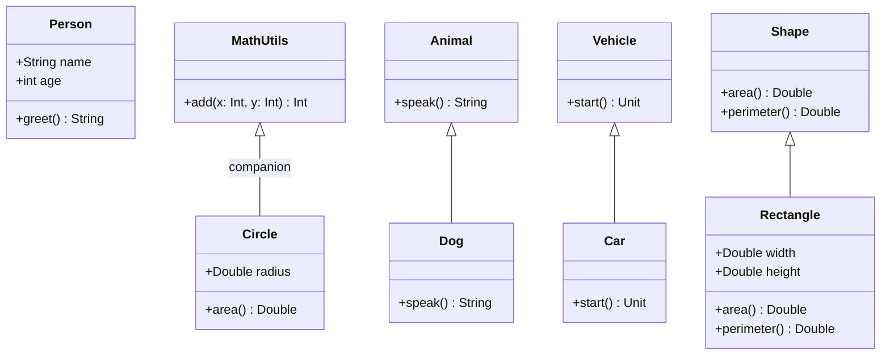

## 3.6 Scala's Object-Oriented Features

Scala is a unique language that seamlessly integrates object-oriented programming (OOP) with functional programming. This section delves into Scala's object-oriented features, which are crucial for expert software engineers and architects aiming to design robust and scalable systems. We'll explore classes, objects, inheritance, and abstract classes, providing a comprehensive understanding of how these features can be leveraged in Scala.

### Classes, Objects, and Companions

#### Classes in Scala

In Scala, classes are blueprints for creating objects. They encapsulate data and behavior, allowing for the creation of complex data structures and functionalities. Let's explore the syntax and usage of classes in Scala.

```scala
// Define a simple class in Scala
class Person(val name: String, val age: Int) {
  // Method within the class
  def greet(): String = s"Hello, my name is $name and I am $age years old."
}

// Instantiate an object of the class
val person = new Person("Alice", 30)
println(person.greet()) // Output: Hello, my name is Alice and I am 30 years old.
```

**Key Points:**

- **Primary Constructor:** The `Person` class has a primary constructor with parameters `name` and `age`. These parameters are automatically converted into fields due to the `val` keyword.
- **Methods:** The `greet` method demonstrates how behavior is encapsulated within a class.

#### Objects in Scala

Objects in Scala are single instances of their own definition, similar to the Singleton pattern in other languages. They are used to hold static methods and values.

```scala
// Define an object in Scala
object MathUtils {
  def add(x: Int, y: Int): Int = x + y
}

// Access the method without instantiation
println(MathUtils.add(5, 3)) // Output: 8
```

**Key Points:**

- **Singleton Nature:** An object is instantiated once and can be accessed globally.
- **Utility Methods:** Objects are often used for utility functions that don't require state.

#### Companion Objects

Companion objects in Scala are objects with the same name as a class and are defined in the same file. They can access the private members of the class.

```scala
class Circle(val radius: Double) {
  import Circle._
  def area: Double = pi * radius * radius
}

object Circle {
  private val pi = 3.14159
}

// Instantiate and use the class
val circle = new Circle(5.0)
println(circle.area) // Output: 78.53975
```

**Key Points:**

- **Access to Private Members:** The companion object `Circle` can access the private `pi` value.
- **Factory Methods:** Companion objects are often used to implement factory methods for creating instances of the class.

### Inheritance and Method Overriding

Inheritance in Scala allows a class to inherit fields and methods from another class, promoting code reuse and the creation of hierarchical class structures.

#### Inheritance

Scala supports single inheritance, where a class can extend another class.

```scala
// Base class
class Animal {
  def speak(): String = "Some sound"
}

// Derived class
class Dog extends Animal {
  override def speak(): String = "Woof"
}

// Instantiate and use the derived class
val dog = new Dog
println(dog.speak()) // Output: Woof
```

**Key Points:**

- **`extends` Keyword:** Used to inherit from a base class.
- **Method Overriding:** The `Dog` class overrides the `speak` method to provide specific behavior.

#### Method Overriding

Method overriding allows a subclass to provide a specific implementation of a method that is already defined in its superclass.

```scala
class Vehicle {
  def start(): Unit = println("Vehicle started")
}

class Car extends Vehicle {
  override def start(): Unit = println("Car started")
}

// Instantiate and use the classes
val vehicle = new Vehicle
vehicle.start() // Output: Vehicle started

val car = new Car
car.start() // Output: Car started
```

**Key Points:**

- **`override` Keyword:** Used to indicate that a method is being overridden.
- **Polymorphism:** Subclasses can be treated as instances of their superclass, allowing for dynamic method dispatch.

### Abstract Classes

Abstract classes in Scala are classes that cannot be instantiated on their own and are meant to be extended by other classes. They can contain both abstract and concrete methods.

```scala
// Define an abstract class
abstract class Shape {
  def area: Double // Abstract method
  def perimeter: Double // Abstract method
}

// Concrete class extending the abstract class
class Rectangle(val width: Double, val height: Double) extends Shape {
  def area: Double = width * height
  def perimeter: Double = 2 * (width + height)
}

// Instantiate and use the concrete class
val rectangle = new Rectangle(4.0, 5.0)
println(s"Area: ${rectangle.area}, Perimeter: ${rectangle.perimeter}")
// Output: Area: 20.0, Perimeter: 18.0
```

**Key Points:**

- **Abstract Methods:** Methods without implementation that must be implemented by subclasses.
- **Concrete Methods:** Abstract classes can also have fully implemented methods.

### Design Considerations

When designing with Scala's object-oriented features, consider the following:

- **Encapsulation:** Use classes to encapsulate data and behavior, ensuring that internal states are protected.
- **Reusability:** Leverage inheritance to promote code reuse, but be cautious of deep inheritance hierarchies that can complicate maintenance.
- **Polymorphism:** Utilize polymorphism to design flexible and extensible systems.
- **Abstract Classes vs. Traits:** Choose between abstract classes and traits based on the need for state and multiple inheritance.

### Differences and Similarities

While Scala's object-oriented features are similar to those in other languages like Java, there are key differences:

- **Traits vs. Abstract Classes:** Traits in Scala are similar to interfaces in Java but can contain concrete methods and fields. They support multiple inheritance, unlike abstract classes.
- **Companion Objects:** Unique to Scala, they provide a way to define static members and factory methods.
- **Unified Type System:** Scala's type system unifies primitive types and objects, unlike Java's distinction between primitives and objects.

### Try It Yourself

Experiment with the following code snippets to deepen your understanding:

1. **Modify the `Person` class** to include a method that calculates the year of birth based on the current year.
2. **Create a new class `Cat`** that extends the `Animal` class and overrides the `speak` method to return "Meow".
3. **Implement a companion object** for a `Book` class that includes a factory method for creating `Book` instances with default values.

### Visualizing Scala's Object-Oriented Features

To better understand the relationships between classes, objects, and inheritance in Scala, let's visualize these concepts using a class diagram.



**Diagram Explanation:**

- **Person Class:** Demonstrates a simple class with fields and methods.
- **MathUtils Object:** Represents a singleton object with a utility method.
- **Circle and Companion Object:** Shows how a companion object can access private members.
- **Inheritance:** Illustrates how `Dog` and `Car` extend `Animal` and `Vehicle`, respectively.
- **Abstract Class and Subclass:** Depicts `Shape` as an abstract class with `Rectangle` as its concrete implementation.

### Knowledge Check

Before moving on, let's reinforce what we've learned:

- **What is the purpose of a companion object in Scala?**
- **How does Scala's inheritance model differ from Java's?**
- **When would you choose an abstract class over a trait?**

### Embrace the Journey

Remember, mastering Scala's object-oriented features is a journey. As you continue to explore and experiment, you'll discover new ways to design and implement efficient and maintainable software systems. Keep experimenting, stay curious, and enjoy the journey!

## Quiz Time!



### What is a companion object in Scala?

- [x] An object with the same name as a class, defined in the same file, and can access the class's private members.
- [ ] A singleton object that cannot access any class members.
- [ ] A class that is used to create multiple instances of an object.
- [ ] An object that is used to store static methods only.

> **Explanation:** A companion object in Scala is defined with the same name as a class and can access its private members. It is often used to define factory methods and static members.

### How does Scala handle single inheritance?

- [x] Scala supports single inheritance, where a class can extend only one superclass.
- [ ] Scala does not support inheritance.
- [ ] Scala supports multiple inheritance through classes.
- [ ] Scala allows a class to inherit from multiple classes directly.

> **Explanation:** Scala supports single inheritance, meaning a class can extend only one superclass. However, it can mix in multiple traits to achieve similar functionality to multiple inheritance.

### What keyword is used to override a method in Scala?

- [x] override
- [ ] extend
- [ ] super
- [ ] implements

> **Explanation:** The `override` keyword is used in Scala to indicate that a method is being overridden in a subclass.

### What is the main difference between traits and abstract classes in Scala?

- [x] Traits can be mixed into multiple classes, while abstract classes can only be extended by one subclass.
- [ ] Traits cannot have concrete methods, while abstract classes can.
- [ ] Traits cannot have fields, while abstract classes can.
- [ ] Traits are only used for interfaces, while abstract classes are used for implementation.

> **Explanation:** Traits in Scala can be mixed into multiple classes, providing a form of multiple inheritance, whereas abstract classes can only be extended by one subclass.

### Which of the following is true about Scala's type system?

- [x] Scala's type system unifies primitive types and objects.
- [ ] Scala distinguishes between primitive types and objects like Java.
- [ ] Scala only supports primitive types.
- [ ] Scala does not have a type system.

> **Explanation:** Scala's type system unifies primitive types and objects, unlike Java, which distinguishes between them.

### What is the purpose of the `val` keyword in a class constructor?

- [x] To automatically convert constructor parameters into immutable fields.
- [ ] To make the class mutable.
- [ ] To define a method.
- [ ] To declare a variable that can be changed.

> **Explanation:** The `val` keyword in a class constructor automatically converts the parameters into immutable fields, making them accessible as properties of the class.

### Can a Scala object be instantiated multiple times?

- [ ] Yes, Scala objects can be instantiated multiple times.
- [x] No, Scala objects are singletons and can only be instantiated once.
- [ ] Yes, but only if they do not contain any methods.
- [ ] No, Scala objects cannot be instantiated at all.

> **Explanation:** Scala objects are singletons, meaning they are instantiated once and can be accessed globally.

### What is the role of the `extends` keyword in Scala?

- [x] It is used to inherit from a superclass.
- [ ] It is used to implement an interface.
- [ ] It is used to declare a new class.
- [ ] It is used to override a method.

> **Explanation:** The `extends` keyword is used in Scala to inherit from a superclass, allowing a class to reuse the fields and methods of the superclass.

### Which of the following best describes method overriding in Scala?

- [x] Providing a specific implementation of a method already defined in its superclass.
- [ ] Defining a new method in a class.
- [ ] Implementing an interface method.
- [ ] Creating a method with the same name but different parameters.

> **Explanation:** Method overriding in Scala involves providing a specific implementation of a method that is already defined in its superclass.

### True or False: Scala's companion objects can access private members of their corresponding class.

- [x] True
- [ ] False

> **Explanation:** True. Companion objects in Scala can access private members of their corresponding class because they are defined in the same file and share the same name.


