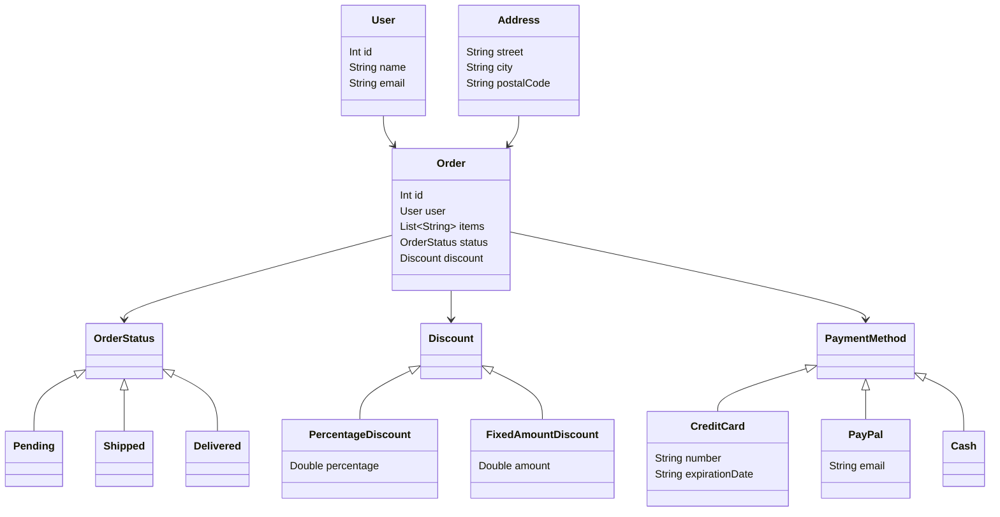

## 3.7 Functional Domain Modeling

Functional Domain Modeling (FDM) is a powerful approach to designing software systems that leverages the strengths of functional programming and type systems. In Scala, FDM allows developers to create robust, maintainable, and expressive domain models by utilizing features such as case classes, sealed traits, and the type system. This section will guide you through the concepts, techniques, and best practices for functional domain modeling in Scala.

### Introduction to Functional Domain Modeling

Functional Domain Modeling is the practice of representing the problem domain of a software application using functional programming principles. It emphasizes immutability, composability, and the use of types to enforce constraints and express domain logic. By capturing the essence of the domain in the type system, developers can create models that are not only more expressive but also safer and easier to reason about.

#### Key Concepts

- **Immutability**: Ensures that once data is created, it cannot be changed. This leads to more predictable and reliable code.
- **Composability**: Allows small, simple functions to be combined to build more complex functionality.
- **Type Safety**: Uses the type system to enforce constraints and invariants, reducing runtime errors.

### Capturing Domain Models with Case Classes

Case classes in Scala are a fundamental building block for functional domain modeling. They provide a concise and expressive way to define immutable data structures that represent entities in your domain.

#### Defining Case Classes

A case class is a special type of class in Scala that is optimized for pattern matching and immutability. Here's a simple example:

```scala
case class User(id: Int, name: String, email: String)
```

In this example, `User` is a case class with three fields: `id`, `name`, and `email`. Case classes automatically provide several useful features:

- **Immutability**: All fields are immutable by default.
- **Pattern Matching**: Case classes can be used in pattern matching expressions.
- **Equality**: Case classes automatically implement `equals` and `hashCode` based on their fields.
- **Copy Method**: Allows creating a copy of an object with some fields modified.

#### Using Case Classes in Domain Models

Case classes are ideal for representing entities and value objects in your domain. They allow you to define the structure and constraints of your data in a clear and concise manner.

```scala
case class Address(street: String, city: String, postalCode: String)

case class Order(id: Int, user: User, items: List[String], shippingAddress: Address)
```

In this example, `Address` and `Order` are case classes that represent different aspects of the domain. By using case classes, you can ensure that your domain model is both expressive and type-safe.

### Sealed Traits for Algebraic Data Types

Sealed traits are another powerful feature of Scala that can be used to define algebraic data types (ADTs). ADTs are a way of modeling data that can take on one of several different forms, each with its own associated data.

#### Defining Sealed Traits

A sealed trait is a trait that can only be extended by classes and objects defined in the same file. This restriction allows the compiler to know all possible subtypes of the trait, enabling exhaustive pattern matching.

```scala
sealed trait PaymentMethod

case class CreditCard(number: String, expirationDate: String) extends PaymentMethod
case class PayPal(email: String) extends PaymentMethod
case object Cash extends PaymentMethod
```

In this example, `PaymentMethod` is a sealed trait with three possible subtypes: `CreditCard`, `PayPal`, and `Cash`. This allows you to represent different payment methods in a type-safe way.

#### Pattern Matching with Sealed Traits

Sealed traits work seamlessly with pattern matching, allowing you to handle different cases in a concise and expressive manner.

```scala
def processPayment(payment: PaymentMethod): String = payment match {
  case CreditCard(number, _) => s"Processing credit card payment for card number $number"
  case PayPal(email) => s"Processing PayPal payment for account $email"
  case Cash => "Processing cash payment"
}
```

This function processes a `PaymentMethod` by pattern matching on its type and handling each case accordingly.

### Designing Domain Models with Types

The type system in Scala is a powerful tool for designing domain models. By using types to represent domain concepts and constraints, you can create models that are both expressive and safe.

#### Encoding Domain Logic with Types

Types can be used to encode domain logic and enforce constraints at compile time. This reduces the likelihood of runtime errors and makes your code more robust.

```scala
case class Email(value: String) {
  require(value.contains("@"), "Invalid email address")
}

case class Age(value: Int) {
  require(value >= 0, "Age cannot be negative")
}
```

In this example, `Email` and `Age` are value classes that enforce constraints on their values. By using types to represent these concepts, you can ensure that invalid data is caught at compile time.

#### Leveraging Type Aliases

Type aliases can be used to give meaningful names to existing types, making your code more readable and expressive.

```scala
type UserId = Int
type ProductId = Int

case class Product(id: ProductId, name: String, price: Double)
```

In this example, `UserId` and `ProductId` are type aliases for `Int`, providing more context and meaning to the code.

### Integrating Functional and Object-Oriented Concepts

Scala is a hybrid language that combines functional and object-oriented programming paradigms. This allows you to leverage the best of both worlds when designing your domain models.

#### Using Traits for Behavior

Traits in Scala can be used to define reusable behavior that can be mixed into different classes. This allows you to separate concerns and promote code reuse.

```scala
trait Discount {
  def applyDiscount(amount: Double): Double
}

case class PercentageDiscount(percentage: Double) extends Discount {
  def applyDiscount(amount: Double): Double = amount - (amount * percentage / 100)
}

case class FixedAmountDiscount(amount: Double) extends Discount {
  def applyDiscount(amount: Double): Double = amount - amount
}
```

In this example, `Discount` is a trait that defines a common interface for different types of discounts. `PercentageDiscount` and `FixedAmountDiscount` are concrete implementations that provide specific behavior.

#### Composing Domain Models

By combining case classes, sealed traits, and traits, you can create rich and expressive domain models that capture the essence of your problem domain.

```scala
sealed trait OrderStatus
case object Pending extends OrderStatus
case object Shipped extends OrderStatus
case object Delivered extends OrderStatus

case class Order(id: Int, user: User, items: List[String], status: OrderStatus, discount: Option[Discount])
```

In this example, `Order` is a case class that represents an order in the system. It uses a sealed trait `OrderStatus` to represent the different states an order can be in, and an optional `Discount` trait to apply discounts.

### Visualizing Functional Domain Models

To better understand the structure and relationships within a functional domain model, it's helpful to visualize them using diagrams. Below is a class diagram representing the domain model for an e-commerce system.



### Best Practices for Functional Domain Modeling

When designing functional domain models in Scala, there are several best practices to keep in mind:

- **Embrace Immutability**: Use immutable data structures to ensure that your domain model is predictable and reliable.
- **Leverage the Type System**: Use types to express domain concepts and constraints, reducing the likelihood of runtime errors.
- **Promote Composability**: Design your domain model to be composed of small, reusable components that can be combined to build more complex functionality.
- **Use Pattern Matching**: Take advantage of pattern matching to handle different cases in a concise and expressive manner.
- **Separate Concerns**: Use traits to separate behavior and promote code reuse.

### Try It Yourself

To deepen your understanding of functional domain modeling in Scala, try modifying the code examples provided in this section:

1. **Add a new payment method**: Extend the `PaymentMethod` sealed trait with a new payment method, such as `BankTransfer`.
2. **Implement a new discount type**: Create a new discount type that applies a discount based on the number of items in an order.
3. **Enhance the order status**: Add a new order status, such as `Cancelled`, and update the pattern matching logic in the `Order` class to handle it.

### Knowledge Check

Before moving on, take a moment to reflect on what you've learned:

- How do case classes and sealed traits contribute to functional domain modeling in Scala?
- What are the benefits of using types to encode domain logic and constraints?
- How can you leverage Scala's type system to create expressive and safe domain models?

### Conclusion

Functional Domain Modeling in Scala is a powerful approach to designing software systems that are robust, maintainable, and expressive. By leveraging Scala's type system, case classes, and sealed traits, you can create domain models that capture the essence of your problem domain and enforce constraints at compile time. As you continue to explore functional programming and domain-driven design, remember to embrace immutability, composability, and type safety to create software that is both elegant and reliable.

## Quiz Time!



### What is the primary benefit of using case classes in Scala for domain modeling?

- [x] Immutability and pattern matching
- [ ] Dynamic typing
- [ ] Automatic serialization
- [ ] Inheritance hierarchy

> **Explanation:** Case classes in Scala provide immutability and are optimized for pattern matching, making them ideal for domain modeling.

### How do sealed traits enhance pattern matching in Scala?

- [x] They allow exhaustive pattern matching by restricting subclassing to the same file.
- [ ] They enable dynamic typing.
- [ ] They provide automatic serialization.
- [ ] They enforce runtime checks.

> **Explanation:** Sealed traits restrict subclassing to the same file, allowing the compiler to know all possible subtypes and enabling exhaustive pattern matching.

### What is a key advantage of using types to encode domain logic in Scala?

- [x] Compile-time enforcement of constraints
- [ ] Faster runtime performance
- [ ] Easier debugging
- [ ] Simplified syntax

> **Explanation:** Using types to encode domain logic allows constraints to be enforced at compile time, reducing runtime errors and improving code safety.

### What is the role of traits in functional domain modeling?

- [x] Defining reusable behavior
- [ ] Enforcing immutability
- [ ] Providing dynamic typing
- [ ] Simplifying serialization

> **Explanation:** Traits in Scala are used to define reusable behavior that can be mixed into different classes, promoting code reuse and separation of concerns.

### How can type aliases improve code readability in Scala?

- [x] By providing meaningful names to existing types
- [ ] By enabling dynamic typing
- [ ] By simplifying serialization
- [ ] By enforcing runtime checks

> **Explanation:** Type aliases give meaningful names to existing types, enhancing code readability and expressiveness.

### What is a common use case for pattern matching in functional domain modeling?

- [x] Handling different cases of algebraic data types
- [ ] Enforcing immutability
- [ ] Simplifying serialization
- [ ] Enabling dynamic typing

> **Explanation:** Pattern matching is commonly used to handle different cases of algebraic data types, allowing for concise and expressive code.

### What is the benefit of using sealed traits for algebraic data types?

- [x] Exhaustive pattern matching
- [ ] Dynamic typing
- [ ] Automatic serialization
- [ ] Simplified syntax

> **Explanation:** Sealed traits enable exhaustive pattern matching by restricting subclassing to the same file, allowing the compiler to know all possible subtypes.

### How do case classes automatically implement equality in Scala?

- [x] By generating `equals` and `hashCode` methods based on their fields
- [ ] By using dynamic typing
- [ ] By providing automatic serialization
- [ ] By enforcing runtime checks

> **Explanation:** Case classes automatically generate `equals` and `hashCode` methods based on their fields, ensuring consistent equality checks.

### What is the purpose of the `copy` method in case classes?

- [x] To create a copy of an object with some fields modified
- [ ] To enforce immutability
- [ ] To simplify serialization
- [ ] To enable dynamic typing

> **Explanation:** The `copy` method in case classes allows creating a copy of an object with some fields modified, facilitating immutability.

### True or False: Functional domain modeling in Scala relies heavily on mutable data structures.

- [ ] True
- [x] False

> **Explanation:** Functional domain modeling in Scala emphasizes immutability, using immutable data structures to ensure predictability and reliability.



Remember, this is just the beginning. As you progress, you'll build more complex and interactive domain models. Keep experimenting, stay curious, and enjoy the journey!
