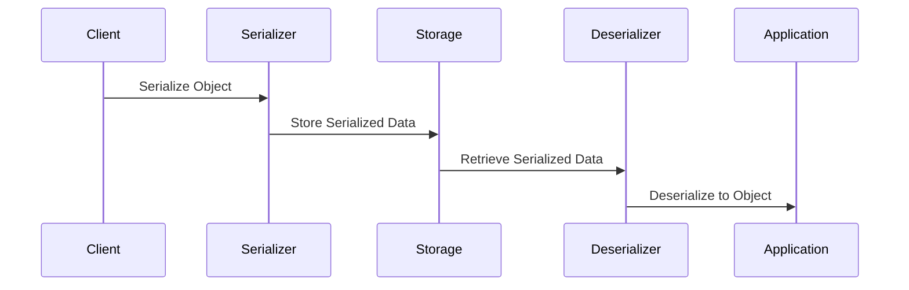

## 3.8 Serialization and Deserialization

Serialization and deserialization are crucial processes in software engineering, enabling the conversion of complex data structures into a format that can be easily stored or transmitted and then reconstructed later. In Scala, these processes are essential for tasks such as data persistence, communication between distributed systems, and caching. This section will delve into the techniques for serializing Scala objects, managing versioning and compatibility, and using popular libraries like Jackson, upickle, and Circe.

### Understanding Serialization and Deserialization

**Serialization** is the process of converting an object into a byte stream, making it suitable for storage or transmission. **Deserialization** is the reverse process, where the byte stream is converted back into a copy of the original object.

#### Why Serialize?

- **Persistence**: Store objects in files or databases.
- **Communication**: Transmit objects over a network.
- **Caching**: Store objects in memory for quick access.

#### Challenges in Serialization

- **Versioning**: Ensuring compatibility between different versions of serialized objects.
- **Performance**: Balancing speed and resource usage.
- **Security**: Protecting against malicious data.

### Techniques for Serializing Scala Objects

Scala provides several methods for serialization, each with its own advantages and trade-offs. Let's explore some of the most common techniques.

#### Java Serialization

Scala objects can be serialized using Java's built-in serialization mechanism by implementing the `Serializable` interface. However, this approach has limitations, such as performance overhead and lack of control over the serialization process.

```scala
import java.io._

@SerialVersionUID(123L)
case class Person(name: String, age: Int) extends Serializable

val person = Person("Alice", 30)

// Serialize to a file
val fileOutputStream = new FileOutputStream("person.ser")
val objectOutputStream = new ObjectOutputStream(fileOutputStream)
objectOutputStream.writeObject(person)
objectOutputStream.close()

// Deserialize from a file
val fileInputStream = new FileInputStream("person.ser")
val objectInputStream = new ObjectInputStream(fileInputStream)
val deserializedPerson = objectInputStream.readObject().asInstanceOf[Person]
objectInputStream.close()

println(deserializedPerson) // Output: Person(Alice,30)
```

**Key Considerations**:
- **Performance**: Java serialization can be slow and resource-intensive.
- **Versioning**: Use `@SerialVersionUID` to manage version compatibility.
- **Security**: Be cautious of deserialization vulnerabilities.

#### JSON Serialization

JSON is a popular format for serialization due to its human-readable nature and compatibility with web technologies. Libraries like Jackson, upickle, and Circe offer powerful tools for JSON serialization in Scala.

##### Jackson

Jackson is a widely-used library for JSON processing in Java and Scala. It provides a flexible and high-performance solution for serialization.

```scala
import com.fasterxml.jackson.module.scala.DefaultScalaModule
import com.fasterxml.jackson.databind.ObjectMapper

val mapper = new ObjectMapper()
mapper.registerModule(DefaultScalaModule)

val personJson = mapper.writeValueAsString(person)
println(personJson) // Output: {"name":"Alice","age":30}

val personFromJson = mapper.readValue(personJson, classOf[Person])
println(personFromJson) // Output: Person(Alice,30)
```

**Advantages**:
- **Performance**: Jackson is optimized for speed.
- **Flexibility**: Supports a wide range of data formats.

**Considerations**:
- **Configuration**: Requires setup for Scala-specific features.
- **Dependencies**: Adds external dependencies to your project.

##### upickle

upickle is a lightweight JSON library for Scala, designed for simplicity and ease of use.

```scala
import upickle.default._

val personJson = write(person)
println(personJson) // Output: {"name":"Alice","age":30}

val personFromJson = read[Person](personJson)
println(personFromJson) // Output: Person(Alice,30)
```

**Advantages**:
- **Simplicity**: Easy to use with minimal configuration.
- **Scala-centric**: Designed specifically for Scala.

**Considerations**:
- **Performance**: May not be as fast as Jackson for large datasets.
- **Features**: Limited compared to more comprehensive libraries.

##### Circe

Circe is a functional JSON library for Scala, leveraging the power of type classes and functional programming.

```scala
import io.circe.generic.auto._
import io.circe.syntax._
import io.circe.parser._

val personJson = person.asJson.noSpaces
println(personJson) // Output: {"name":"Alice","age":30}

val personFromJson = decode[Person](personJson)
println(personFromJson) // Output: Right(Person(Alice,30))
```

**Advantages**:
- **Functional**: Emphasizes immutability and type safety.
- **Type Classes**: Uses Scala's type class mechanism for extensibility.

**Considerations**:
- **Complexity**: May have a steeper learning curve for those unfamiliar with functional programming.
- **Dependencies**: Adds external dependencies to your project.

### Managing Versioning and Compatibility

Versioning is a critical aspect of serialization, especially in distributed systems where different components may evolve independently. Here are some strategies for managing version compatibility:

#### Use Schema Evolution

Schema evolution allows serialized data to be compatible with newer versions of the schema. This is particularly useful in systems where backward compatibility is essential.

- **Additive Changes**: Adding new fields is usually safe.
- **Deprecating Fields**: Mark fields as deprecated before removing them.
- **Default Values**: Use default values for new fields to maintain compatibility.

#### Employ Protocol Buffers or Avro

Protocol Buffers and Avro are serialization frameworks that support schema evolution, making them suitable for systems requiring long-term compatibility.

##### Protocol Buffers

Protocol Buffers (Protobuf) is a language-neutral, platform-neutral extensible mechanism for serializing structured data.

```protobuf
syntax = "proto3";

message Person {
  string name = 1;
  int32 age = 2;
}
```

**Advantages**:
- **Efficiency**: Compact binary format.
- **Schema Evolution**: Supports backward and forward compatibility.

**Considerations**:
- **Complexity**: Requires additional tooling and setup.
- **Learning Curve**: May be challenging for those unfamiliar with the ecosystem.

##### Avro

Avro is a data serialization system that provides rich data structures and a compact, fast, binary data format.

```json
{
  "type": "record",
  "name": "Person",
  "fields": [
    {"name": "name", "type": "string"},
    {"name": "age", "type": "int"}
  ]
}
```

**Advantages**:
- **Dynamic Typing**: Supports dynamic typing and schema evolution.
- **Interoperability**: Works well with Hadoop and other big data tools.

**Considerations**:
- **Setup**: Requires schema management and additional tooling.
- **Performance**: Binary format may require more processing power.

### Using Libraries for Serialization in Scala

Let's explore how to use some of the popular libraries for serialization and deserialization in Scala, focusing on Jackson, upickle, and Circe.

#### Jackson

Jackson is a powerful library for JSON serialization and deserialization. It supports a wide range of data formats and provides excellent performance.

- **Setup**: Add the Jackson Scala module to your project dependencies.
- **Configuration**: Register the `DefaultScalaModule` to handle Scala-specific features.

**Example**:

```scala
import com.fasterxml.jackson.module.scala.DefaultScalaModule
import com.fasterxml.jackson.databind.ObjectMapper

val mapper = new ObjectMapper()
mapper.registerModule(DefaultScalaModule)

val person = Person("Alice", 30)
val json = mapper.writeValueAsString(person)
println(json) // Output: {"name":"Alice","age":30}

val deserializedPerson = mapper.readValue(json, classOf[Person])
println(deserializedPerson) // Output: Person(Alice,30)
```

**Tips**:
- **Annotations**: Use Jackson annotations to customize serialization behavior.
- **Mixins**: Define mixins to add annotations to classes without modifying the source code.

#### upickle

upickle is a lightweight JSON library for Scala, designed for simplicity and ease of use. It provides a straightforward API for serialization and deserialization.

- **Setup**: Add upickle to your project dependencies.
- **Usage**: Use the `write` and `read` methods for serialization and deserialization.

**Example**:

```scala
import upickle.default._

val person = Person("Alice", 30)
val json = write(person)
println(json) // Output: {"name":"Alice","age":30}

val deserializedPerson = read[Person](json)
println(deserializedPerson) // Output: Person(Alice,30)
```

**Tips**:
- **Customization**: Use custom readers and writers for complex types.
- **Integration**: Easily integrate with Scala.js for client-side applications.

#### Circe

Circe is a functional JSON library for Scala, leveraging the power of type classes and functional programming.

- **Setup**: Add Circe to your project dependencies.
- **Usage**: Use the `asJson` and `decode` methods for serialization and deserialization.

**Example**:

```scala
import io.circe.generic.auto._
import io.circe.syntax._
import io.circe.parser._

val person = Person("Alice", 30)
val json = person.asJson.noSpaces
println(json) // Output: {"name":"Alice","age":30}

val deserializedPerson = decode[Person](json)
println(deserializedPerson) // Output: Right(Person(Alice,30))
```

**Tips**:
- **Derivation**: Use automatic derivation for simple case classes.
- **Error Handling**: Handle errors gracefully with `Either` and `Option`.

### Try It Yourself

To deepen your understanding, try modifying the code examples to serialize and deserialize more complex data structures. Experiment with different libraries and configurations to see how they impact performance and compatibility.

### Visualizing Serialization and Deserialization

To better understand the flow of serialization and deserialization, let's visualize the process using a sequence diagram.



**Diagram Description**: This sequence diagram illustrates the flow of data from a client application through the serialization process, storage, and back through deserialization to the application.

### References and Links

- [Jackson Documentation](https://github.com/FasterXML/jackson)
- [upickle Documentation](https://com-lihaoyi.github.io/upickle/)
- [Circe Documentation](https://circe.github.io/circe/)
- [Protocol Buffers](https://developers.google.com/protocol-buffers)
- [Apache Avro](https://avro.apache.org/)

### Knowledge Check

- **Question**: What are the main advantages of using JSON for serialization?
- **Exercise**: Implement a custom serializer for a complex Scala object using one of the libraries discussed.

### Embrace the Journey

Remember, mastering serialization and deserialization is a journey. As you progress, you'll encounter more complex scenarios and requirements. Keep experimenting, stay curious, and enjoy the process of learning and applying these techniques in your Scala applications.

### Summary

In this section, we've explored various techniques for serializing and deserializing Scala objects, managing versioning and compatibility, and using libraries like Jackson, upickle, and Circe. We've also discussed the challenges and considerations involved in serialization, providing you with a comprehensive understanding of this essential aspect of software engineering.

## Quiz Time!



### What is the primary purpose of serialization?

- [x] To convert objects into a format suitable for storage or transmission.
- [ ] To execute code faster.
- [ ] To enhance security.
- [ ] To improve code readability.

> **Explanation:** Serialization is primarily used to convert objects into a format that can be easily stored or transmitted, allowing them to be reconstructed later.

### Which library is known for its functional approach to JSON serialization in Scala?

- [ ] Jackson
- [ ] upickle
- [x] Circe
- [ ] Gson

> **Explanation:** Circe is known for its functional approach to JSON serialization in Scala, leveraging type classes and functional programming principles.

### What is a common challenge in serialization?

- [ ] Improving code readability
- [x] Managing version compatibility
- [ ] Increasing execution speed
- [ ] Reducing code size

> **Explanation:** Managing version compatibility is a common challenge in serialization, especially in distributed systems where different components may evolve independently.

### Which annotation is used in Java serialization to manage version compatibility?

- [ ] @JsonProperty
- [ ] @JsonIgnore
- [x] @SerialVersionUID
- [ ] @JsonInclude

> **Explanation:** The @SerialVersionUID annotation is used in Java serialization to manage version compatibility, ensuring that serialized objects can be deserialized correctly across different versions.

### What is the main advantage of using Protocol Buffers for serialization?

- [ ] Human-readable format
- [x] Compact binary format
- [ ] Easy to use
- [ ] No setup required

> **Explanation:** Protocol Buffers provide a compact binary format, which is efficient for storage and transmission, making them suitable for systems requiring long-term compatibility.

### Which library is designed specifically for Scala and offers a lightweight JSON serialization solution?

- [ ] Jackson
- [x] upickle
- [ ] Circe
- [ ] Gson

> **Explanation:** upickle is a lightweight JSON library designed specifically for Scala, offering a simple and easy-to-use API for serialization and deserialization.

### What is a key consideration when using Jackson for JSON serialization?

- [ ] No configuration needed
- [ ] Only works with Java
- [x] Requires setup for Scala-specific features
- [ ] Limited to small datasets

> **Explanation:** Jackson requires setup for Scala-specific features, such as registering the DefaultScalaModule, to handle Scala's data structures effectively.

### What is schema evolution?

- [ ] A method to improve code readability
- [x] A strategy to ensure serialized data is compatible with newer schema versions
- [ ] A technique for optimizing performance
- [ ] A way to reduce code size

> **Explanation:** Schema evolution is a strategy to ensure serialized data remains compatible with newer versions of the schema, allowing for backward and forward compatibility.

### Which library uses type classes to provide extensibility in JSON serialization?

- [ ] Jackson
- [ ] upickle
- [x] Circe
- [ ] Gson

> **Explanation:** Circe uses Scala's type class mechanism to provide extensibility in JSON serialization, allowing for flexible and type-safe serialization and deserialization.

### True or False: Serialization is only used for storing data in databases.

- [ ] True
- [x] False

> **Explanation:** False. Serialization is used for various purposes, including storing data in databases, transmitting data over networks, and caching objects in memory.


