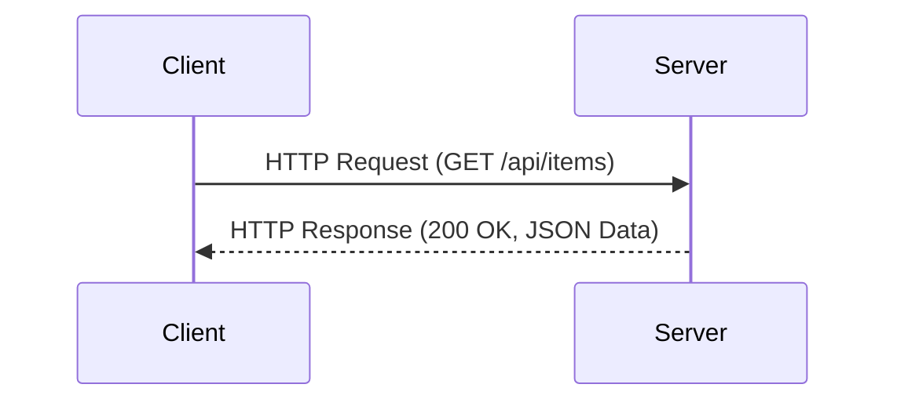

## 3.9 Communication Protocols and Network Programming

In the realm of modern software development, communication protocols and network programming are pivotal for building scalable, efficient, and robust applications. Scala, with its powerful features and libraries, provides a versatile platform for implementing various communication protocols. In this section, we will delve into the implementation of RESTful services using the Play Framework and Akka HTTP, as well as explore other protocols like gRPC and GraphQL.

### Introduction to Communication Protocols

Communication protocols define the rules and conventions for data exchange between systems. They ensure that data is transmitted accurately and efficiently across networks. In Scala, we can leverage various libraries and frameworks to implement these protocols, enabling seamless communication between distributed systems.

### RESTful Services with Play Framework

The Play Framework is a high-velocity web framework for Java and Scala. It is designed to facilitate the development of web applications with a focus on developer productivity and performance. Play is built on top of Akka and provides a reactive model for handling HTTP requests.

#### Key Features of Play Framework

- **Asynchronous I/O**: Play uses non-blocking I/O operations, allowing it to handle a large number of concurrent requests efficiently.
- **Hot Reloading**: Developers can see changes in real-time without restarting the server.
- **Built-in Testing**: Play includes tools for unit testing and integration testing, ensuring robust application development.

#### Implementing RESTful Services

To implement a RESTful service using the Play Framework, follow these steps:

1. **Set Up a Play Project**: Use the Play command line tool to create a new project.
2. **Define Routes**: Specify the endpoints and their corresponding controllers in the `conf/routes` file.
3. **Create Controllers**: Implement the logic for handling requests in controller classes.
4. **Handle JSON**: Use Play's JSON library to parse and generate JSON data.

Here is a simple example of a RESTful service using Play:

```scala
// conf/routes
GET     /api/items          controllers.ItemController.list
POST    /api/items          controllers.ItemController.create

// app/controllers/ItemController.scala
package controllers

import play.api.mvc._
import play.api.libs.json._
import javax.inject._

case class Item(id: Long, name: String, price: Double)

object Item {
  implicit val itemFormat: Format[Item] = Json.format[Item]
}

@Singleton
class ItemController @Inject()(cc: ControllerComponents) extends AbstractController(cc) {
  private var items = List(
    Item(1, "Laptop", 999.99),
    Item(2, "Smartphone", 499.99)
  )

  def list: Action[AnyContent] = Action {
    Ok(Json.toJson(items))
  }

  def create: Action[JsValue] = Action(parse.json) { request =>
    request.body.validate[Item].fold(
      errors => BadRequest(Json.obj("message" -> "Invalid data")),
      item => {
        items = items :+ item
        Created(Json.toJson(item))
      }
    )
  }
}
```

### RESTful Services with Akka HTTP

Akka HTTP is a toolkit for building HTTP-based applications in Scala. It is built on top of Akka, a powerful actor-based framework, and provides a flexible and efficient way to handle HTTP requests.

#### Key Features of Akka HTTP

- **Actor Model**: Akka HTTP leverages the actor model for handling concurrency, providing a robust foundation for building scalable applications.
- **Streaming Support**: It supports streaming data, making it suitable for applications that require real-time data processing.
- **Modular Design**: Akka HTTP is highly modular, allowing developers to use only the components they need.

#### Implementing RESTful Services

To implement a RESTful service using Akka HTTP, follow these steps:

1. **Set Up an Akka HTTP Project**: Use sbt to create a new project and add Akka HTTP dependencies.
2. **Define Routes**: Use Akka HTTP's routing DSL to define the endpoints and their handlers.
3. **Create Handlers**: Implement the logic for handling requests in handler functions.
4. **Handle JSON**: Use Akka HTTP's JSON support to parse and generate JSON data.

Here is a simple example of a RESTful service using Akka HTTP:

```scala
import akka.actor.ActorSystem
import akka.http.scaladsl.Http
import akka.http.scaladsl.server.Directives._
import akka.http.scaladsl.model.StatusCodes
import akka.http.scaladsl.marshallers.sprayjson.SprayJsonSupport._
import spray.json.DefaultJsonProtocol._

final case class Item(id: Long, name: String, price: Double)

object ItemJsonProtocol extends DefaultJsonProtocol {
  implicit val itemFormat = jsonFormat3(Item)
}

object AkkaHttpServer extends App {
  implicit val system = ActorSystem("akka-http-server")
  import system.dispatcher
  import ItemJsonProtocol._

  var items = List(
    Item(1, "Laptop", 999.99),
    Item(2, "Smartphone", 499.99)
  )

  val route =
    pathPrefix("api" / "items") {
      get {
        complete(items)
      } ~
      post {
        entity(as[Item]) { item =>
          items = items :+ item
          complete(StatusCodes.Created, item)
        }
      }
    }

  Http().newServerAt("localhost", 8080).bind(route)
}
```

### Working with gRPC

gRPC is a high-performance, open-source universal RPC framework. It uses HTTP/2 for transport, Protocol Buffers as the interface description language, and provides features such as authentication, load balancing, and more.

#### Key Features of gRPC

- **HTTP/2**: gRPC leverages HTTP/2 for efficient communication, supporting multiplexing and bidirectional streaming.
- **Protocol Buffers**: It uses Protocol Buffers for serializing structured data, providing a compact and efficient format.
- **Cross-Language Support**: gRPC supports multiple languages, making it suitable for polyglot environments.

#### Implementing gRPC Services in Scala

To implement a gRPC service in Scala, follow these steps:

1. **Define the Service**: Use Protocol Buffers to define the service and messages.
2. **Generate Code**: Use the Protocol Buffers compiler to generate Scala code.
3. **Implement the Service**: Implement the service logic in Scala.
4. **Run the Server**: Set up a gRPC server to handle requests.

Here is a simple example of a gRPC service in Scala:

```proto
// src/main/proto/item.proto
syntax = "proto3";

package item;

service ItemService {
  rpc ListItems (Empty) returns (ItemList);
  rpc CreateItem (Item) returns (Item);
}

message Empty {}

message Item {
  int64 id = 1;
  string name = 2;
  double price = 3;
}

message ItemList {
  repeated Item items = 1;
}
```

```scala
// src/main/scala/item/ItemServiceImpl.scala
package item

import scala.concurrent.Future

class ItemServiceImpl extends ItemServiceGrpc.ItemService {
  private var items = List(
    Item(1, "Laptop", 999.99),
    Item(2, "Smartphone", 499.99)
  )

  override def listItems(request: Empty): Future[ItemList] = {
    Future.successful(ItemList(items))
  }

  override def createItem(request: Item): Future[Item] = {
    items = items :+ request
    Future.successful(request)
  }
}
```

```scala
// src/main/scala/item/ItemServer.scala
package item

import io.grpc.ServerBuilder

object ItemServer extends App {
  val server = ServerBuilder.forPort(8080)
    .addService(ItemServiceGrpc.bindService(new ItemServiceImpl, scala.concurrent.ExecutionContext.global))
    .build
    .start

  println("Server started, listening on 8080")
  server.awaitTermination()
}
```

### Working with GraphQL

GraphQL is a query language for APIs and a runtime for executing those queries with your existing data. It provides a more flexible alternative to REST, allowing clients to request exactly the data they need.

#### Key Features of GraphQL

- **Flexible Queries**: Clients can request specific fields, reducing over-fetching and under-fetching of data.
- **Strongly Typed Schema**: GraphQL APIs are defined by a schema, providing a clear contract between client and server.
- **Real-Time Updates**: GraphQL supports subscriptions for real-time data updates.

#### Implementing GraphQL Services in Scala

To implement a GraphQL service in Scala, follow these steps:

1. **Define the Schema**: Use a schema definition language to define the types and queries.
2. **Implement Resolvers**: Implement the logic for resolving queries and mutations.
3. **Set Up the Server**: Use a GraphQL library to handle requests and execute queries.

Here is a simple example of a GraphQL service in Scala using Sangria:

```scala
// build.sbt
libraryDependencies += "org.sangria-graphql" %% "sangria" % "2.0.0"

// src/main/scala/graphql/SchemaDefinition.scala
package graphql

import sangria.schema._

case class Item(id: Long, name: String, price: Double)

object SchemaDefinition {
  val ItemType = ObjectType(
    "Item",
    fields[Unit, Item](
      Field("id", LongType, resolve = _.value.id),
      Field("name", StringType, resolve = _.value.name),
      Field("price", FloatType, resolve = _.value.price)
    )
  )

  val QueryType = ObjectType(
    "Query",
    fields[Unit, Unit](
      Field("items", ListType(ItemType), resolve = _ => items)
    )
  )

  val schema = Schema(QueryType)

  var items = List(
    Item(1, "Laptop", 999.99),
    Item(2, "Smartphone", 499.99)
  )
}
```

```scala
// src/main/scala/graphql/GraphQLServer.scala
package graphql

import akka.http.scaladsl.Http
import akka.http.scaladsl.server.Directives._
import sangria.execution.Executor
import sangria.marshalling.sprayJson._
import spray.json._

object GraphQLServer extends App {
  import SchemaDefinition._

  val route =
    path("graphql") {
      post {
        entity(as[JsValue]) { requestJson =>
          val query = requestJson.convertTo[JsObject].fields("query").convertTo[String]
          complete(Executor.execute(schema, query).map(_.toJson))
        }
      }
    }

  Http().newServerAt("localhost", 8080).bind(route)
}
```

### Try It Yourself

Experiment with the code examples provided in this section. Try modifying the routes, adding new fields to the data models, or implementing additional features such as authentication or error handling. This hands-on approach will deepen your understanding of communication protocols and network programming in Scala.

### Visualizing Communication Protocols

To better understand the flow of data in communication protocols, let's visualize a simple RESTful service architecture using Mermaid.js:



This diagram illustrates the basic interaction between a client and a server in a RESTful service, where the client sends an HTTP request and the server responds with data.

### References and Links

- [Play Framework Documentation](https://www.playframework.com/documentation/latest/Home)
- [Akka HTTP Documentation](https://doc.akka.io/docs/akka-http/current/)
- [gRPC Documentation](https://grpc.io/docs/)
- [GraphQL Documentation](https://graphql.org/learn/)
- [Sangria GraphQL Library](https://sangria-graphql.github.io/)

### Knowledge Check

- What are the key differences between REST and GraphQL?
- How does gRPC leverage HTTP/2 for communication?
- What are the advantages of using Akka HTTP for building RESTful services?

### Embrace the Journey

Remember, mastering communication protocols and network programming in Scala is a journey. As you progress, you'll build more complex and efficient systems. Keep experimenting, stay curious, and enjoy the journey!

### Conclusion

In this section, we explored the implementation of communication protocols and network programming in Scala. By leveraging frameworks like Play and Akka HTTP, and protocols like gRPC and GraphQL, you can build robust and scalable applications. Continue to explore these technologies and apply them to your projects for optimal results.

## Quiz Time!



### What is a key feature of the Play Framework?

- [x] Asynchronous I/O
- [ ] Synchronous I/O
- [ ] Only supports Java
- [ ] Requires server restart for changes

> **Explanation:** Play Framework uses asynchronous I/O to handle a large number of concurrent requests efficiently.

### Which protocol does gRPC use for transport?

- [x] HTTP/2
- [ ] HTTP/1.1
- [ ] WebSocket
- [ ] FTP

> **Explanation:** gRPC leverages HTTP/2 for efficient communication, supporting multiplexing and bidirectional streaming.

### What is a benefit of using Akka HTTP?

- [x] Actor Model for concurrency
- [ ] Requires a separate server
- [ ] Only supports REST
- [ ] No support for streaming

> **Explanation:** Akka HTTP uses the actor model for handling concurrency, providing a robust foundation for scalable applications.

### What language is used to define a gRPC service?

- [x] Protocol Buffers
- [ ] XML
- [ ] YAML
- [ ] JSON

> **Explanation:** gRPC uses Protocol Buffers as the interface description language for defining services and messages.

### Which feature does GraphQL provide?

- [x] Flexible Queries
- [ ] Fixed Queries
- [ ] Only supports GET requests
- [ ] No real-time updates

> **Explanation:** GraphQL allows clients to request specific fields, reducing over-fetching and under-fetching of data.

### What is a key advantage of using GraphQL?

- [x] Strongly Typed Schema
- [ ] Only supports REST
- [ ] Requires XML for data
- [ ] No support for mutations

> **Explanation:** GraphQL APIs are defined by a schema, providing a clear contract between client and server.

### How does Akka HTTP handle JSON data?

- [x] With JSON support libraries
- [ ] Only supports XML
- [ ] Requires manual parsing
- [ ] No support for JSON

> **Explanation:** Akka HTTP provides JSON support for parsing and generating JSON data.

### What is a common use case for gRPC?

- [x] Cross-language communication
- [ ] Only supports Scala
- [ ] Requires REST endpoints
- [ ] No support for streaming

> **Explanation:** gRPC supports multiple languages, making it suitable for polyglot environments.

### Which framework supports hot reloading?

- [x] Play Framework
- [ ] Akka HTTP
- [ ] gRPC
- [ ] GraphQL

> **Explanation:** Play Framework supports hot reloading, allowing developers to see changes in real-time without restarting the server.

### True or False: GraphQL supports real-time updates through subscriptions.

- [x] True
- [ ] False

> **Explanation:** GraphQL supports subscriptions for real-time data updates, allowing clients to receive updates when data changes.


