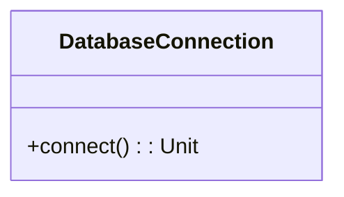
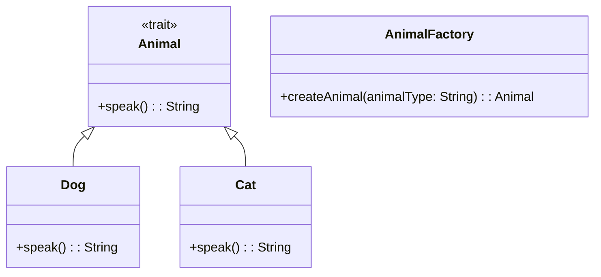
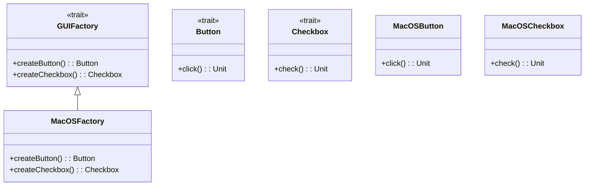
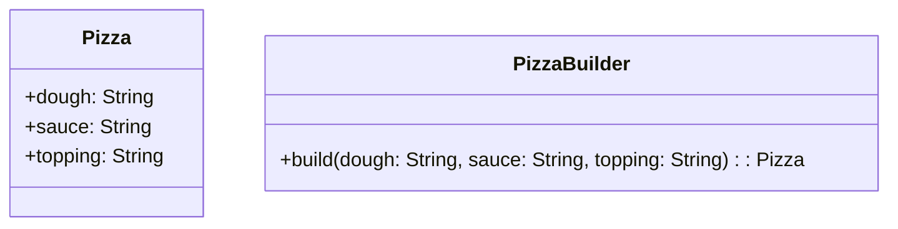
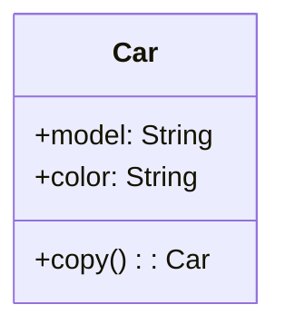

## 4.1 Adapting Creational Patterns to Functional and Object-Oriented Scala

In the realm of software design, creational patterns play a pivotal role in defining the best practices for object creation mechanisms. These patterns aim to make the system independent of how its objects are created, composed, and represented. In Scala, with its unique blend of functional and object-oriented paradigms, adapting these patterns requires a nuanced understanding of both approaches. This section delves into how we can effectively adapt traditional creational design patterns to leverage Scala's capabilities, enhancing code clarity, maintainability, and scalability.

### Introduction to Creational Patterns

Creational design patterns abstract the instantiation process, allowing systems to be configured with "product" objects at runtime. These patterns are particularly useful when a system must be independent of how its objects are created or when a system is composed of objects that interact in complex ways.

**Key Creational Patterns:**

- **Singleton Pattern**: Ensures a class has only one instance and provides a global point of access to it.
- **Factory Method Pattern**: Defines an interface for creating an object, but lets subclasses alter the type of objects that will be created.
- **Abstract Factory Pattern**: Provides an interface for creating families of related or dependent objects without specifying their concrete classes.
- **Builder Pattern**: Separates the construction of a complex object from its representation, allowing the same construction process to create different representations.
- **Prototype Pattern**: Specifies the kinds of objects to create using a prototypical instance and creates new objects by copying this prototype.

### Adapting Creational Patterns in Scala

Scala's functional programming features, such as immutability, higher-order functions, and pattern matching, offer new ways to implement these patterns. Additionally, Scala's object-oriented features, like traits and case classes, provide powerful tools for adapting traditional patterns.

#### Singleton Pattern in Scala

**Intent**: Ensure a class has only one instance and provide a global point of access to it.

In Scala, the Singleton pattern is elegantly implemented using the `object` keyword. Unlike Java, where you typically use a private constructor and a static method to control the instantiation, Scala's `object` inherently ensures a single instance.

```scala
object DatabaseConnection {
  def connect(): Unit = {
    println("Connecting to the database...")
  }
}

// Usage
DatabaseConnection.connect()
```

**Design Considerations**: 
- **Thread Safety**: Scala's `object` is inherently thread-safe, making it an ideal choice for implementing singletons.
- **Lazy Initialization**: The instance is lazily initialized when first accessed, which can be beneficial for performance.

#### Factory Method Pattern in Scala

**Intent**: Define an interface for creating an object, but let subclasses alter the type of objects that will be created.

Scala's traits and case classes can be leveraged to implement the Factory Method pattern. By using traits, we can define a common interface, and case classes can provide concrete implementations.

```scala
trait Animal {
  def speak(): String
}

case class Dog() extends Animal {
  def speak(): String = "Woof"
}

case class Cat() extends Animal {
  def speak(): String = "Meow"
}

object AnimalFactory {
  def createAnimal(animalType: String): Animal = animalType match {
    case "dog" => Dog()
    case "cat" => Cat()
    case _     => throw new IllegalArgumentException("Unknown animal type")
  }
}

// Usage
val dog = AnimalFactory.createAnimal("dog")
println(dog.speak())  // Output: Woof
```

**Design Considerations**:
- **Pattern Matching**: Scala's pattern matching simplifies the implementation of factory methods, allowing for concise and readable code.
- **Extensibility**: Adding new animal types requires minimal changes, enhancing maintainability.

#### Abstract Factory Pattern in Scala

**Intent**: Provide an interface for creating families of related or dependent objects without specifying their concrete classes.

The Abstract Factory pattern can be implemented using traits and objects in Scala. Traits define the abstract factory interface, and objects provide concrete implementations.

```scala
trait GUIFactory {
  def createButton(): Button
  def createCheckbox(): Checkbox
}

trait Button {
  def click(): Unit
}

trait Checkbox {
  def check(): Unit
}

object MacOSFactory extends GUIFactory {
  def createButton(): Button = new MacOSButton
  def createCheckbox(): Checkbox = new MacOSCheckbox
}

class MacOSButton extends Button {
  def click(): Unit = println("MacOS Button clicked")
}

class MacOSCheckbox extends Checkbox {
  def check(): Unit = println("MacOS Checkbox checked")
}

// Usage
val factory: GUIFactory = MacOSFactory
val button = factory.createButton()
button.click()
```

**Design Considerations**:
- **Scalability**: Easily extendable to support new GUI components or platforms.
- **Decoupling**: Clients are decoupled from concrete classes, promoting flexibility.

#### Builder Pattern in Scala

**Intent**: Separate the construction of a complex object from its representation, allowing the same construction process to create different representations.

Scala's case classes and the `copy` method provide a natural way to implement the Builder pattern, especially for immutable objects.

```scala
case class Pizza(dough: String, sauce: String, topping: String)

object PizzaBuilder {
  def build(dough: String, sauce: String, topping: String): Pizza = {
    Pizza(dough, sauce, topping)
  }
}

// Usage
val pizza = PizzaBuilder.build("Thin", "Tomato", "Cheese")
println(pizza)
```

**Design Considerations**:
- **Immutability**: Case classes ensure immutability, which is a key aspect of functional programming.
- **Fluent Interface**: Method chaining can be used to create a fluent interface, enhancing readability.

#### Prototype Pattern in Scala

**Intent**: Specify the kinds of objects to create using a prototypical instance and create new objects by copying this prototype.

Scala's case classes inherently support cloning through the `copy` method, making them ideal for implementing the Prototype pattern.

```scala
case class Car(model: String, color: String)

val originalCar = Car("Tesla", "Red")
val clonedCar = originalCar.copy()

println(clonedCar)  // Output: Car(Tesla,Red)
```

**Design Considerations**:
- **Immutability**: Case classes are immutable, ensuring that the prototype cannot be altered.
- **Ease of Use**: The `copy` method simplifies the cloning process.

### Visualizing Creational Patterns in Scala

To better understand how these patterns fit together, let's visualize the relationships and flow of these patterns using Mermaid.js diagrams.

#### Singleton Pattern Diagram



**Caption**: The Singleton pattern in Scala using an `object`.

#### Factory Method Pattern Diagram



**Caption**: The Factory Method pattern in Scala using traits and case classes.

#### Abstract Factory Pattern Diagram



**Caption**: The Abstract Factory pattern in Scala using traits and objects.

#### Builder Pattern Diagram



**Caption**: The Builder pattern in Scala using case classes and a builder object.

#### Prototype Pattern Diagram



**Caption**: The Prototype pattern in Scala using case classes and the `copy` method.

### Differences and Similarities

When adapting creational patterns to Scala, it's essential to understand the differences and similarities with traditional implementations:

- **Singleton Pattern**: Scala's `object` provides a more concise and thread-safe implementation compared to Java's static methods.
- **Factory Method Pattern**: Scala's pattern matching and case classes simplify the creation logic, making it more readable and maintainable.
- **Abstract Factory Pattern**: Traits and objects in Scala offer a flexible way to define and implement abstract factories.
- **Builder Pattern**: Scala's case classes and `copy` method provide a natural way to implement builders for immutable objects.
- **Prototype Pattern**: The `copy` method in case classes simplifies cloning, a core aspect of the Prototype pattern.

### Try It Yourself

To solidify your understanding, try modifying the code examples provided:

- **Singleton Pattern**: Add a method to the `DatabaseConnection` object that returns the connection status.
- **Factory Method Pattern**: Extend the `AnimalFactory` to include a new animal type, such as `Bird`.
- **Abstract Factory Pattern**: Implement a new factory for a different platform, such as `WindowsFactory`.
- **Builder Pattern**: Add more attributes to the `Pizza` case class and update the builder accordingly.
- **Prototype Pattern**: Experiment with creating a deep copy of a case class that contains nested objects.

### Knowledge Check

To ensure you've grasped the concepts, consider the following questions:

- How does Scala's `object` keyword simplify the Singleton pattern?
- What advantages do case classes provide when implementing the Prototype pattern?
- How can pattern matching enhance the Factory Method pattern in Scala?
- Why is immutability important in the Builder pattern?
- How do traits facilitate the Abstract Factory pattern in Scala?

### Summary

Adapting creational patterns to Scala's functional and object-oriented paradigms offers numerous benefits, including enhanced code clarity, maintainability, and scalability. By leveraging Scala's unique features, such as traits, case classes, and pattern matching, we can implement these patterns in a way that aligns with modern software development practices.

Remember, this is just the beginning. As you progress, you'll discover more ways to harness Scala's capabilities to create robust and efficient software systems. Keep experimenting, stay curious, and enjoy the journey!

## Quiz Time!



### How does Scala's `object` keyword simplify the Singleton pattern?

- [x] It inherently ensures a single instance and is thread-safe.
- [ ] It requires additional code for thread safety.
- [ ] It allows multiple instances to be created.
- [ ] It is not suitable for implementing singletons.

> **Explanation:** Scala's `object` keyword inherently ensures a single instance and is thread-safe, making it ideal for implementing the Singleton pattern.

### What advantage do case classes provide when implementing the Prototype pattern?

- [x] They provide a `copy` method for easy cloning.
- [ ] They require manual implementation of cloning.
- [ ] They do not support cloning.
- [ ] They are mutable by default.

> **Explanation:** Case classes in Scala provide a `copy` method that simplifies cloning, which is a core aspect of the Prototype pattern.

### How can pattern matching enhance the Factory Method pattern in Scala?

- [x] It simplifies the creation logic and improves readability.
- [ ] It complicates the creation logic.
- [ ] It is not applicable to the Factory Method pattern.
- [ ] It makes the code less maintainable.

> **Explanation:** Pattern matching in Scala simplifies the creation logic and improves readability, making it a valuable tool for implementing the Factory Method pattern.

### Why is immutability important in the Builder pattern?

- [x] It ensures the constructed objects are thread-safe and consistent.
- [ ] It makes the objects mutable.
- [ ] It complicates the construction process.
- [ ] It is not relevant to the Builder pattern.

> **Explanation:** Immutability ensures that the constructed objects are thread-safe and consistent, which is crucial for the Builder pattern.

### How do traits facilitate the Abstract Factory pattern in Scala?

- [x] They define interfaces for creating families of related objects.
- [ ] They make the code less flexible.
- [ ] They are not suitable for defining interfaces.
- [ ] They complicate the implementation.

> **Explanation:** Traits in Scala define interfaces for creating families of related objects, facilitating the implementation of the Abstract Factory pattern.

### What is a key benefit of using `object` for Singleton in Scala?

- [x] Lazy initialization and thread safety.
- [ ] Requires explicit synchronization.
- [ ] Allows multiple instances.
- [ ] Increases code complexity.

> **Explanation:** Using `object` in Scala provides lazy initialization and thread safety, making it an efficient choice for implementing the Singleton pattern.

### Which Scala feature is particularly useful for the Factory Method pattern?

- [x] Pattern matching.
- [ ] Implicit conversions.
- [ ] Type classes.
- [ ] Macros.

> **Explanation:** Pattern matching is particularly useful for the Factory Method pattern in Scala, as it simplifies the creation logic and enhances readability.

### In the Builder pattern, what does the `copy` method in case classes facilitate?

- [x] Creating modified copies of immutable objects.
- [ ] Making objects mutable.
- [ ] Increasing object complexity.
- [ ] Reducing code readability.

> **Explanation:** The `copy` method in case classes facilitates creating modified copies of immutable objects, which is essential for the Builder pattern.

### How does the Prototype pattern benefit from Scala's case classes?

- [x] Simplifies cloning with the `copy` method.
- [ ] Requires manual cloning implementation.
- [ ] Does not support cloning.
- [ ] Increases code complexity.

> **Explanation:** Scala's case classes simplify cloning with the `copy` method, making them ideal for implementing the Prototype pattern.

### True or False: Scala's `object` keyword is inherently thread-safe.

- [x] True
- [ ] False

> **Explanation:** True. Scala's `object` keyword is inherently thread-safe, making it suitable for implementing the Singleton pattern.


