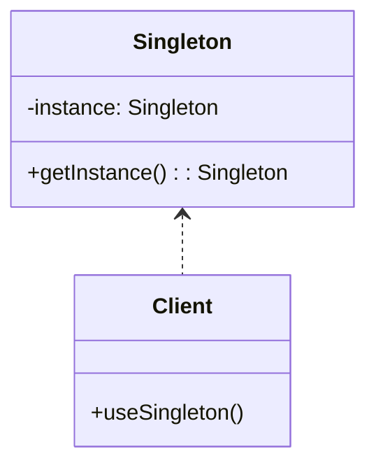

## 4.2 Singleton Pattern

In the realm of software design patterns, the Singleton Pattern stands out as a fundamental creational pattern. Its primary intent is to ensure that a class has only one instance and to provide a global point of access to that instance. This pattern is particularly useful in scenarios where a single instance of a class is required to coordinate actions across a system, such as in configuration settings, logging, or connection pooling.

### Intent

The Singleton Pattern aims to:
- **Ensure a class has only one instance**: This is crucial in scenarios where having multiple instances would lead to inconsistent states or resource conflicts.
- **Provide a global point of access**: This allows different parts of a program to access the same instance without having to pass it around explicitly.

### Key Participants

1. **Singleton Class**: The class that is responsible for creating and managing its sole instance.
2. **Client**: Any code that accesses the Singleton instance.

### Applicability

The Singleton Pattern is applicable when:
- There must be exactly one instance of a class, and it must be accessible to clients from a well-known access point.
- The sole instance should be extensible by subclassing, and clients should be able to use an extended instance without modifying their code.

### Implementing Singletons with Scala Objects

Scala provides a straightforward way to implement the Singleton Pattern using the `object` keyword. Unlike classes, objects in Scala are lazily initialized and are inherently singletons. This means that the first time an object is accessed, it is instantiated, and subsequent accesses return the same instance.

#### Example: Basic Singleton Implementation

```scala
object Logger {
  def log(message: String): Unit = {
    println(s"Log: $message")
  }
}

// Usage
Logger.log("This is a singleton logger.")
```

In this example, `Logger` is a singleton object. It provides a `log` method that can be accessed globally throughout the application.

### Thread Safety and Initialization

One of the critical aspects of implementing a Singleton Pattern is ensuring thread safety, especially in a multi-threaded environment. Scala's `object` provides thread safety out of the box because it is initialized in a thread-safe manner. However, if additional initialization logic is required, care must be taken to ensure that it does not introduce race conditions.

#### Example: Thread-Safe Singleton with Initialization Logic

```scala
object Configuration {
  private var initialized = false
  private var settings: Map[String, String] = _

  def initialize(config: Map[String, String]): Unit = synchronized {
    if (!initialized) {
      settings = config
      initialized = true
    }
  }

  def getSetting(key: String): Option[String] = settings.get(key)
}

// Usage
Configuration.initialize(Map("host" -> "localhost", "port" -> "8080"))
println(Configuration.getSetting("host")) // Output: Some(localhost)
```

In this example, the `Configuration` object is a singleton that holds application settings. The `initialize` method is synchronized to ensure that the settings are only initialized once, even in a multi-threaded environment.

### Design Considerations

- **Lazy Initialization**: Scala's `object` is lazily initialized, meaning it is only created when it is first accessed. This can be beneficial for resource management, as it avoids unnecessary initialization.
- **Serialization**: If a singleton needs to be serialized, care must be taken to ensure that deserialization does not create a new instance. This can be handled by implementing the `readResolve` method.
- **Testing**: Singletons can be challenging to test because they maintain state across tests. Dependency injection or mocking frameworks can help isolate singletons in tests.

### Differences and Similarities with Other Patterns

The Singleton Pattern is often confused with the Factory Pattern, as both involve object creation. However, the Factory Pattern focuses on creating instances of various classes, while the Singleton Pattern ensures a single instance of a specific class. Additionally, the Singleton Pattern can be seen as a special case of the Factory Pattern where the factory method always returns the same instance.

### Visualizing the Singleton Pattern

To better understand the Singleton Pattern, let's visualize it using a class diagram:



In this diagram, the `Singleton` class has a private static instance and a public method `getInstance()` to access it. The `Client` class uses this method to interact with the Singleton instance.

### Try It Yourself

To deepen your understanding of the Singleton Pattern in Scala, try modifying the examples above:
- Add additional methods to the `Logger` singleton to log messages at different levels (e.g., info, warning, error).
- Extend the `Configuration` singleton to support updating settings after initialization, ensuring thread safety.

### Knowledge Check

- What are the primary benefits of using the Singleton Pattern?
- How does Scala's `object` keyword simplify Singleton implementation?
- What considerations should be taken into account when implementing a Singleton in a multi-threaded environment?

### Further Reading

For more information on the Singleton Pattern and its applications, consider exploring the following resources:
- [Design Patterns: Elements of Reusable Object-Oriented Software](https://en.wikipedia.org/wiki/Design_Patterns)
- [Scala Documentation on Objects](https://docs.scala-lang.org/tour/singleton-objects.html)

## Quiz Time!



### What is the primary intent of the Singleton Pattern?

- [x] To ensure a class has only one instance and provide a global point of access.
- [ ] To create multiple instances of a class.
- [ ] To manage dependencies between classes.
- [ ] To encapsulate object creation logic.

> **Explanation:** The Singleton Pattern ensures a class has only one instance and provides a global point of access to it.

### How does Scala's `object` keyword help in implementing the Singleton Pattern?

- [x] It provides a thread-safe, lazily initialized singleton instance.
- [ ] It allows multiple instances of a class.
- [ ] It requires explicit synchronization for thread safety.
- [ ] It does not support lazy initialization.

> **Explanation:** Scala's `object` keyword creates a lazily initialized, thread-safe singleton instance.

### What is a potential challenge when using the Singleton Pattern?

- [x] Testing can be difficult due to shared state.
- [ ] It allows too many instances of a class.
- [ ] It complicates object creation.
- [ ] It requires extensive use of inheritance.

> **Explanation:** Singletons maintain state across tests, making them challenging to test.

### Which method can be used to ensure a singleton remains a single instance during serialization?

- [x] Implementing the `readResolve` method.
- [ ] Using the `writeObject` method.
- [ ] Overriding the `toString` method.
- [ ] Implementing the `clone` method.

> **Explanation:** The `readResolve` method ensures that deserialization returns the existing singleton instance.

### What is a common misconception about the Singleton Pattern?

- [x] It is often confused with the Factory Pattern.
- [ ] It is the same as the Observer Pattern.
- [ ] It is only used for logging.
- [ ] It cannot be used in multi-threaded environments.

> **Explanation:** The Singleton Pattern is often confused with the Factory Pattern, but they serve different purposes.

### What is a key benefit of lazy initialization in singletons?

- [x] It avoids unnecessary resource allocation.
- [ ] It complicates the initialization process.
- [ ] It requires manual synchronization.
- [ ] It prevents object creation.

> **Explanation:** Lazy initialization ensures resources are allocated only when needed.

### How can thread safety be ensured in a singleton with initialization logic?

- [x] By synchronizing the initialization method.
- [ ] By allowing multiple threads to initialize simultaneously.
- [ ] By avoiding any initialization logic.
- [ ] By using a separate thread for initialization.

> **Explanation:** Synchronizing the initialization method ensures thread safety.

### What is a common use case for the Singleton Pattern?

- [x] Configuration settings management.
- [ ] Creating multiple database connections.
- [ ] Implementing complex algorithms.
- [ ] Managing user sessions.

> **Explanation:** The Singleton Pattern is often used for managing configuration settings.

### True or False: The Singleton Pattern can be used to create multiple instances of a class.

- [ ] True
- [x] False

> **Explanation:** The Singleton Pattern ensures only one instance of a class is created.

### Which of the following is NOT a characteristic of the Singleton Pattern?

- [x] It allows multiple instances of a class.
- [ ] It provides a global point of access.
- [ ] It ensures a single instance of a class.
- [ ] It can be lazily initialized.

> **Explanation:** The Singleton Pattern does not allow multiple instances of a class.



Remember, mastering the Singleton Pattern is just the beginning of your journey in understanding design patterns in Scala. Keep exploring, experimenting, and applying these concepts to build robust and efficient software systems.
