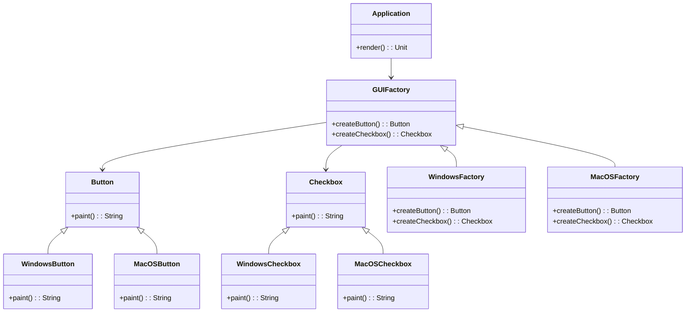

## 4.3 Factory Patterns

Factory Patterns are a cornerstone of object-oriented design, providing a way to encapsulate the instantiation of objects. In Scala, these patterns are adapted to leverage the language's functional and object-oriented paradigms, offering flexibility and scalability. This section will delve into three primary factory patterns: the Simple Factory Pattern, the Factory Method Pattern, and the Abstract Factory Pattern.

### Simple Factory Pattern

#### Intent

The Simple Factory Pattern aims to encapsulate the creation logic of objects, making it easier to manage and modify without affecting the client code. It is not a formal design pattern but a common practice used to simplify object creation.

#### Key Participants

- **Factory**: The central component that contains the logic to create and return instances of various classes.
- **Product**: The interface or abstract class for objects created by the factory.
- **Concrete Product**: The specific implementations of the Product interface.

#### Applicability

Use the Simple Factory Pattern when:
- You need to centralize the creation logic of objects.
- You want to decouple the client code from the concrete classes it instantiates.

#### Sample Code Snippet

```scala
// Define a trait for the Product
trait Animal {
  def speak(): String
}

// Concrete Product implementations
class Dog extends Animal {
  override def speak(): String = "Woof!"
}

class Cat extends Animal {
  override def speak(): String = "Meow!"
}

// Simple Factory
object AnimalFactory {
  def createAnimal(animalType: String): Option[Animal] = animalType.toLowerCase match {
    case "dog" => Some(new Dog())
    case "cat" => Some(new Cat())
    case _ => None
  }
}

// Usage
val dog = AnimalFactory.createAnimal("dog")
val cat = AnimalFactory.createAnimal("cat")

dog.foreach(d => println(d.speak())) // Outputs: Woof!
cat.foreach(c => println(c.speak())) // Outputs: Meow!
```

#### Design Considerations

- **Simplicity**: The Simple Factory Pattern is straightforward and easy to implement.
- **Scalability**: Adding new products requires modifying the factory, which can lead to maintenance challenges as the number of products grows.
- **Error Handling**: Consider how to handle cases where the factory cannot create an object (e.g., returning `None` in Scala).

#### Try It Yourself

Experiment with the Simple Factory Pattern by adding a new `Animal` type, such as `Bird`, and update the `AnimalFactory` to support it.

### Factory Method Pattern

#### Intent

The Factory Method Pattern defines an interface for creating an object but allows subclasses to alter the type of objects that will be created. This pattern promotes loose coupling by delegating the instantiation process to subclasses.

#### Key Participants

- **Creator**: The abstract class or interface that declares the factory method.
- **Concrete Creator**: Subclasses that implement the factory method to create specific products.
- **Product**: The interface or abstract class for objects created by the factory method.
- **Concrete Product**: The specific implementations of the Product interface.

#### Applicability

Use the Factory Method Pattern when:
- A class cannot anticipate the class of objects it must create.
- A class wants its subclasses to specify the objects it creates.
- You want to localize the knowledge of which class to instantiate.

#### Sample Code Snippet

```scala
// Define a trait for the Product
trait Transport {
  def deliver(): String
}

// Concrete Product implementations
class Truck extends Transport {
  override def deliver(): String = "Delivering by land in a truck."
}

class Ship extends Transport {
  override def deliver(): String = "Delivering by sea in a ship."
}

// Creator
abstract class Logistics {
  def createTransport(): Transport
  def planDelivery(): String = {
    val transport = createTransport()
    transport.deliver()
  }
}

// Concrete Creators
class RoadLogistics extends Logistics {
  override def createTransport(): Transport = new Truck()
}

class SeaLogistics extends Logistics {
  override def createTransport(): Transport = new Ship()
}

// Usage
val roadLogistics = new RoadLogistics()
println(roadLogistics.planDelivery()) // Outputs: Delivering by land in a truck.

val seaLogistics = new SeaLogistics()
println(seaLogistics.planDelivery()) // Outputs: Delivering by sea in a ship.
```

#### Design Considerations

- **Flexibility**: The Factory Method Pattern allows for greater flexibility in object creation.
- **Complexity**: It introduces additional complexity by requiring subclasses for each product type.
- **Extensibility**: Adding new products involves creating new subclasses, making it easier to extend.

#### Differences and Similarities

- **Simple Factory vs. Factory Method**: The Simple Factory centralizes object creation, while the Factory Method delegates it to subclasses.
- **Factory Method vs. Abstract Factory**: The Factory Method focuses on creating a single product, whereas the Abstract Factory deals with families of related products.

#### Try It Yourself

Modify the `Logistics` example to include a new transport method, such as `AirLogistics`, which uses a `Plane` as the transport.

### Abstract Factory Pattern

#### Intent

The Abstract Factory Pattern provides an interface for creating families of related or dependent objects without specifying their concrete classes. It is particularly useful when a system needs to be independent of how its products are created.

#### Key Participants

- **Abstract Factory**: The interface that declares a set of methods for creating abstract products.
- **Concrete Factory**: Implements the methods to create concrete products.
- **Abstract Product**: The interface for a type of product.
- **Concrete Product**: The specific implementations of the Abstract Product interface.
- **Client**: Uses the Abstract Factory to create products.

#### Applicability

Use the Abstract Factory Pattern when:
- A system should be independent of how its products are created, composed, and represented.
- A system should be configured with one of multiple families of products.
- You want to provide a library of products and reveal only their interfaces.

#### Sample Code Snippet

```scala
// Abstract Products
trait Button {
  def paint(): String
}

trait Checkbox {
  def paint(): String
}

// Concrete Products
class WindowsButton extends Button {
  override def paint(): String = "Rendering a button in Windows style."
}

class MacOSButton extends Button {
  override def paint(): String = "Rendering a button in MacOS style."
}

class WindowsCheckbox extends Checkbox {
  override def paint(): String = "Rendering a checkbox in Windows style."
}

class MacOSCheckbox extends Checkbox {
  override def paint(): String = "Rendering a checkbox in MacOS style."
}

// Abstract Factory
trait GUIFactory {
  def createButton(): Button
  def createCheckbox(): Checkbox
}

// Concrete Factories
class WindowsFactory extends GUIFactory {
  override def createButton(): Button = new WindowsButton()
  override def createCheckbox(): Checkbox = new WindowsCheckbox()
}

class MacOSFactory extends GUIFactory {
  override def createButton(): Button = new MacOSButton()
  override def createCheckbox(): Checkbox = new MacOSCheckbox()
}

// Client
class Application(factory: GUIFactory) {
  private val button: Button = factory.createButton()
  private val checkbox: Checkbox = factory.createCheckbox()

  def render(): Unit = {
    println(button.paint())
    println(checkbox.paint())
  }
}

// Usage
val windowsApp = new Application(new WindowsFactory())
windowsApp.render() // Outputs: Rendering a button in Windows style. Rendering a checkbox in Windows style.

val macApp = new Application(new MacOSFactory())
macApp.render() // Outputs: Rendering a button in MacOS style. Rendering a checkbox in MacOS style.
```

#### Design Considerations

- **Consistency**: Ensures that products from the same family are used together.
- **Complexity**: Can be complex to implement due to the number of interfaces and classes involved.
- **Extensibility**: Adding new product families requires creating new factories and products.

#### Differences and Similarities

- **Factory Method vs. Abstract Factory**: The Factory Method is about creating a single product, while the Abstract Factory deals with creating families of products.
- **Abstract Factory vs. Builder**: The Abstract Factory is used for creating families of objects, whereas the Builder is used for constructing a complex object step by step.

#### Try It Yourself

Extend the `GUIFactory` example by adding a new product, such as `Slider`, and update the factories to support it.

### Visualizing Factory Patterns

To better understand the relationships and interactions in Factory Patterns, let's visualize them using Mermaid.js diagrams.

#### Simple Factory Pattern Diagram


#### Factory Method Pattern Diagram


#### Abstract Factory Pattern Diagram



### Knowledge Check

- **What are the key differences between the Simple Factory and Factory Method patterns?**
- **How does the Abstract Factory Pattern ensure consistency among product families?**
- **When would you choose to use the Factory Method Pattern over the Simple Factory Pattern?**

### Embrace the Journey

Remember, mastering Factory Patterns is just one step in your Scala journey. As you continue to explore design patterns, you'll gain a deeper understanding of how to build scalable and maintainable applications. Keep experimenting, stay curious, and enjoy the journey!

## Quiz Time!



### What is the primary intent of the Simple Factory Pattern?

- [x] To encapsulate object creation logic
- [ ] To define an interface for creating objects
- [ ] To create families of related objects
- [ ] To simplify object inheritance

> **Explanation:** The Simple Factory Pattern encapsulates the logic for creating objects, making it easier to manage and modify without affecting client code.

### Which pattern allows subclasses to alter the type of objects that will be created?

- [ ] Simple Factory Pattern
- [x] Factory Method Pattern
- [ ] Abstract Factory Pattern
- [ ] Singleton Pattern

> **Explanation:** The Factory Method Pattern allows subclasses to define the type of objects that will be created, promoting loose coupling.

### What is a key benefit of using the Abstract Factory Pattern?

- [ ] It simplifies object inheritance
- [x] It ensures consistency among product families
- [ ] It reduces the number of classes needed
- [ ] It centralizes object creation logic

> **Explanation:** The Abstract Factory Pattern ensures that products from the same family are used together, maintaining consistency.

### In the Factory Method Pattern, what role does the Concrete Creator play?

- [ ] It defines the interface for creating objects
- [x] It implements the factory method to create specific products
- [ ] It encapsulates object creation logic
- [ ] It creates families of related objects

> **Explanation:** The Concrete Creator in the Factory Method Pattern implements the factory method to create specific products.

### How does the Simple Factory Pattern handle error cases where it cannot create an object?

- [x] By returning `None` in Scala
- [ ] By throwing an exception
- [ ] By returning a default object
- [ ] By logging an error message

> **Explanation:** In Scala, the Simple Factory Pattern can handle error cases by returning `None` when it cannot create an object.

### What is a common use case for the Abstract Factory Pattern?

- [ ] When a class cannot anticipate the class of objects it must create
- [ ] When you want to centralize object creation logic
- [x] When a system should be independent of how its products are created
- [ ] When you need to create a single product

> **Explanation:** The Abstract Factory Pattern is used when a system should be independent of how its products are created, composed, and represented.

### Which pattern is best suited for creating a single product?

- [ ] Abstract Factory Pattern
- [x] Factory Method Pattern
- [ ] Simple Factory Pattern
- [ ] Builder Pattern

> **Explanation:** The Factory Method Pattern is best suited for creating a single product, allowing subclasses to define the type of product created.

### What is a potential drawback of the Simple Factory Pattern?

- [ ] It requires too many classes
- [ ] It is too complex to implement
- [x] It can lead to maintenance challenges as the number of products grows
- [ ] It does not support polymorphism

> **Explanation:** The Simple Factory Pattern can lead to maintenance challenges as the number of products grows, requiring modifications to the factory.

### True or False: The Abstract Factory Pattern can be used to create a single product.

- [ ] True
- [x] False

> **Explanation:** The Abstract Factory Pattern is designed to create families of related or dependent objects, not a single product.

### What is the role of the Client in the Abstract Factory Pattern?

- [ ] To define the interface for creating objects
- [ ] To implement the factory method
- [x] To use the Abstract Factory to create products
- [ ] To encapsulate object creation logic

> **Explanation:** In the Abstract Factory Pattern, the Client uses the Abstract Factory to create products, relying on the factory to provide the necessary objects.


