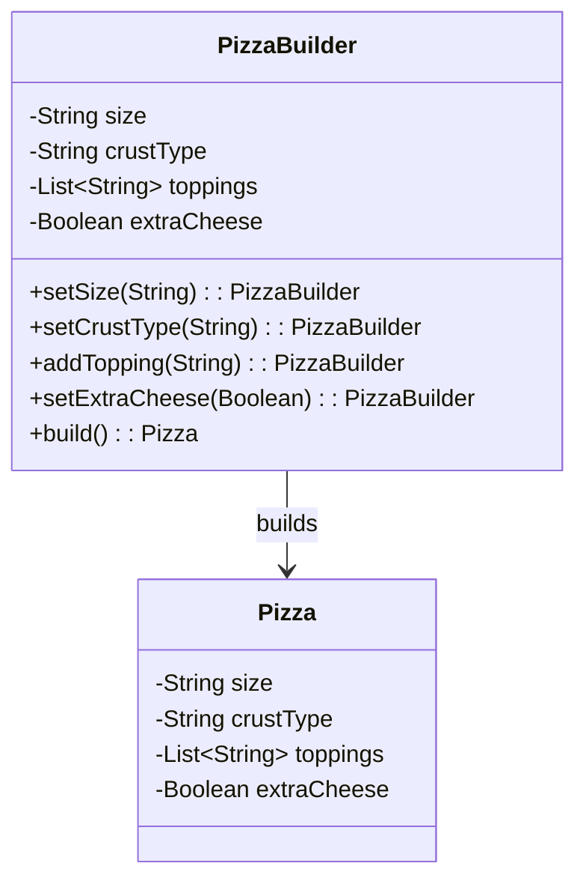

## 4.4 Builder Pattern

In the world of software design, constructing complex objects can often become cumbersome and error-prone, especially when dealing with numerous parameters and configurations. The Builder Pattern offers a solution by providing a flexible and clear approach to object construction. In this section, we will delve into the Builder Pattern, specifically tailored for Scala, and explore how it can be implemented using case classes, copy methods, and fluent interfaces with method chaining.

### Intent

The Builder Pattern is a creational design pattern that aims to separate the construction of a complex object from its representation. This separation allows the same construction process to create different representations. The primary goal is to construct an object step by step, providing a clear and flexible way to manage the complexity of object creation.

### Key Participants

1. **Builder**: An interface or abstract class defining the steps to construct the product.
2. **Concrete Builder**: Implements the Builder interface and provides specific implementations for the construction steps.
3. **Director**: Oversees the construction process, using the Builder interface.
4. **Product**: The complex object that is being constructed.

### Applicability

The Builder Pattern is particularly useful when:
- An object requires numerous parameters for its construction.
- The construction process involves complex steps or configurations.
- You need to create different representations of the same object.
- You want to improve code readability and maintainability by separating object construction logic.

### Implementing Builders with Case Classes and Copy Methods

Scala's case classes provide a convenient way to implement the Builder Pattern, thanks to their immutability and built-in `copy` method. Let's explore how we can leverage these features to construct complex objects.

#### Example: Building a `Pizza` Object

Consider a scenario where we need to construct a `Pizza` object with various attributes such as size, crust type, toppings, and extra cheese. Using the Builder Pattern with case classes, we can achieve this in a clean and flexible manner.

```scala
// Define the Pizza case class
case class Pizza(size: String, crustType: String, toppings: List[String], extraCheese: Boolean)

// Builder for Pizza
class PizzaBuilder {
  private var size: String = "Medium"
  private var crustType: String = "Regular"
  private var toppings: List[String] = List()
  private var extraCheese: Boolean = false

  def setSize(size: String): PizzaBuilder = {
    this.size = size
    this
  }

  def setCrustType(crustType: String): PizzaBuilder = {
    this.crustType = crustType
    this
  }

  def addTopping(topping: String): PizzaBuilder = {
    this.toppings = this.toppings :+ topping
    this
  }

  def setExtraCheese(extraCheese: Boolean): PizzaBuilder = {
    this.extraCheese = extraCheese
    this
  }

  def build(): Pizza = {
    Pizza(size, crustType, toppings, extraCheese)
  }
}

// Usage
val pizza = new PizzaBuilder()
  .setSize("Large")
  .setCrustType("Thin Crust")
  .addTopping("Pepperoni")
  .addTopping("Mushrooms")
  .setExtraCheese(true)
  .build()

println(pizza)
```

In this example, the `PizzaBuilder` class provides methods to set each attribute of the `Pizza` object. Each method returns the builder itself, allowing for method chaining and creating a fluent interface. The `build` method constructs the final `Pizza` object using the specified attributes.

### Fluent Interfaces with Method Chaining

Fluent interfaces enhance code readability by allowing method calls to be chained together in a natural and expressive way. This technique is particularly effective in the Builder Pattern, as it simplifies the process of setting multiple attributes.

#### Example: Fluent Interface for a `Car` Builder

Let's consider another example where we build a `Car` object with attributes such as make, model, year, and color.

```scala
// Define the Car case class
case class Car(make: String, model: String, year: Int, color: String)

// Builder for Car
class CarBuilder {
  private var make: String = ""
  private var model: String = ""
  private var year: Int = 0
  private var color: String = ""

  def setMake(make: String): CarBuilder = {
    this.make = make
    this
  }

  def setModel(model: String): CarBuilder = {
    this.model = model
    this
  }

  def setYear(year: Int): CarBuilder = {
    this.year = year
    this
  }

  def setColor(color: String): CarBuilder = {
    this.color = color
    this
  }

  def build(): Car = {
    Car(make, model, year, color)
  }
}

// Usage
val car = new CarBuilder()
  .setMake("Tesla")
  .setModel("Model S")
  .setYear(2022)
  .setColor("Red")
  .build()

println(car)
```

In this example, the `CarBuilder` class provides a fluent interface for constructing a `Car` object. Each method returns the builder itself, allowing for a clean and readable construction process.

### Design Considerations

When implementing the Builder Pattern in Scala, consider the following:

- **Immutability**: Leverage Scala's case classes and immutability to ensure that the constructed objects are immutable and thread-safe.
- **Fluent Interfaces**: Use method chaining to create fluent interfaces, improving code readability and maintainability.
- **Optional Parameters**: Handle optional parameters gracefully by providing default values or using the `Option` type.
- **Complex Construction Logic**: If the construction process involves complex logic, consider encapsulating it within the builder methods.

### Differences and Similarities with Other Patterns

The Builder Pattern is often compared to the Factory Method and Abstract Factory patterns. Here are some key differences and similarities:

- **Builder vs. Factory Method**: The Factory Method pattern focuses on creating objects through a single method, while the Builder Pattern involves a step-by-step construction process.
- **Builder vs. Abstract Factory**: The Abstract Factory pattern provides an interface for creating families of related objects, whereas the Builder Pattern constructs a single complex object.
- **Similarities**: Both the Builder and Factory patterns aim to abstract the object creation process and provide flexibility in object construction.

### Visualizing the Builder Pattern

To better understand the Builder Pattern, let's visualize the process using a class diagram.



This diagram illustrates the relationship between the `PizzaBuilder` and `Pizza` classes. The builder constructs the `Pizza` object by setting its attributes step by step.

### Try It Yourself

Now that we've explored the Builder Pattern, it's time to experiment with the code examples. Try modifying the `PizzaBuilder` and `CarBuilder` classes to add new attributes or change the construction process. Consider implementing a builder for a different object, such as a `House` or `Computer`, and explore the flexibility and readability that the Builder Pattern provides.

### Knowledge Check

To reinforce your understanding of the Builder Pattern, consider the following questions:

1. What are the key benefits of using the Builder Pattern in Scala?
2. How does method chaining improve code readability in the Builder Pattern?
3. What are some common use cases for the Builder Pattern?
4. How does the Builder Pattern differ from the Factory Method pattern?
5. Why is immutability important when implementing the Builder Pattern in Scala?

### Conclusion

The Builder Pattern is a powerful tool for constructing complex objects in a flexible and readable manner. By leveraging Scala's case classes, copy methods, and fluent interfaces, we can create builders that simplify object construction and improve code maintainability. As you continue your journey in software design, remember to explore and experiment with different design patterns, and embrace the flexibility and power that Scala offers.

## Quiz Time!



### What is the primary goal of the Builder Pattern?

- [x] To construct complex objects step by step.
- [ ] To create a single method for object creation.
- [ ] To provide an interface for creating families of related objects.
- [ ] To ensure objects are immutable.

> **Explanation:** The Builder Pattern's primary goal is to construct complex objects step by step, allowing for flexibility and clarity in the construction process.

### How does method chaining enhance the Builder Pattern?

- [x] It improves code readability by allowing method calls to be chained together.
- [ ] It ensures objects are immutable.
- [ ] It provides a single method for object creation.
- [ ] It separates object construction from representation.

> **Explanation:** Method chaining enhances the Builder Pattern by allowing method calls to be chained together, creating a fluent interface that improves code readability.

### Which of the following is a key participant in the Builder Pattern?

- [x] Builder
- [ ] Singleton
- [ ] Adapter
- [ ] Observer

> **Explanation:** The Builder is a key participant in the Builder Pattern, responsible for defining the steps to construct the product.

### What is a common use case for the Builder Pattern?

- [x] Constructing objects with numerous parameters.
- [ ] Creating a single method for object creation.
- [ ] Implementing a publish-subscribe model.
- [ ] Managing asynchronous computations.

> **Explanation:** A common use case for the Builder Pattern is constructing objects with numerous parameters, where a step-by-step construction process is beneficial.

### How does the Builder Pattern differ from the Factory Method pattern?

- [x] The Builder Pattern involves a step-by-step construction process.
- [ ] The Builder Pattern provides an interface for creating families of related objects.
- [ ] The Builder Pattern focuses on creating objects through a single method.
- [ ] The Builder Pattern ensures objects are immutable.

> **Explanation:** The Builder Pattern differs from the Factory Method pattern by involving a step-by-step construction process, whereas the Factory Method focuses on creating objects through a single method.

### Why is immutability important in the Builder Pattern?

- [x] It ensures thread safety and prevents unintended modifications.
- [ ] It allows method calls to be chained together.
- [ ] It provides an interface for creating families of related objects.
- [ ] It separates object construction from representation.

> **Explanation:** Immutability is important in the Builder Pattern because it ensures thread safety and prevents unintended modifications to the constructed objects.

### What is the role of the Director in the Builder Pattern?

- [x] To oversee the construction process using the Builder interface.
- [ ] To provide a single method for object creation.
- [ ] To implement the steps to construct the product.
- [ ] To ensure objects are immutable.

> **Explanation:** The Director oversees the construction process using the Builder interface, coordinating the steps to construct the product.

### Which Scala feature is particularly useful for implementing the Builder Pattern?

- [x] Case classes
- [ ] Singleton objects
- [ ] Pattern matching
- [ ] Implicit conversions

> **Explanation:** Case classes are particularly useful for implementing the Builder Pattern in Scala due to their immutability and built-in `copy` method.

### True or False: The Builder Pattern is only applicable when constructing objects with numerous parameters.

- [x] False
- [ ] True

> **Explanation:** While the Builder Pattern is particularly useful for constructing objects with numerous parameters, it is also applicable when the construction process involves complex steps or configurations.

### Which of the following is a benefit of using fluent interfaces in the Builder Pattern?

- [x] Improved code readability and maintainability.
- [ ] Ensuring objects are immutable.
- [ ] Providing an interface for creating families of related objects.
- [ ] Separating object construction from representation.

> **Explanation:** Fluent interfaces in the Builder Pattern improve code readability and maintainability by allowing method calls to be chained together in a natural and expressive way.


