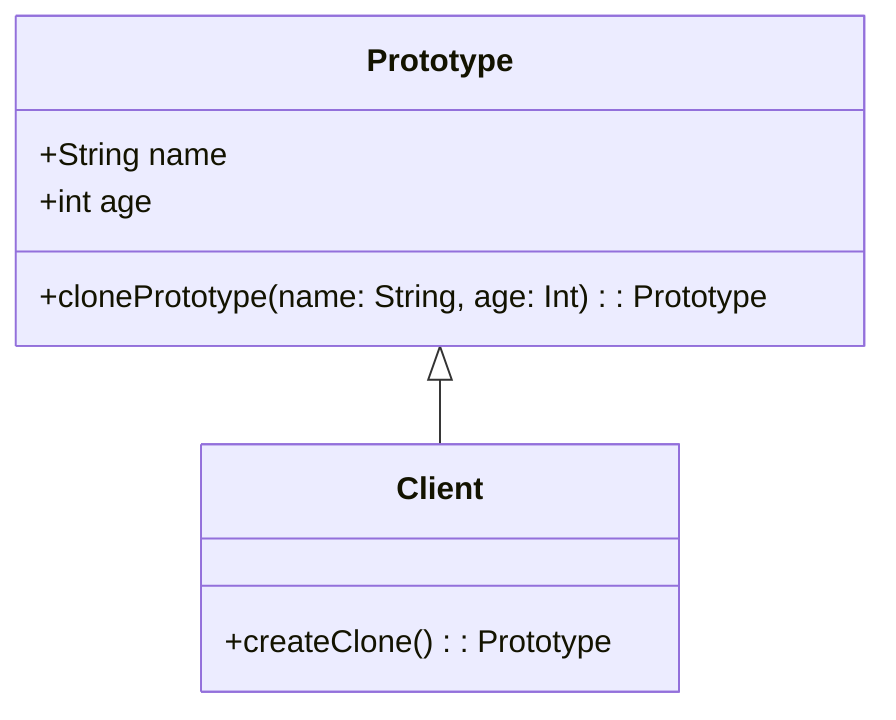

## 4.5 Prototype Pattern

In the realm of software design patterns, the Prototype Pattern stands out as a powerful tool for creating new objects by cloning existing ones. This pattern is particularly useful in scenarios where the cost of creating a new instance of a class is more expensive than copying an existing instance. In this section, we will delve into the intricacies of the Prototype Pattern, its implementation in Scala, and how it leverages Scala's unique features such as case classes and immutability.

### Intent

The Prototype Pattern is a creational design pattern that allows for the creation of new objects by copying an existing object, known as the prototype. The primary intent of this pattern is to reduce the cost of creating objects, especially when the instantiation process is resource-intensive.

### Key Participants

- **Prototype Interface**: Defines the method for cloning objects.
- **Concrete Prototype**: Implements the cloning method to create a copy of itself.
- **Client**: Uses the cloning method to create new objects.

### Applicability

The Prototype Pattern is applicable in the following scenarios:

- When the cost of creating a new instance of a class is more expensive than copying an existing instance.
- When the system should be independent of how its products are created, composed, and represented.
- When classes to be instantiated are specified at runtime.

### Implementing Cloning in Scala

Scala, with its rich feature set, provides several ways to implement the Prototype Pattern. One of the most effective ways is through the use of case classes, which inherently support immutability and provide a built-in method for cloning objects.

#### Using Case Classes for Immutability

Case classes in Scala are a perfect fit for implementing the Prototype Pattern because they are immutable by default and come with a `copy` method that facilitates cloning. Let's explore how we can leverage case classes to implement this pattern.

```scala
// Define a case class representing a prototype
case class Prototype(name: String, age: Int) {
  // Method to clone the object with optional modifications
  def clonePrototype(name: String = this.name, age: Int = this.age): Prototype = {
    this.copy(name = name, age = age)
  }
}

// Client code to demonstrate cloning
object PrototypeDemo extends App {
  // Create an initial prototype
  val original = Prototype("John Doe", 30)

  // Clone the prototype with modifications
  val clone1 = original.clonePrototype(age = 31)
  val clone2 = original.clonePrototype(name = "Jane Doe")

  // Print the original and cloned objects
  println(s"Original: $original")
  println(s"Clone 1: $clone1")
  println(s"Clone 2: $clone2")
}
```

In this example, the `Prototype` case class represents the prototype object. The `clonePrototype` method uses the `copy` method to create a new instance of the prototype with optional modifications.

#### Advantages of Using Case Classes

- **Immutability**: Case classes are immutable by default, which means once an object is created, its state cannot be changed. This property is crucial for ensuring that cloned objects do not inadvertently affect the original object.
- **Built-in Cloning**: The `copy` method provided by case classes makes it easy to clone objects with modifications.
- **Pattern Matching**: Case classes support pattern matching, which can be useful in scenarios where the behavior of the cloned object needs to be determined based on its state.

### Design Considerations

When implementing the Prototype Pattern in Scala, there are several design considerations to keep in mind:

- **Deep vs. Shallow Copy**: Determine whether a deep or shallow copy is required. A shallow copy duplicates the object's fields, while a deep copy duplicates the object and all objects it references.
- **Mutable State**: If the prototype object contains mutable state, ensure that the cloned object does not share references to mutable objects with the original.
- **Performance**: Consider the performance implications of cloning, especially if the prototype object is large or complex.

### Differences and Similarities with Other Patterns

The Prototype Pattern is often compared to other creational patterns such as the Factory Method and Abstract Factory. While these patterns focus on creating objects without specifying the exact class of object that will be created, the Prototype Pattern focuses on cloning existing objects.

- **Factory Method**: Creates objects without specifying the exact class. It defines an interface for creating an object but lets subclasses alter the type of objects that will be created.
- **Abstract Factory**: Provides an interface for creating families of related or dependent objects without specifying their concrete classes.
- **Prototype**: Clones existing objects to create new instances.

### Visualizing the Prototype Pattern

To better understand the Prototype Pattern, let's visualize the process of cloning objects using a class diagram.



In this diagram, the `Prototype` class defines the properties and the `clonePrototype` method. The `Client` class interacts with the `Prototype` class to create clones.

### Try It Yourself

To deepen your understanding of the Prototype Pattern, try modifying the code example provided. Experiment with adding new fields to the `Prototype` class and see how the `clonePrototype` method handles these changes. You can also try implementing a deep copy mechanism if your prototype contains mutable objects.

### Knowledge Check

- What are the key benefits of using case classes in implementing the Prototype Pattern?
- How does immutability contribute to the effectiveness of the Prototype Pattern?
- What are the differences between shallow and deep copies?

### Conclusion

The Prototype Pattern is a powerful tool for creating new objects by cloning existing ones. In Scala, case classes provide an elegant and efficient way to implement this pattern, leveraging immutability and built-in cloning capabilities. By understanding and applying the Prototype Pattern, you can create flexible and efficient object creation mechanisms in your Scala applications.

Remember, this is just the beginning. As you progress, you'll build more complex and interactive systems. Keep experimenting, stay curious, and enjoy the journey!

## Quiz Time!



### What is the primary intent of the Prototype Pattern?

- [x] To create new objects by cloning existing ones
- [ ] To define an interface for creating objects
- [ ] To provide an interface for creating families of related objects
- [ ] To separate the construction of a complex object from its representation

> **Explanation:** The Prototype Pattern is designed to create new objects by cloning existing ones, reducing the cost of object creation.

### Which Scala feature is particularly useful for implementing the Prototype Pattern?

- [x] Case classes
- [ ] Traits
- [ ] Abstract classes
- [ ] Companion objects

> **Explanation:** Case classes in Scala provide built-in immutability and a `copy` method, making them ideal for implementing the Prototype Pattern.

### What is a key advantage of using case classes for the Prototype Pattern?

- [x] Immutability
- [ ] Inheritance
- [ ] Polymorphism
- [ ] Encapsulation

> **Explanation:** Case classes are immutable by default, which ensures that cloned objects do not affect the original object.

### How does the `copy` method in case classes facilitate cloning?

- [x] It creates a new instance with optional modifications
- [ ] It modifies the original instance
- [ ] It deletes the original instance
- [ ] It merges two instances into one

> **Explanation:** The `copy` method creates a new instance of the case class with optional modifications, facilitating cloning.

### What is the difference between a shallow copy and a deep copy?

- [x] A shallow copy duplicates the object's fields, while a deep copy duplicates the object and all objects it references
- [ ] A shallow copy duplicates the object and all objects it references, while a deep copy duplicates only the object's fields
- [ ] A shallow copy modifies the original object, while a deep copy creates a new object
- [ ] A shallow copy merges two objects, while a deep copy splits an object into two

> **Explanation:** A shallow copy duplicates the object's fields, while a deep copy duplicates the object and all objects it references.

### Which of the following is NOT a creational design pattern?

- [ ] Factory Method
- [ ] Abstract Factory
- [x] Observer
- [ ] Prototype

> **Explanation:** The Observer Pattern is a behavioral design pattern, not a creational one.

### In what scenario is the Prototype Pattern particularly useful?

- [x] When the cost of creating a new instance is more expensive than copying an existing one
- [ ] When classes to be instantiated are specified at compile time
- [ ] When the system should be dependent on how its products are created
- [ ] When the system should use inheritance to create new objects

> **Explanation:** The Prototype Pattern is useful when the cost of creating a new instance is more expensive than copying an existing one.

### What is a potential pitfall of using the Prototype Pattern?

- [x] Sharing references to mutable objects between the original and cloned objects
- [ ] Creating too many instances of the prototype
- [ ] Not being able to modify the cloned object
- [ ] Losing the original object's state

> **Explanation:** If the prototype contains mutable objects, cloned objects may share references to these mutable objects, leading to unintended side effects.

### How can you ensure that a cloned object does not affect the original object?

- [x] By ensuring immutability and using deep copies if necessary
- [ ] By using inheritance
- [ ] By modifying the original object
- [ ] By using polymorphism

> **Explanation:** Ensuring immutability and using deep copies if necessary prevents cloned objects from affecting the original object.

### True or False: The Prototype Pattern is often used in conjunction with the Singleton Pattern.

- [x] True
- [ ] False

> **Explanation:** The Prototype Pattern can be used with the Singleton Pattern to ensure that only one instance of a prototype is used for cloning.


