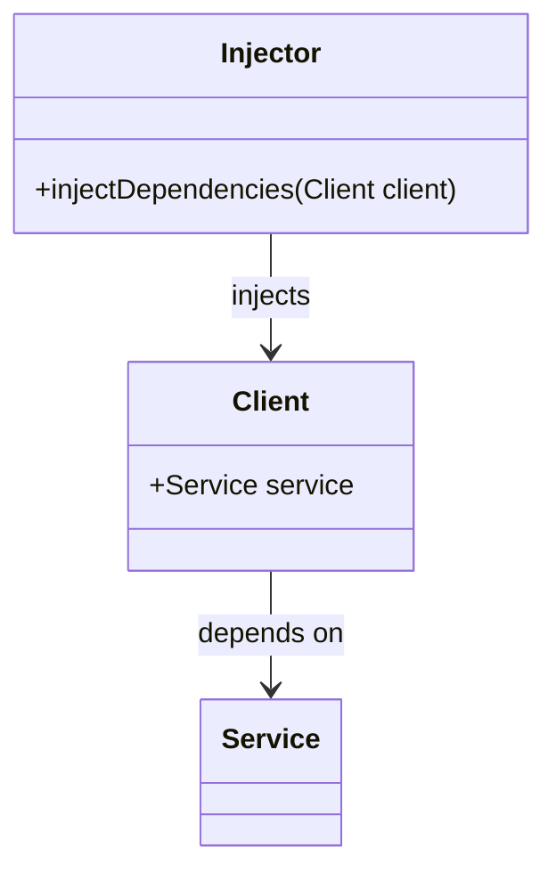

## 4.6 Dependency Injection

In the realm of software engineering, managing dependencies effectively is crucial for creating maintainable, scalable, and testable applications. Dependency Injection (DI) is a design pattern that addresses this need by promoting loose coupling between components. In this section, we will delve into the intricacies of Dependency Injection as a creational pattern, explore various DI techniques, and examine how Scala's unique features can be leveraged to implement DI effectively.

### Overview of Dependency Injection as a Creational Pattern

Dependency Injection is a technique where an object's dependencies are supplied by an external entity rather than being created within the object itself. This approach enhances modularity and testability, as components can be easily swapped or mocked during testing.

#### Intent

The primary intent of Dependency Injection is to separate the creation of an object's dependencies from its behavior, thereby adhering to the Dependency Inversion Principle—a key tenet of SOLID design principles. This separation allows for greater flexibility and easier maintenance.

#### Key Participants

1. **Service**: The object that performs a specific function and requires dependencies.
2. **Client**: The object that depends on the service.
3. **Injector**: The mechanism or framework responsible for providing the dependencies to the client.

#### Applicability

Dependency Injection is applicable in scenarios where:
- You need to decouple components to enhance testability and maintainability.
- You want to adhere to the principles of Inversion of Control (IoC).
- You aim to facilitate the configuration and management of dependencies externally.

### DI Techniques

Several techniques can be employed to implement Dependency Injection, each with its own advantages and trade-offs. Let's explore these techniques in the context of Scala.

#### 1. Constructor Injection

Constructor Injection is the most common form of DI, where dependencies are provided through the constructor of a class. This technique ensures that the object is fully initialized with all its dependencies at the time of creation.

```scala
class DatabaseConnection(url: String)

class UserService(dbConnection: DatabaseConnection) {
  def getUser(id: String): User = {
    // Use dbConnection to fetch user
  }
}

// Injecting dependency
val dbConnection = new DatabaseConnection("jdbc:mysql://localhost:3306/mydb")
val userService = new UserService(dbConnection)
```

**Advantages**:
- Ensures immutability by making dependencies final.
- Easy to understand and implement.

**Disadvantages**:
- Can lead to complex constructors if there are many dependencies.

#### 2. Setter Injection

Setter Injection involves providing dependencies through setter methods after the object has been constructed. This technique is less common in Scala due to its emphasis on immutability.

```scala
class UserService {
  private var dbConnection: DatabaseConnection = _

  def setDbConnection(connection: DatabaseConnection): Unit = {
    this.dbConnection = connection
  }

  def getUser(id: String): User = {
    // Use dbConnection to fetch user
  }
}

// Injecting dependency
val userService = new UserService()
userService.setDbConnection(new DatabaseConnection("jdbc:mysql://localhost:3306/mydb"))
```

**Advantages**:
- Allows for optional dependencies.
- More flexible in certain scenarios.

**Disadvantages**:
- Can lead to mutable state, which is discouraged in functional programming.
- Risk of using an uninitialized object.

#### 3. Interface Injection

Interface Injection is a less common technique where the dependency provides an injector method that will inject the dependency into any client passed to it. This is not widely used in Scala due to its complexity and the availability of more straightforward alternatives.

```scala
trait DatabaseClient {
  def setDbConnection(connection: DatabaseConnection): Unit
}

class UserService extends DatabaseClient {
  private var dbConnection: DatabaseConnection = _

  override def setDbConnection(connection: DatabaseConnection): Unit = {
    this.dbConnection = connection
  }

  def getUser(id: String): User = {
    // Use dbConnection to fetch user
  }
}

// Injecting dependency
val userService = new UserService()
userService.setDbConnection(new DatabaseConnection("jdbc:mysql://localhost:3306/mydb"))
```

**Advantages**:
- Provides a clear contract for dependency injection.

**Disadvantages**:
- Adds complexity to the design.
- Not idiomatic in Scala.

### Leveraging Scala's Features for DI

Scala's rich type system and functional programming paradigms offer unique opportunities for implementing Dependency Injection in a more idiomatic and powerful way.

#### 1. Using Traits and Mixins

Scala's traits can be used to define dependencies and mix them into classes, promoting code reuse and modularity.

```scala
trait DatabaseComponent {
  val dbConnection: DatabaseConnection
}

class UserService extends DatabaseComponent {
  override val dbConnection: DatabaseConnection = new DatabaseConnection("jdbc:mysql://localhost:3306/mydb")

  def getUser(id: String): User = {
    // Use dbConnection to fetch user
  }
}
```

**Advantages**:
- Promotes code reuse and modularity.
- Aligns with Scala's idiomatic use of traits.

**Disadvantages**:
- Can lead to complex inheritance hierarchies.

#### 2. The Cake Pattern

The Cake Pattern is a sophisticated DI technique in Scala that uses self-types and traits to manage dependencies. It allows for highly modular and testable code.

```scala
trait DatabaseComponent {
  val dbConnection: DatabaseConnection
}

trait UserServiceComponent {
  this: DatabaseComponent =>

  val userService: UserService

  class UserService {
    def getUser(id: String): User = {
      // Use dbConnection to fetch user
    }
  }
}

object Application extends UserServiceComponent with DatabaseComponent {
  override val dbConnection: DatabaseConnection = new DatabaseConnection("jdbc:mysql://localhost:3306/mydb")
  override val userService: UserService = new UserService()
}
```

**Advantages**:
- Highly modular and testable.
- Dependencies are explicit and enforced by the compiler.

**Disadvantages**:
- Can be complex and difficult to understand for newcomers.

#### 3. Reader Monad

The Reader Monad is a functional programming approach to DI that encapsulates dependencies in a monadic context, allowing for cleaner and more testable code.

```scala
case class Config(dbUrl: String)

case class DatabaseConnection(url: String)

case class UserService(dbConnection: DatabaseConnection) {
  def getUser(id: String): User = {
    // Use dbConnection to fetch user
  }
}

import cats.data.Reader

type ConfigReader[A] = Reader[Config, A]

val dbConnectionReader: ConfigReader[DatabaseConnection] = Reader(config => new DatabaseConnection(config.dbUrl))

val userServiceReader: ConfigReader[UserService] = dbConnectionReader.map(dbConnection => new UserService(dbConnection))

val config = Config("jdbc:mysql://localhost:3306/mydb")
val userService = userServiceReader.run(config)
```

**Advantages**:
- Purely functional and composable.
- Dependencies are explicit and easy to manage.

**Disadvantages**:
- May introduce complexity for those unfamiliar with monads.

### Visualizing Dependency Injection

To better understand how Dependency Injection works, let's visualize the process using a class diagram.



**Diagram Description**: This diagram illustrates the relationship between the Client, Service, and Injector in a Dependency Injection setup. The Client depends on the Service, and the Injector is responsible for providing the Service to the Client.

### Design Considerations

When implementing Dependency Injection in Scala, consider the following:

- **Immutability**: Favor immutable dependencies to align with Scala's functional programming principles.
- **Complexity**: Avoid overcomplicating the design with unnecessary layers of abstraction.
- **Testing**: Ensure that dependencies can be easily mocked or stubbed for testing purposes.
- **Performance**: Be mindful of the performance implications of complex DI setups, especially in high-performance applications.

### Differences and Similarities with Other Patterns

Dependency Injection is often confused with other design patterns, such as:

- **Service Locator**: Unlike DI, the Service Locator pattern involves a client querying a locator for its dependencies, which can lead to tighter coupling.
- **Factory Pattern**: While both patterns deal with object creation, DI focuses on providing dependencies externally, whereas the Factory Pattern encapsulates the creation logic within a factory class.

### Try It Yourself

To solidify your understanding of Dependency Injection in Scala, try modifying the code examples provided:

- Experiment with different DI techniques, such as switching from Constructor Injection to the Cake Pattern.
- Implement a new service with multiple dependencies and explore how DI can simplify testing.
- Use the Reader Monad to manage dependencies in a small functional application.

### Conclusion

Dependency Injection is a powerful design pattern that promotes decoupled, maintainable, and testable code. By leveraging Scala's unique features, such as traits, the Cake Pattern, and the Reader Monad, you can implement DI in a way that aligns with both functional and object-oriented paradigms. Remember, mastering DI is a journey—keep experimenting, stay curious, and enjoy the process of building robust Scala applications.

## Quiz Time!



### What is the primary intent of Dependency Injection?

- [x] To separate the creation of an object's dependencies from its behavior.
- [ ] To encapsulate object creation logic within a factory class.
- [ ] To provide a simplified interface to a complex system.
- [ ] To ensure a component has only one instance.

> **Explanation:** Dependency Injection aims to decouple the creation of dependencies from their usage, promoting modularity and testability.

### Which DI technique involves providing dependencies through the constructor of a class?

- [x] Constructor Injection
- [ ] Setter Injection
- [ ] Interface Injection
- [ ] Service Locator

> **Explanation:** Constructor Injection provides dependencies through the constructor, ensuring the object is fully initialized at creation.

### What is a disadvantage of Setter Injection?

- [ ] Ensures immutability by making dependencies final.
- [x] Can lead to mutable state, which is discouraged in functional programming.
- [ ] Provides a clear contract for dependency injection.
- [ ] Dependencies are explicit and enforced by the compiler.

> **Explanation:** Setter Injection can lead to mutable state, which is not ideal in functional programming paradigms.

### Which Scala feature is used in the Cake Pattern for Dependency Injection?

- [ ] Case Classes
- [ ] Objects
- [x] Traits
- [ ] Companion Objects

> **Explanation:** The Cake Pattern uses traits and self-types to manage dependencies in a modular way.

### What is a key advantage of using the Reader Monad for Dependency Injection?

- [ ] Allows for optional dependencies.
- [x] Purely functional and composable.
- [ ] Provides a clear contract for dependency injection.
- [ ] Aligns with Scala's idiomatic use of traits.

> **Explanation:** The Reader Monad is purely functional and allows for composable dependency management.

### Which pattern is often confused with Dependency Injection?

- [ ] Singleton Pattern
- [x] Service Locator
- [ ] Observer Pattern
- [ ] Adapter Pattern

> **Explanation:** The Service Locator pattern is often confused with DI, but it involves querying a locator for dependencies.

### What should be favored in Scala's functional programming principles when implementing DI?

- [ ] Mutable dependencies
- [x] Immutable dependencies
- [ ] Complex inheritance hierarchies
- [ ] Deep inheritance hierarchies

> **Explanation:** Immutable dependencies align with Scala's functional programming principles.

### What is a disadvantage of the Cake Pattern?

- [ ] Dependencies are explicit and enforced by the compiler.
- [x] Can be complex and difficult to understand for newcomers.
- [ ] Promotes code reuse and modularity.
- [ ] Aligns with Scala's idiomatic use of traits.

> **Explanation:** The Cake Pattern can be complex and challenging for those new to Scala.

### True or False: Interface Injection is widely used in Scala.

- [ ] True
- [x] False

> **Explanation:** Interface Injection is not widely used in Scala due to its complexity and the availability of more straightforward alternatives.

### Which of the following is NOT a key participant in Dependency Injection?

- [ ] Service
- [ ] Client
- [x] Factory
- [ ] Injector

> **Explanation:** The key participants in Dependency Injection are the Service, Client, and Injector, not a Factory.


