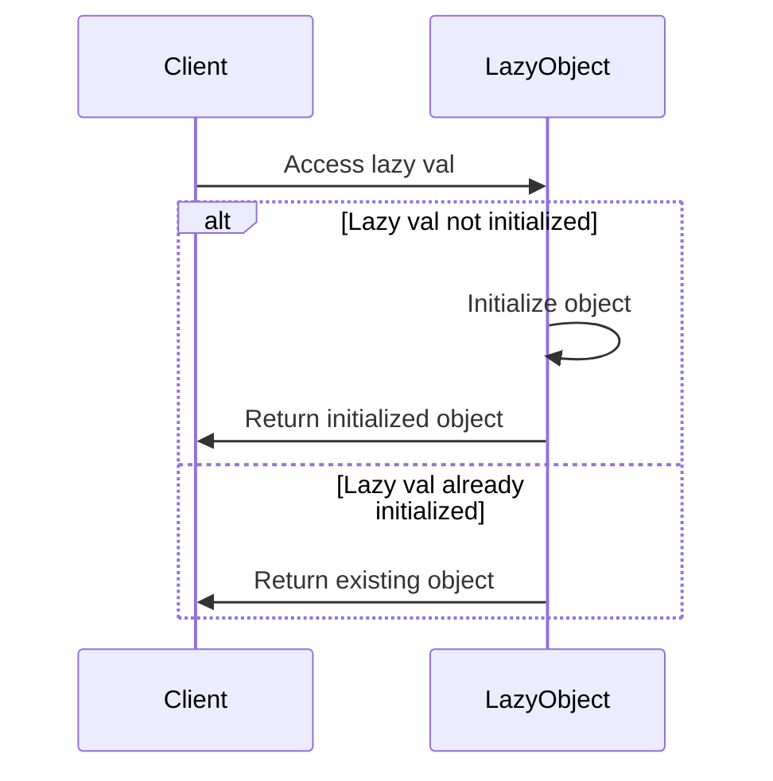

## 4.7 Lazy Initialization

Lazy Initialization is a powerful design pattern that defers the creation of an object until it is needed. This approach can lead to significant performance improvements and resource savings, especially in scenarios where the initialization of an object is costly or the object may not be used at all. In Scala, lazy initialization is elegantly implemented using the `lazy val` construct, which allows developers to create efficient and responsive applications.

### Intent

The primary intent of the Lazy Initialization pattern is to optimize resource usage by delaying the creation of an object until the point at which it is actually needed. This can help in reducing the memory footprint of an application and improving its startup time.

### Key Participants

- **Client Code**: The part of the application that requires the object.
- **Lazy Initialized Object**: The object whose creation is deferred.
- **Lazy Initialization Mechanism**: The construct or technique used to defer the object's creation.

### Applicability

Lazy Initialization is applicable in scenarios where:

- The cost of creating an object is high, and the object is not always required.
- The object may not be used during the application's lifecycle.
- You want to improve application startup time by deferring the initialization of certain components.
- Memory usage needs to be optimized by avoiding the allocation of unused resources.

### Implementing Lazy Initialization with `lazy val`

Scala provides a straightforward way to implement lazy initialization using the `lazy val` keyword. When a variable is declared as `lazy`, its initialization is deferred until it is accessed for the first time. This ensures that resources are only consumed when necessary.

#### Sample Code Snippet

Let's explore a simple example to understand how `lazy val` works in Scala:

```scala
object LazyInitializationExample {

  // A costly resource that we want to initialize lazily
  lazy val expensiveResource: String = {
    println("Initializing expensive resource...")
    "Resource Initialized"
  }

  def main(args: Array[String]): Unit = {
    println("Before accessing expensiveResource")
    println(expensiveResource) // This will trigger the initialization
    println("After accessing expensiveResource")
  }
}
```

**Explanation:**

- The `expensiveResource` is declared as a `lazy val`, meaning it will not be initialized until it is accessed.
- The first access to `expensiveResource` triggers its initialization, as evidenced by the printed message.
- Subsequent accesses do not trigger re-initialization, ensuring efficiency.

### Design Considerations

When using lazy initialization, consider the following:

- **Thread Safety**: In Scala, `lazy val` is thread-safe by default. The initialization is atomic, ensuring that the resource is initialized only once, even in concurrent environments.
- **Memory Usage**: While lazy initialization can reduce memory usage by deferring object creation, it may also lead to increased memory usage if the object is retained longer than necessary.
- **Performance Overhead**: The first access to a `lazy val` incurs the cost of initialization. Ensure that this overhead is acceptable in your application's context.

### Differences and Similarities

Lazy Initialization is often compared with other creational patterns such as Singleton and Factory. While Singleton ensures a single instance of a class, Lazy Initialization focuses on deferring the creation of an instance until it is needed. Factory patterns, on the other hand, encapsulate the creation logic but do not inherently defer it.

### Use Cases and Examples

#### Use Case 1: Database Connections

In applications where database connections are required, initializing connections lazily can help in reducing the load on the database server and improving application performance.

```scala
object DatabaseConnectionExample {

  class DatabaseConnection {
    println("Establishing database connection...")
    def query(sql: String): Unit = println(s"Executing query: $sql")
  }

  lazy val dbConnection: DatabaseConnection = new DatabaseConnection

  def main(args: Array[String]): Unit = {
    println("Before accessing dbConnection")
    dbConnection.query("SELECT * FROM users")
    println("After accessing dbConnection")
  }
}
```

**Explanation:**

- The `DatabaseConnection` is initialized lazily, ensuring that the connection is established only when a query is executed.

#### Use Case 2: Configuration Loading

Applications often require configuration files to be loaded. Lazy initialization can be used to load configurations only when they are needed, reducing startup time.

```scala
object ConfigurationExample {

  lazy val config: Map[String, String] = {
    println("Loading configuration...")
    Map("host" -> "localhost", "port" -> "8080")
  }

  def main(args: Array[String]): Unit = {
    println("Before accessing config")
    println(s"Host: ${config("host")}, Port: ${config("port")}")
    println("After accessing config")
  }
}
```

**Explanation:**

- The `config` map is loaded lazily, ensuring that the configuration is only read when required.

### Visualizing Lazy Initialization

To better understand how lazy initialization works, let's visualize the process using a sequence diagram:



**Description:**

- The client accesses a lazy val.
- If the lazy val is not initialized, the object is initialized and returned.
- If the lazy val is already initialized, the existing object is returned.

### Try It Yourself

Experiment with the provided examples by modifying them:

- **Change the Initialization Logic**: Modify the initialization logic of the `expensiveResource` to simulate a more complex setup.
- **Add More Lazy Variables**: Introduce additional lazy variables and observe how they are initialized independently.
- **Simulate Concurrent Access**: Create a multi-threaded scenario to test the thread safety of `lazy val`.

### Knowledge Check

Let's reinforce our understanding of lazy initialization with a few questions:

1. What is the primary benefit of using lazy initialization?
2. How does Scala ensure thread safety for `lazy val`?
3. In what scenarios would lazy initialization be particularly beneficial?

### Conclusion

Lazy Initialization is a valuable pattern for optimizing resource usage in Scala applications. By deferring object creation until necessary, developers can improve performance and reduce memory consumption. The `lazy val` construct in Scala provides a simple yet powerful way to implement this pattern, ensuring thread safety and efficiency.

Remember, this is just the beginning. As you progress, you'll discover more advanced techniques and patterns that build upon the foundation of lazy initialization. Keep experimenting, stay curious, and enjoy the journey!

## Quiz Time!



### What is the primary benefit of lazy initialization?

- [x] Reducing memory usage by deferring object creation
- [ ] Ensuring a single instance of a class
- [ ] Encapsulating object creation logic
- [ ] Improving code readability

> **Explanation:** Lazy initialization reduces memory usage by creating objects only when they are needed.

### How does Scala ensure thread safety for `lazy val`?

- [x] By making the initialization atomic
- [ ] By using synchronized blocks
- [ ] By creating a new instance for each thread
- [ ] By locking the entire class

> **Explanation:** Scala ensures thread safety for `lazy val` by making the initialization atomic, so it is initialized only once even in concurrent environments.

### In which scenario is lazy initialization particularly beneficial?

- [x] When the cost of creating an object is high and it may not be used
- [ ] When multiple instances of an object are needed
- [ ] When an object needs to be shared across threads
- [ ] When an object is frequently accessed

> **Explanation:** Lazy initialization is beneficial when the cost of creating an object is high and it may not be used, as it defers creation until necessary.

### What keyword is used in Scala to declare a lazy variable?

- [x] lazy
- [ ] defer
- [ ] delay
- [ ] lazyInit

> **Explanation:** The keyword `lazy` is used in Scala to declare a lazy variable.

### What happens when a `lazy val` is accessed for the first time?

- [x] It is initialized
- [ ] It throws an exception
- [ ] It returns null
- [ ] It creates a new thread

> **Explanation:** When a `lazy val` is accessed for the first time, it is initialized.

### Can a `lazy val` be re-initialized after its first access?

- [ ] Yes
- [x] No

> **Explanation:** A `lazy val` cannot be re-initialized after its first access; it is initialized only once.

### What is a potential downside of using lazy initialization?

- [x] Increased memory usage if the object is retained longer than necessary
- [ ] Decreased application startup time
- [ ] Lack of thread safety
- [ ] Increased code complexity

> **Explanation:** A potential downside of lazy initialization is increased memory usage if the object is retained longer than necessary.

### How can you test the thread safety of a `lazy val`?

- [x] By simulating concurrent access in a multi-threaded scenario
- [ ] By using a single-threaded application
- [ ] By checking the source code
- [ ] By using a debugger

> **Explanation:** You can test the thread safety of a `lazy val` by simulating concurrent access in a multi-threaded scenario.

### Which pattern is often compared with Lazy Initialization?

- [x] Singleton
- [ ] Observer
- [ ] Decorator
- [ ] Strategy

> **Explanation:** Lazy Initialization is often compared with the Singleton pattern, although they serve different purposes.

### True or False: Lazy Initialization can help improve application startup time.

- [x] True
- [ ] False

> **Explanation:** True. Lazy Initialization can help improve application startup time by deferring the creation of certain components until they are needed.


