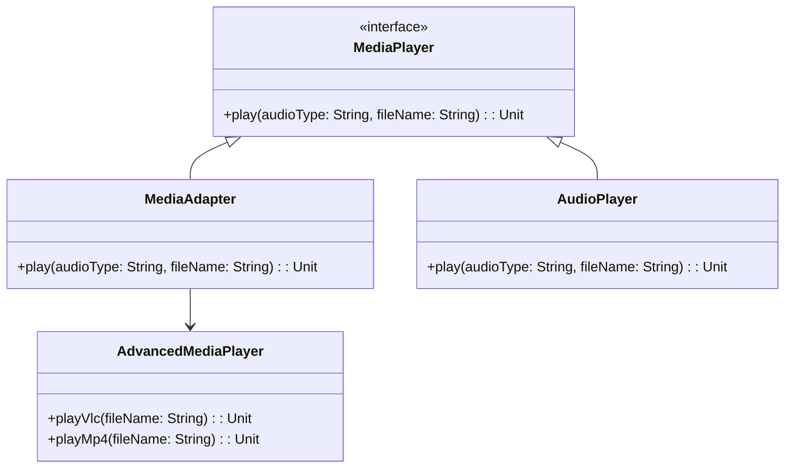

## 5.1 Adapter Pattern

In the realm of software design, the Adapter Pattern is a structural pattern that plays a crucial role in bridging the gap between incompatible interfaces. This pattern allows objects with incompatible interfaces to collaborate seamlessly. In Scala, the Adapter Pattern can be elegantly implemented using traits and implicit conversions, making it a powerful tool for expert software engineers and architects.

### Intent

The primary intent of the Adapter Pattern is to allow two incompatible interfaces to work together. It acts as a bridge between two objects, enabling them to communicate without altering their existing code. This pattern is particularly useful when integrating third-party libraries or legacy systems with new applications.

### Key Participants

1. **Target Interface**: The interface that the client expects to work with.
2. **Adaptee**: The existing interface that needs to be adapted.
3. **Adapter**: The class or object that bridges the gap between the Target and the Adaptee.
4. **Client**: The entity that uses the Target interface.

### Applicability

The Adapter Pattern is applicable in scenarios where:

- You need to use an existing class, but its interface does not match the one you need.
- You want to create a reusable class that cooperates with unrelated or unforeseen classes.
- You need to integrate third-party libraries or legacy systems with your application.

### Implementing the Adapter Pattern in Scala

Scala offers unique features such as traits and implicit conversions, which can be leveraged to implement the Adapter Pattern effectively. Let's explore how these features can be used to create adapters.

#### Using Traits

Traits in Scala are similar to interfaces in Java but more powerful. They can contain method implementations and can be mixed into classes. Here's how you can use traits to implement the Adapter Pattern:

```scala
// Target Interface
trait MediaPlayer {
  def play(audioType: String, fileName: String): Unit
}

// Adaptee
class AdvancedMediaPlayer {
  def playVlc(fileName: String): Unit = println(s"Playing vlc file. Name: $fileName")
  def playMp4(fileName: String): Unit = println(s"Playing mp4 file. Name: $fileName")
}

// Adapter
class MediaAdapter extends MediaPlayer {
  private val advancedMusicPlayer = new AdvancedMediaPlayer

  override def play(audioType: String, fileName: String): Unit = {
    audioType.toLowerCase match {
      case "vlc" => advancedMusicPlayer.playVlc(fileName)
      case "mp4" => advancedMusicPlayer.playMp4(fileName)
      case _ => println(s"Invalid media. $audioType format not supported")
    }
  }
}

// Client
class AudioPlayer extends MediaPlayer {
  private val mediaAdapter = new MediaAdapter

  override def play(audioType: String, fileName: String): Unit = {
    if (audioType.equalsIgnoreCase("mp3")) {
      println(s"Playing mp3 file. Name: $fileName")
    } else {
      mediaAdapter.play(audioType, fileName)
    }
  }
}

// Usage
val audioPlayer = new AudioPlayer
audioPlayer.play("mp3", "song.mp3")
audioPlayer.play("mp4", "video.mp4")
audioPlayer.play("vlc", "movie.vlc")
audioPlayer.play("avi", "documentary.avi")
```

In this example, `MediaAdapter` acts as the adapter that allows `AudioPlayer` to play different audio formats by adapting the `AdvancedMediaPlayer` interface.

#### Using Implicit Conversions

Implicit conversions in Scala provide a way to automatically convert one type to another. This feature can be used to implement the Adapter Pattern without explicitly defining an adapter class.

```scala
// Adaptee
class LegacyRectangle {
  def draw(x: Int, y: Int, width: Int, height: Int): Unit = {
    println(s"Drawing rectangle at ($x, $y) with width $width and height $height")
  }
}

// Target Interface
trait Shape {
  def draw(x: Int, y: Int, width: Int, height: Int): Unit
}

// Implicit Adapter
object ShapeAdapter {
  implicit def rectangleToShape(rectangle: LegacyRectangle): Shape = new Shape {
    override def draw(x: Int, y: Int, width: Int, height: Int): Unit = {
      rectangle.draw(x, y, width, height)
    }
  }
}

// Client
object DrawingApp extends App {
  val rectangle = new LegacyRectangle
  import ShapeAdapter._

  def drawShape(shape: Shape): Unit = {
    shape.draw(10, 20, 30, 40)
  }

  drawShape(rectangle)  // Implicit conversion happens here
}
```

In this example, the implicit conversion from `LegacyRectangle` to `Shape` allows the `DrawingApp` to use `LegacyRectangle` as if it were a `Shape`.

### Visualizing the Adapter Pattern

To better understand the Adapter Pattern, let's visualize the relationships between the components using a class diagram.



### Design Considerations

When implementing the Adapter Pattern in Scala, consider the following:

- **Performance**: Implicit conversions can introduce performance overhead. Use them judiciously.
- **Complexity**: Avoid overusing adapters, as they can make the codebase complex and hard to maintain.
- **Compatibility**: Ensure that the adapter correctly translates calls from the target interface to the adaptee.

### Differences and Similarities

The Adapter Pattern is often confused with the Decorator Pattern. While both patterns involve wrapping objects, they serve different purposes. The Adapter Pattern is used to make incompatible interfaces compatible, whereas the Decorator Pattern is used to add new functionality to an object without altering its structure.

### Try It Yourself

Experiment with the Adapter Pattern by modifying the code examples provided. Try adding support for additional media formats or implementing the pattern using different Scala features.

### Knowledge Check

- What is the primary intent of the Adapter Pattern?
- How can traits be used to implement the Adapter Pattern in Scala?
- What are the advantages and disadvantages of using implicit conversions for adapters?
- How does the Adapter Pattern differ from the Decorator Pattern?

### Embrace the Journey

Remember, mastering design patterns is a journey. As you continue to explore and implement patterns in Scala, you'll gain a deeper understanding of how to create flexible and maintainable software architectures. Keep experimenting, stay curious, and enjoy the journey!

## Quiz Time!



### What is the primary intent of the Adapter Pattern?

- [x] To allow two incompatible interfaces to work together.
- [ ] To add new functionality to an existing class.
- [ ] To create a new interface for an existing class.
- [ ] To simplify complex interfaces for easier use.

> **Explanation:** The Adapter Pattern is designed to allow two incompatible interfaces to work together by acting as a bridge between them.

### Which Scala feature can be used to implement the Adapter Pattern without explicitly defining an adapter class?

- [ ] Traits
- [x] Implicit Conversions
- [ ] Case Classes
- [ ] Companion Objects

> **Explanation:** Implicit conversions in Scala can automatically convert one type to another, allowing the Adapter Pattern to be implemented without explicitly defining an adapter class.

### In the Adapter Pattern, what role does the Adapter play?

- [ ] It defines the interface that the client expects to work with.
- [x] It bridges the gap between the Target and the Adaptee.
- [ ] It is the existing interface that needs to be adapted.
- [ ] It is the entity that uses the Target interface.

> **Explanation:** The Adapter acts as a bridge between the Target and the Adaptee, allowing them to work together.

### What is a potential downside of using implicit conversions in Scala?

- [ ] They make code more readable.
- [x] They can introduce performance overhead.
- [ ] They simplify complex interfaces.
- [ ] They enhance type safety.

> **Explanation:** Implicit conversions can introduce performance overhead and should be used judiciously.

### How does the Adapter Pattern differ from the Decorator Pattern?

- [x] The Adapter Pattern makes incompatible interfaces compatible, while the Decorator Pattern adds functionality.
- [ ] The Adapter Pattern adds functionality, while the Decorator Pattern makes interfaces compatible.
- [ ] Both patterns serve the same purpose.
- [ ] The Adapter Pattern is used for performance optimization.

> **Explanation:** The Adapter Pattern is used to make incompatible interfaces compatible, whereas the Decorator Pattern is used to add new functionality to an object.

### What is a key consideration when using the Adapter Pattern?

- [ ] Ensuring the adapter adds new functionality.
- [x] Ensuring the adapter correctly translates calls from the target interface to the adaptee.
- [ ] Ensuring the adapter simplifies the interface.
- [ ] Ensuring the adapter enhances performance.

> **Explanation:** A key consideration is ensuring that the adapter correctly translates calls from the target interface to the adaptee.

### Which of the following is NOT a key participant in the Adapter Pattern?

- [ ] Target Interface
- [ ] Adaptee
- [ ] Adapter
- [x] Decorator

> **Explanation:** The Decorator is not a participant in the Adapter Pattern. The key participants are the Target Interface, Adaptee, and Adapter.

### What is the role of the Client in the Adapter Pattern?

- [ ] It adapts the interface to be compatible.
- [ ] It defines the interface that needs to be adapted.
- [x] It uses the Target interface.
- [ ] It provides the implementation for the Adapter.

> **Explanation:** The Client is the entity that uses the Target interface.

### What is an advantage of using traits to implement the Adapter Pattern in Scala?

- [x] Traits can contain method implementations and can be mixed into classes.
- [ ] Traits simplify complex interfaces.
- [ ] Traits enhance performance.
- [ ] Traits provide implicit conversions.

> **Explanation:** Traits in Scala can contain method implementations and can be mixed into classes, making them a powerful tool for implementing the Adapter Pattern.

### True or False: The Adapter Pattern can only be implemented using implicit conversions in Scala.

- [ ] True
- [x] False

> **Explanation:** The Adapter Pattern can be implemented using both traits and implicit conversions in Scala, providing flexibility in how it is applied.


