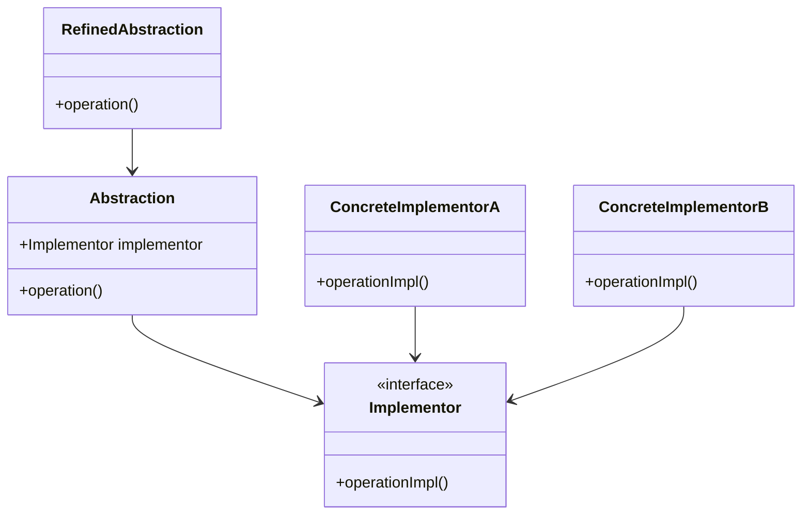
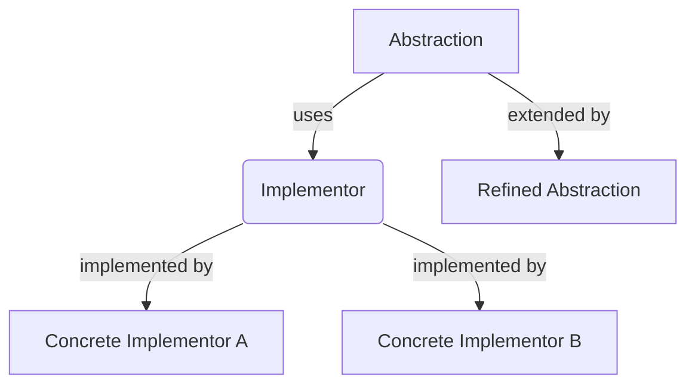

## 5.2 Bridge Pattern

### Introduction

The Bridge Pattern is a structural design pattern that plays a crucial role in software architecture by decoupling an abstraction from its implementation. This separation allows both the abstraction and the implementation to evolve independently, leading to more flexible and scalable systems. In Scala, a language that elegantly combines object-oriented and functional programming paradigms, the Bridge Pattern can be effectively implemented using traits and abstract classes.

### Intent

The primary intent of the Bridge Pattern is to separate the abstraction from its implementation so that both can vary independently. This pattern is particularly useful when dealing with complex systems where the abstraction and implementation are expected to change over time. By decoupling these components, the Bridge Pattern facilitates easier maintenance and extension of the codebase.

### Key Participants

1. **Abstraction**: Defines the abstraction's interface and maintains a reference to the implementor.
2. **Refined Abstraction**: Extends the interface defined by the Abstraction.
3. **Implementor**: Defines the interface for implementation classes. This interface does not need to correspond directly to the Abstraction's interface; in fact, the two interfaces can be quite different.
4. **Concrete Implementor**: Implements the Implementor interface and provides concrete implementations.

### Applicability

Use the Bridge Pattern when:

- You want to avoid a permanent binding between an abstraction and its implementation.
- Both the abstraction and its implementation should be extensible by subclassing.
- Changes in the implementation of an abstraction should not impact the client code.
- You have a proliferation of classes due to the combination of multiple dimensions of abstraction and implementation.

### Diagram

Below is a diagram illustrating the Bridge Pattern:



### Sample Code Snippet

Let's explore a Scala implementation of the Bridge Pattern. We'll create a simple example involving shapes and colors to demonstrate how the pattern works.

```scala
// Implementor
trait Color {
  def applyColor(): String
}

// Concrete Implementors
class RedColor extends Color {
  override def applyColor(): String = "Red"
}

class BlueColor extends Color {
  override def applyColor(): String = "Blue"
}

// Abstraction
abstract class Shape(protected val color: Color) {
  def draw(): String
}

// Refined Abstraction
class Circle(color: Color) extends Shape(color) {
  override def draw(): String = s"Circle drawn with color ${color.applyColor()}"
}

class Square(color: Color) extends Shape(color) {
  override def draw(): String = s"Square drawn with color ${color.applyColor()}"
}

// Client code
object BridgePatternDemo extends App {
  val redCircle = new Circle(new RedColor)
  val blueSquare = new Square(new BlueColor)

  println(redCircle.draw()) // Output: Circle drawn with color Red
  println(blueSquare.draw()) // Output: Square drawn with color Blue
}
```

### Design Considerations

When implementing the Bridge Pattern in Scala, consider the following:

- **Traits vs. Abstract Classes**: Use traits for defining the Implementor interface, as they provide greater flexibility and can be mixed into multiple classes. Abstract classes can be used for the Abstraction to provide a common base for different refined abstractions.
- **Decoupling**: Ensure that the abstraction and implementation are truly decoupled, allowing them to vary independently.
- **Complexity**: The Bridge Pattern can introduce additional complexity due to the increased number of classes and interfaces. Ensure that the benefits of decoupling outweigh this complexity.

### Differences and Similarities

The Bridge Pattern is often confused with the Adapter Pattern. While both patterns involve interfaces and classes, they serve different purposes:

- **Bridge Pattern**: Focuses on decoupling abstraction from implementation, allowing both to vary independently.
- **Adapter Pattern**: Focuses on converting the interface of a class into another interface that clients expect.

### Try It Yourself

To deepen your understanding of the Bridge Pattern, try modifying the code example above:

- Add a new shape, such as a `Rectangle`, and implement it using the Bridge Pattern.
- Introduce a new color, like `GreenColor`, and see how easily it integrates with existing shapes.
- Experiment with different combinations of shapes and colors to see the flexibility of the Bridge Pattern in action.

### Visualizing the Bridge Pattern

To further illustrate the Bridge Pattern, let's visualize how the abstraction and implementation are decoupled:



### Knowledge Check

- Explain how the Bridge Pattern decouples abstraction from implementation.
- Describe a scenario where the Bridge Pattern would be beneficial.
- What are the key differences between the Bridge Pattern and the Adapter Pattern?

### Conclusion

The Bridge Pattern is a powerful tool in the arsenal of a Scala developer, enabling the separation of abstraction from implementation. By leveraging Scala's traits and abstract classes, developers can create flexible and scalable systems that are easier to maintain and extend. As you continue to explore design patterns, remember that the Bridge Pattern is just one of many strategies available to create robust software architectures.

## Quiz Time!



### What is the primary intent of the Bridge Pattern?

- [x] To separate abstraction from implementation so that both can vary independently.
- [ ] To convert the interface of a class into another interface that clients expect.
- [ ] To ensure a class has only one instance.
- [ ] To define a family of algorithms and make them interchangeable.

> **Explanation:** The Bridge Pattern's primary intent is to decouple abstraction from implementation, allowing both to change independently.

### Which of the following is a key participant in the Bridge Pattern?

- [x] Abstraction
- [ ] Adapter
- [ ] Singleton
- [x] Implementor

> **Explanation:** The key participants in the Bridge Pattern include the Abstraction and the Implementor, among others.

### What is a common use case for the Bridge Pattern?

- [x] When you want to avoid a permanent binding between an abstraction and its implementation.
- [ ] When you need to convert one interface into another.
- [ ] When you want to ensure a class has only one instance.
- [ ] When you need to define a family of algorithms and make them interchangeable.

> **Explanation:** The Bridge Pattern is useful when you want to avoid a permanent binding between an abstraction and its implementation.

### How does the Bridge Pattern differ from the Adapter Pattern?

- [x] The Bridge Pattern focuses on decoupling abstraction from implementation, while the Adapter Pattern focuses on converting interfaces.
- [ ] The Bridge Pattern ensures a class has only one instance, while the Adapter Pattern defines a family of algorithms.
- [ ] The Bridge Pattern is used for creating objects, while the Adapter Pattern is used for structuring code.
- [ ] The Bridge Pattern is used for defining algorithms, while the Adapter Pattern is used for creating objects.

> **Explanation:** The Bridge Pattern focuses on decoupling abstraction from implementation, whereas the Adapter Pattern is about converting interfaces.

### In the provided code example, what role does the `Color` trait play?

- [x] Implementor
- [ ] Abstraction
- [ ] Refined Abstraction
- [ ] Concrete Implementor

> **Explanation:** The `Color` trait acts as the Implementor in the Bridge Pattern example.

### What Scala feature is particularly useful for implementing the Bridge Pattern?

- [x] Traits
- [ ] Case Classes
- [ ] Singleton Objects
- [ ] Companion Objects

> **Explanation:** Traits are particularly useful in Scala for implementing the Bridge Pattern due to their flexibility and ability to be mixed into multiple classes.

### Why might the Bridge Pattern introduce additional complexity?

- [x] Due to the increased number of classes and interfaces.
- [ ] Because it requires converting interfaces.
- [ ] Because it ensures a class has only one instance.
- [ ] Because it defines a family of algorithms.

> **Explanation:** The Bridge Pattern can introduce additional complexity due to the increased number of classes and interfaces involved.

### What is a benefit of using the Bridge Pattern?

- [x] It allows both the abstraction and implementation to be extended independently.
- [ ] It ensures a class has only one instance.
- [ ] It converts one interface into another.
- [ ] It defines a family of algorithms.

> **Explanation:** A benefit of the Bridge Pattern is that it allows both the abstraction and implementation to be extended independently.

### True or False: The Bridge Pattern is useful when you want to ensure a class has only one instance.

- [ ] True
- [x] False

> **Explanation:** False. The Bridge Pattern is not about ensuring a class has only one instance; that's the Singleton Pattern.

### Which of the following is NOT a key participant in the Bridge Pattern?

- [ ] Abstraction
- [ ] Implementor
- [x] Adapter
- [ ] Concrete Implementor

> **Explanation:** The Adapter is not a key participant in the Bridge Pattern; it is part of the Adapter Pattern.


