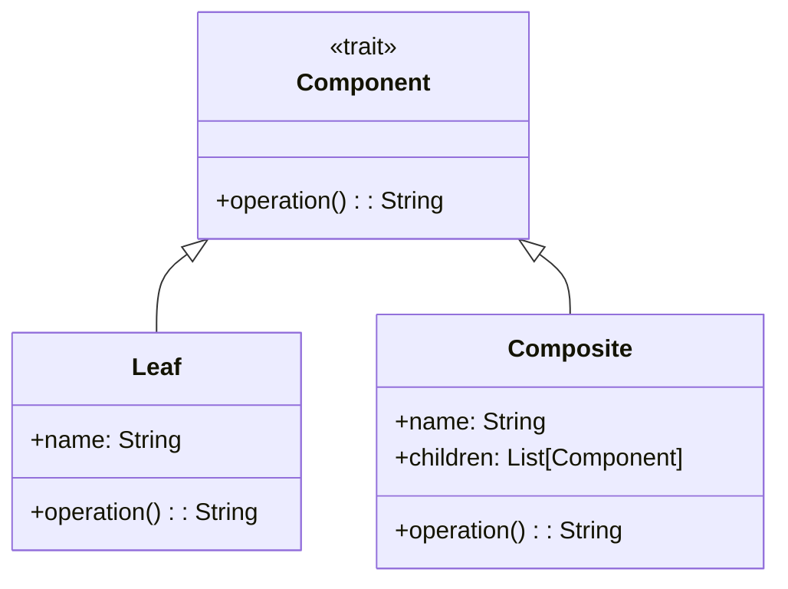

## 5.3 Composite Pattern

The Composite Pattern is a structural design pattern that allows you to compose objects into tree-like structures to represent part-whole hierarchies. This pattern enables clients to treat individual objects and compositions of objects uniformly. In Scala, the Composite Pattern is elegantly implemented using case classes and sealed traits, which provide a robust foundation for creating immutable and type-safe tree structures.

### Intent

The primary intent of the Composite Pattern is to allow clients to treat individual objects and compositions of objects uniformly. This is particularly useful when dealing with tree structures such as file systems, organizational hierarchies, or graphical user interfaces.

### Key Participants

- **Component**: An abstract class or trait that defines the interface for all objects in the composition, both leaf and composite nodes.
- **Leaf**: Represents leaf objects in the composition. A leaf has no children.
- **Composite**: Represents a composite node that can have children. It implements operations defined in the Component interface.

### Applicability

Use the Composite Pattern when:
- You want to represent part-whole hierarchies of objects.
- You want clients to be able to ignore the difference between compositions of objects and individual objects.
- You need to implement tree structures where nodes and leaves are treated uniformly.

### Implementing Composite Structures with Case Classes and Sealed Traits

Scala's case classes and sealed traits provide an ideal mechanism for implementing the Composite Pattern. Let's explore how we can leverage these features to create a flexible and type-safe tree structure.

#### Step 1: Define the Component Trait

The Component trait serves as the base for both leaf and composite nodes. It defines the common interface for all nodes in the tree.

```scala
sealed trait Component {
  def operation(): String
}
```

#### Step 2: Implement Leaf Nodes

Leaf nodes are the simplest form of components. They do not have any children and typically perform a specific operation.

```scala
case class Leaf(name: String) extends Component {
  override def operation(): String = s"Leaf: $name"
}
```

#### Step 3: Implement Composite Nodes

Composite nodes can have children, which are themselves components. This allows for recursive composition.

```scala
case class Composite(name: String, children: List[Component]) extends Component {
  override def operation(): String = {
    val childOperations = children.map(_.operation()).mkString(", ")
    s"Composite: $name with children [$childOperations]"
  }
}
```

### Sample Code Snippet

Here's a complete example demonstrating the Composite Pattern in Scala:

```scala
sealed trait Component {
  def operation(): String
}

case class Leaf(name: String) extends Component {
  override def operation(): String = s"Leaf: $name"
}

case class Composite(name: String, children: List[Component]) extends Component {
  override def operation(): String = {
    val childOperations = children.map(_.operation()).mkString(", ")
    s"Composite: $name with children [$childOperations]"
  }
}

object CompositePatternExample extends App {
  val leaf1 = Leaf("Leaf 1")
  val leaf2 = Leaf("Leaf 2")
  val composite1 = Composite("Composite 1", List(leaf1, leaf2))

  val leaf3 = Leaf("Leaf 3")
  val root = Composite("Root", List(composite1, leaf3))

  println(root.operation())
}
```

### Visualizing the Composite Pattern

To better understand the structure of the Composite Pattern, let's visualize it using a class diagram.



### Design Considerations

When implementing the Composite Pattern in Scala, consider the following:

- **Immutability**: Leverage Scala's immutable collections to ensure that your tree structures are immutable. This enhances safety and prevents unintended side effects.
- **Type Safety**: Use sealed traits to ensure that all possible subtypes are known at compile time, providing exhaustive pattern matching and reducing runtime errors.
- **Performance**: Be mindful of the performance implications of deep tree structures, especially when traversing or modifying them.

### Differences and Similarities

The Composite Pattern is often compared to other structural patterns such as the Decorator and Flyweight patterns. While all these patterns deal with object composition, they serve different purposes:

- **Decorator Pattern**: Focuses on adding responsibilities to individual objects dynamically without affecting other objects.
- **Flyweight Pattern**: Aims to minimize memory usage by sharing common data among multiple objects.
- **Composite Pattern**: Emphasizes tree structures and uniform treatment of nodes and leaves.

### Try It Yourself

To deepen your understanding of the Composite Pattern, try modifying the code example:

- Add a method to count the total number of leaf nodes in the tree.
- Implement a method to find a leaf by name.
- Experiment with different tree structures and observe how the operations change.

### Knowledge Check

Before we wrap up, let's reinforce what we've learned:

- What is the primary intent of the Composite Pattern?
- How do case classes and sealed traits facilitate the implementation of the Composite Pattern in Scala?
- What are some common use cases for the Composite Pattern?

### Embrace the Journey

Remember, mastering design patterns is a journey. As you continue to explore and apply these patterns, you'll gain deeper insights into building robust and scalable software architectures. Keep experimenting, stay curious, and enjoy the journey!

## Quiz Time!



### What is the primary intent of the Composite Pattern?

- [x] To allow clients to treat individual objects and compositions of objects uniformly.
- [ ] To add responsibilities to individual objects dynamically.
- [ ] To minimize memory usage by sharing common data among multiple objects.
- [ ] To separate abstraction from implementation.

> **Explanation:** The Composite Pattern allows clients to treat individual objects and compositions of objects uniformly, which is its primary intent.

### Which Scala feature is especially useful for implementing the Composite Pattern?

- [x] Case classes and sealed traits
- [ ] Implicit conversions
- [ ] Higher-order functions
- [ ] Pattern matching

> **Explanation:** Case classes and sealed traits are particularly useful for implementing the Composite Pattern in Scala due to their support for immutability and type safety.

### What is a key characteristic of leaf nodes in the Composite Pattern?

- [x] They do not have any children.
- [ ] They can have multiple children.
- [ ] They represent the root of the tree.
- [ ] They are used to add responsibilities to objects.

> **Explanation:** Leaf nodes in the Composite Pattern do not have any children, which distinguishes them from composite nodes.

### How does the Composite Pattern treat leaf and composite nodes?

- [x] Uniformly
- [ ] Differently
- [ ] As separate hierarchies
- [ ] As unrelated entities

> **Explanation:** The Composite Pattern treats leaf and composite nodes uniformly, allowing them to be used interchangeably.

### What is a common use case for the Composite Pattern?

- [x] Representing part-whole hierarchies
- [ ] Adding dynamic behavior to objects
- [ ] Sharing data among objects
- [ ] Separating interface from implementation

> **Explanation:** The Composite Pattern is commonly used to represent part-whole hierarchies, such as file systems or organizational charts.

### Which pattern is often compared to the Composite Pattern?

- [x] Decorator Pattern
- [ ] Singleton Pattern
- [ ] Observer Pattern
- [ ] Strategy Pattern

> **Explanation:** The Decorator Pattern is often compared to the Composite Pattern, as both involve object composition.

### What is a benefit of using sealed traits in the Composite Pattern?

- [x] Ensures all possible subtypes are known at compile time
- [ ] Allows dynamic addition of behavior
- [ ] Minimizes memory usage
- [ ] Separates interface from implementation

> **Explanation:** Sealed traits ensure that all possible subtypes are known at compile time, which enhances type safety and allows for exhaustive pattern matching.

### What is a potential performance consideration when using the Composite Pattern?

- [x] Deep tree structures can impact performance.
- [ ] Leaf nodes require more memory.
- [ ] Composite nodes cannot be reused.
- [ ] The pattern does not support immutability.

> **Explanation:** Deep tree structures can impact performance, especially when traversing or modifying them.

### True or False: The Composite Pattern is useful for implementing tree structures where nodes and leaves are treated differently.

- [ ] True
- [x] False

> **Explanation:** False. The Composite Pattern is useful for implementing tree structures where nodes and leaves are treated uniformly.

### What is a common feature of both the Composite and Flyweight patterns?

- [x] Both involve object composition.
- [ ] Both focus on minimizing memory usage.
- [ ] Both add responsibilities to objects dynamically.
- [ ] Both separate abstraction from implementation.

> **Explanation:** Both the Composite and Flyweight patterns involve object composition, although they serve different purposes.


