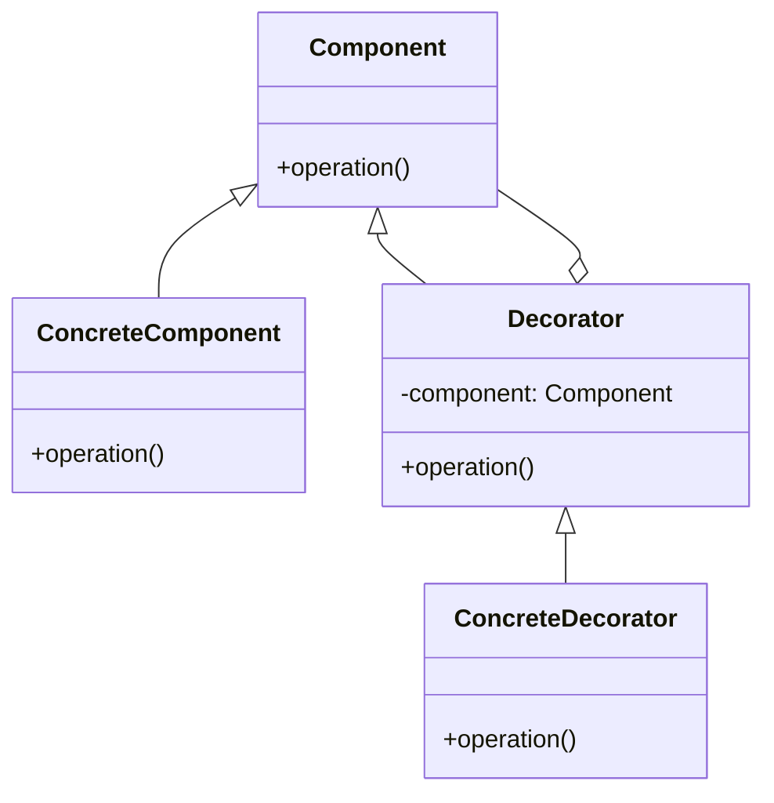

## 5.4 Decorator Pattern

The Decorator Pattern is a structural design pattern that allows behavior to be added to individual objects, either statically or dynamically, without affecting the behavior of other objects from the same class. In Scala, this pattern can be effectively implemented using traits, mixins, and the new extension methods introduced in Scala 3. This pattern is particularly useful when you want to adhere to the Open/Closed Principle, which states that software entities should be open for extension but closed for modification.

### Intent

The primary intent of the Decorator Pattern is to provide a flexible alternative to subclassing for extending functionality. By wrapping an object with a decorator, you can add new behaviors and responsibilities to the object without altering its structure.

### Key Participants

- **Component**: Defines the interface for objects that can have responsibilities added to them dynamically.
- **ConcreteComponent**: The class to which additional responsibilities can be attached.
- **Decorator**: Maintains a reference to a Component object and defines an interface that conforms to Component's interface.
- **ConcreteDecorator**: Adds responsibilities to the component.

### Applicability

Use the Decorator Pattern when:

- You want to add responsibilities to individual objects dynamically and transparently, without affecting other objects.
- You want to avoid subclassing to extend functionality.
- You need to add responsibilities to an object that you cannot modify directly.

### Visualizing the Decorator Pattern

Let's visualize the Decorator Pattern using a class diagram to understand the relationships between the components.



**Diagram Description:** The diagram illustrates the relationship between the Component, ConcreteComponent, Decorator, and ConcreteDecorator classes. The Decorator class maintains a reference to a Component object and extends its functionality.

### Implementing the Decorator Pattern in Scala

In Scala, the Decorator Pattern can be implemented using traits and mixins. Let's explore how to achieve this with a practical example.

#### Example: Coffee Shop

Imagine a coffee shop where you can order a basic coffee and add various condiments like milk, sugar, and whipped cream. We'll use the Decorator Pattern to model this scenario.

```scala
// Define the Component trait
trait Coffee {
  def cost: Double
  def description: String
}

// ConcreteComponent
class SimpleCoffee extends Coffee {
  override def cost: Double = 5.0
  override def description: String = "Simple Coffee"
}

// Decorator
trait CoffeeDecorator extends Coffee {
  protected val coffee: Coffee
  override def cost: Double = coffee.cost
  override def description: String = coffee.description
}

// ConcreteDecorator for Milk
class MilkDecorator(val coffee: Coffee) extends CoffeeDecorator {
  override def cost: Double = coffee.cost + 1.5
  override def description: String = coffee.description + ", Milk"
}

// ConcreteDecorator for Sugar
class SugarDecorator(val coffee: Coffee) extends CoffeeDecorator {
  override def cost: Double = coffee.cost + 0.5
  override def description: String = coffee.description + ", Sugar"
}

// Usage
val myCoffee: Coffee = new SugarDecorator(new MilkDecorator(new SimpleCoffee))
println(s"Cost: ${myCoffee.cost}, Description: ${myCoffee.description}")
```

**Code Explanation:**

- **Component Trait**: `Coffee` defines the interface for coffee objects.
- **ConcreteComponent**: `SimpleCoffee` is a basic coffee with a fixed cost and description.
- **Decorator Trait**: `CoffeeDecorator` extends `Coffee` and maintains a reference to a `Coffee` object.
- **ConcreteDecorators**: `MilkDecorator` and `SugarDecorator` add additional costs and descriptions to the coffee.

### Using Extension Methods in Scala 3

Scala 3 introduces extension methods, which provide a more concise way to add functionality to existing types. Let's see how we can use extension methods to implement the Decorator Pattern.

#### Example: Coffee Shop with Extension Methods

```scala
// Define the Coffee trait
trait Coffee {
  def cost: Double
  def description: String
}

// ConcreteComponent
class SimpleCoffee extends Coffee {
  override def cost: Double = 5.0
  override def description: String = "Simple Coffee"
}

// Extension methods for Coffee
extension (coffee: Coffee)
  def withMilk: Coffee = new Coffee {
    override def cost: Double = coffee.cost + 1.5
    override def description: String = coffee.description + ", Milk"
  }

  def withSugar: Coffee = new Coffee {
    override def cost: Double = coffee.cost + 0.5
    override def description: String = coffee.description + ", Sugar"
  }

// Usage
val myCoffee: Coffee = SimpleCoffee().withMilk.withSugar
println(s"Cost: ${myCoffee.cost}, Description: ${myCoffee.description}")
```

**Code Explanation:**

- **Extension Methods**: We define extension methods `withMilk` and `withSugar` for the `Coffee` trait. These methods return a new `Coffee` instance with the added functionality.
- **Usage**: We can chain the extension methods to add multiple decorators to the coffee.

### Design Considerations

When using the Decorator Pattern in Scala, consider the following:

- **Immutability**: Ensure that decorators do not modify the state of the objects they decorate. Use immutable data structures where possible.
- **Performance**: Be mindful of the performance overhead introduced by multiple layers of decorators.
- **Complexity**: Avoid excessive use of decorators, which can lead to complex and hard-to-maintain code.

### Differences and Similarities

The Decorator Pattern is often confused with the Proxy Pattern. While both patterns involve a level of indirection, they serve different purposes:

- **Decorator Pattern**: Adds responsibilities to objects dynamically.
- **Proxy Pattern**: Controls access to an object.

### Try It Yourself

Experiment with the code examples provided by adding new decorators, such as `WhippedCreamDecorator`, and see how they affect the cost and description of the coffee. Try using Scala 3 extension methods to implement additional functionalities.

### Knowledge Check

- What is the primary intent of the Decorator Pattern?
- How can traits and mixins be used to implement the Decorator Pattern in Scala?
- What are the advantages of using extension methods in Scala 3 for the Decorator Pattern?

### Conclusion

The Decorator Pattern in Scala offers a powerful way to extend the functionality of objects dynamically. By leveraging traits, mixins, and extension methods, you can create flexible and reusable components that adhere to the Open/Closed Principle. Remember, this is just the beginning. As you progress, you'll build more complex and interactive systems. Keep experimenting, stay curious, and enjoy the journey!

## Quiz Time!



### What is the primary intent of the Decorator Pattern?

- [x] To add responsibilities to individual objects dynamically without affecting other objects.
- [ ] To control access to an object.
- [ ] To create a family of related objects.
- [ ] To define a one-to-many dependency between objects.

> **Explanation:** The Decorator Pattern is used to add responsibilities to individual objects dynamically and transparently.

### Which Scala feature is particularly useful for implementing the Decorator Pattern?

- [x] Traits and mixins
- [ ] Case classes
- [ ] Abstract classes
- [ ] Companion objects

> **Explanation:** Traits and mixins allow for dynamic composition of behaviors, which is ideal for implementing the Decorator Pattern.

### How do extension methods in Scala 3 enhance the Decorator Pattern?

- [x] By providing a concise way to add functionality to existing types.
- [ ] By enforcing immutability in decorated objects.
- [ ] By automatically generating decorators.
- [ ] By simplifying the inheritance hierarchy.

> **Explanation:** Extension methods in Scala 3 offer a concise syntax for adding functionality to existing types, which can be used to implement decorators.

### What is a key difference between the Decorator and Proxy Patterns?

- [x] Decorator adds responsibilities, while Proxy controls access.
- [ ] Decorator controls access, while Proxy adds responsibilities.
- [ ] Both patterns serve the same purpose.
- [ ] Decorator is used for creating objects, while Proxy is not.

> **Explanation:** The Decorator Pattern adds responsibilities to objects, while the Proxy Pattern controls access to them.

### In the provided coffee shop example, what is the role of `CoffeeDecorator`?

- [x] To extend the `Coffee` trait and maintain a reference to a `Coffee` object.
- [ ] To define the cost of a coffee.
- [ ] To implement the `SimpleCoffee` class.
- [ ] To add new methods to the `Coffee` trait.

> **Explanation:** `CoffeeDecorator` extends the `Coffee` trait and maintains a reference to a `Coffee` object, allowing additional responsibilities to be added.

### What is the advantage of using immutable data structures in the Decorator Pattern?

- [x] They prevent state modification in decorated objects.
- [ ] They improve performance.
- [ ] They simplify code readability.
- [ ] They automatically handle concurrency.

> **Explanation:** Immutable data structures ensure that the state of decorated objects is not modified, maintaining consistency and predictability.

### How can you add a new decorator, such as `WhippedCreamDecorator`, to the coffee shop example?

- [x] By creating a new class that extends `CoffeeDecorator` and overrides `cost` and `description`.
- [ ] By modifying the `SimpleCoffee` class.
- [ ] By using a companion object.
- [ ] By changing the `Coffee` trait.

> **Explanation:** To add a new decorator, create a class that extends `CoffeeDecorator` and overrides the `cost` and `description` methods to include the new functionality.

### What is a potential drawback of using too many decorators?

- [x] Increased complexity and maintenance difficulty.
- [ ] Reduced code readability.
- [ ] Decreased performance.
- [ ] All of the above.

> **Explanation:** Using too many decorators can lead to increased complexity, reduced readability, and potential performance issues.

### True or False: The Decorator Pattern can only be used with classes.

- [ ] True
- [x] False

> **Explanation:** The Decorator Pattern can be used with traits and mixins in Scala, not just classes.

### Which principle does the Decorator Pattern adhere to?

- [x] Open/Closed Principle
- [ ] Single Responsibility Principle
- [ ] Dependency Inversion Principle
- [ ] Liskov Substitution Principle

> **Explanation:** The Decorator Pattern adheres to the Open/Closed Principle by allowing objects to be extended without modifying their existing code.


