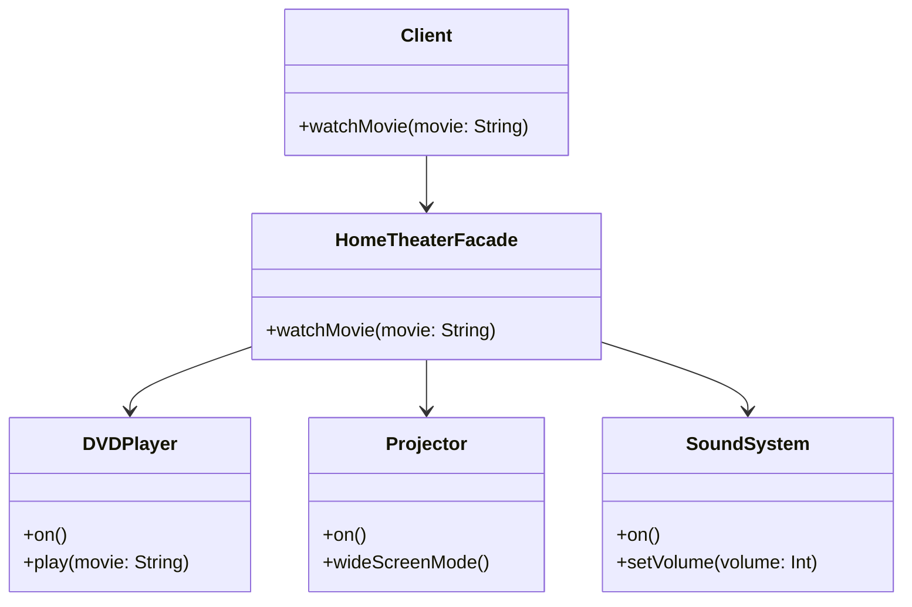

## 5.5 Facade Pattern

The Facade Pattern is a structural design pattern that provides a simplified interface to a complex subsystem. It is particularly useful in managing the complexity of large systems by offering a unified interface to a set of interfaces in a subsystem. This pattern is widely used in software engineering to improve the usability and readability of code, making it easier to work with complex systems.

### Intent

The primary intent of the Facade Pattern is to hide the complexities of a system and provide an interface that is easier to use. By doing so, it allows clients to interact with the system without needing to understand its internal workings. This pattern is particularly beneficial when dealing with complex libraries or frameworks, where a simplified interface can make the system more accessible and easier to use.

### Key Participants

- **Facade**: The main class that provides a simplified interface to the complex subsystem. It delegates client requests to the appropriate subsystem objects.
- **Subsystem Classes**: These are the classes that implement the complex functionality. They handle the actual work but are hidden behind the facade.
- **Client**: The entity that interacts with the facade instead of the subsystem classes directly.

### Applicability

The Facade Pattern is applicable in the following scenarios:

- When you want to provide a simple interface to a complex subsystem.
- When there are many dependencies between clients and the implementation classes of an abstraction.
- When you want to layer your subsystems. Use a facade to define an entry point to each subsystem level.

### Implementing the Facade Pattern in Scala

Scala, with its object-oriented and functional programming capabilities, provides an excellent platform for implementing the Facade Pattern. Let's explore how we can implement this pattern using Scala's features.

#### Sample Code Snippet

Consider a scenario where we have a complex subsystem for a home theater system. The subsystem includes classes for a DVD player, a projector, and a sound system. We want to provide a simple interface to operate the entire system.

```scala
// Subsystem Classes
class DVDPlayer {
  def on(): Unit = println("DVD Player is on")
  def play(movie: String): Unit = println(s"Playing movie: $movie")
}

class Projector {
  def on(): Unit = println("Projector is on")
  def wideScreenMode(): Unit = println("Projector in widescreen mode")
}

class SoundSystem {
  def on(): Unit = println("Sound system is on")
  def setVolume(volume: Int): Unit = println(s"Setting volume to $volume")
}

// Facade Class
class HomeTheaterFacade(dvdPlayer: DVDPlayer, projector: Projector, soundSystem: SoundSystem) {
  def watchMovie(movie: String): Unit = {
    println("Get ready to watch a movie...")
    dvdPlayer.on()
    dvdPlayer.play(movie)
    projector.on()
    projector.wideScreenMode()
    soundSystem.on()
    soundSystem.setVolume(10)
  }
}

// Client Code
object FacadePatternDemo extends App {
  val dvdPlayer = new DVDPlayer
  val projector = new Projector
  val soundSystem = new SoundSystem

  val homeTheater = new HomeTheaterFacade(dvdPlayer, projector, soundSystem)
  homeTheater.watchMovie("Inception")
}
```

In this example, the `HomeTheaterFacade` class provides a simple interface to the complex subsystem consisting of the `DVDPlayer`, `Projector`, and `SoundSystem` classes. The client interacts with the facade, which in turn delegates the calls to the appropriate subsystem classes.

### Design Considerations

When implementing the Facade Pattern, consider the following:

- **Simplicity vs. Flexibility**: The facade should provide a simplified interface, but it should not limit the flexibility of the subsystem. Ensure that advanced users can still access the full functionality of the subsystem if needed.
- **Dependency Management**: The facade can help manage dependencies between clients and subsystems, reducing the coupling between them.
- **Performance**: Be mindful of the performance implications of adding an additional layer of abstraction. The facade should not introduce significant overhead.

### Differences and Similarities

The Facade Pattern is often confused with other structural patterns like the Adapter Pattern. Here are some key differences and similarities:

- **Facade vs. Adapter**: The Adapter Pattern is used to make two incompatible interfaces compatible, whereas the Facade Pattern provides a simplified interface to a complex system.
- **Facade vs. Proxy**: The Proxy Pattern controls access to an object, while the Facade Pattern provides a simplified interface to a subsystem.
- **Similarities**: Both patterns aim to simplify interactions with complex systems, but they do so in different ways.

### Visualizing the Facade Pattern

Let's visualize the Facade Pattern using a class diagram to better understand the relationships between the components.



In this diagram, the `Client` interacts with the `HomeTheaterFacade`, which in turn interacts with the subsystem classes (`DVDPlayer`, `Projector`, and `SoundSystem`).

### Try It Yourself

To get a better understanding of the Facade Pattern, try modifying the code example above. Here are some suggestions:

- Add a new subsystem class, such as a `Lights` class, and update the facade to control it.
- Modify the `watchMovie` method to include additional steps, such as dimming the lights.
- Experiment with different configurations of the subsystem classes to see how the facade simplifies the client code.

### Knowledge Check

Before we wrap up, let's reinforce what we've learned with a few questions:

- What is the primary purpose of the Facade Pattern?
- How does the Facade Pattern differ from the Adapter Pattern?
- What are some design considerations when implementing a facade?

### Embrace the Journey

Remember, the Facade Pattern is just one of many design patterns that can help simplify complex systems. As you continue your journey in software development, keep exploring different patterns and techniques to enhance your skills. Stay curious, keep experimenting, and enjoy the process!

## Quiz Time!



### What is the primary purpose of the Facade Pattern?

- [x] To provide a simplified interface to a complex subsystem
- [ ] To make two incompatible interfaces compatible
- [ ] To control access to an object
- [ ] To define a family of algorithms

> **Explanation:** The Facade Pattern aims to provide a simplified interface to a complex subsystem, making it easier for clients to interact with the system.

### Which of the following is a key participant in the Facade Pattern?

- [x] Facade
- [ ] Adapter
- [ ] Proxy
- [ ] Strategy

> **Explanation:** The Facade is the main class that provides a simplified interface to the complex subsystem in the Facade Pattern.

### How does the Facade Pattern differ from the Adapter Pattern?

- [x] The Facade Pattern provides a simplified interface, while the Adapter Pattern makes two incompatible interfaces compatible.
- [ ] The Facade Pattern controls access to an object, while the Adapter Pattern provides a simplified interface.
- [ ] The Facade Pattern defines a family of algorithms, while the Adapter Pattern provides a simplified interface.
- [ ] The Facade Pattern provides a simplified interface, while the Adapter Pattern controls access to an object.

> **Explanation:** The Facade Pattern provides a simplified interface to a complex system, whereas the Adapter Pattern is used to make two incompatible interfaces compatible.

### What is a design consideration when implementing a facade?

- [x] Ensuring the facade does not limit the flexibility of the subsystem
- [ ] Ensuring the facade introduces significant overhead
- [ ] Ensuring the facade makes two incompatible interfaces compatible
- [ ] Ensuring the facade controls access to an object

> **Explanation:** When implementing a facade, it's important to ensure that it provides a simplified interface without limiting the flexibility of the subsystem.

### Which pattern is often confused with the Facade Pattern?

- [x] Adapter Pattern
- [ ] Observer Pattern
- [ ] Singleton Pattern
- [ ] Factory Pattern

> **Explanation:** The Adapter Pattern is often confused with the Facade Pattern because both involve interfaces, but they serve different purposes.

### In the Facade Pattern, who interacts with the subsystem classes?

- [x] Facade
- [ ] Client
- [ ] Adapter
- [ ] Proxy

> **Explanation:** In the Facade Pattern, the Facade interacts with the subsystem classes, while the client interacts with the Facade.

### What is a benefit of using the Facade Pattern?

- [x] It reduces the complexity of interactions with a subsystem.
- [ ] It makes two incompatible interfaces compatible.
- [ ] It controls access to an object.
- [ ] It defines a family of algorithms.

> **Explanation:** The Facade Pattern reduces the complexity of interactions with a subsystem by providing a simplified interface.

### Which of the following is NOT a key participant in the Facade Pattern?

- [x] Strategy
- [ ] Facade
- [ ] Subsystem Classes
- [ ] Client

> **Explanation:** The Strategy is not a key participant in the Facade Pattern. The key participants are the Facade, Subsystem Classes, and Client.

### What should a facade avoid introducing?

- [x] Significant overhead
- [ ] Simplified interface
- [ ] Dependency management
- [ ] Layering of subsystems

> **Explanation:** A facade should avoid introducing significant overhead, as it is meant to simplify interactions without adding unnecessary complexity.

### True or False: The Facade Pattern is used to control access to an object.

- [ ] True
- [x] False

> **Explanation:** False. The Facade Pattern is not used to control access to an object; it is used to provide a simplified interface to a complex subsystem.



By understanding and applying the Facade Pattern, you can create more maintainable and user-friendly software systems. Keep exploring and experimenting with different design patterns to enhance your software architecture skills.
