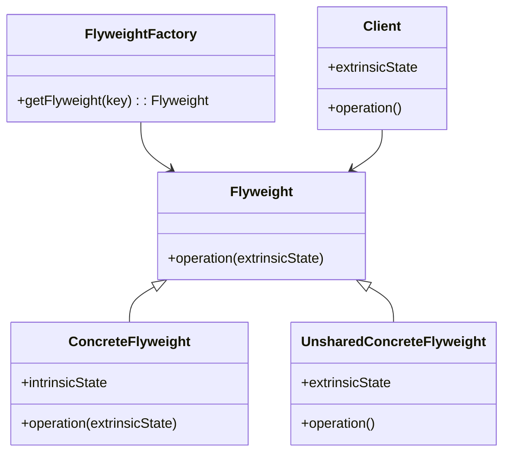
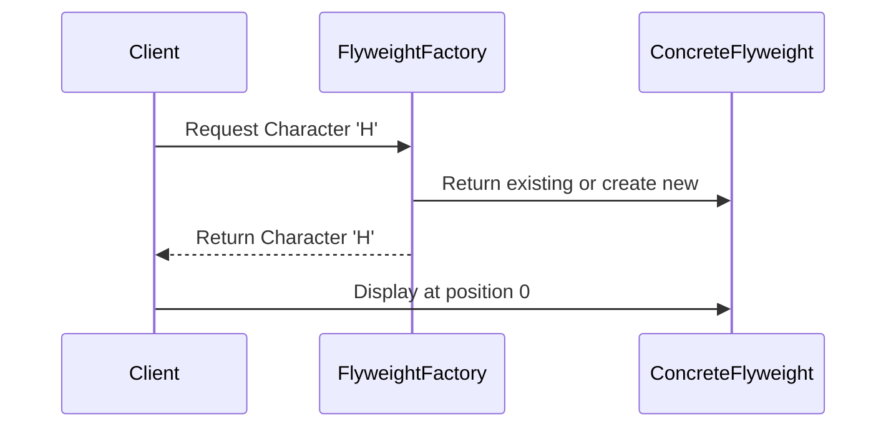

## 5.6 Flyweight Pattern

### Introduction

The Flyweight Pattern is a structural design pattern that focuses on minimizing memory usage by sharing as much data as possible with similar objects. This pattern is particularly useful in scenarios where a large number of objects are created, and many of them share common data. By using the Flyweight Pattern, you can significantly reduce the memory footprint of your application, which is crucial in resource-constrained environments or when dealing with large-scale systems.

In Scala, the Flyweight Pattern can be effectively implemented by leveraging immutability and shared instances. Scala's rich type system and functional programming features make it an ideal language for implementing this pattern efficiently.

### Intent

The primary intent of the Flyweight Pattern is to share common data among multiple objects to reduce memory usage. This is achieved by storing shared data externally and referencing it from multiple objects. The pattern is particularly useful when:

- You have a large number of objects that share a significant amount of data.
- Memory usage is a critical concern.
- You want to improve performance by reducing the overhead of object creation.

### Key Participants

The Flyweight Pattern involves several key participants:

1. **Flyweight Interface**: Defines the interface for flyweight objects. This interface ensures that flyweight objects can be used interchangeably.

2. **Concrete Flyweight**: Implements the Flyweight interface and stores intrinsic state. This state is shared among multiple objects.

3. **Unshared Concrete Flyweight**: Represents flyweight objects that cannot be shared. These objects store extrinsic state, which is unique to each object.

4. **Flyweight Factory**: Manages the creation and sharing of flyweight objects. It ensures that flyweight objects are shared and reused appropriately.

5. **Client**: Uses the Flyweight objects. The client is responsible for maintaining the extrinsic state of flyweight objects.

### Applicability

The Flyweight Pattern is applicable in scenarios where:

- You need to create a large number of similar objects.
- Many objects share common data, and memory usage is a concern.
- The intrinsic state of objects can be shared, while the extrinsic state is maintained externally.

### Diagram

Below is a class diagram representing the Flyweight Pattern:



### Sample Code Snippet

Let's explore how to implement the Flyweight Pattern in Scala. We'll create a simple example involving a text editor that handles a large number of character objects.

```scala
// Flyweight trait representing the Flyweight interface
trait Character {
  def display(position: Int): Unit
}

// ConcreteFlyweight class representing shared characters
class ConcreteCharacter(val char: Char) extends Character {
  override def display(position: Int): Unit = {
    println(s"Character $char at position $position")
  }
}

// FlyweightFactory class managing flyweight objects
object CharacterFactory {
  private var characters: Map[Char, Character] = Map()

  def getCharacter(char: Char): Character = {
    characters.getOrElse(char, {
      val newCharacter = new ConcreteCharacter(char)
      characters += (char -> newCharacter)
      newCharacter
    })
  }
}

// Client code using flyweight objects
object TextEditor extends App {
  val text = "Hello Flyweight Pattern"
  text.zipWithIndex.foreach { case (char, index) =>
    val character = CharacterFactory.getCharacter(char)
    character.display(index)
  }
}
```

**Explanation:**

- **Character Trait**: Defines the interface for flyweight objects.
- **ConcreteCharacter Class**: Implements the Character trait and stores intrinsic state (the character itself).
- **CharacterFactory Object**: Manages the creation and sharing of ConcreteCharacter objects.
- **TextEditor Object**: Acts as the client, using flyweight objects to display characters at specific positions.

### Design Considerations

When implementing the Flyweight Pattern in Scala, consider the following:

- **Immutability**: Leverage Scala's immutable collections and data structures to ensure that shared data remains consistent and thread-safe.
- **Shared Instances**: Use shared instances to minimize memory usage. Ensure that the Flyweight Factory manages these instances efficiently.
- **Performance**: The Flyweight Pattern can improve performance by reducing memory usage and object creation overhead. However, it may introduce complexity in managing extrinsic state.

### Differences and Similarities

The Flyweight Pattern is often compared to other structural patterns, such as the Proxy and Composite patterns. Here are some key differences and similarities:

- **Proxy Pattern**: Both patterns involve managing access to objects. However, the Proxy Pattern focuses on controlling access, while the Flyweight Pattern focuses on sharing data.
- **Composite Pattern**: Both patterns involve managing groups of objects. However, the Composite Pattern focuses on treating individual objects and compositions uniformly, while the Flyweight Pattern focuses on sharing data among objects.

### Try It Yourself

To better understand the Flyweight Pattern, try modifying the code example above:

- **Experiment with Different Characters**: Add more characters to the text and observe how the CharacterFactory manages shared instances.
- **Implement Additional Features**: Extend the TextEditor to support different fonts or styles, and see how the Flyweight Pattern can be applied to manage these features efficiently.

### Visualizing the Flyweight Pattern

To further illustrate the Flyweight Pattern, let's visualize the relationship between the Flyweight Factory, Concrete Flyweight, and Client using a sequence diagram:



**Diagram Explanation:**

- The **Client** requests a character from the **FlyweightFactory**.
- The **FlyweightFactory** checks if the character already exists. If not, it creates a new **ConcreteFlyweight**.
- The **Client** uses the **ConcreteFlyweight** to display the character at a specific position.

### Knowledge Check

Before we conclude, let's reinforce your understanding of the Flyweight Pattern with a few questions:

- What is the primary goal of the Flyweight Pattern?
- How does the Flyweight Pattern differ from the Proxy Pattern?
- What are some key considerations when implementing the Flyweight Pattern in Scala?

### Conclusion

The Flyweight Pattern is a powerful tool for optimizing memory usage in applications that require a large number of similar objects. By leveraging Scala's immutability and shared instances, you can implement this pattern efficiently and effectively. As you continue to explore design patterns in Scala, remember to consider the specific needs of your application and choose patterns that best address those needs.

### Further Reading

For more information on the Flyweight Pattern and other design patterns, consider exploring the following resources:

- [Design Patterns: Elements of Reusable Object-Oriented Software](https://en.wikipedia.org/wiki/Design_Patterns) by Erich Gamma, Richard Helm, Ralph Johnson, and John Vlissides.
- [Scala Design Patterns](https://www.scala-lang.org/) - Official Scala documentation and resources.

## Quiz Time!



### What is the primary goal of the Flyweight Pattern?

- [x] To share common data among multiple objects to reduce memory usage.
- [ ] To control access to objects.
- [ ] To treat individual objects and compositions uniformly.
- [ ] To encapsulate object creation logic.

> **Explanation:** The Flyweight Pattern aims to minimize memory usage by sharing common data among multiple objects.

### Which of the following is a key participant in the Flyweight Pattern?

- [x] Flyweight Factory
- [ ] Proxy
- [ ] Composite
- [ ] Decorator

> **Explanation:** The Flyweight Factory is responsible for managing the creation and sharing of flyweight objects.

### How does the Flyweight Pattern differ from the Proxy Pattern?

- [x] The Flyweight Pattern focuses on sharing data, while the Proxy Pattern focuses on controlling access.
- [ ] The Flyweight Pattern focuses on controlling access, while the Proxy Pattern focuses on sharing data.
- [ ] Both patterns focus on sharing data.
- [ ] Both patterns focus on controlling access.

> **Explanation:** The Flyweight Pattern is about sharing data, whereas the Proxy Pattern is about controlling access to objects.

### In Scala, what feature can be leveraged to ensure shared data remains consistent and thread-safe?

- [x] Immutability
- [ ] Inheritance
- [ ] Polymorphism
- [ ] Reflection

> **Explanation:** Scala's immutability ensures that shared data remains consistent and thread-safe.

### What is the role of the Flyweight Factory?

- [x] To manage the creation and sharing of flyweight objects.
- [ ] To encapsulate object creation logic.
- [ ] To control access to objects.
- [ ] To provide a simplified interface to a complex system.

> **Explanation:** The Flyweight Factory is responsible for managing the creation and sharing of flyweight objects.

### Which of the following is NOT a feature of the Flyweight Pattern?

- [ ] Reducing memory usage
- [ ] Sharing common data
- [x] Controlling access to objects
- [ ] Managing extrinsic state

> **Explanation:** Controlling access to objects is not a feature of the Flyweight Pattern; it is a feature of the Proxy Pattern.

### What is the intrinsic state in the Flyweight Pattern?

- [x] The shared data among multiple objects.
- [ ] The unique data for each object.
- [ ] The data used to control access to objects.
- [ ] The data used to encapsulate object creation logic.

> **Explanation:** The intrinsic state is the shared data among multiple objects in the Flyweight Pattern.

### What is the extrinsic state in the Flyweight Pattern?

- [x] The unique data for each object.
- [ ] The shared data among multiple objects.
- [ ] The data used to control access to objects.
- [ ] The data used to encapsulate object creation logic.

> **Explanation:** The extrinsic state is the unique data for each object in the Flyweight Pattern.

### True or False: The Flyweight Pattern can introduce complexity in managing extrinsic state.

- [x] True
- [ ] False

> **Explanation:** The Flyweight Pattern can introduce complexity in managing extrinsic state, as it requires careful handling to ensure correct behavior.

### True or False: The Flyweight Pattern is often used in scenarios where memory usage is not a concern.

- [ ] True
- [x] False

> **Explanation:** The Flyweight Pattern is specifically used in scenarios where memory usage is a concern.



Remember, this is just the beginning. As you progress, you'll build more complex and efficient systems using the Flyweight Pattern. Keep experimenting, stay curious, and enjoy the journey!
