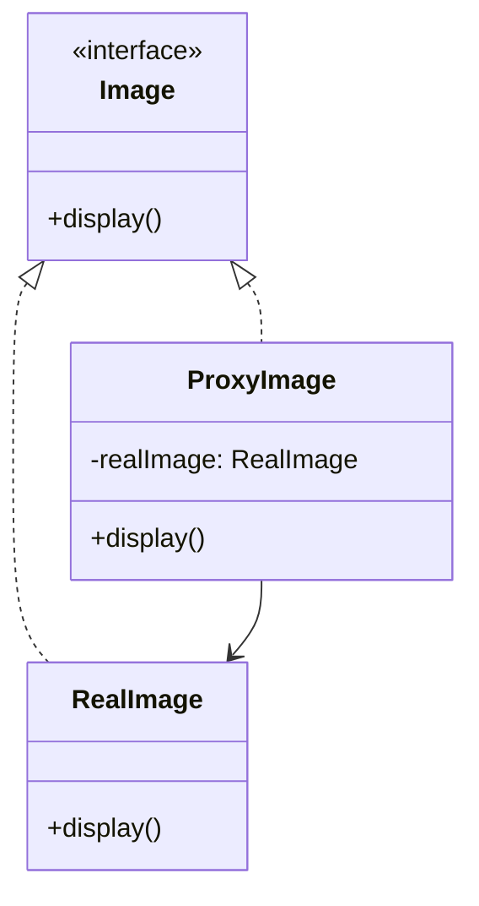

## 5.7 Proxy Pattern

The Proxy Pattern is a structural design pattern that provides a surrogate or placeholder for another object to control access to it. This pattern is particularly useful in scenarios where direct access to an object is either costly or undesirable. In Scala, the Proxy Pattern can be elegantly implemented using traits and lazy evaluation, leveraging the language's powerful features to create efficient and maintainable code.

### Intent

The primary intent of the Proxy Pattern is to control access to an object. This can involve:

- **Lazy Initialization**: Deferring the creation and initialization of an object until it is needed.
- **Access Control**: Restricting access to certain methods or properties of an object.
- **Remote Proxy**: Representing an object located in a different address space.
- **Virtual Proxy**: Creating expensive objects on demand.
- **Protection Proxy**: Controlling access rights to an object.

### Key Participants

- **Subject**: The common interface for RealSubject and Proxy. This interface defines the operations that can be performed on the object.
- **RealSubject**: The actual object that the proxy represents.
- **Proxy**: The surrogate that controls access to the RealSubject. It implements the same interface as the RealSubject and maintains a reference to it.

### Applicability

Use the Proxy Pattern when:

- You need to control access to an object.
- You want to add a layer of security or access control.
- You need to manage resource-intensive objects efficiently.
- You want to provide a local representative for a remote object.

### Implementing Proxies with Traits and Lazy Evaluation

Scala's traits and lazy evaluation provide a powerful combination for implementing the Proxy Pattern. Traits allow us to define shared behavior, while lazy evaluation defers computation until it is absolutely necessary.

#### Example: Virtual Proxy for Image Loading

Consider a scenario where we have an image viewer application. Loading images can be resource-intensive, so we use a proxy to load images only when they are needed.

```scala
trait Image {
  def display(): Unit
}

class RealImage(filename: String) extends Image {
  println(s"Loading image from $filename")
  
  override def display(): Unit = {
    println(s"Displaying $filename")
  }
}

class ProxyImage(filename: String) extends Image {
  private lazy val realImage = new RealImage(filename)
  
  override def display(): Unit = {
    realImage.display()
  }
}

object ProxyPatternDemo extends App {
  val image1 = new ProxyImage("photo1.jpg")
  val image2 = new ProxyImage("photo2.jpg")
  
  // Image is loaded only when display is called
  image1.display()
  image2.display()
}
```

**Explanation:**

- **Image Trait**: Defines the common interface for RealImage and ProxyImage.
- **RealImage Class**: Represents the actual image object that is resource-intensive to create.
- **ProxyImage Class**: Acts as a placeholder for RealImage. It uses a `lazy val` to defer the creation of RealImage until `display()` is called.

### Visualizing the Proxy Pattern

Below is a class diagram illustrating the Proxy Pattern in the context of the image loading example.



**Diagram Description**: This class diagram shows the relationship between the Image interface, the RealImage class, and the ProxyImage class. The ProxyImage class holds a reference to the RealImage and implements the same interface.

### Design Considerations

- **Performance**: The Proxy Pattern can improve performance by deferring the creation of expensive objects.
- **Security**: Proxies can add security layers by controlling access to sensitive operations.
- **Complexity**: Introducing proxies can add complexity to the codebase, so use them judiciously.

### Differences and Similarities with Other Patterns

- **Decorator Pattern**: Both Proxy and Decorator patterns implement the same interface as the object they are wrapping. However, the Proxy Pattern focuses on controlling access, while the Decorator Pattern focuses on adding behavior.
- **Adapter Pattern**: The Adapter Pattern is used to make two incompatible interfaces compatible, whereas the Proxy Pattern controls access to an object.

### Try It Yourself

Experiment with the code example by modifying the `ProxyImage` class to include logging functionality. This will demonstrate how the Proxy Pattern can be extended to add additional behavior.

```scala
class LoggingProxyImage(filename: String) extends Image {
  private lazy val realImage = new RealImage(filename)
  
  override def display(): Unit = {
    println(s"Logging: Displaying $filename")
    realImage.display()
  }
}
```

### Advanced Use Cases

#### Remote Proxy

In distributed systems, a remote proxy can represent an object located in a different address space. This allows for communication between objects in different systems.

#### Protection Proxy

A protection proxy can control access to an object based on user permissions. This is useful in applications where different users have different access rights.

### Knowledge Check

- What is the primary purpose of the Proxy Pattern?
- How does lazy evaluation benefit the Proxy Pattern in Scala?
- Can you identify a real-world scenario where a remote proxy might be useful?

### Summary

The Proxy Pattern is a versatile tool in the software engineer's toolkit, providing a way to control access to objects and manage resource-intensive operations efficiently. By leveraging Scala's traits and lazy evaluation, developers can implement proxies that are both efficient and maintainable.

Remember, this is just the beginning. As you progress, you'll build more complex and interactive applications. Keep experimenting, stay curious, and enjoy the journey!

## Quiz Time!



### What is the primary purpose of the Proxy Pattern?

- [x] To control access to an object
- [ ] To add new behavior to an object
- [ ] To adapt an interface to another
- [ ] To create a family of related objects

> **Explanation:** The Proxy Pattern is used to control access to an object, providing a surrogate or placeholder for it.

### Which Scala feature is particularly useful for implementing the Proxy Pattern?

- [x] Lazy evaluation
- [ ] Pattern matching
- [ ] Implicits
- [ ] Higher-order functions

> **Explanation:** Lazy evaluation defers the creation of an object until it is needed, which is useful in the Proxy Pattern.

### In the Proxy Pattern, what is the role of the RealSubject?

- [x] The actual object that the proxy represents
- [ ] The interface shared by the proxy and the real object
- [ ] The surrogate that controls access to the object
- [ ] The client that uses the proxy

> **Explanation:** The RealSubject is the actual object that the proxy represents and controls access to.

### How does the Proxy Pattern differ from the Decorator Pattern?

- [x] Proxy controls access, Decorator adds behavior
- [ ] Proxy adds behavior, Decorator controls access
- [ ] Both patterns control access
- [ ] Both patterns add behavior

> **Explanation:** The Proxy Pattern controls access to an object, while the Decorator Pattern adds new behavior to an object.

### What is a potential downside of using the Proxy Pattern?

- [x] Increased complexity
- [ ] Decreased security
- [ ] Reduced performance
- [ ] Limited scalability

> **Explanation:** The Proxy Pattern can increase complexity in the codebase, as it introduces additional layers.

### Which of the following is NOT a type of proxy?

- [ ] Virtual Proxy
- [ ] Remote Proxy
- [ ] Protection Proxy
- [x] Adapter Proxy

> **Explanation:** Adapter Proxy is not a recognized type of proxy. The Adapter Pattern is a separate design pattern.

### What is a common use case for a remote proxy?

- [x] Representing an object in a different address space
- [ ] Adding logging functionality
- [ ] Deferring object creation
- [ ] Controlling user permissions

> **Explanation:** A remote proxy is used to represent an object located in a different address space, often in distributed systems.

### How can the Proxy Pattern enhance security?

- [x] By controlling access to sensitive operations
- [ ] By encrypting data
- [ ] By adding authentication mechanisms
- [ ] By improving performance

> **Explanation:** The Proxy Pattern can enhance security by controlling access to sensitive operations, acting as a gatekeeper.

### Which of the following is a benefit of using lazy evaluation in the Proxy Pattern?

- [x] Deferring computation until necessary
- [ ] Simplifying code structure
- [ ] Improving readability
- [ ] Increasing memory usage

> **Explanation:** Lazy evaluation defers computation until it is necessary, which can improve performance by avoiding unnecessary operations.

### True or False: The Proxy Pattern can be used to add new behavior to an object.

- [ ] True
- [x] False

> **Explanation:** The Proxy Pattern is not intended to add new behavior to an object; it is used to control access to an object.


