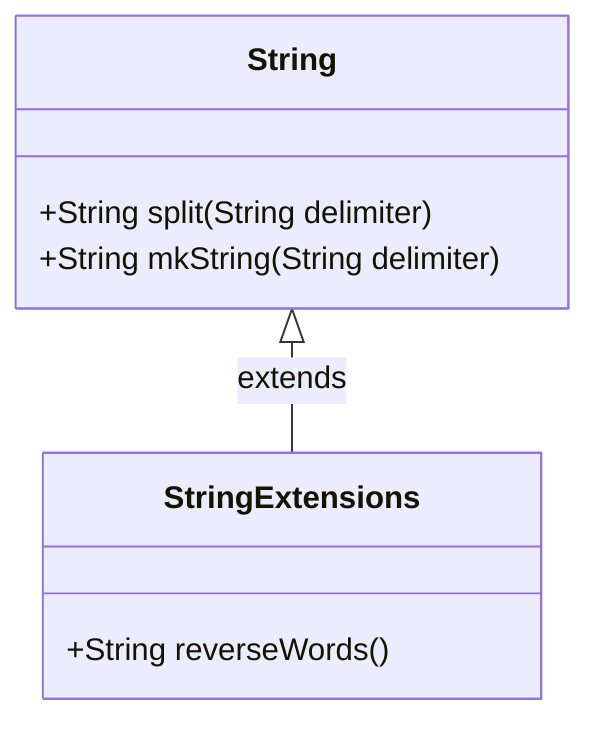

## 5.8 Extension Methods

In the realm of software development, the ability to extend existing code without altering its original structure is a powerful tool. Extension methods in Scala provide a mechanism to achieve this, allowing developers to add new functionality to existing types seamlessly. This section delves into the concept of extension methods, their implementation using Scala's implicits and the new Scala 3 syntax, and their significance in enhancing code flexibility and reusability.

### Understanding Extension Methods

**Extension methods** are a way to add new methods to existing types without modifying their source code. This is particularly useful when working with types from libraries or frameworks where direct modification is not possible or advisable. By using extension methods, developers can introduce additional behavior to these types, enhancing their functionality and making them more adaptable to specific needs.

#### Key Benefits of Extension Methods

- **Non-Invasive**: Extension methods allow you to augment existing types without altering their original implementation, ensuring that you do not introduce breaking changes.
- **Enhanced Readability**: By adding methods that logically belong to a type, you can make your code more intuitive and easier to read.
- **Reusability**: Extension methods can be reused across different parts of your application, promoting code reuse and reducing duplication.
- **Encapsulation**: They help encapsulate additional functionality, keeping the core logic clean and focused.

### Implementing Extension Methods in Scala

Scala provides two primary ways to implement extension methods: using implicits (available in Scala 2) and the new extension method syntax introduced in Scala 3. Let's explore both approaches in detail.

#### Extension Methods with Implicits (Scala 2)

In Scala 2, extension methods are typically implemented using implicit classes. An implicit class is a class that is marked with the `implicit` keyword, allowing its methods to be invoked as if they were part of another type.

**Example: Implementing an Extension Method with Implicits**

```scala
// Define an implicit class to add an extension method
implicit class StringExtensions(val s: String) {
  // Define an extension method to reverse a string
  def reverseWords: String = s.split(" ").reverse.mkString(" ")
}

// Usage of the extension method
val sentence = "Hello world from Scala"
val reversed = sentence.reverseWords
println(reversed) // Output: Scala from world Hello
```

In this example, we define an implicit class `StringExtensions` that adds a `reverseWords` method to the `String` type. This method splits a string into words, reverses their order, and joins them back into a single string.

**Key Points:**

- The implicit class must have a primary constructor with exactly one argument.
- The methods defined in the implicit class can be used on instances of the type specified in the constructor (in this case, `String`).

#### Extension Methods in Scala 3

Scala 3 introduces a more concise and expressive syntax for defining extension methods, eliminating the need for implicit classes. This new syntax enhances clarity and reduces boilerplate code.

**Example: Implementing an Extension Method in Scala 3**

```scala
// Define an extension method using Scala 3 syntax
extension (s: String)
  def reverseWords: String = s.split(" ").reverse.mkString(" ")

// Usage of the extension method
val sentence = "Hello world from Scala"
val reversed = sentence.reverseWords
println(reversed) // Output: Scala from world Hello
```

In this example, the `extension` keyword is used to define the `reverseWords` method directly on the `String` type. This approach is more straightforward and aligns with Scala 3's goal of improving code readability and simplicity.

**Key Points:**

- The `extension` keyword is followed by a parameter list that specifies the type being extended.
- The method is defined directly within the extension block, making the code more concise.

### Visualizing Extension Methods

To better understand how extension methods work, let's visualize the process using a class diagram.



**Diagram Description:**

- The `String` class represents the existing type being extended.
- The `StringExtensions` class (or extension block in Scala 3) adds the `reverseWords` method to the `String` type.
- The extension relationship is depicted by the arrow, indicating that `StringExtensions` extends the functionality of `String`.

### Applicability of Extension Methods

Extension methods are particularly useful in scenarios where:

- You need to add utility methods to existing types without modifying their source code.
- You want to enhance the functionality of third-party library types.
- You aim to keep your codebase clean and maintainable by encapsulating additional behavior.

### Sample Code Snippet: Advanced Extension Methods

Let's explore a more advanced example where we implement extension methods for a custom data type.

**Example: Implementing Extension Methods for a Custom Data Type**

```scala
// Define a custom data type
case class Point(x: Int, y: Int)

// Define extension methods for the Point type
extension (p: Point)
  def distanceToOrigin: Double = math.sqrt(p.x * p.x + p.y * p.y)

  def move(dx: Int, dy: Int): Point = Point(p.x + dx, p.y + dy)

// Usage of the extension methods
val point = Point(3, 4)
val distance = point.distanceToOrigin
println(distance) // Output: 5.0

val newPoint = point.move(1, 2)
println(newPoint) // Output: Point(4, 6)
```

In this example, we define a `Point` case class representing a point in a 2D space. We then use extension methods to add functionality for calculating the distance to the origin and moving the point by a specified offset.

### Design Considerations for Extension Methods

When using extension methods, consider the following:

- **Naming Conflicts**: Ensure that the names of your extension methods do not conflict with existing methods on the type being extended.
- **Performance**: While extension methods are convenient, they may introduce slight performance overhead due to additional method calls. Use them judiciously in performance-critical sections.
- **Readability**: Extension methods can improve readability by logically grouping related functionality. However, excessive use of extension methods can lead to confusion, especially if they are scattered across multiple files.

### Differences and Similarities with Other Patterns

Extension methods share similarities with other design patterns, such as:

- **Decorator Pattern**: Both patterns add functionality to existing types. However, extension methods do so without modifying the original type or creating wrapper objects.
- **Adapter Pattern**: While the adapter pattern adapts one interface to another, extension methods enhance the existing interface without altering its structure.

### Try It Yourself: Experimenting with Extension Methods

To deepen your understanding of extension methods, try modifying the code examples provided:

- **Add a New Method**: Extend the `Point` type with a method that calculates the midpoint between two points.
- **Enhance Functionality**: Modify the `reverseWords` method to handle punctuation correctly.
- **Explore Performance**: Measure the performance impact of using extension methods in a loop with a large number of iterations.

### References and Further Reading

- [Scala 3 Documentation: Extension Methods](https://docs.scala-lang.org/scala3/reference/contextual/extension-methods.html)
- [Scala 2 Documentation: Implicits](https://docs.scala-lang.org/tour/implicit-classes.html)

### Knowledge Check

Before we conclude, let's reinforce our understanding with a few questions:

- What are the key benefits of using extension methods in Scala?
- How do extension methods differ between Scala 2 and Scala 3?
- In what scenarios are extension methods particularly useful?

### Embrace the Journey

Remember, mastering extension methods is just one step in your Scala journey. As you continue to explore the language, you'll discover even more powerful techniques to enhance your code. Keep experimenting, stay curious, and enjoy the journey!

## Quiz Time!



### What is the primary purpose of extension methods in Scala?

- [x] To add new functionality to existing types without modifying their source code.
- [ ] To replace existing methods in a type with new implementations.
- [ ] To create new types that extend existing ones.
- [ ] To modify the internal state of existing types.

> **Explanation:** Extension methods allow developers to add new functionality to existing types without altering their original implementation, making them more adaptable and reusable.

### How are extension methods implemented in Scala 2?

- [x] Using implicit classes.
- [ ] Using the `extension` keyword.
- [ ] Using abstract classes.
- [ ] Using traits.

> **Explanation:** In Scala 2, extension methods are implemented using implicit classes, which allow methods to be added to existing types.

### How does Scala 3 improve the syntax for extension methods?

- [x] By introducing the `extension` keyword for a more concise and expressive syntax.
- [ ] By removing the need for extension methods altogether.
- [ ] By requiring extension methods to be defined in separate files.
- [ ] By using macros to generate extension methods.

> **Explanation:** Scala 3 introduces the `extension` keyword, which simplifies the definition of extension methods and reduces boilerplate code.

### What is a potential drawback of using extension methods excessively?

- [x] They can lead to naming conflicts and reduced readability.
- [ ] They can cause runtime errors.
- [ ] They can modify the internal state of existing types.
- [ ] They can increase the size of the compiled code.

> **Explanation:** Excessive use of extension methods can lead to naming conflicts and make the codebase harder to understand, especially if methods are scattered across multiple files.

### Which design pattern is similar to extension methods in terms of adding functionality?

- [x] Decorator Pattern
- [ ] Singleton Pattern
- [ ] Factory Pattern
- [ ] Observer Pattern

> **Explanation:** Both the Decorator Pattern and extension methods add functionality to existing types, but extension methods do so without modifying the original type or creating wrapper objects.

### What is a key consideration when naming extension methods?

- [x] Avoiding conflicts with existing methods on the type being extended.
- [ ] Ensuring the names are as short as possible.
- [ ] Using the same names as existing methods for consistency.
- [ ] Prefixing all method names with "ext".

> **Explanation:** It's important to avoid naming conflicts with existing methods to prevent unexpected behavior and maintain code clarity.

### How can extension methods improve code readability?

- [x] By logically grouping related functionality and making code more intuitive.
- [ ] By reducing the number of lines of code.
- [ ] By eliminating the need for comments.
- [ ] By allowing developers to write code in any order.

> **Explanation:** Extension methods can improve readability by logically grouping related functionality, making the code more intuitive and easier to understand.

### In what scenario would you use extension methods?

- [x] When you need to add utility methods to existing types without modifying their source code.
- [ ] When you want to create a new type that inherits from an existing one.
- [ ] When you need to modify the internal state of an existing type.
- [ ] When you want to replace existing methods with new implementations.

> **Explanation:** Extension methods are useful when you need to add utility methods to existing types without altering their source code, especially for types from libraries or frameworks.

### What is the relationship between extension methods and the Adapter Pattern?

- [x] Extension methods enhance the existing interface without altering its structure, while the Adapter Pattern adapts one interface to another.
- [ ] Both patterns are used to modify the internal state of existing types.
- [ ] Both patterns require the use of implicit classes.
- [ ] Extension methods and the Adapter Pattern are identical in functionality.

> **Explanation:** Extension methods enhance the existing interface without altering its structure, while the Adapter Pattern adapts one interface to another, making them distinct in their applications.

### True or False: Extension methods can be used to modify the internal state of existing types.

- [ ] True
- [x] False

> **Explanation:** Extension methods add new functionality to existing types without modifying their internal state, preserving the original behavior and structure of the type.


