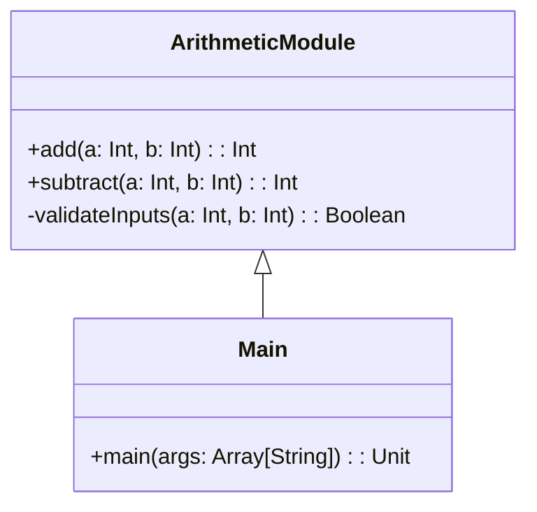

## 5.9 Module Pattern

In the realm of software engineering and architecture, the organization of code into reusable and encapsulated units is paramount for maintaining clarity, scalability, and maintainability. The Module Pattern in Scala is a structural design pattern that provides a robust framework for achieving these goals. This pattern leverages Scala's powerful features, such as packages and objects, to create modular, cohesive, and decoupled codebases.

### Intent

The primary intent of the Module Pattern is to organize code into self-contained units that encapsulate functionality, promote reuse, and reduce dependencies. By doing so, it enhances code readability, maintainability, and scalability, making it easier to manage complex systems.

### Key Participants

- **Modules**: These are the primary building blocks, encapsulating related functionalities and exposing a well-defined interface.
- **Packages**: Serve as namespaces that group related modules, preventing naming conflicts and enhancing code organization.
- **Objects**: Used to define singletons that can act as modules, encapsulating state and behavior.

### Applicability

Use the Module Pattern when:

- You need to organize a large codebase into manageable units.
- You want to promote code reuse and reduce duplication.
- You aim to encapsulate functionality and hide implementation details.
- You need to manage dependencies effectively and reduce coupling.

### Sample Code Snippet

Let's explore a simple example to illustrate the Module Pattern in Scala. We'll create a module for a basic arithmetic library.

```scala
// Define a package for the arithmetic module
package com.example.math

// Define an object to encapsulate arithmetic operations
object ArithmeticModule {
  
  // Private helper function
  private def validateInputs(a: Int, b: Int): Boolean = a >= 0 && b >= 0

  // Public method for addition
  def add(a: Int, b: Int): Int = {
    require(validateInputs(a, b), "Inputs must be non-negative")
    a + b
  }

  // Public method for subtraction
  def subtract(a: Int, b: Int): Int = {
    require(validateInputs(a, b), "Inputs must be non-negative")
    a - b
  }
}

// Usage
object Main extends App {
  import com.example.math.ArithmeticModule._

  println(add(5, 3)) // Output: 8
  println(subtract(10, 4)) // Output: 6
}
```

### Design Considerations

- **Encapsulation**: Use private methods and fields to hide implementation details and expose only necessary functionality.
- **Reusability**: Design modules to be reusable across different parts of the application.
- **Decoupling**: Minimize dependencies between modules to enhance maintainability and scalability.
- **Scala-Specific Features**: Leverage Scala's features like traits and case classes to enhance the flexibility and expressiveness of modules.

### Differences and Similarities

The Module Pattern shares similarities with other structural patterns like the Facade Pattern, as both aim to provide a simplified interface to a complex system. However, the Module Pattern focuses more on encapsulation and organization within the codebase, whereas the Facade Pattern is more about simplifying interactions with external systems.

### Using Packages and Objects for Module Organization

Scala's packages and objects are instrumental in implementing the Module Pattern. Let's delve deeper into how these features facilitate module organization.

#### Packages

Packages in Scala serve as namespaces that help organize code logically. They prevent naming conflicts and allow for better code management. By grouping related modules under a package, you create a cohesive structure that reflects the application's domain.

```scala
package com.example.utilities

object StringUtils {
  def toUpperCase(s: String): String = s.toUpperCase
}

object MathUtils {
  def square(x: Int): Int = x * x
}
```

#### Objects

Objects in Scala are singletons that encapsulate state and behavior. They are ideal for defining modules as they provide a natural way to group related functionalities.

```scala
object Configuration {
  private var settings: Map[String, String] = Map()

  def set(key: String, value: String): Unit = {
    settings += (key -> value)
  }

  def get(key: String): Option[String] = settings.get(key)
}
```

### Visualizing the Module Pattern

To better understand the Module Pattern, let's visualize the structure using a class diagram.



**Diagram Description**: The diagram illustrates the relationship between the `ArithmeticModule` and the `Main` object. The `ArithmeticModule` encapsulates arithmetic operations, while the `Main` object uses these operations.

### Try It Yourself

To deepen your understanding of the Module Pattern, try modifying the code examples:

- **Add a new operation**: Extend the `ArithmeticModule` with a new operation, such as multiplication or division.
- **Enhance validation**: Modify the `validateInputs` method to handle additional validation rules.
- **Create a new module**: Design a new module for a different domain, such as string manipulation or file handling.

### Knowledge Check

- **Question**: What are the primary benefits of using the Module Pattern in Scala?
- **Challenge**: Refactor an existing codebase to use the Module Pattern, focusing on encapsulation and reusability.

### Conclusion

The Module Pattern is a powerful tool for organizing code in Scala. By encapsulating functionality into reusable units, it enhances code clarity, maintainability, and scalability. As you continue to explore Scala's rich ecosystem, remember that the Module Pattern is just one of many tools available to you. Keep experimenting, stay curious, and enjoy the journey!

## Quiz Time!



### What is the primary intent of the Module Pattern in Scala?

- [x] To organize code into self-contained units that encapsulate functionality
- [ ] To provide a simplified interface to a complex system
- [ ] To manage asynchronous computations
- [ ] To implement concurrency using actors

> **Explanation:** The primary intent of the Module Pattern is to organize code into self-contained units that encapsulate functionality, promoting reuse and reducing dependencies.

### Which Scala feature is commonly used to define modules?

- [x] Objects
- [ ] Classes
- [ ] Traits
- [ ] Case Classes

> **Explanation:** Objects in Scala are singletons that encapsulate state and behavior, making them ideal for defining modules.

### How do packages help in implementing the Module Pattern?

- [x] They serve as namespaces that group related modules
- [ ] They provide a simplified interface to external systems
- [ ] They manage asynchronous computations
- [ ] They implement concurrency using actors

> **Explanation:** Packages in Scala serve as namespaces that group related modules, preventing naming conflicts and enhancing code organization.

### What is a key design consideration when using the Module Pattern?

- [x] Encapsulation
- [ ] Asynchronous processing
- [ ] Concurrency control
- [ ] Simplified interfaces

> **Explanation:** Encapsulation is a key design consideration when using the Module Pattern, as it involves hiding implementation details and exposing only necessary functionality.

### Which of the following is a benefit of using the Module Pattern?

- [x] Enhanced code readability
- [ ] Simplified concurrency management
- [ ] Improved asynchronous processing
- [ ] Reduced need for testing

> **Explanation:** The Module Pattern enhances code readability by organizing code into self-contained units, making it easier to understand and maintain.

### What is a common similarity between the Module Pattern and the Facade Pattern?

- [x] Both aim to provide a simplified interface
- [ ] Both focus on concurrency management
- [ ] Both handle asynchronous computations
- [ ] Both are used for error handling

> **Explanation:** Both the Module Pattern and the Facade Pattern aim to provide a simplified interface, though they do so in different contexts.

### How can you enhance the `ArithmeticModule` example?

- [x] Add a new operation like multiplication
- [ ] Implement concurrency using actors
- [ ] Simplify the interface with a facade
- [ ] Manage asynchronous computations

> **Explanation:** You can enhance the `ArithmeticModule` example by adding a new operation like multiplication, extending its functionality.

### What is a benefit of using objects in Scala for modules?

- [x] They encapsulate state and behavior
- [ ] They simplify asynchronous processing
- [ ] They manage concurrency
- [ ] They provide simplified interfaces

> **Explanation:** Objects in Scala encapsulate state and behavior, making them ideal for defining modules.

### Which of the following is NOT a benefit of the Module Pattern?

- [x] Simplified concurrency management
- [ ] Enhanced code readability
- [ ] Improved maintainability
- [ ] Reduced dependencies

> **Explanation:** Simplified concurrency management is not a benefit of the Module Pattern; the pattern focuses on code organization and encapsulation.

### True or False: The Module Pattern is only applicable to large codebases.

- [ ] True
- [x] False

> **Explanation:** False. The Module Pattern is applicable to both small and large codebases, as it helps organize code into reusable and encapsulated units regardless of size.


