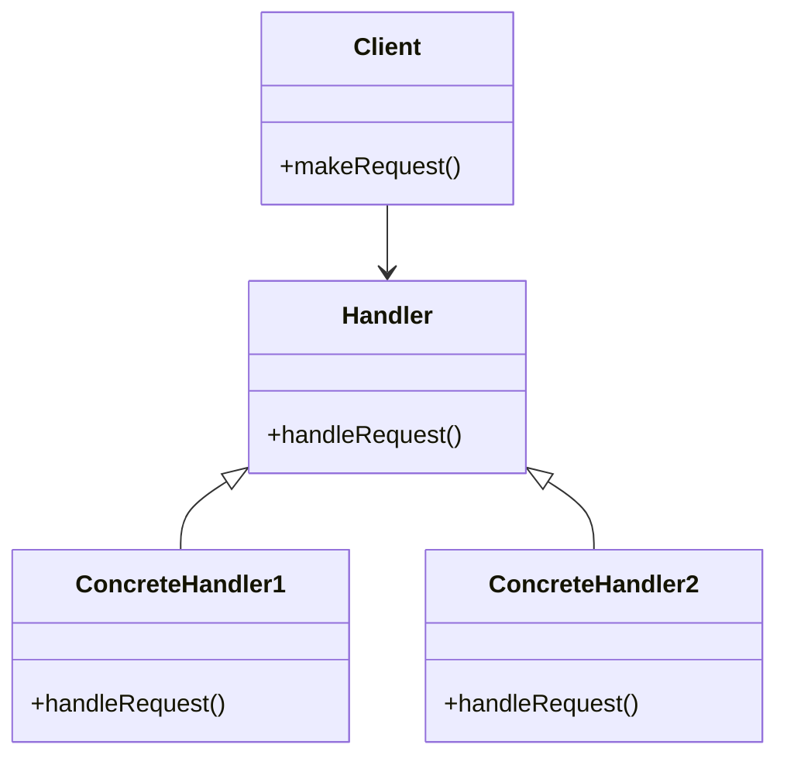
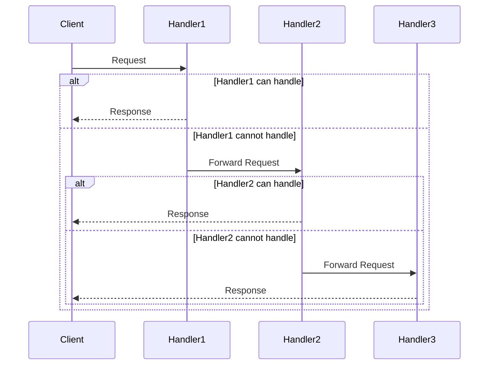

## 6.1 Chain of Responsibility Pattern

The Chain of Responsibility pattern is a behavioral design pattern that allows an object to pass a request along a chain of potential handlers until one of them handles the request. This pattern decouples the sender of a request from its receivers, giving more flexibility in assigning responsibilities to objects. In Scala, we can leverage functional programming features such as functions and pattern matching to implement this pattern effectively.

### Intent

The primary intent of the Chain of Responsibility pattern is to avoid coupling the sender of a request to its receiver by giving more than one object a chance to handle the request. This pattern allows a request to be passed along a chain of handlers until one of them handles it.

### Key Participants

1. **Handler**: Defines an interface for handling requests. Optionally, it implements the successor link.
2. **ConcreteHandler**: Handles requests it is responsible for. It can access its successor. If the ConcreteHandler can handle the request, it does so; otherwise, it forwards the request to its successor.
3. **Client**: Initiates the request to a ConcreteHandler object on the chain.

### Applicability

Use the Chain of Responsibility pattern when:

- More than one object can handle a request, and the handler isn't known a priori. The handler should be ascertained automatically.
- You want to issue a request to one of several objects without specifying the receiver explicitly.
- The set of objects that can handle a request should be specified dynamically.

### Diagram

Below is a diagram illustrating the Chain of Responsibility pattern:



### Implementing the Chain of Responsibility Pattern in Scala

Scala's functional programming capabilities make it an excellent language for implementing the Chain of Responsibility pattern. We can use functions and pattern matching to create a chain of handlers that process requests.

#### Sample Code Snippet

Let's start with a simple example where we have a chain of handlers that process requests based on their type.

```scala
// Define a trait for the Handler
trait Handler {
  def handleRequest(request: String): Option[String]
}

// Implement Concrete Handlers
class ConcreteHandler1 extends Handler {
  override def handleRequest(request: String): Option[String] = {
    if (request.contains("Handler1")) Some("Handled by Handler1")
    else None
  }
}

class ConcreteHandler2 extends Handler {
  override def handleRequest(request: String): Option[String] = {
    if (request.contains("Handler2")) Some("Handled by Handler2")
    else None
  }
}

// Client code to process requests
object ChainOfResponsibilityExample {
  def main(args: Array[String]): Unit = {
    val handlers = List(new ConcreteHandler1, new ConcreteHandler2)

    def processRequest(request: String, handlers: List[Handler]): String = {
      handlers.view.flatMap(_.handleRequest(request)).headOption.getOrElse("No handler could process the request")
    }

    println(processRequest("Request for Handler1", handlers))
    println(processRequest("Request for Handler2", handlers))
    println(processRequest("Request for Handler3", handlers))
  }
}
```

In this example, we define a `Handler` trait with a `handleRequest` method. We then create two concrete handlers, `ConcreteHandler1` and `ConcreteHandler2`, each capable of handling specific requests. The `processRequest` function iterates over the list of handlers and processes the request using the first handler that can handle it.

### Design Considerations

- **Flexibility**: The Chain of Responsibility pattern provides flexibility in assigning responsibilities to objects. You can add or remove handlers dynamically.
- **Decoupling**: This pattern decouples the sender and receiver of a request, allowing for more modular code.
- **Performance**: Be cautious of performance issues if the chain becomes too long, as each request must pass through multiple handlers.

#### Scala-Specific Features

Scala's pattern matching and functional programming features can enhance the implementation of the Chain of Responsibility pattern. For instance, you can use pattern matching to determine which handler should process a request.

```scala
def handleRequest(request: String): String = request match {
  case r if r.contains("Handler1") => "Handled by Handler1"
  case r if r.contains("Handler2") => "Handled by Handler2"
  case _ => "No handler could process the request"
}
```

### Differences and Similarities

The Chain of Responsibility pattern is often compared to the Command pattern. While both involve processing requests, the Chain of Responsibility pattern allows multiple handlers to process a request, whereas the Command pattern encapsulates a request as an object, allowing for parameterization of clients with queues, requests, and operations.

### Try It Yourself

To deepen your understanding of the Chain of Responsibility pattern, try modifying the code example above to include additional handlers. Experiment with different request types and see how the chain processes them. You can also implement a logging mechanism to track which handlers are invoked for each request.

### Visualizing the Chain of Responsibility Pattern

To better understand how the Chain of Responsibility pattern works, let's visualize the process of passing a request along a chain of handlers.



In this sequence diagram, the client sends a request to `Handler1`. If `Handler1` can handle the request, it responds to the client. If not, it forwards the request to `Handler2`, and so on, until a handler processes the request or the chain ends.

### Knowledge Check

- **Question**: What is the primary intent of the Chain of Responsibility pattern?
- **Answer**: To avoid coupling the sender of a request to its receiver by giving more than one object a chance to handle the request.

- **Question**: How can Scala's pattern matching be used in the Chain of Responsibility pattern?
- **Answer**: Pattern matching can be used to determine which handler should process a request based on its characteristics.

### Embrace the Journey

Remember, mastering design patterns like the Chain of Responsibility is a journey. As you progress, you'll build more complex and efficient systems. Keep experimenting, stay curious, and enjoy the journey!

## Quiz Time!



### What is the primary intent of the Chain of Responsibility pattern?

- [x] To avoid coupling the sender of a request to its receiver by giving more than one object a chance to handle the request.
- [ ] To ensure a single object handles all requests.
- [ ] To prioritize requests based on their type.
- [ ] To simplify the request handling process.

> **Explanation:** The Chain of Responsibility pattern's primary intent is to decouple the sender of a request from its receivers, allowing multiple objects to have a chance to handle the request.

### Which Scala feature is particularly useful for implementing the Chain of Responsibility pattern?

- [x] Pattern matching
- [ ] Implicit conversions
- [ ] Type inference
- [ ] Lazy evaluation

> **Explanation:** Pattern matching in Scala is particularly useful for implementing the Chain of Responsibility pattern as it allows for concise and expressive request handling logic.

### What is a potential drawback of the Chain of Responsibility pattern?

- [x] Performance issues if the chain becomes too long
- [ ] Increased coupling between sender and receiver
- [ ] Difficulty in adding new handlers
- [ ] Lack of flexibility in assigning responsibilities

> **Explanation:** A potential drawback of the Chain of Responsibility pattern is performance issues if the chain becomes too long, as each request must pass through multiple handlers.

### In the Chain of Responsibility pattern, what happens if no handler can process a request?

- [x] The request is not handled.
- [ ] The request is automatically handled by the last handler.
- [ ] The request is sent back to the client for modification.
- [ ] The request is discarded.

> **Explanation:** If no handler in the chain can process a request, the request remains unhandled.

### How can you dynamically add or remove handlers in the Chain of Responsibility pattern?

- [x] By modifying the list or chain of handlers at runtime
- [ ] By recompiling the code with new handlers
- [ ] By using reflection to add handlers
- [ ] By using a configuration file

> **Explanation:** You can dynamically add or remove handlers in the Chain of Responsibility pattern by modifying the list or chain of handlers at runtime.

### What is the role of the Client in the Chain of Responsibility pattern?

- [x] To initiate the request to a handler object on the chain
- [ ] To process the request if no handler can
- [ ] To manage the chain of handlers
- [ ] To log all requests and responses

> **Explanation:** The Client's role in the Chain of Responsibility pattern is to initiate the request to a handler object on the chain.

### Which of the following is NOT a key participant in the Chain of Responsibility pattern?

- [x] Observer
- [ ] Handler
- [ ] ConcreteHandler
- [ ] Client

> **Explanation:** The Observer is not a key participant in the Chain of Responsibility pattern. The key participants are Handler, ConcreteHandler, and Client.

### What is a common use case for the Chain of Responsibility pattern?

- [x] Logging requests in a system
- [ ] Managing database transactions
- [ ] Rendering graphics in a game
- [ ] Compiling code

> **Explanation:** A common use case for the Chain of Responsibility pattern is logging requests in a system, where each handler in the chain can log or process the request.

### How does the Chain of Responsibility pattern differ from the Command pattern?

- [x] The Chain of Responsibility pattern allows multiple handlers to process a request, while the Command pattern encapsulates a request as an object.
- [ ] The Chain of Responsibility pattern is used for logging, while the Command pattern is used for database transactions.
- [ ] The Chain of Responsibility pattern is a structural pattern, while the Command pattern is a behavioral pattern.
- [ ] The Chain of Responsibility pattern is less flexible than the Command pattern.

> **Explanation:** The Chain of Responsibility pattern allows multiple handlers to process a request, whereas the Command pattern encapsulates a request as an object, allowing for parameterization of clients with queues, requests, and operations.

### True or False: The Chain of Responsibility pattern can be implemented using a simple list of functions in Scala.

- [x] True
- [ ] False

> **Explanation:** True. The Chain of Responsibility pattern can be implemented using a simple list of functions in Scala, where each function represents a handler in the chain.


